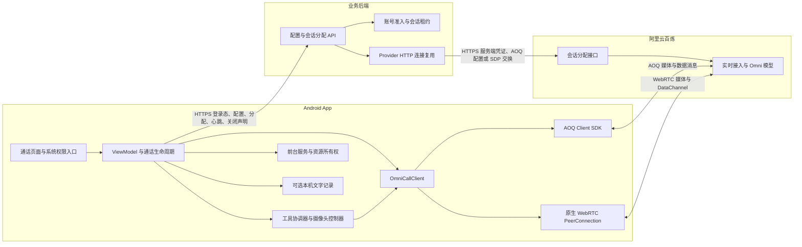
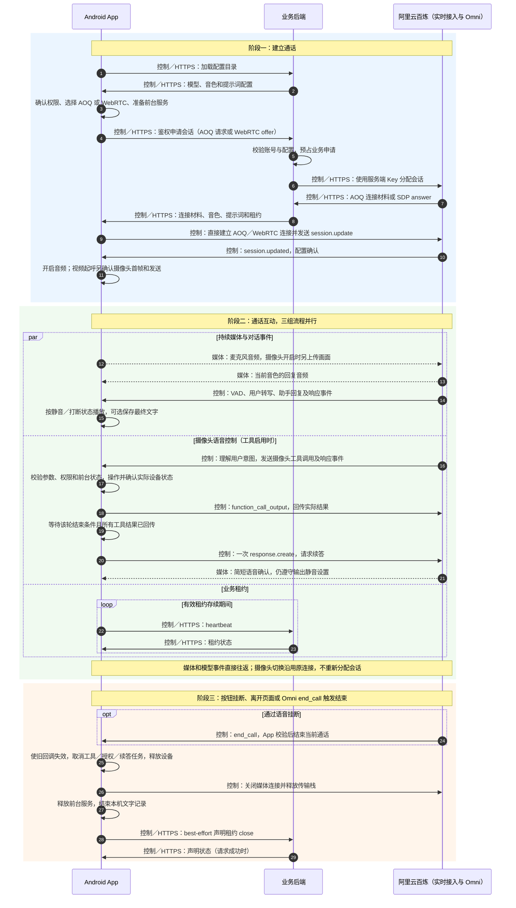
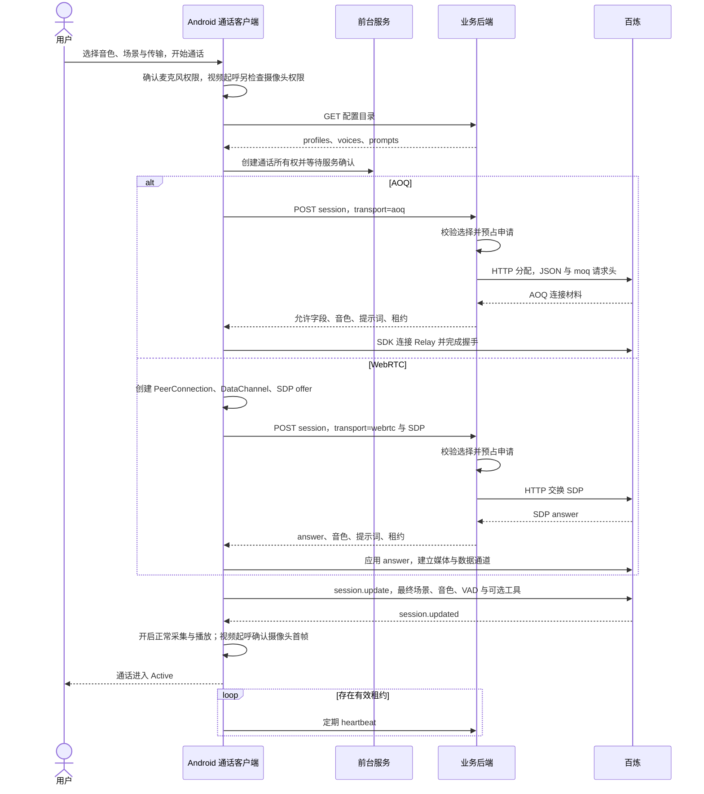
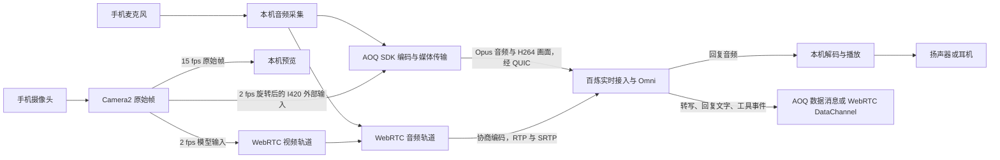
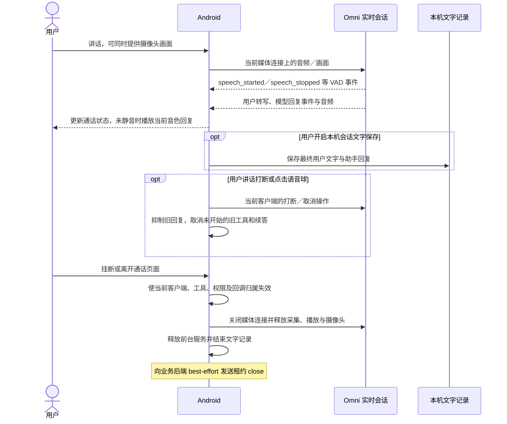
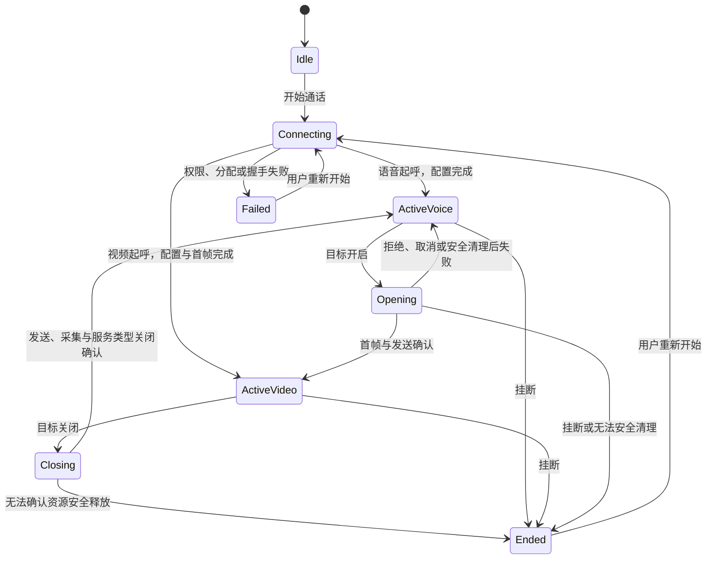
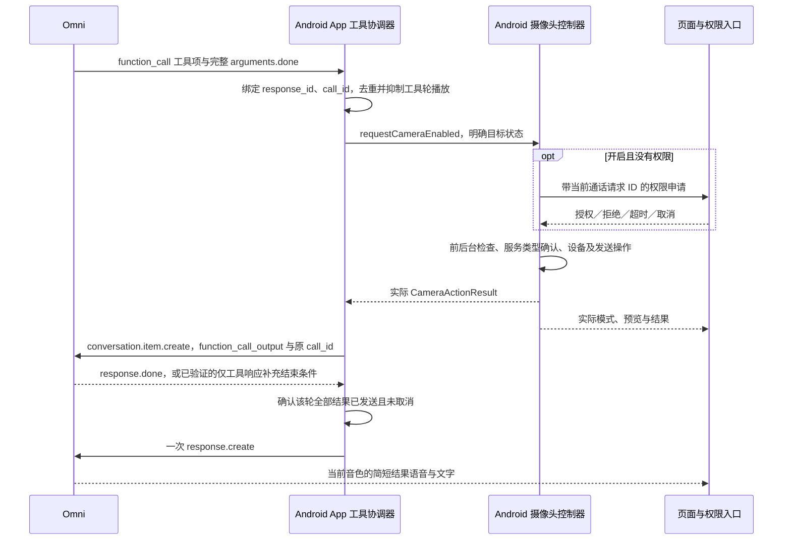

# Android AI 音视频互动方案

接口清单核对日期：2026-10-09，Android 源码基线 `dce3d3e6`，业务后端基线 `062b71fed`。入口：**AI 工具 → 打电话**。模型：`qwen3.8-omni-flash-realtime`。本文说明当前架构、控制流与媒体流，以及通过自然语言切换语音／视频的实现和发布条件。历史摄像头语音控制验收及后续增量见 [内部验收记录](https://github.com/John-Shao/we-meet-android/blob/main/docs/ai-call-camera-voice-verification.md)，接口清单更新不代表生产验收条件已全部通过。

## 1. 产品范围与当前状态

用户与 Omni 进行实时语音对话；开启摄像头后，Omni 同时理解用户上传的实时画面，继续以语音和文字回答。这里的“视频对话”指用户提供摄像头画面，当前客户端没有订阅 AI 视频，也不生成数字人画面。

| 能力 | 当前实现与发布状态 |
| --- | --- |
| 语音／视频传输 | 新版 Android Debug、Release 默认 AOQ，可在开始通话前手动选择 WebRTC |
| 摄像头按钮、麦克风静音、静音播报、打断、挂断 | 保留现有操作；两种传输通过共享通话接口执行 |
| 音色与场景 | 开始前选择；通话内沿用当前音色和最终场景提示词 |
| 本机会话文字记录 | 可关闭；不影响对话和工具调用 |
| 自然语言开关／查询摄像头 | 已实现内部候选；Debug 默认开启，生产 Release 默认关闭 |
| 自然语言结束对话 | `end_call` 直接结束当前语音／视频通话，独立开关默认在 Debug、Release 开启 |
| 语音控制生产验收 | 尚未通过：后续 AOQ 基本语音流程及 WebRTC 文本工具／本机摄像头联合探针已通过；历史连续 10 轮语音漏调用及超时仍需完整复测，荣耀完整语音控制和 WebRTC 视频待验收 |

本方案不覆盖 LiveKit 会议中的 AI 助手、SIP 电话接入、独立双语互译或个人录音 ASR。它们的模型、鉴权和媒体路径见 [大模型接入方案](llm-integration.md)。Android 本功能不需要创建 LiveKit 房间或启动云端 AI Agent。

## 2. 整体架构



业务服务器只参与鉴权、配置、会话分配和租约控制，持续音视频及实时模型事件由 App 直接传输至百炼。这里的“直连”允许阿里云自己的 Relay／媒体接入节点参与路由，不表示手机与模型进程之间没有任何供应商基础设施。

| 组件 | 职责与边界 |
| --- | --- |
| `AssistantCallScreen` | 显示语音球、视频预览、连接方式、处理中状态和失败提示；接收按钮操作、权限回调及页面前台状态 |
| `AiCallViewModel` | 选择配置、创建当前客户端、维护实际界面状态、绑定工具执行、前台服务、租约与记录 |
| `OmniCallClient` | AOQ／WebRTC 共享接口：连接、可等待完成的摄像头操作、实际状态、换镜头、静音、打断与释放 |
| `OmniCallTools` | 解析完整工具项、去重、管理响应归属；摄像头工具回传结果并协调续答，结束工具直接终止当前通话；统一工具轮播放抑制 |
| `CameraActionController` | 串行处理明确的摄像头目标，统一权限、前后台限制、媒体操作、超时与失败清理 |
| `AssistantForegroundSession`／Service | 持有持续通话资源；通过会话所有权和服务确认避免通话与互译竞争音频设备 |
| 后端分配与租约服务 | 校验账号、模型目录与选择项；使用服务端 Key 换取连接材料；记录申请和可配置准入，不处理媒体 |

**工具协调器和摄像头控制器均位于 Android App。** Omni 负责理解用户意图和产生工具调用；App 校验、执行、确认实际状态并回传摄像头结果；业务后端负责连接分配和租约。工具调用通过 App 与 Omni 的现有数据通道交互，具体接口见 4.4 节。

AOQ 使用阿里云 AOQ Client SDK 1.3.0。WebRTC 使用 `io.livekit:livekit-android` 2.24.1 所带的 `livekit.org.webrtc` 底层接口建立 `PeerConnection`，并使用 AudioSwitch 管理设备路由；不调用 LiveKit `Room.connect`，也不是阿里云 WebRTC 客户端 SDK。

## 3. 整体流程

以下时序图概括 App、业务后端和阿里云百炼之间的一通电话。**实线箭头表示控制流，虚线箭头表示媒体流**；响应、模型事件及工具结果均归入控制流。AOQ／WebRTC 在一通电话中二选一，连接材料和握手细节见第 4 节，媒体处理见第 5 节。



业务后端承担登录态鉴权、配置、会话分配和租约请求；App 与百炼直接交换持续音视频及实时事件，供应商 Relay 可参与媒体路由。图中摄像头控制分支是可选路径，普通对话无需工具；其严格时序、AOQ 缺失结束事件的兼容条件见第 8 节。`end_call` 是终止工具，直接进入结束阶段，不回传工具结果或请求告别续答。

## 4. 控制流一：配置、鉴权与建连

### 4.1 App ↔ 业务后端 HTTP 接口清单

以下为“打电话”模块使用的全部业务 HTTP 接口，路径相对于 App 配置的业务 API 根地址。HTTP 请求／响应为 JSON；两个 POST 使用 `Authorization: Bearer <App access_token>`，令牌来自全 App 登录流程。配置 GET 的权限设置为空，可匿名读取；已登录 App 仍通过同一认证 HTTP 客户端访问。

| 接口 | 调用阶段／方向 | 请求 | 成功响应 | 鉴权与约束 |
| --- | --- | --- | --- | --- |
| `GET /api/v1.0/rooms/ai-agent-config/` | 进入页面／加载设置，App → 后端 | 无业务请求体 | `200`，`profiles[]`、`prompts[]` | 公开配置；App 筛选 `model_code=aliyun/qwen3.8-omni-flash-realtime` |
| `POST /api/v1.0/ai-call/session/` | 开始通话，App → 后端 | `profile_code`、`transport`、`sdp`，可选 `voice_id`、`prompt_id` | `200`，AOQ 连接材料或 SDP answer，以及 `voice`、`instructions`、`session_lease` | 登录鉴权；每用户 6 次／分钟；固定 Omni 模型；返回 `Cache-Control: no-store` |
| `POST /api/v1.0/direct-ai/sessions/{id}/`，`operation=heartbeat` | 分配后租约存续期间，App → 后端 | `{"operation":"heartbeat"}` | `200`，`{"status":"active"}` | 登录鉴权，仅本人租约；与 close 共用每用户 120 次／分钟限流 |
| 同一租约 POST，`operation=close` | 挂断或清理，App → 后端 | `{"operation":"close"}` | 通常 `200`，`{"status":"closed"}`；已终结申请返回现有状态 | best-effort 声明，不承担供应商令牌撤销或媒体断连；过期状态返回 `410` |

**配置字段：**`profiles[]` 包含 `code`、`display_name`、`agent_type`、`model_code`、`default_voice_id` 和 `voices[]`；每个 voice 包含 UUID `id`、模型音色 `value` 和展示 `label`。`prompts[]` 包含 UUID `id`、`label`、`content`。空目录应按无可用配置处理，不能改为客户端任意指定模型。本地场景选择与提示词替换发生在 App，不属于这些 HTTP 请求字段。

**会话分配请求字段：**

| 字段 | 类型／必填 | 当前契约 |
| --- | --- | --- |
| `profile_code` | String，必填 | 配置目录中的有效 Omni profile `code`；后端核对模型、供应商及启用状态 |
| `transport` | String，Android 明确传入 | `aoq` 或 `webrtc`；后端省略时默认 `webrtc`，Android 默认选择 `aoq` |
| `sdp` | String | AOQ 使用空字符串；WebRTC 必填，传完成 ICE 收集的音频 SDP offer，可含预协商视频轨道；最大 131072 字符 |
| `voice_id` | UUID，可省略／null | 目录 `voices[].id`，不是 `Tina` 等音色名称；选择不可用时后端依次回退至 profile 默认音色、Tina，最终返回实际 `voice` |
| `prompt_id` | UUID，可省略／null | 有效服务端提示词 ID；未选到有效项时返回后端基础提示词，App 可在本地场景选择后替换 |

AOQ 分配请求示例；所有尖括号值均为占位，必须从实际目录取值：

```json
{
  "profile_code": "<Omni 配置代码>",
  "voice_id": "<voices[].id 的 UUID>",
  "transport": "aoq",
  "sdp": ""
}
```

WebRTC 使用同一接口，改为 `transport="webrtc"`，并在 `sdp` 传本机生成且完成 ICE 收集的 offer。Android 始终明确传入所选 transport；后端接口省略该字段时的兼容默认值仍是 WebRTC，不应据此判断 App 默认传输方式。

**分配响应字段：**

| 字段 | 返回路径 | App 的使用方式 |
| --- | --- | --- |
| `voice`、`instructions` | 两种传输 | 实际音色值（例如 `Tina`）和基础提示词；用于模型 `session.update` |
| `aoq.sid`、`aoq.aoqTokenForClient` | AOQ | AOQ SDK 会话与连接鉴权材料 |
| `aoq.clientRelayEndpoints[]` | AOQ | 每项为 `endpoint`、`port`、`route_index`；交给 SDK 接入供应商 Relay |
| `aoq.clientRelayCertFingerprint`、`aoq.workspaceIdHash` | AOQ | SDK 握手校验和工作空间配置 |
| `sdp` | WebRTC | 经过校验的 SDP answer，App 调用 `setRemoteDescription` |
| `session_lease` | 当前后端两种传输均返回 | `id`（UUID）、`ttl_seconds`、`heartbeat_seconds`、`enforce`；交给 `DirectAILease` |

当前业务租约 TTL 为 120 秒，心跳间隔为 30 秒，最长申请生命周期为 12 小时；App 使用返回值，不把这些时长理解为百炼连接令牌有效期。`enforce` 由服务端准入配置决定。每次心跳最长等待 10 秒，鉴权／不存在／过期等明确失败，或连续 3 次失败时：`enforce=true` 结束本机通话；`false` 停止租约观察，媒体连接继续独立运行。close 不会复活已终结申请，迟到 heartbeat 也不会重开通话。旧后端未返回 `session_lease` 时，新客户端兼容原建连流程。

**主要 HTTP 异常：**分配字段／目录校验失败为 `400`；鉴权失败按认证配置返回 `401/403`；创建频率、并发／每日准入超限为 `429`；后端供应商配置缺失为 `503`；供应商拒绝、超时或返回非法连接材料为 `502`。租约操作非法为 `400`，不存在或不属于本人为 `404`，状态过期为 `410`。App 显示失败并由用户重新开始，不自动切换传输或再次创建模型会话。业务后端使用服务端百炼 Key 交换连接材料，该 Key 不出现在上述响应中。

### 4.2 建连时序



两种传输的后端上游均为工作空间绑定的 `https://{workspace}.{region}.maas.aliyuncs.com/api/v1/webrtc/realtime?model=qwen3.8-omni-flash-realtime`。AOQ 使用 JSON 空对象及 `x-dashscope-rtc-transport: moq`；WebRTC 使用 `application/sdp`。接口名称含 `webrtc` 不表示 AOQ 媒体经过 WebRTC。[百炼建连与 Token 鉴权](https://help.aliyun.com/zh/model-studio/realtime-token-authentication)。

AOQ 只向客户端返回所需字段：`sid`、`aoqTokenForClient`、`clientRelayEndpoints`、`clientRelayCertFingerprint`、`workspaceIdHash`。WebRTC 返回经过校验的 SDP answer。后端采用固定上游、响应大小限制、禁止重定向及禁止自动重试会话创建；HTTP 复用只优化这些控制请求。

客户端先检查本机传输能力。AOQ 原生库需要 ARM 运行环境；WebRTC 在支持 H264 时预先协商视频发送轨道，语音建连不打开摄像头。当前模拟器的非 H264 视频 SDP 曾被百炼拒绝，因此无 H264 时客户端退为音频连接，摄像头工具返回 `video_unavailable`。这属于当前实现和工作空间验证边界，不作为供应商永久编码支持结论。

### 4.3 会话配置

最终场景取用户选择：本地场景可替换后端基础提示词，未选择本地场景时使用后端返回的提示词。开启语音摄像头功能后，再在最终场景之后追加统一控制规则和实际摄像头状态，避免某个场景漏掉工具约束。

两种客户端均设置 `modalities=["text","audio"]`、当前 voice、`server_vad`（当前阈值 0.5，静音判定 800 ms）和 `input_audio_transcription.model=qwen3-asr-flash-realtime`。这是 Omni 会话内的转写配置，不额外创建个人 ASR 3.1 连接。模型侧音频格式配置与 SDK／WebRTC 的线路编码是不同层次，不能把 PCM 会话配置理解为网络不编码。

按各自开关分别注册摄像头控制／查询和结束通话工具，显式 `enable_search=false`；当前还设置 `temperature=0`、`presence_penalty=0`。这些参数并未解决实测漏调用问题，不能作为可靠性承诺。所有工具均关闭时不附加控制规则和工具定义，保留原对话行为。百炼支持 Realtime Function Calling，但平台能力仍须在本项目两条链路上验收。[Realtime 能力说明](https://www.alibabacloud.com/help/zh/model-studio/realtime)。

### 4.4 App ↔ Omni 接口清单

这是持久连接上的媒体与 JSON 事件接口。App 使用业务后端返回的连接材料接入百炼，持续媒体、转写和工具事件由 App 与供应商直接交换。下面列出当前 Android 实际发送或消费的接口子集，完整供应商协议另见[客户端事件](https://www.alibabacloud.com/help/zh/model-studio/client-events)及[服务端事件](https://www.alibabacloud.com/help/zh/model-studio/server-events)。

#### 4.4.1 连接、媒体和数据通道

| 接口层／方向 | AOQ | WebRTC | 用途与边界 |
| --- | --- | --- | --- |
| 建连，App ↔ 百炼 | `AoqClientEngine.connect(AoqConnectConfig)`，配置上述 token、sid、Relay、指纹及工作空间 | App 创建 PeerConnection／offer，业务接口交换 answer 后 `setRemoteDescription` | 百炼会话分配 HTTP 由业务后端调用，App 不向模型新增直接 HTTP 分配请求 |
| 控制事件，双向 | App `sendDataMsg`，SDK 回调 `onDataMsg` | App `DataChannel.send`，回调 `onMessage`；本地创建 `oai-events`，也兼容服务端创建的事件通道 | UTF-8 JSON；相同 `type` 事件交给共享 `OmniCallTools` 和文字记录处理 |
| 用户语音，App → Omni | SDK 内部采集、编码及 audio 轨道发送 | 本机音频采集及协商 audio 轨道 | 通过媒体轨道上传，麦克风静音由本机采集／音轨控制 |
| 摄像头画面，App → Omni | Camera2 外部帧 → `pushExternalVideoCapturedFrame` → SDK 编码／video 轨道 | Camera2 → 本地 video source／track／sender | 首帧确认后开启发送，关闭后停止采集及发送；现有连接沿用 |
| 模型语音，Omni → App | SDK 音频解码、播放及播放帧观察 | 远端 audio track、本机播放 | 静音播报为本机输出控制，工具轮播放抑制也在 App 执行 |
| 挂断，App → 本机传输栈 | 禁止发送、停止设备、`disconnect`、`destroy` | 关闭 DataChannel／PeerConnection，释放轨道与设备 | 关闭模型媒体连接，并另向业务后端声明租约 close |

该媒体路径不通过数据通道发送 `input_audio_buffer.append`、`input_image_buffer.append` 或 `response.audio.delta` 的 Base64 音视频；当前生产客户端也不通过 `conversation.item.create` 注入用户文本。文本／PCM 注入仅存在于内部验证探针。摄像头按钮、换镜头、麦克风静音和静音播报均为本机操作，不是新增业务 REST API。

#### 4.4.2 App → Omni 客户端事件

| `type` | 关键字段 | 发送时机／目的 |
| --- | --- | --- |
| `session.update` | `session.modalities`、`voice`、`instructions`、输入／输出音频格式、`input_audio_transcription`、`turn_detection`，按开关附带 `tools` 等 | 建连后配置模型；摄像头工具启用时，也用仅含 `session.instructions` 的更新同步最新实际摄像头状态 |
| `conversation.item.create` | `item.type=function_call_output`、`item.call_id`、`item.output`（结果 JSON 字符串） | App 已确认摄像头执行结果后回传；匹配原始 `call_id` |
| `response.create` | `type`、`event_id`；当前续答请求不另带用户文本 | 工具结果全部发送，原响应结束或满足仅 AOQ 的补充条件后，发一次语音续答；普通对话由 VAD 驱动 |
| `response.cancel` | `type`、`event_id` | 用户主动打断，且 App 判断当前响应仍在生成时请求取消；本机立即抑制旧播放 |

每次发送都附带 `event_id`，用于请求归属和错误定位。摄像头工具结果回传示例；`output` 是字符串，不能直接换成嵌套对象：

```json
{
  "event_id": "<App 生成的事件 ID>",
  "type": "conversation.item.create",
  "item": {
    "type": "function_call_output",
    "call_id": "<原始工具 call_id>",
    "output": "{\"success\":true,\"enabled\":false,\"changed\":true,\"code\":\"disabled\",\"message\":\"摄像头已关闭\"}"
  }
}
```

#### 4.4.3 Omni → App 服务端事件

| `type` | App 使用的关键字段 | 接收用途 |
| --- | --- | --- |
| `session.created` | 事件类型及承载通道 | WebRTC 确认服务端会话与事件通道后发配置；AOQ 在 SDK Connected 后发配置，不依赖此事件触发 |
| `session.updated` | 事件类型 | 初次配置确认后完成 ready，开启正常音频采集／发送；后续状态更新确认不重建连接 |
| `input_audio_buffer.speech_started` | 事件类型 | 用户语音活动开始；抑制旧播放、取消旧轮待执行工具／续答，同步摄像头状态；诊断记录 VAD 与播放／网络元数据 |
| `input_audio_buffer.speech_stopped` | 事件类型 | 记录语音结束到首个可听回复的耗时 |
| `input_audio_buffer.committed` | `item_id` | 为用户转写预留记录顺序 |
| `conversation.item.created` | `item.id` | 建立会话项与文字记录顺序 |
| `conversation.item.input_audio_transcription.completed` | `item_id`、`content_index`、`transcript` | 取得用户最终转写；不从转写执行关键词设备命令 |
| `response.created` | `response.id` | 绑定响应、管理生成状态和工具结果后的续答归属 |
| `response.output_item.added` | `response_id`、`output_index`、`item.id/type` | 工具项出现时抑制该轮播放，记录普通消息／工具项边界 |
| `response.function_call_arguments.done` | `response_id`、`call_id`、`name`、`arguments` | 完整参数主入口，校验并执行本机工具；`arguments` 是 JSON 字符串 |
| `response.output_item.done` | `response_id`、`output_index`、`item.type/name/call_id/arguments` | 完整工具项补充入口，与主入口共用去重；仅 AOQ 使用仅工具轮的补充结束条件 |
| `response.audio_transcript.done`、`response.text.done` | `response_id`、`item_id`、`content_index`、`transcript` 或 `text` | 助手最终文字与语音续答反馈确认；按用户设置保存文字，内部工具内容不展示 |
| `response.done` | `response.id/status/output[]` | 标记响应完成／取消／失败；完整工具项最终补充入口，协调一次续答 |
| `error` | `error.type/code/message/event_id/param` | 归属到配置、工具结果或续答请求；精确兼容已知可恢复错误，其余按失败流程处理，见第 10 节 |

工具参数增量事件（如 `response.function_call_arguments.delta`）不触发设备操作；当前文字记录消费最终转写／回复，不要求把每个 delta 都展示。上述 `speech_started` 是服务端 VAD 事件，不能仅凭收到该事件就认定用户确实讲话或声学回声已经确认。

#### 4.4.4 Omni 发起、App 执行的本地工具接口

| 工具名 | `arguments` 内容 | 执行端与结果 |
| --- | --- | --- |
| `set_camera_enabled` | `{"enabled":true}` 或 `{"enabled":false}`，Boolean 必填且不接受额外字段 | Android `CameraActionController` 串行执行目标状态，回传 `success/enabled/changed/code/message`；`enabled` 无法确认时为 null |
| `get_camera_state` | `{}`，不接受额外字段 | Android 查询实际摄像头状态，使用相同结果结构回传，不开关设备 |
| `end_call` | `{}`，不接受额外字段 | Android 立即执行当前通话的挂断流程；连接关闭后不回传工具 output、不请求续答，不等待告别播报 |

这些工具是模型协议中的 Function Calling，由 App 的 `OmniCallTools` 注册、校验、去重与协调；工具名不对应后端 HTTP 路由，也不代表模型可以直接操作 Android 摄像头。工具注册受构建开关控制，具体提示词、执行时序、安全边界及发布条件见第 8、9、11 节。

## 5. 媒体流：音频、画面与播放



图中 AOQ 和 WebRTC 是互斥的两条运行路径，一通电话只选择一条。业务后端不在任何持续媒体箭头上。两种路径都只上传用户画面，不接收 AI 视频；语音模式没有摄像头采集或新画面发送。

| 项目 | AOQ | WebRTC |
| --- | --- | --- |
| 音频处理 | SDK 采集、编解码与播放；当前输入 16 kHz 单声道、输出 24 kHz，网络使用 Opus | `JavaAudioDeviceModule` 与协商音轨；启用硬件回声消除／降噪选项 |
| 视频处理 | Camera2 以 15 fps 采集并直接预览；上传分支旋转、I420 → SDK → H264；目标 1280×720、2 fps、500 kbps | Camera2 以 15 fps 采集并直接预览；2 fps 分支进入模型 VideoSource；预协商发送器，当前发送上限目标 2 fps、1 Mbps |
| 实时事件 | SDK 数据消息发送 JSON | `oai-events`／供应商实际事件 DataChannel 发送 JSON |
| 音量控制 | Android “媒体”音量 | Android “通话”音量 |
| 设备路由 | 沿用 AOQ SDK 的播放和路由管理 | AudioSwitch，支持蓝牙、有线耳机、扬声器与听筒选择 |

上述分辨率、帧率和码率是当前配置目标，不代表每台设备、网络或服务端均达到该值。模型事件通道不承载手写 Base64 PCM 媒体；编解码和线路传输交给各自客户端栈。

本地预览与模型上传帧率分别由 Android `gradle.properties` 的 `AI_CALL_LOCAL_PREVIEW_FPS=15` 和 `AI_CALL_MODEL_UPLOAD_FPS=2` 配置，也可使用 Gradle `-P` 覆盖，Debug／Release 与 AOQ／WebRTC 共用。预览允许 1–30 整数 fps，上传允许 1–预览 fps；构建时校验，重建安装后生效。硬件采集目标为 `max(15, 本地预览 fps)`，两条分支使用纳秒时钟独立限帧；上传参数同时设置 AOQ 编码 fps 与 WebRTC RTP maxFramerate。因此本文的 15／2 fps 是默认值，硬件输出超过请求值时预览仍按配置限制。参数不改变分辨率、码率或语音工具发布开关。

AOQ 使用已有 WebRTC 包中的 Camera2、纹理和 I420 工具完成本机采集，但不为此创建 WebRTC PeerConnection。两种传输均以兼容的 15 fps 采集，`CameraFrameRouter` 将原始帧直接交给 `TextureViewRenderer` 本地预览，仅模型分支每 500 ms 最多提交一帧。AOQ 的方向旋转、I420 转换与复制只发生在 SDK 上传分支；WebRTC 原始帧预览也在模型 VideoSource 之前分流，避免原生轨道适配再次限制预览。实际预览帧率受设备、曝光和负载影响，不宣称固定达到 15 fps。

AOQ 本地预览不再使用 SDK 的低帧率本地渲染；摄像头和采集纹理每次关闭时释放，共享 EGL 根上下文保留到当前通话结束，避免快速重开时渲染器和新帧处于不同共享上下文。停止和解除绑定构成帧回调屏障，先停止喂帧再释放渲染器。此方案继续使用 SDK 1.3.0 的外部视频输入替代无法可靠重开的内部 Camera1 路径，编码及网络仍由 AOQ 完成，不保存图像。[AOQ 外部视频输入](https://www.alibabacloud.com/help/zh/model-studio/aoq-custom-video-input)。

两种系统音量分别保存，因此同一屏幕位置或先前设置不保证两条路径音量一致。用户曾观察到 AOQ 建连约为 WebRTC 的 2/3，这是单机体感，不能作为稳定性能指标；模型回复延迟还包含 VAD、推理和播放缓冲。

## 6. 控制流二：日常对话、打断与结束



麦克风静音控制上行采集／音轨；“静音播报”控制下行播放，两者独立。输出静音时仍处理工具事件：成功通过摄像头预览及语音／视频模式变化体现，处理中和设备操作失败时显示文字提示，不会为了语音提示临时解除用户静音。成功的开关、重复目标及状态查询不额外显示结果短句；静音查询也不临时播放语音。通话页没有实时转写或助手回复字幕区域，最终文字按设置写入本机会话记录。用户可随时讲话打断，不为摄像头提示关闭麦克风。

设置中的 transport、音色、场景在通话开始前确定，Active／Connecting 时不修改。通话中摄像头开关和换镜头沿用当前业务申请、租约、SDK 引擎或 PeerConnection，不重建模型会话；切换 AOQ／WebRTC 则需用户结束后重新开始。

连接失败不自动分配另一通电话或自动切换传输。当前断线恢复仅保留约 10 秒的原连接恢复窗口，恢复失败结束通话；不把重试当作免费、无副作用的操作。

## 7. 页面、设备状态与前后台生命周期



Opening／Closing 是操作过程的逻辑状态，对应界面的 `cameraPending`，不是新增业务会话。界面 Voice／Video 只能由客户端确认结果更新，不能从模型回复或按钮意图推断。

首次进入页面默认语音；用户可以在开始前选择视频。首次开摄像头默认后置，本次通话重开沿用最后镜头。挂断后摄像头资源释放；页面的模式选择可能保留，重新起呼仍按当前明确选择执行，不宣称每次重拨必然是语音。

通话由前台服务持有，基础类型为 microphone／mediaPlayback，摄像头实际启用时增加 camera 类型。启动或类型切换等待服务确认，不能只发送 Intent 就视为准备完成。通话与独立互译共享排他所有权，避免两个工具同时占用实时音频。

页面 RESUMED 且设备未锁屏才允许新开摄像头。Home、锁屏和旋转沿用现有后台通话生命周期；返回按钮／离开通话页面执行挂断。已经开启的视频在后台的行为不由此次工具功能另行改变；后台关闭摄像头可以执行。

**视频通话屏幕常亮：**通话为 Active、实际 `isCameraEnabled=true` 且页面为 RESUMED 时设置窗口 `FLAG_KEEP_SCREEN_ON`，防止因闲置超时变暗、熄屏和自动锁屏。关闭摄像头、挂断、进入后台或离开页面后释放本页设置；返回前台且摄像头仍开启时重新启用。仅选中视频模式、连接中或等待授权不启用。AOQ、WebRTC 和按钮／语音入口共用该规则，不依赖摄像头语音工具开关。退出时恢复窗口原有标志，不修改系统屏幕超时、强制亮度或用户主动锁屏行为，不新增权限。前台服务的 `PARTIAL_WAKE_LOCK` 只维持 CPU 工作，屏幕常亮由页面管理。[Android 屏幕常亮说明](https://developer.android.com/develop/background-work/background-tasks/awake/screen-on?hl=zh-cn)。

## 8. 通过语音切换语音与视频

### 8.1 用户行为与意图边界

流程为：**用户说话 → Omni 发工具调用 → Android 检查并操作 → 回传实际结果 → Omni 用当前音色简短播报 → 继续原通话**。控制依靠当前 Omni 会话的 Function Calling，不添加独立 ASR，也不在用户转写上另建关键词执行通道。

| 当前实际状态 | 用户请求 | 设备行为 | 中文结果含义 |
| --- | --- | --- | --- |
| 摄像头关闭，语音模式 | “打开摄像头” | 开启采集、视频发送与预览 | “摄像头已打开” |
| 摄像头关闭，语音模式 | “关闭摄像头” | 保持关闭 | “摄像头已经关闭了” |
| 摄像头开启，视频模式 | “关闭摄像头” | 停止视频发送、采集与预览 | “摄像头已关闭” |
| 摄像头开启，视频模式 | “打开摄像头” | 保持开启 | “摄像头已经打开了” |

“开启视频”“让你看看眼前的东西”属于明确开启意图；“关掉视频”“只用语音聊”属于明确关闭意图。“摄像头开着吗”“你现在能看到画面吗”只查询。“不要打开摄像头”“怎么打开摄像头”、假设、引用、角色扮演及画面中的文字不应触发开启；歧义先澄清。换镜头、录屏不在本次工具范围内。

控制规则要求每轮新的明确请求都调用工具，包括重复命令，不用历史回复代替当前状态；一次请求结果已满足意图后也不能循环调用。这是模型行为要求，当前实测仍未稳定满足，详见第 11 节。模型理解与提示词是意图边界，不应描述为已证明能阻止所有提示词注入。

### 8.2 工具定义与结果契约

两个 transport 的 `session.update.session.tools` 使用相同嵌套定义：

```json
[
  {
    "type": "function",
    "function": {
      "name": "set_camera_enabled",
      "description": "明确设置本机摄像头开启或关闭；重复请求也调用，以核实实际状态。",
      "parameters": {
        "type": "object",
        "properties": { "enabled": { "type": "boolean" } },
        "required": ["enabled"],
        "additionalProperties": false
      }
    }
  },
  {
    "type": "function",
    "function": {
      "name": "get_camera_state",
      "description": "查询本机摄像头实际状态，不改变设备。",
      "parameters": {
        "type": "object",
        "properties": {},
        "additionalProperties": false
      }
    }
  }
]
```

示例保留摄像头工具实际结构，完整 description 和提示词以 `OmniCallTools` 为准。摄像头工具启用时允许这两个名字，语音挂断另允许 `end_call`；`enabled` 必须是真正 JSON Boolean，字符串 `"false"`、缺失或额外字段均拒绝；查询参数只能为空对象。非法参数、未启用工具和未知工具统一回传 `invalid_arguments`，不操作设备。

统一结果示例：

```json
{
  "success": true,
  "enabled": false,
  "changed": false,
  "code": "already_disabled",
  "message": "摄像头已经关闭了"
}
```

`enabled` 是客户端确认的实际状态，无法确认时为 `null`；`changed` 表示本次成功改变状态。`code` 包括 `enabled`、`disabled`、`already_enabled`、`already_disabled`、`permission_denied`、`foreground_required`、`video_unavailable`、`device_error`、`timeout`、`cancelled`、`invalid_arguments`。失败后已安全清理时可以返回 `enabled=false`，但 `success=false`，不能把安全关闭误说成请求开启成功。查询复用 `already_enabled`／`already_disabled` 结果。

### 8.3 模型事件与语音续答时序



1. `response.function_call_arguments.done` 的完整工具名、arguments、`call_id`、`response_id` 才能触发执行；参数增量不执行。
2. `response.output_item.done.item` 及 `response.done.output` 的完整工具项作为补充入口，与主入口共享 `call_id` 去重。同一调用只执行和回传一次；不同新请求即使目标相同，也返回当次实际状态。
3. 通过 `conversation.item.create` 回传 `type=function_call_output`、原 `call_id`，`output` 为结果 JSON 的字符串。发送事件附带 `event_id`，仅归属于当前工具事件的错误按反馈失败处理。
4. 通常等待该响应完成且该轮所有工具结果已发送，然后只发一次 `response.create`。多工具操作仍由摄像头控制器串行处理。
5. AOQ 实测有仅含工具的响应不发 `response.done`：仅 AOQ 启用此兼容实现，收齐**已声明**工具的 `output_item.done`，等待 200 ms 合并相邻项，再按结果条件续答。混合普通消息的响应仍等待 `response.done`。WebRTC 不启用该补充条件，必须等待整轮 `response.done` 及所有结果回传；迟到的整轮结束不能导致提前发起重叠回复。这是本项目实测兼容策略，200 ms 不能证明未来不会再来工具项，不应作为所有供应商／版本的通用协议保证。

工具结果回传和显式续答方式依据 [百炼客户端事件](https://www.alibabacloud.com/help/zh/model-studio/client-events)；服务端完整工具事件见 [服务端事件](https://www.alibabacloud.com/help/zh/model-studio/server-events)。本功能不注册 MCP，不把 MCP 的说明当作本地 Function Calling 的全部实现约束。

### 8.4 统一设备入口、权限与并发

按钮与语音共用可等待完成的入口：

```kotlin
suspend fun requestCameraEnabled(
    enabled: Boolean,
    source: CameraActionSource
): CameraActionResult
```

按钮根据当前实际状态计算目标；语音直接指定目标。查询、设备启停和手动换镜头共享串行控制，不把语音工具实现为“点一下切换按钮”。相同目标直接返回已开启／已关闭，不重复启停设备。

**开启顺序：**确认当前通话、传输视频能力、前台与解锁状态 → 摄像头权限 → 前台服务 camera 类型确认 → 再次检查前台 → 启动采集并确认首帧 → 开启视频发送 → 更新实际 Video 状态和预览。AOQ 的首帧以真实 Camera2 帧被 SDK 接受为依据；WebRTC 使用摄像头首帧回调，随后附加发送轨道。

**关闭顺序：**先停止视频发送 → 停止采集／外部推帧并确认摄像头关闭回调 → 撤销服务 camera 类型 → 更新实际 Voice 状态、移除预览。已进入网络或服务端缓冲的旧帧可能晚到；验收检查关闭完成后不再采集或发送新帧，不能声称已撤回此前上传的画面。

| 约束 | 当前处理 |
| --- | --- |
| 没有 CAMERA 权限 | 前台页面请求系统授权，等待最多 60 秒；授权后执行原始目标，不反向切换 |
| 权限拒绝 | 保持语音，结果含义为“未获得摄像头权限，暂时无法打开” |
| 后台或锁屏新开启 | 拒绝，提示“请回到通话页面后再打开摄像头”；关闭仍可执行 |
| 迟到授权 | 请求 UUID 和当前通话归属校验；超时、挂断、取消后不能重新开摄像头 |
| 开启授权期间明确关闭 | 关闭目标先取消等待中的授权，再进入串行操作 |
| 开启硬件期间收到关闭 | 按设备操作串行完成或安全取消，再执行关闭；不允许交错操作设备 |
| 操作失败／打断取消 | 清理视频发送、采集与服务类型；无法确认安全释放则挂断，实际状态返回未知 |
| 挂断并重新拨号 | 新客户端和控制器所有权；旧权限、工具、响应及媒体回调不能操作新通话 |

常规设备操作整体限时 10 秒；内部首帧／停止回调最多等待 8 秒，服务确认最多 5 秒，均受外层操作限制。权限等待单独计时，失败清理另有最多 10 秒的不可取消回收过程。因此 10 秒不是包含授权和清理的总响应上限。正常设备目标为 3 秒以内，不计用户授权等待，当前尚未完成真机达标验收。

### 8.5 结果反馈、打断和记录

取得工具项后抑制该轮模型音频，避免操作未完成时先播报成功；续答时按用户静音、打断和工具抑制的合并状态恢复。AOQ 清零需要抑制的可写播放 PCM 并持续解码，WebRTC 控制远端音轨。普通 `response.created` 不能无条件解除用户静音。

用户新讲话、取消响应和挂断使未开始的旧工具及续答失效；已完成设备操作不自动反向撤销。手动按钮改变状态后及每轮用户语音开始时，同步最新实际状态至模型提示词；工具执行中通过结果返回状态，避免频繁重写指令干扰该轮调用。

结果由 Omni 沿用当前音色和播放路径播报，不引入本地 TTS、提示音、额外音频焦点管理或独立 ASR。中文请求要求简短中文反馈；模型生成语音不承诺逐字一致，验收要求含义准确且失败不得播报成成功。

回传失败保留已完成的实际设备状态，界面沿用实际预览／模式并显示反馈失败提示，不重做设备操作或重连整通电话。页面仅在处理中或设备操作失败时显示摄像头结果文字；成功结果不显示“摄像头已打开／已关闭”等短句。续答等待 15 秒；普通 `response.created` 或首段文字不能提前结束等待，对应完整文字或实际播放才算反馈进展完成。完整文字用于协议确认及可选记录，不代表页面显示了字幕，也不单独证明用户听到了语音。超时显示反馈失败提示，不重复请求声音兜底。

错误回调带本轮实际结果和阶段：状态同步、工具执行、结果回传、响应结束及语音续答。新工具开始清除旧结果；无本轮结果显示“尚未确认摄像头操作结果”，状态同步失败单独提示，不以历史“已打开／已关闭”冒充本轮结果。已确认本轮结果时保留结构化结果和实际设备状态，提示“暂时无法语音确认”；仅失败结果另外显示其原因，成功结果仍不显示文字短句。旧 `video-fps` 包的统一“结果已显示”提示不能证明设备已经执行；用户原包已卸载，尚无原现场日志。新真实 WebRTC 探针覆盖生产 ViewModel 与 Camera2 的四种基本状态、重复目标及反馈界面故障注入；模拟器只补充本机未协商的视频发送器，不据此声称荣耀真实语音或供应商 H264 视频通过，具体证据见 Android 验收记录。

WebRTC 实测的请求冲突 `Conversation already has an active response` 属于当前回复仍在生成时拒绝新的 `response.create`。客户端仅在已建连、错误类型与文字精确匹配、参数未归属其他操作、存在 30 秒内未确认请求时恢复；有客户端事件 ID 则必须匹配，无 ID 时关联最新未确认请求。工具续答被拒绝只报告反馈失败，保留设备实际状态和当前连接；不重做摄像头操作或重拨。真实连接、媒体设备及其他协议错误仍按原失败处理。断连日志记录原因和协议元数据，不记录用户内容或连接凭证。荣耀旧包已卸载，未取得原现场日志，不能将协议复现等同于实机原故障根因已确诊。

播放抑制只在收到工具项后生效，无法撤销此前已播出的预告，也无法可靠识别模型**完全漏发工具却口头确认**的回复。这是当前生产门槛之一，不能把提示词要求“不得谎称成功”描述为客户端已经强制保证所有模型输出。

开启本机记录时保存最终用户转写和助手回复文字，不展示内部工具 JSON；关闭记录仍执行工具。本模块记录位于账号隔离的应用私有 SQLite／noBackup 目录，未实现独立数据库加密或对话云端同步，也不保存通话音频和摄像头图像。上传百炼的数据处理与保留须按供应商实际政策和产品约定说明，不能由“不本地录制”推断“不经过云端”。

### 8.6 通过语音结束当前对话

用户明确说“结束对话”“停止对话”“结束通话”“挂断电话”时，Omni 通过当前 AOQ 数据通道或 WebRTC DataChannel 调用 `end_call`，参数必须为 `{}`，不接受额外字段。沿用完整参数事件及补充工具项入口，绑定当前客户端／响应、去重和取消检查；不新增 ASR，不从用户转写执行关键词操作。否定、用法问句、假设、引用、角色扮演和画面中的指令不执行；关闭摄像头、切为语音或暂停说话均不等于挂断，歧义先澄清。

客户端校验后抑制旧播放、取消未完成工具／授权／反馈任务，调用当前实例绑定的 `AiCallViewModel.endCall()`。此操作复用挂断按钮：结束摄像头及音频、关闭模型媒体连接、释放前台服务和业务租约、关闭本机文字记录，界面进入结束状态并恢复可重新拨号。摄像头是否开启、输出静音或通话在后台不增加挂断权限要求。麦克风已关闭时无法收到新的语音指令，仍可使用挂断按钮。

这是终止工具，关闭连接后不发送 `function_call_output` 或 `response.create`，不等待原响应结束或告别播报，不声称告别语已生成。摄像头工具继续使用前述结果回传／续答流程。关闭后的重复工具项、迟到权限和旧通话回调不能结束或操作新通话；非法工具参数返回错误，保持当前通话。

独立构建开关 `AI_CALL_VOICE_HANGUP` 默认在 Debug、Release 开启，可用 `-PAI_CALL_VOICE_HANGUP=false` 回退，修改需重建安装。生产 Release 摄像头控制默认关闭时仍注册结束工具；两个开关都关闭才完全恢复原始无工具会话。此增量不修改已有摄像头语音控制的实机验收门槛。

## 9. 安全、并发与成本边界

服务端 Key 留在服务端；日志和文档不记录连接 Token、完整 SDP、原始语音或图像。后端校验模型目录、音色和提示词有效性，AOQ 连接材料按允许字段输出；客户端按 SDK 要求使用 Relay 和证书信息。CAMERA、RECORD_AUDIO 和前台服务权限由 Android 系统控制，模型不能越过它们。

`DirectAIAllocation` 在上游分配前预占申请，数据库事务不包含网络等待；验证上游结果后签发租约。新版客户端通常每 30 秒心跳，租约保留 120 秒，声明最长 12 小时。这个时长是应用申请生命周期，不是供应商会话或 Token 的官方时限。

`DIRECT_AI_MAX_ACTIVE_ALLOCATIONS` 和 `DIRECT_AI_MAX_DAILY_ALLOCATIONS` 默认 0，仅观测；配置正数才限制账号活动申请和 UTC 当日申请次数。活动限制启用时返回 `enforce=true`，客户端遇到租约拒绝或连续三次心跳失败结束连接；观测模式停止上报后允许已有媒体继续。关闭／过期声明不能由迟到心跳复活。

租约和每日申请数不是供应商权威并发或账单：旧客户端可能不发心跳，声明过期不会由业务后端强制撤销上游连接，失败分配也计入申请数。硬性费用管理仍须结合百炼权限、配额、限流及账单，不能把业务 DB 的过期清理当作停止计费证明。

直连减少业务服务器持续媒体带宽和转发计算，但服务端仍承担分配、鉴权、数据库及心跳请求；同时每通电话有自己的媒体连接，不能用 HTTP 池把多个用户通话合并。模型推理费用不会因 HTTP 复用或去掉业务中转自动降低。

## 10. 异常处理与可观测性

| 异常 | 行为 |
| --- | --- |
| 配置错误、分配拒绝、连接失败 | 显示失败并释放当前资源；不自动重试收费创建或换 transport |
| 没有 H264／不具备视频能力 | 保留语音连接；按钮或工具返回视频不可用，不虚构画面 |
| 摄像头占用、首帧超时、发送失败 | 回收采集和发送；安全时恢复 Voice，无法确认安全时结束通话 |
| 关闭设备失败 | 结束通话释放资源，不显示假的“已关闭” |
| 工具结果或续答失败 | 保留已确认的实际设备状态并显示对应失败提示；成功结果不额外显示短句，无本轮结果不借用历史结果；不重复硬件操作、不自动重拨 |
| 模型漏发工具 | 实际状态不改变，严格验收判失败；当前不添加转写关键词兜底 |
| AOQ 特定图像／音频顺序错误 | 仅已建连、无请求归属的精确已知错误放弃该帧，其他错误沿用原失败处理 |

最后一项指 `Error append image before append audio.` 的严格匹配兼容处理，不重传该帧、不重新分配。音视频在 VAD 提交后到达顺序不同是本项目实测解释，不是供应商对持续恢复的承诺；普通权限、设备、工具或会话错误不能归入此例外。

验收与诊断分别记录：业务分配耗时、媒体握手耗时、`session.updated` 时刻、用户语音结束到工具请求、工具请求到设备确认、设备确认到提示播放、工具去重／取消／超时、摄像头关闭后的新帧计数、每通电话的分配次数，以及租约／前台服务释放。当前证据主要来自探针与日志，尚不能表述为完整生产监控面板或全量延迟统计。

关联使用业务申请 ID、当前通话代次、`response_id`／`call_id`／`event_id`，不把 Token 当日志关联键。模型短句、转写文字和成功提示不能代替首帧、实际发送统计、停止回调或设备资源断言。

## 11. 测试、发布门槛与回退

### 11.1 当前证据

截至 2026-10-09，以下汇总 Android 已归档测试和本次会话中的用户反馈；本次文档修订不重新运行收费模型测试。各候选包按各自来源快照及配置解释，历史失败保留，后续单项通过不代表整套生产验收通过。

**当前候选与后续验证：**

| 验证项 | 日期／候选 | 结果与边界 |
| --- | --- | --- |
| 单元测试与构建 | 2026-10-08，媒体模式诊断候选 | feature-assistant 84 项单元测试通过，Debug 与内部 Release 构建通过；默认 Release 配置另已核对为媒体模式、摄像头语音关闭。早期 app 561 项等全量结果见历史记录，未在此候选重新全量运行 |
| AOQ 基本语音流程 | 2026-10-08，媒体模式诊断候选 Debug | 真实模型综合探针通过四种摄像头状态、按钮后状态同步、否定／问句／自然表达及静音指令，保持一次业务分配；输入为合成 PCM，使用模拟器真实摄像头，不等同于荣耀麦克风或连续 10 轮验收 |
| 媒体模式诊断回归 | 2026-10-08，媒体模式诊断候选 | Debug 3 项、内部 Release 4 项通过：两种构建均覆盖 2 项真实 SDK 路由／音频模式与退出恢复；Debug 另含上述 AOQ 综合流程，Release 另含真实模型查询／语音续答及合成语音结束静音视频；退出后无活动摄像头及通话前台服务 |
| WebRTC 工具与摄像头联合流程 | 2026-10-08，camera-feedback 候选 | Debug、内部 Release 均通过开启、重复开启、关闭、重复关闭、结果归属及反馈界面故障注入；生产 ViewModel、权限／前台服务和 Camera2 实际执行，全程分配一次。模型输入为合成文字，模拟器仅补充未协商的本机发送器，不证明供应商 H264 视频或荣耀真实语音通过 |
| WebRTC 续答冲突恢复 | 2026-10-08，webrtc-camera-fix 候选 | 文本驱动的真实模型查询、两组连续关闭及终止工具通过；同批 AOQ 查询曾超时，按原断言单独复测通过，保留批量 4/5 结果，不表述为零失败 |
| 荣耀 AOQ 音量／偶现中断反馈 | 2026-10-09，本次会话用户反馈 | 用户确认媒体模式诊断包“声音恢复，问题没有复现”；此前 VoIP 对照包的音量回归不作为默认方案。此反馈补充于归档之后，未改写原候选元数据；未取得偶现故障日志，不能认定声学回声或网络拥塞根因已解决 |
| 尚未完成的生产门槛 | 截至 2026-10-09 | 连续 10 轮真实语音控制的历史漏工具／续答超时仍待完整复测；荣耀两条路径的全套语音、权限与生命周期、完整 WebRTC H264 视频及正式签名 Release 验收未完成 |

当前内部测试包为 Android 仓库工作区 `release/0.3.0-work.2-aoq-media-diagnostics-20261008/we-meet-aoq-media-diagnostics-release-internal.apk`。配置为 `AOQ_MEDIA_PLAYBACK=true`、`AI_CALL_CAMERA_VOICE_CONTROL_RELEASE=true`，语音挂断开启，默认预览／上传帧率为 15／2 fps；内部摄像头语音开关不改变生产 Release 默认值。SHA-256 为 `880f650cc17e577b91556ac848683a4a6e8300ef1609619b35072f861aa6f10c`。目录内包含 Debug／内部 Release APK、`candidate.json`、源码快照／补丁、BuildConfig、构建与测试日志、签名及 `SHA256SUMS`；候选在提交前构建，来源以归档快照和补丁为准，不仅凭当前 Git HEAD 判断。目录忽略于 Git，内部 Release 使用 Android 调试证书，不等于正式生产签名发行包。

**早期摄像头候选及功能增量的历史证据：**

| 验证项 | 2026-10-08 历史归档结果 |
| --- | --- |
| 初始摄像头候选单元测试 | feature-assistant 57 项、app 561 项；其中新增摄像头测试 27 项；后续媒体诊断候选为上述 84 项 feature-assistant 测试 |
| 构建 | Debug、默认 Release、显式启用语音控制的内部 Release 均已构建 |
| 视频通话屏幕常亮增量 | 57 项相关单元测试、7 项页面回归及 1 项真实 AOQ 授权／摄像头探针通过；系统窗口确认摄像头开启时持有常亮，进入后台后释放；荣耀闲置超时与主动锁屏待真机确认 |
| 预览与模型帧率分流增量 | 60 项相关单元测试、8 项原生预览／页面回归及真实 AOQ 生命周期探针通过；原生源／渲染器 3001ms 内实际渲染 81 帧、模型分支提交 6 帧；ARM 转译模拟器曾未达帧率目标，荣耀及 WebRTC 视频流畅度待真机确认 |
| 独立帧率参数增量 | 默认 15／2 fps、30／3 fps 覆盖配置及 61 项单元测试通过，非法配置拒绝；8 项原生预览／页面回归通过，3002ms 实际渲染 41 帧、模型分支 6 帧；已给预览加配置上限，前一行 81 帧属于历史候选，本次未重跑真实模型／实机验收 |
| 语音结束对话增量 | 69 项相关单元测试、8 项页面／预览回归通过；Debug 与默认 Release 各 3 项真实验证通过，AOQ 使用合成语音结束语音／静音视频通话，WebRTC 为真实模型文本工具探针；默认 Release 实际只注册 end_call，每次工具调用、会话分配和租约关闭均一次，完整资源清理后 Ended；WebRTC 首次建连超时记录保留，按原断言复测通过，荣耀及 WebRTC 麦克风／视频实机待验收 |
| 真实 AOQ／WebRTC 工具协议 | 无设备副作用查询工具完成调用、结果回传、文字续答及播放能量检测；每条连接仅分配一次 |
| 内部 Release 权限及真实页面 | 两条查询探针、权限拒绝、授权／预览／镜头保持／后台限制，共 4 项通过 |
| AOQ 真实媒体 10 轮开关 | 通过；同一引擎／租约，真实采集、非零编码与发送统计 |
| 初始候选真实语音基本流程 | 当时严格复测出现续答超时，整体未通过；后续 AOQ 基本流程通过见上表，原失败记录保留 |
| 真实语音连续 10 轮 | 当时未通过，出现模型口头确认却漏发工具；尚无后续完整严格复测通过证据 |
| 性能目标 | 多数开启约 1 秒、关闭约 0.3 秒；有超过 3 秒的模拟器样本，不能宣布整体达标 |
| 荣耀 AMM-AN00／MagicOS 10／Android 16 | 当时待用户实机验收；后续音量／偶现中断反馈见上表，完整摄像头语音控制验收仍待完成 |
| 完整 WebRTC 视频 | 需支持 H264 的实机验收，不能用模拟器音频及查询工具替代 |

单元测试覆盖参数完整性、严格类型、多工具、重复事件、缺失事件补充、响应取消、一次续答、回传失败、静音与打断、权限等待及迟到授权、后台限制、设备超时、关闭失败与重新拨号归属。真实验收必须检查设备和网络行为，不只检查模型文字。

`release/0.3.0-work.2-camera-voice-20261008/` 是早期摄像头候选归档，保留其成功／失败证据，不再作为当前测试包入口。后续协议修复、反馈修复及媒体诊断分别保存在各自候选目录，不覆盖旧包。测试入口、运行前提和各次结果见 [详细验收记录](https://github.com/John-Shao/we-meet-android/blob/main/docs/ai-call-camera-voice-verification.md)；该记录中的媒体诊断实机待确认状态形成于本次用户反馈之前，以本节标明日期的后续反馈补充。

### 11.2 上线条件

1. AOQ 和 WebRTC 真实工具调用、回传、续答均通过；严格基本语音流程及连续 10 轮成功，不放宽漏调用或实际状态断言。
2. 荣耀设备两条路径验证四种状态、查询、自然表达、否定／引用／假设、首次授权和拒绝、后台／锁屏、迟到授权及挂断重拨。
3. 验证真实画面采集和发送，关闭后无新帧；默认后置和重开镜头保持；全过程只有一次业务分配、租约和媒体连接沿用。
4. 静音、用户打断、按钮与语音并发正确；当前音色简短准确播报，失败不得被播报成成功，提示不与旧回复重叠。
5. 记录分段耗时，正常设备执行不超过 3 秒；连续开关无摄像头泄漏且音频持续可用。
6. 默认 Release 正式签名构建、工具注册、系统权限及实际页面流程全部通过，再修改 Release 默认开关。

### 11.3 开关与回退

| 构建方式 | 语音摄像头工具 |
| --- | --- |
| Debug 默认 | 开启 |
| Debug 加 `-PAI_CALL_CAMERA_VOICE_CONTROL=false` | 关闭 |
| Release 默认 | 关闭 |
| 内部 Release 加 `-PAI_CALL_CAMERA_VOICE_CONTROL_RELEASE=true` | 显式开启，仅供验收 |
| Release 加 `-PAI_CALL_CAMERA_VOICE_CONTROL_RELEASE=false` | 明确关闭 |

`BuildConfig.AI_CALL_CAMERA_VOICE_CONTROL` 同时控制摄像头工具注册和摄像头控制提示词。语音挂断使用独立的 `AI_CALL_VOICE_HANGUP`，默认 Debug／Release 开启，`-PAI_CALL_VOICE_HANGUP=false` 可关闭。它们是编译开关，回退已安装功能需要分发对应 APK，不是运行时远程开关。关闭后各自按钮继续可用；AOQ 正式默认传输及用户手动选择 WebRTC 的能力不受影响。

此次语音控制不增加后端 API、数据库迁移、生产后端部署或 API Key 调整；已存在的分配／租约后端保持原契约。正式发布只需在功能可靠性验收后完成 Android 默认值、正式签名、版本归档及发布流程。

## 12. 实现入口与相关文档

| 范围 | 实现入口 |
| --- | --- |
| Android UI、模式和配置 | [AssistantCallScreen](https://github.com/John-Shao/we-meet-android/blob/main/feature-assistant/src/main/java/com/we/meet/feature/assistant/aicall/ui/AssistantCallScreen.kt)、[AiCallViewModel](https://github.com/John-Shao/we-meet-android/blob/main/feature-assistant/src/main/java/com/we/meet/feature/assistant/aicall/vm/AiCallViewModel.kt) |
| 统一客户端与媒体 | [OmniCallClient](https://github.com/John-Shao/we-meet-android/blob/main/feature-assistant/src/main/java/com/we/meet/feature/assistant/aicall/rtc/OmniCallClient.kt)、[OmniAoqClient](https://github.com/John-Shao/we-meet-android/blob/main/feature-assistant/src/main/java/com/we/meet/feature/assistant/aicall/rtc/OmniAoqClient.kt)、[OmniWebRtcClient](https://github.com/John-Shao/we-meet-android/blob/main/feature-assistant/src/main/java/com/we/meet/feature/assistant/aicall/rtc/OmniWebRtcClient.kt)、[AoqCameraCapture](https://github.com/John-Shao/we-meet-android/blob/main/feature-assistant/src/main/java/com/we/meet/feature/assistant/aicall/rtc/AoqCameraCapture.kt) |
| 工具协议与设备状态 | [OmniCallTools](https://github.com/John-Shao/we-meet-android/blob/main/feature-assistant/src/main/java/com/we/meet/feature/assistant/aicall/rtc/OmniCallTools.kt)、[CameraActionController](https://github.com/John-Shao/we-meet-android/blob/main/feature-assistant/src/main/java/com/we/meet/feature/assistant/aicall/vm/CameraActionController.kt) |
| App 业务 HTTP 接口、字段与租约 | [AiAgentApi](https://github.com/John-Shao/we-meet-android/blob/main/feature-assistant/src/main/java/com/we/meet/feature/assistant/aicall/data/AiAgentApi.kt)、[AiCallDtos](https://github.com/John-Shao/we-meet-android/blob/main/feature-assistant/src/main/java/com/we/meet/feature/assistant/aicall/model/AiCallDtos.kt)、[DirectAILease](https://github.com/John-Shao/we-meet-android/blob/main/feature-assistant/src/main/java/com/we/meet/feature/assistant/aicall/data/DirectAILease.kt) |
| 业务分配 | [ai_call.py](../../src/backend/core/api/ai_call.py) |
| 租约与准入 | [direct_ai_allocations.py 服务](../../src/backend/core/services/direct_ai_allocations.py)、[租约 API](../../src/backend/core/api/direct_ai_allocations.py) |
| 全系统模型接入 | [大模型接入方案](llm-integration.md) |
| 摄像头详细设计与证据 | [Android 语音控制摄像头](https://github.com/John-Shao/we-meet-android/blob/main/docs/ai-call-camera-voice-control.md)、[内部验收记录](https://github.com/John-Shao/we-meet-android/blob/main/docs/ai-call-camera-voice-verification.md) |

原 [App 端 AI 打电话接口文档](../apis/App端AI打电话接口文档.md) 中的创建房间、LiveKit Token 和启动 Agent 流程属于早期实现，不能作为当前 Android 直连通话的接入步骤。会议助手设计见 [历史 AI 助手方案](ai_assistant.md)，两者应分别维护。
