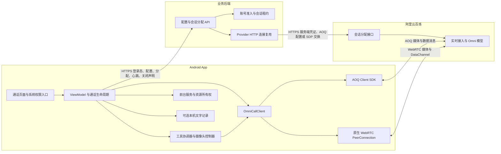
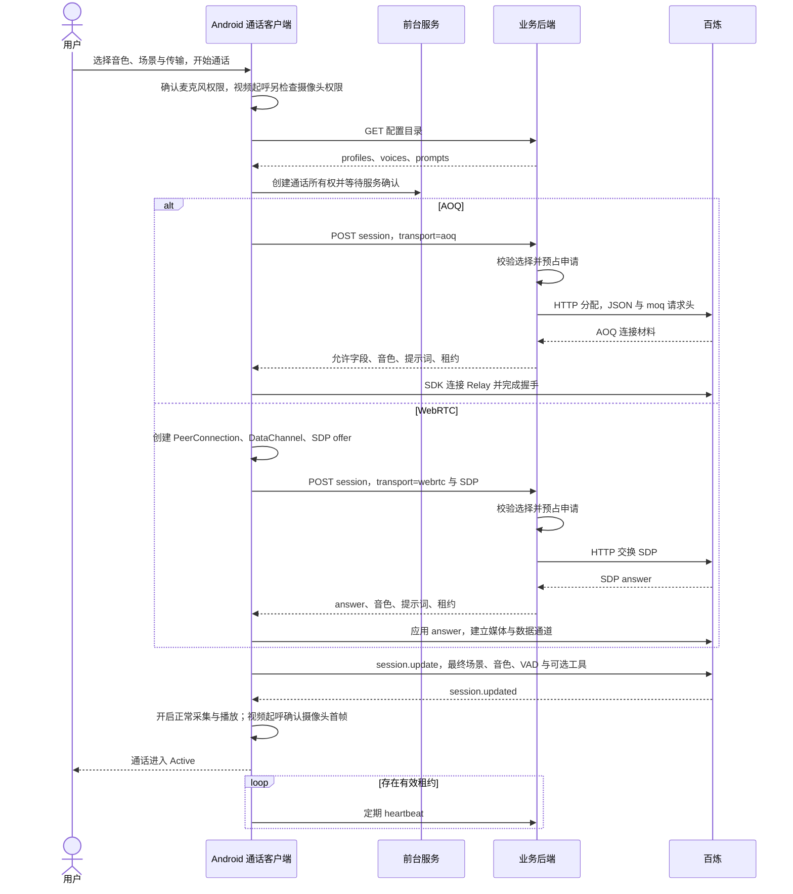
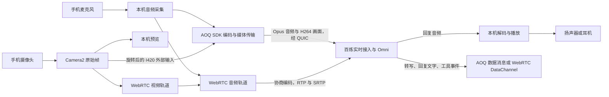
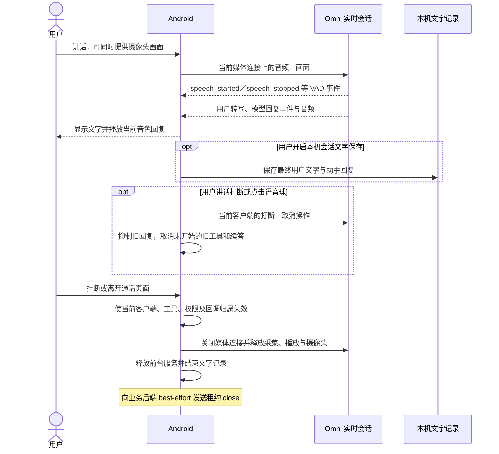
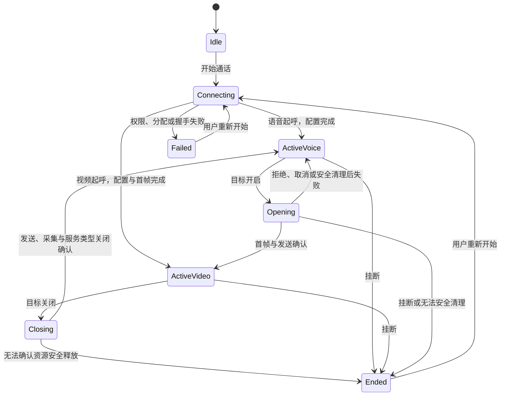
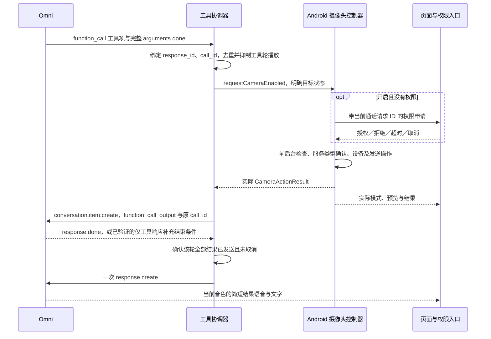

# Android AI 音视频互动方案

核对日期：2026-10-08。入口：**AI 工具 → 打电话**。模型：`qwen3.8-omni-flash-realtime`。本文说明当前架构、控制流与媒体流，以及通过自然语言切换语音／视频的实现和发布条件。Android 摄像头语音控制源码基线为 `e180da17`；详细测试结果见 [内部验收记录](https://github.com/John-Shao/we-meet-android/blob/main/docs/ai-call-camera-voice-verification.md)。

## 1. 产品范围与当前状态

用户与 Omni 进行实时语音对话；开启摄像头后，Omni 同时理解用户上传的实时画面，继续以语音和文字回答。这里的“视频对话”指用户提供摄像头画面，当前客户端没有订阅 AI 视频，也不生成数字人画面。

| 能力 | 当前实现与发布状态 |
| --- | --- |
| 语音／视频传输 | 新版 Android Debug、Release 默认 AOQ，可在开始通话前手动选择 WebRTC |
| 摄像头按钮、麦克风静音、静音播报、打断、挂断 | 保留现有操作；两种传输通过共享通话接口执行 |
| 音色与场景 | 开始前选择；通话内沿用当前音色和最终场景提示词 |
| 本机会话文字记录 | 可关闭；不影响对话和工具调用 |
| 自然语言开关／查询摄像头 | 已实现内部候选；Debug 默认开启，生产 Release 默认关闭 |
| 语音控制生产验收 | 尚未通过：真实模型仍有漏发工具调用及续答超时，荣耀实机和完整 WebRTC 视频待验收 |

本方案不覆盖 LiveKit 会议中的 AI 助手、SIP 电话接入、独立双语互译或个人录音 ASR。它们的模型、鉴权和媒体路径见 [大模型接入方案](llm-integration.md)。Android 本功能不需要创建 LiveKit 房间或启动云端 AI Agent。

## 2. 整体架构



业务服务器只参与鉴权、配置、会话分配和租约控制，持续音视频及实时模型事件由 App 直接传输至百炼。这里的“直连”允许阿里云自己的 Relay／媒体接入节点参与路由，不表示手机与模型进程之间没有任何供应商基础设施。

| 组件 | 职责与边界 |
| --- | --- |
| `AssistantCallScreen` | 显示语音球、视频预览、工具结果和处理中状态；接收按钮操作、权限回调及页面前台状态 |
| `AiCallViewModel` | 选择配置、创建当前客户端、维护实际界面状态、绑定工具执行、前台服务、租约与记录 |
| `OmniCallClient` | AOQ／WebRTC 共享接口：连接、可等待完成的摄像头操作、实际状态、换镜头、静音、打断与释放 |
| `OmniCameraTools` | 解析完整工具项、去重、管理响应归属、回传结果、协调一次续答及工具轮播放抑制 |
| `CameraActionController` | 串行处理明确的摄像头目标，统一权限、前后台限制、媒体操作、超时与失败清理 |
| `AssistantForegroundSession`／Service | 持有持续通话资源；通过会话所有权和服务确认避免通话与互译竞争音频设备 |
| 后端分配与租约服务 | 校验账号、模型目录与选择项；使用服务端 Key 换取连接材料；记录申请和可配置准入，不处理媒体 |

AOQ 使用阿里云 AOQ Client SDK 1.3.0。WebRTC 使用 `io.livekit:livekit-android` 2.24.1 所带的 `livekit.org.webrtc` 底层接口建立 `PeerConnection`，并使用 AudioSwitch 管理设备路由；不调用 LiveKit `Room.connect`，也不是阿里云 WebRTC 客户端 SDK。

## 3. 控制流一：配置、鉴权与建连

### 3.1 业务接口

| 接口 | 用途 | 关键约束 |
| --- | --- | --- |
| `GET /api/v1.0/rooms/ai-agent-config/` | 获取模型目录、音色和提示词配置 | App 筛选当前 Omni 配置；本地场景另由客户端定义 |
| `POST /api/v1.0/ai-call/session/` | 分配一次 AOQ 或 WebRTC 通话 | 登录鉴权；每用户 6 次／分钟；固定 Omni 模型，不允许客户端指定任意上游地址 |
| `POST /api/v1.0/direct-ai/sessions/{id}/` | `heartbeat` 或 `close` 租约声明 | 只操作本人租约；每用户 120 次／分钟；不是音视频传输或上游令牌撤销接口 |

业务请求使用 App 登录态，不把永久百炼 API Key 下发给手机。分配响应包含音色、提示词、连接材料，以及可选的 `session_lease`；敏感响应禁止缓存。旧后端未返回租约时，新版客户端兼容原建连流程。

AOQ 分配请求示例，`profile_code` 为服务端配置目录中的实际值：

```json
{
  "profile_code": "<Omni 配置代码>",
  "voice_id": "Tina",
  "transport": "aoq",
  "sdp": ""
}
```

WebRTC 使用同一接口，改为 `transport="webrtc"`，并在 `sdp` 传本机生成且完成 ICE 收集的 offer。Android 始终明确传入所选 transport；后端接口省略该字段时的兼容默认值仍是 WebRTC，不应据此判断 App 默认传输方式。

### 3.2 建连时序



两种传输的后端上游均为工作空间绑定的 `https://{workspace}.{region}.maas.aliyuncs.com/api/v1/webrtc/realtime?model=qwen3.8-omni-flash-realtime`。AOQ 使用 JSON 空对象及 `x-dashscope-rtc-transport: moq`；WebRTC 使用 `application/sdp`。接口名称含 `webrtc` 不表示 AOQ 媒体经过 WebRTC。[百炼建连与 Token 鉴权](https://help.aliyun.com/zh/model-studio/realtime-token-authentication)。

AOQ 只向客户端返回所需字段：`sid`、`aoqTokenForClient`、`clientRelayEndpoints`、`clientRelayCertFingerprint`、`workspaceIdHash`。WebRTC 返回经过校验的 SDP answer。后端采用固定上游、响应大小限制、禁止重定向及禁止自动重试会话创建；HTTP 复用只优化这些控制请求。

客户端先检查本机传输能力。AOQ 原生库需要 ARM 运行环境；WebRTC 在支持 H264 时预先协商视频发送轨道，语音建连不打开摄像头。当前模拟器的非 H264 视频 SDP 曾被百炼拒绝，因此无 H264 时客户端退为音频连接，摄像头工具返回 `video_unavailable`。这属于当前实现和工作空间验证边界，不作为供应商永久编码支持结论。

### 3.3 会话配置

最终场景取用户选择：本地场景可替换后端基础提示词，未选择本地场景时使用后端返回的提示词。开启语音摄像头功能后，再在最终场景之后追加统一控制规则和实际摄像头状态，避免某个场景漏掉工具约束。

两种客户端均设置 `modalities=["text","audio"]`、当前 voice、`server_vad`（当前阈值 0.5，静音判定 800 ms）和 `input_audio_transcription.model=qwen3-asr-flash-realtime`。这是 Omni 会话内的转写配置，不额外创建个人 ASR 3.1 连接。模型侧音频格式配置与 SDK／WebRTC 的线路编码是不同层次，不能把 PCM 会话配置理解为网络不编码。

工具启用时注册相同的两个工具，显式 `enable_search=false`；当前还设置 `temperature=0`、`presence_penalty=0`。这些参数并未解决实测漏调用问题，不能作为可靠性承诺。工具关闭时不附加控制规则和工具定义，保留原对话行为。百炼支持 Realtime Function Calling，但平台能力仍须在本项目两条链路上验收。[Realtime 能力说明](https://www.alibabacloud.com/help/zh/model-studio/realtime)。

## 4. 媒体流：音频、画面与播放



图中 AOQ 和 WebRTC 是互斥的两条运行路径，一通电话只选择一条。业务后端不在任何持续媒体箭头上。两种路径都只上传用户画面，不接收 AI 视频；语音模式没有摄像头采集或新画面发送。

| 项目 | AOQ | WebRTC |
| --- | --- | --- |
| 音频处理 | SDK 采集、编解码与播放；当前输入 16 kHz 单声道、输出 24 kHz，网络使用 Opus | `JavaAudioDeviceModule` 与协商音轨；启用硬件回声消除／降噪选项 |
| 视频处理 | Camera2 → 旋转、I420 → SDK 外部输入 → H264；目标 1280×720、2 fps、500 kbps | 预协商视频发送器，开启后附加摄像头轨道；当前发送上限目标 2 fps、1 Mbps |
| 实时事件 | SDK 数据消息发送 JSON | `oai-events`／供应商实际事件 DataChannel 发送 JSON |
| 音量控制 | Android “媒体”音量 | Android “通话”音量 |
| 设备路由 | 沿用 AOQ SDK 的播放和路由管理 | AudioSwitch，支持蓝牙、有线耳机、扬声器与听筒选择 |

上述分辨率、帧率和码率是当前配置目标，不代表每台设备、网络或服务端均达到该值。模型事件通道不承载手写 Base64 PCM 媒体；编解码和线路传输交给各自客户端栈。

AOQ 使用已有 WebRTC 包中的 Camera2、纹理和 I420 工具完成本机采集，但不为此创建 WebRTC PeerConnection。硬件采集使用兼容的 15 fps，每 500 ms 最多向 AOQ 提交一帧；图像转换与复制只服务于 SDK 输入缓冲，不保存图像。此方案替代 SDK 1.3.0 内部 Camera1 在模拟器上停止后无法可靠重开的路径，编码及网络仍由 AOQ 完成。[AOQ 外部视频输入](https://www.alibabacloud.com/help/zh/model-studio/aoq-custom-video-input)。

两种系统音量分别保存，因此同一屏幕位置或先前设置不保证两条路径音量一致。用户曾观察到 AOQ 建连约为 WebRTC 的 2/3，这是单机体感，不能作为稳定性能指标；模型回复延迟还包含 VAD、推理和播放缓冲。

## 5. 控制流二：日常对话、打断与结束



麦克风静音控制上行采集／音轨；“静音播报”控制下行播放，两者独立。输出静音时仍处理工具事件并显示实际结果，不会为了语音提示临时解除用户静音。用户可随时讲话打断，不为摄像头提示关闭麦克风。

设置中的 transport、音色、场景在通话开始前确定，Active／Connecting 时不修改。通话中摄像头开关和换镜头沿用当前业务申请、租约、SDK 引擎或 PeerConnection，不重建模型会话；切换 AOQ／WebRTC 则需用户结束后重新开始。

连接失败不自动分配另一通电话或自动切换传输。当前断线恢复仅保留约 10 秒的原连接恢复窗口，恢复失败结束通话；不把重试当作免费、无副作用的操作。

## 6. 页面、设备状态与前后台生命周期



Opening／Closing 是操作过程的逻辑状态，对应界面的 `cameraPending`，不是新增业务会话。界面 Voice／Video 只能由客户端确认结果更新，不能从模型回复或按钮意图推断。

首次进入页面默认语音；用户可以在开始前选择视频。首次开摄像头默认后置，本次通话重开沿用最后镜头。挂断后摄像头资源释放；页面的模式选择可能保留，重新起呼仍按当前明确选择执行，不宣称每次重拨必然是语音。

通话由前台服务持有，基础类型为 microphone／mediaPlayback，摄像头实际启用时增加 camera 类型。启动或类型切换等待服务确认，不能只发送 Intent 就视为准备完成。通话与独立互译共享排他所有权，避免两个工具同时占用实时音频。

页面 RESUMED 且设备未锁屏才允许新开摄像头。Home、锁屏和旋转沿用现有后台通话生命周期；返回按钮／离开通话页面执行挂断。已经开启的视频在后台的行为不由此次工具功能另行改变；后台关闭摄像头可以执行。

## 7. 通过语音切换语音与视频

### 7.1 用户行为与意图边界

流程为：**用户说话 → Omni 发工具调用 → Android 检查并操作 → 回传实际结果 → Omni 用当前音色简短播报 → 继续原通话**。控制依靠当前 Omni 会话的 Function Calling，不添加独立 ASR，也不在用户转写上另建关键词执行通道。

| 当前实际状态 | 用户请求 | 设备行为 | 中文结果含义 |
| --- | --- | --- | --- |
| 摄像头关闭，语音模式 | “打开摄像头” | 开启采集、视频发送与预览 | “摄像头已打开” |
| 摄像头关闭，语音模式 | “关闭摄像头” | 保持关闭 | “摄像头已经关闭了” |
| 摄像头开启，视频模式 | “关闭摄像头” | 停止视频发送、采集与预览 | “摄像头已关闭” |
| 摄像头开启，视频模式 | “打开摄像头” | 保持开启 | “摄像头已经打开了” |

“开启视频”“让你看看眼前的东西”属于明确开启意图；“关掉视频”“只用语音聊”属于明确关闭意图。“摄像头开着吗”“你现在能看到画面吗”只查询。“不要打开摄像头”“怎么打开摄像头”、假设、引用、角色扮演及画面中的文字不应触发开启；歧义先澄清。换镜头、录屏不在本次工具范围内。

控制规则要求每轮新的明确请求都调用工具，包括重复命令，不用历史回复代替当前状态；一次请求结果已满足意图后也不能循环调用。这是模型行为要求，当前实测仍未稳定满足，详见第 10 节。模型理解与提示词是意图边界，不应描述为已证明能阻止所有提示词注入。

### 7.2 工具定义与结果契约

两个 transport 的 `session.update.session.tools` 使用相同嵌套定义：

```json
[
  {
    "type": "function",
    "function": {
      "name": "set_camera_enabled",
      "description": "明确设置本机摄像头开启或关闭；重复请求也调用，以核实实际状态。",
      "parameters": {
        "type": "object",
        "properties": { "enabled": { "type": "boolean" } },
        "required": ["enabled"],
        "additionalProperties": false
      }
    }
  },
  {
    "type": "function",
    "function": {
      "name": "get_camera_state",
      "description": "查询本机摄像头实际状态，不改变设备。",
      "parameters": {
        "type": "object",
        "properties": {},
        "additionalProperties": false
      }
    }
  }
]
```

示例保留实际结构，完整 description 和提示词以 `OmniCameraTools` 为准。客户端只允许这两个名字；`enabled` 必须是真正 JSON Boolean，字符串 `"false"`、缺失或额外字段均拒绝；查询参数只能为空对象。非法参数和未知工具统一回传 `invalid_arguments`，不操作设备。

统一结果示例：

```json
{
  "success": true,
  "enabled": false,
  "changed": false,
  "code": "already_disabled",
  "message": "摄像头已经关闭了"
}
```

`enabled` 是客户端确认的实际状态，无法确认时为 `null`；`changed` 表示本次成功改变状态。`code` 包括 `enabled`、`disabled`、`already_enabled`、`already_disabled`、`permission_denied`、`foreground_required`、`video_unavailable`、`device_error`、`timeout`、`cancelled`、`invalid_arguments`。失败后已安全清理时可以返回 `enabled=false`，但 `success=false`，不能把安全关闭误说成请求开启成功。查询复用 `already_enabled`／`already_disabled` 结果。

### 7.3 模型事件与语音续答时序



1. `response.function_call_arguments.done` 的完整工具名、arguments、`call_id`、`response_id` 才能触发执行；参数增量不执行。
2. `response.output_item.done.item` 及 `response.done.output` 的完整工具项作为补充入口，与主入口共享 `call_id` 去重。同一调用只执行和回传一次；不同新请求即使目标相同，也返回当次实际状态。
3. 通过 `conversation.item.create` 回传 `type=function_call_output`、原 `call_id`，`output` 为结果 JSON 的字符串。发送事件附带 `event_id`，仅归属于当前工具事件的错误按反馈失败处理。
4. 通常等待该响应完成且该轮所有工具结果已发送，然后只发一次 `response.create`。多工具操作仍由摄像头控制器串行处理。
5. AOQ 实测有仅含工具的响应不发 `response.done`：当前兼容实现收齐**已声明**工具的 `output_item.done`，等待 200 ms 合并相邻项，再按结果条件续答。混合普通消息的响应仍等待 `response.done`。这是本项目实测兼容策略，200 ms 不能证明未来不会再来工具项，不应作为所有供应商／版本的通用协议保证。

工具结果回传和显式续答方式依据 [百炼客户端事件](https://www.alibabacloud.com/help/zh/model-studio/client-events)；服务端完整工具事件见 [服务端事件](https://www.alibabacloud.com/help/zh/model-studio/server-events)。本功能不注册 MCP，不把 MCP 的说明当作本地 Function Calling 的全部实现约束。

### 7.4 统一设备入口、权限与并发

按钮与语音共用可等待完成的入口：

```kotlin
suspend fun requestCameraEnabled(
    enabled: Boolean,
    source: CameraActionSource
): CameraActionResult
```

按钮根据当前实际状态计算目标；语音直接指定目标。查询、设备启停和手动换镜头共享串行控制，不把语音工具实现为“点一下切换按钮”。相同目标直接返回已开启／已关闭，不重复启停设备。

**开启顺序：**确认当前通话、传输视频能力、前台与解锁状态 → 摄像头权限 → 前台服务 camera 类型确认 → 再次检查前台 → 启动采集并确认首帧 → 开启视频发送 → 更新实际 Video 状态和预览。AOQ 的首帧以真实 Camera2 帧被 SDK 接受为依据；WebRTC 使用摄像头首帧回调，随后附加发送轨道。

**关闭顺序：**先停止视频发送 → 停止采集／外部推帧并确认摄像头关闭回调 → 撤销服务 camera 类型 → 更新实际 Voice 状态、移除预览。已进入网络或服务端缓冲的旧帧可能晚到；验收检查关闭完成后不再采集或发送新帧，不能声称已撤回此前上传的画面。

| 约束 | 当前处理 |
| --- | --- |
| 没有 CAMERA 权限 | 前台页面请求系统授权，等待最多 60 秒；授权后执行原始目标，不反向切换 |
| 权限拒绝 | 保持语音，结果含义为“未获得摄像头权限，暂时无法打开” |
| 后台或锁屏新开启 | 拒绝，提示“请回到通话页面后再打开摄像头”；关闭仍可执行 |
| 迟到授权 | 请求 UUID 和当前通话归属校验；超时、挂断、取消后不能重新开摄像头 |
| 开启授权期间明确关闭 | 关闭目标先取消等待中的授权，再进入串行操作 |
| 开启硬件期间收到关闭 | 按设备操作串行完成或安全取消，再执行关闭；不允许交错操作设备 |
| 操作失败／打断取消 | 清理视频发送、采集与服务类型；无法确认安全释放则挂断，实际状态返回未知 |
| 挂断并重新拨号 | 新客户端和控制器所有权；旧权限、工具、响应及媒体回调不能操作新通话 |

常规设备操作整体限时 10 秒；内部首帧／停止回调最多等待 8 秒，服务确认最多 5 秒，均受外层操作限制。权限等待单独计时，失败清理另有最多 10 秒的不可取消回收过程。因此 10 秒不是包含授权和清理的总响应上限。正常设备目标为 3 秒以内，不计用户授权等待，当前尚未完成真机达标验收。

### 7.5 结果反馈、打断和记录

取得工具项后抑制该轮模型音频，避免操作未完成时先播报成功；续答时按用户静音、打断和工具抑制的合并状态恢复。AOQ 清零需要抑制的可写播放 PCM 并持续解码，WebRTC 控制远端音轨。普通 `response.created` 不能无条件解除用户静音。

用户新讲话、取消响应和挂断使未开始的旧工具及续答失效；已完成设备操作不自动反向撤销。手动按钮改变状态后及每轮用户语音开始时，同步最新实际状态至模型提示词；工具执行中通过结果返回状态，避免频繁重写指令干扰该轮调用。

结果由 Omni 沿用当前音色和播放路径播报，不引入本地 TTS、提示音、额外音频焦点管理或独立 ASR。中文请求要求简短中文反馈；模型生成语音不承诺逐字一致，验收要求含义准确且失败不得播报成成功。

回传失败保留已完成的实际状态，界面显示结果，不重做设备操作或重连整通电话。续答等待 15 秒；普通 `response.created` 或首段文字不能提前结束等待，对应完整文字或实际播放才算反馈进展完成。超时显示文字失败提示，不重复请求声音兜底。

播放抑制只在收到工具项后生效，无法撤销此前已播出的预告，也无法可靠识别模型**完全漏发工具却口头确认**的回复。这是当前生产门槛之一，不能把提示词要求“不得谎称成功”描述为客户端已经强制保证所有模型输出。

开启本机记录时保存最终用户转写和助手回复文字，不展示内部工具 JSON；关闭记录仍执行工具。本模块记录位于账号隔离的应用私有 SQLite／noBackup 目录，未实现独立数据库加密或对话云端同步，也不保存通话音频和摄像头图像。上传百炼的数据处理与保留须按供应商实际政策和产品约定说明，不能由“不本地录制”推断“不经过云端”。

## 8. 安全、并发与成本边界

服务端 Key 留在服务端；日志和文档不记录连接 Token、完整 SDP、原始语音或图像。后端校验模型目录、音色和提示词有效性，AOQ 连接材料按允许字段输出；客户端按 SDK 要求使用 Relay 和证书信息。CAMERA、RECORD_AUDIO 和前台服务权限由 Android 系统控制，模型不能越过它们。

`DirectAIAllocation` 在上游分配前预占申请，数据库事务不包含网络等待；验证上游结果后签发租约。新版客户端通常每 30 秒心跳，租约保留 120 秒，声明最长 12 小时。这个时长是应用申请生命周期，不是供应商会话或 Token 的官方时限。

`DIRECT_AI_MAX_ACTIVE_ALLOCATIONS` 和 `DIRECT_AI_MAX_DAILY_ALLOCATIONS` 默认 0，仅观测；配置正数才限制账号活动申请和 UTC 当日申请次数。活动限制启用时返回 `enforce=true`，客户端遇到租约拒绝或连续三次心跳失败结束连接；观测模式停止上报后允许已有媒体继续。关闭／过期声明不能由迟到心跳复活。

租约和每日申请数不是供应商权威并发或账单：旧客户端可能不发心跳，声明过期不会由业务后端强制撤销上游连接，失败分配也计入申请数。硬性费用管理仍须结合百炼权限、配额、限流及账单，不能把业务 DB 的过期清理当作停止计费证明。

直连减少业务服务器持续媒体带宽和转发计算，但服务端仍承担分配、鉴权、数据库及心跳请求；同时每通电话有自己的媒体连接，不能用 HTTP 池把多个用户通话合并。模型推理费用不会因 HTTP 复用或去掉业务中转自动降低。

## 9. 异常处理与可观测性

| 异常 | 行为 |
| --- | --- |
| 配置错误、分配拒绝、连接失败 | 显示失败并释放当前资源；不自动重试收费创建或换 transport |
| 没有 H264／不具备视频能力 | 保留语音连接；按钮或工具返回视频不可用，不虚构画面 |
| 摄像头占用、首帧超时、发送失败 | 回收采集和发送；安全时恢复 Voice，无法确认安全时结束通话 |
| 关闭设备失败 | 结束通话释放资源，不显示假的“已关闭” |
| 工具结果或续答失败 | 保留实际设备状态及文字结果，不重复硬件操作、不自动重拨 |
| 模型漏发工具 | 实际状态不改变，严格验收判失败；当前不添加转写关键词兜底 |
| AOQ 特定图像／音频顺序错误 | 仅已建连、无请求归属的精确已知错误放弃该帧，其他错误沿用原失败处理 |

最后一项指 `Error append image before append audio.` 的严格匹配兼容处理，不重传该帧、不重新分配。音视频在 VAD 提交后到达顺序不同是本项目实测解释，不是供应商对持续恢复的承诺；普通权限、设备、工具或会话错误不能归入此例外。

验收与诊断分别记录：业务分配耗时、媒体握手耗时、`session.updated` 时刻、用户语音结束到工具请求、工具请求到设备确认、设备确认到提示播放、工具去重／取消／超时、摄像头关闭后的新帧计数、每通电话的分配次数，以及租约／前台服务释放。当前证据主要来自探针与日志，尚不能表述为完整生产监控面板或全量延迟统计。

关联使用业务申请 ID、当前通话代次、`response_id`／`call_id`／`event_id`，不把 Token 当日志关联键。模型短句、转写文字和成功提示不能代替首帧、实际发送统计、停止回调或设备资源断言。

## 10. 测试、发布门槛与回退

### 10.1 当前证据

以下为已归档结果，本次文档更新不重新运行收费模型测试：

| 验证项 | 2026-10-08 状态 |
| --- | --- |
| 单元测试 | feature-assistant 57 项、app 561 项；其中新增摄像头测试 27 项 |
| 构建 | Debug、默认 Release、显式启用语音控制的内部 Release 均已构建 |
| 真实 AOQ／WebRTC 工具协议 | 无设备副作用查询工具完成调用、结果回传、文字续答及播放能量检测；每条连接仅分配一次 |
| 内部 Release 权限及真实页面 | 两条查询探针、权限拒绝、授权／预览／镜头保持／后台限制，共 4 项通过 |
| AOQ 真实媒体 10 轮开关 | 通过；同一引擎／租约，真实采集、非零编码与发送统计 |
| 真实语音基本流程 | 最新严格复测出现续答超时，整体未通过 |
| 真实语音连续 10 轮 | 未通过，出现模型口头确认却漏发工具 |
| 性能目标 | 多数开启约 1 秒、关闭约 0.3 秒；有超过 3 秒的模拟器样本，不能宣布整体达标 |
| 荣耀 AMM-AN00／MagicOS 10／Android 16 | 待用户实机验收 |
| 完整 WebRTC 视频 | 需支持 H264 的实机验收，不能用模拟器音频及查询工具替代 |

单元测试覆盖参数完整性、严格类型、多工具、重复事件、缺失事件补充、响应取消、一次续答、回传失败、静音与打断、权限等待及迟到授权、后台限制、设备超时、关闭失败与重新拨号归属。真实验收必须检查设备和网络行为，不只检查模型文字。

内部 APK 位于 Android 仓库工作区 `release/0.3.0-work.2-camera-voice-20261008/`，包含 Debug 和内部启用 Release、`candidate.json`、来源校验、`SHA256SUMS` 及成功／失败证据。该目录忽略于 Git，内部 Release 使用 Android 调试证书，不等于正式生产签名发行包。测试入口和运行前提见 [详细验收记录](https://github.com/John-Shao/we-meet-android/blob/main/docs/ai-call-camera-voice-verification.md)。

### 10.2 上线条件

1. AOQ 和 WebRTC 真实工具调用、回传、续答均通过；严格基本语音流程及连续 10 轮成功，不放宽漏调用或实际状态断言。
2. 荣耀设备两条路径验证四种状态、查询、自然表达、否定／引用／假设、首次授权和拒绝、后台／锁屏、迟到授权及挂断重拨。
3. 验证真实画面采集和发送，关闭后无新帧；默认后置和重开镜头保持；全过程只有一次业务分配、租约和媒体连接沿用。
4. 静音、用户打断、按钮与语音并发正确；当前音色简短准确播报，失败不得被播报成成功，提示不与旧回复重叠。
5. 记录分段耗时，正常设备执行不超过 3 秒；连续开关无摄像头泄漏且音频持续可用。
6. 默认 Release 正式签名构建、工具注册、系统权限及实际页面流程全部通过，再修改 Release 默认开关。

### 10.3 开关与回退

| 构建方式 | 语音摄像头工具 |
| --- | --- |
| Debug 默认 | 开启 |
| Debug 加 `-PAI_CALL_CAMERA_VOICE_CONTROL=false` | 关闭 |
| Release 默认 | 关闭 |
| 内部 Release 加 `-PAI_CALL_CAMERA_VOICE_CONTROL_RELEASE=true` | 显式开启，仅供验收 |
| Release 加 `-PAI_CALL_CAMERA_VOICE_CONTROL_RELEASE=false` | 明确关闭 |

`BuildConfig.AI_CALL_CAMERA_VOICE_CONTROL` 同时控制工具注册和控制提示词。它是编译开关，回退已安装功能需要分发对应 APK，不是运行时远程开关。关闭后摄像头按钮继续可用；AOQ 正式默认传输及用户手动选择 WebRTC 的能力不受影响。

此次语音控制不增加后端 API、数据库迁移、生产后端部署或 API Key 调整；已存在的分配／租约后端保持原契约。正式发布只需在功能可靠性验收后完成 Android 默认值、正式签名、版本归档及发布流程。

## 11. 实现入口与相关文档

| 范围 | 实现入口 |
| --- | --- |
| Android UI、模式和配置 | [AssistantCallScreen](https://github.com/John-Shao/we-meet-android/blob/main/feature-assistant/src/main/java/com/we/meet/feature/assistant/aicall/ui/AssistantCallScreen.kt)、[AiCallViewModel](https://github.com/John-Shao/we-meet-android/blob/main/feature-assistant/src/main/java/com/we/meet/feature/assistant/aicall/vm/AiCallViewModel.kt) |
| 统一客户端与媒体 | [OmniCallClient](https://github.com/John-Shao/we-meet-android/blob/main/feature-assistant/src/main/java/com/we/meet/feature/assistant/aicall/rtc/OmniCallClient.kt)、[OmniAoqClient](https://github.com/John-Shao/we-meet-android/blob/main/feature-assistant/src/main/java/com/we/meet/feature/assistant/aicall/rtc/OmniAoqClient.kt)、[OmniWebRtcClient](https://github.com/John-Shao/we-meet-android/blob/main/feature-assistant/src/main/java/com/we/meet/feature/assistant/aicall/rtc/OmniWebRtcClient.kt)、[AoqCameraCapture](https://github.com/John-Shao/we-meet-android/blob/main/feature-assistant/src/main/java/com/we/meet/feature/assistant/aicall/rtc/AoqCameraCapture.kt) |
| 工具协议与设备状态 | [OmniCameraTools](https://github.com/John-Shao/we-meet-android/blob/main/feature-assistant/src/main/java/com/we/meet/feature/assistant/aicall/rtc/OmniCameraTools.kt)、[CameraActionController](https://github.com/John-Shao/we-meet-android/blob/main/feature-assistant/src/main/java/com/we/meet/feature/assistant/aicall/vm/CameraActionController.kt) |
| 业务分配 | [ai_call.py](../../src/backend/core/api/ai_call.py) |
| 租约与准入 | [direct_ai_allocations.py 服务](../../src/backend/core/services/direct_ai_allocations.py)、[租约 API](../../src/backend/core/api/direct_ai_allocations.py) |
| 全系统模型接入 | [大模型接入方案](llm-integration.md) |
| 摄像头详细设计与证据 | [Android 语音控制摄像头](https://github.com/John-Shao/we-meet-android/blob/main/docs/ai-call-camera-voice-control.md)、[内部验收记录](https://github.com/John-Shao/we-meet-android/blob/main/docs/ai-call-camera-voice-verification.md) |

原 [App 端 AI 打电话接口文档](../apis/App端AI打电话接口文档.md) 中的创建房间、LiveKit Token 和启动 Agent 流程属于早期实现，不能作为当前 Android 直连通话的接入步骤。会议助手设计见 [历史 AI 助手方案](ai_assistant.md)，两者应分别维护。
