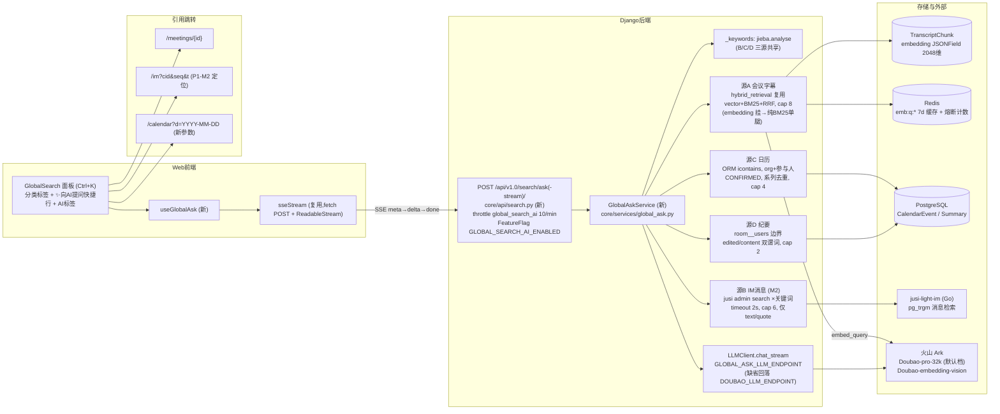
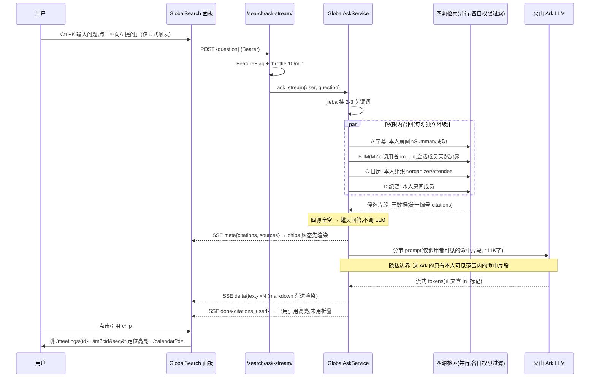

# 全局搜索 AI 化(P1-4)— 设计文档

状态:M1+M2 已完成,M3 客户端部分已完成(2026-07-18);M3 剩余=评测集/
pro-lite 对比/日 quota(需线上数据)+ `/calendar?event=` 事件级定位。
M3(App)实施注记:GlobalAskSse(鉴权 OkHttp 流式,契约同 §D2,离页断流)+
搜索页 AI 分类(显式触发/灰态引用先行/★ 标已用/degraded 检索结果模式/IM
缺席弱提示);引用点击 消息→会话定位、会议→历史详情,**日历引用 App 端仅
展示**(无按日定位路由,后续拉齐)。android commit 6c13d32。
M2 实施注记:`_recall_im` 按 §D1 源B 全量落地——uid 只取调用者(resolve_uid
缓存+懒注册,失败=无 IM 身份静默跳源)、独立 2s 超时 JusiImAdminClient、≤3 线程
逐关键词 limit=5、轮转交错 + mid 去重、仅 text/quote(quote 取 JSON.text)、
发送者名本地 im_uid 反查;**skipped 语义**=未配置/无身份/全部关键词调用失败
(与 empty 区分);前端 done 后 IM 缺席弱提示(拍板③,灰字不弹窗)。调用顺序
与 prompt 分节一致保证 [n] 分节内递增。测试 +4(uid 断言/扇出去重与类型过滤/
未配置与全挂 skipped/缺源不拖垮整体),19 条全过。M1 实施注记:后端
`core/services/global_ask.py` + `core/api/search.py` 按 §D1-D7 全量落地
(三源/引用契约/熔断/检索结果模式/独立 ep 配置键/flag 双端 gate/throttle),
测试 12 条(权限跨用户负例×3/罐头零调用/熔断/引用提取/流契约/端点 gate)全过;
前端 GlobalSearch 第 5 分类+快捷行+AI 面板(灰态→高亮/折叠/降级横幅/关面板
abort)+ `/calendar?d=` + i18n 五语。
对标:飞书 aily/知识问答(专业版付费)、钉钉 AI搜问(免费边界未决)、企微智能搜索
调研依据:`docs/research/competitor-gap-feishu-wecom-dingtalk-2026-07.md` §五 P1-4

---

## 1. 背景与差距

我方全局搜索(Ctrl+K)已具备 联系人/会议/消息 关键词检索(P1 消息全文搜索已收口),
但竞品已进化到「自然语言提问 → 跨源检索 → 带引用作答」。三家该能力普遍带付费/灰度
门槛(飞书 aily 专业版、Lark AI Notes 仅 Pro+、钉钉 AI 免费边界未决)——**免费开放
即获客差异点**(强度取决于竞品免费版实际权益,见调研 §六缺口 6.2)。

我方的结构性优势:PersonalAI 已跑通完整的「NL 提问→混合检索→SSE 流式→带引用作答」
闭环(仅覆盖会议字幕单源、仅挂首页悬浮球),本设计 = 把该闭环泛化为多源并接入全局
搜索面板,复用比新建多得多。

## 2. 现状锚点(代码)

**可直接复用**
- `core/services/personal_ai.py`:`_user_room_ids`(L257-275,权限=本人房间∩Summary
  SUCCESS,唯一隐私边界)、`ask()`(L78)/`ask_stream()`(L97,SSE meta→delta→done)、
  system prompt 硬编码(L40-54)。
- `core/services/hybrid_retrieval.py`:`vector_rank`(L33,numpy cosine,维度自适应)、
  `bm25_rank`(L67,jieba+BM25Okapi)、`reciprocal_rank_fusion`(L94,RRF k=60)。
- `core/services/llm_client.py`:`chat_stream`(L154,OpenAI SDK 流式);
  `core/services/embeddings.py` EmbeddingClient(L41,Ark multimodal,2048 维);
  `core/services/embedding_cache.py` `cached_embed`(L50,Redis 7d)。
- `core/api/viewsets.py`:`_sse_response`(L141-168,惰性生成器+带内 error 事件)、
  `ServerSentEventRenderer`;`core/api/throttling.py` `PersonalAIRateThrottle`(L98)。
- 前端:`layout/GlobalSearch.tsx`(Ctrl+K L39-48;4 分类 CATEGORIES L126-127;消息命中
  跳转 `/im?cid&seq&t` L215-220)、`features/personal-ai/api/sseStream.ts`(fetch POST
  + ReadableStream,meta 宽类型 L24-28——**新增 meta 字段零改动**)、
  `hooks/usePersonalAI.ts`、`PersonalAIDrawer.tsx` 引用 chip 范式(L208-211)。
- IM 检索:`core/api/im.py` `ImViewSet.search`(L707-739,代理 jusi trgm,权限=会话
  成员,q≥2,`{items, next_before_mid}`)。
- 消息定位:`ImRoute.tsx` L83-98 解析 `?cid&seq&t` → ChatPane locate(P1-M2 现成)。

**缺口(设计内补)**
- 会议/日历/纪要无搜索端点 → 进程内 ORM 召回(不建新搜索 API)。
- `Summary.effective_content` 是 Python property(models.py)**不能 ORM icontains**
  → 双谓词见 D1 源D。
- 日历路由无事件定位参数 → `/calendar?d=YYYY-MM-DD` 小扩展(CalendarRoute date
  state 初始化读 query)。
- 文档(MeetingDoc)仅外链、无可搜端点 → 非目标。

## 3. 目标 / 非目标

**目标**
1. Ctrl+K 面板新增「AI 问答」分类 +「全部」分类下的「✨ 向 AI 提问」快捷行。
2. 自然语言提问 → 多源(字幕/日历/纪要,M2 加 IM)权限内检索 → 流式回答 + 可点击
   引用(会议/消息/日程三类跳转)。
3. 免费开放(无付费墙),以 限流+显式触发+熔断 控成本。

**非目标(明确不做)**
- rerank(Ark 无自助 rerank 端点,既有否决维持,见 `hybrid_retrieval.md` §9)。
- 主题聚类(已推迟)。用户自定义提示词(prompt injection 风险,已搁置)。
- 文档源(La Suite Docs 自有搜索,iframe 侧解决)。
- 多轮追问(单轮问答;多轮是 PersonalAIDrawer 的形态,不重复建设)。
- Android 端(M3 再议;后端契约天然可复用)。

## 4. 设计

### D0 系统架构图与数据流向图

系统架构图:

数据流向图(含隐私边界):

### D1 GlobalAskService(新文件 `core/services/global_ask.py`,零改 personal_ai)

**关键词抽取(B/C/D 三源共享)**:`jieba.analyse.extract_tags(question, topK=3)`
(TF-IDF,自带停用词权重,jieba 已因 bm25 在进程内热)+ 保留引号内短语与英文/数字
token 原样 + 词长≥2(trgm 对 2 字 CJK 已边际)。**否决 LLM 抽词**:+0.5~1.5s 首字
延迟、失败仍需 jieba 兜底、同义词发散对字面检索(trgm/icontains)是负收益。

**四源召回**(每源独立 try/except,失败只缺源):

| 源 | 召回方式 | 权限边界 | cap×截断 |
|---|---|---|---|
| A 会议字幕 | hybrid 三件套(vector+BM25+RRF)复用;**embedding 挂→纯 BM25 单腿继续**(优于 PersonalAI 现状的硬失败) | `_user_room_ids`(本人房间∩Summary SUCCESS),复用 staticmethod + parity 测试防漂移 | 8×800字 |
| B IM 消息(M2) | 关键词逐个查 jusi admin search,`limit=5`,**独立 `JusiImAdminClient(timeout_seconds=2)`**,≤3 线程并发,整源预算 2.5s;按 mid 去重、关键词轮转交错 | uid **只取调用者**(`User.im_uid`,空则 issue_token 解析回填;失败=静默跳源);会话成员关系即 jusi 服务端权限 | 6×200字,**仅 text/quote**(quote 取 JSON.text;image/file body 是 JSON/URL 噪音) |
| C 日历 | 关键词 OR icontains(title/description),窗口 ±180 天,仅 `CONFIRMED`;**按 `recurrence_parent_id or id` 去重取距今最近发生**(防重复系列占满 cap) | `get_caller_organization` 口径(服务内复刻 6 行查询并注释指回 directory.py:32,防 api→services 反向 import 链)+ `Q(organizer=user)\|Q(attendees__user=user)` + `.distinct()`;org 为 None 整源跳过 | 4×300字(desc 截 150) |
| D 纪要 | 关键词 icontains,**双谓词** `Q(edited_content__icontains=kw) \| (Q(edited_content="") & Q(content__icontains=kw))`(effective_content 是 property 不能 ORM 查;双谓词既不漏编辑稿也不误中被取代的 AI 原文);喂 prompt 取命中位置 ±300 字窗口 | `Summary.objects.filter(room__users=user, status=SUCCESS)`——与 `_user_room_ids` 同构的**房间成员边界,不是组织边界** | 2×600字,引用归并 meeting 类型 |

**融合与 prompt**:不做跨源 RRF(分数量纲不可比);分源 cap + 分节喂
(【会议字幕】【聊天消息】【日程】【会议纪要】,空节整节省略),**全局单调编号**贯穿分节,
prompt 声明「节内已按相关度排序,节间不可比」。预算:6400+1200+1200+1200+骨架
≈11K 字 + max_tokens 1200,32K 窗口余量充足。消息发送者名用
`User.objects.filter(im_uid__in=…)` 本地反查(零外部调用)。
**四源全空不调 LLM**,走罐头回答(省钱且快)。

### D2 引用契约(混合式:meta 全量 + 行内 [n] + done 带已用集)

- `meta{citations[], sources{}, model_used}`:**全部候选引用**,统一编号分源分组,
  UI 立即渲染为灰态「参考来源」(沿用 PersonalAI 首 token 前出 chips 的 UX 优点)。
- `delta{text}`:正文要求 `[n]` 行内标记(prompt 给 few-shot 示例)。
- `done{citations_used[]}`:后端流式过程中累积全文,结束时正则提取 `[n]` 集合——
  比前端解析稳,非流式端点行为天然一致。
- 前端:done 后**高亮被引用 chips,未引用折叠到「更多来源」;模型漏标时全部 chips
  保持灰态可点,绝不清空**(Doubao 偶发不守标记格式是必然发生的降级态,这是硬要求)。
- citation 形状:`{n, kind: meeting|im|calendar, title, snippet, room_id?, cid?,
  seq?, date?}`(纪要归并 meeting)。
- `meta.sources: {transcripts|im|calendar|summaries: ok|empty|skipped, llm?: degraded}`
  从 M1 就带(零成本,排障刚需;UI M1 只记日志,M2 加缺源弱提示)。

### D3 端点

- 新文件 `core/api/search.py`:`POST /api/v1.0/search/ask/` + `/search/ask-stream/`
  (复用 `_sse_response`/`ServerSentEventRenderer`;urls.py 仿 `config/` 加两条 path;
  不再往 3000+ 行的 viewsets.py 堆)。
- serializer 照抄 `AskPersonalAISerializer`(question ≤500 字);**单轮无 history**。
- 新 throttle `GlobalSearchAIRateThrottle`(照抄 PersonalAIRateThrottle,scope
  `global_search_ai`),`DEFAULT_THROTTLE_RATES` 加 `10/minute` + 环境变量覆盖;
  独立 scope 不与 personal_ai 抢额度。
- **FeatureFlag 双端 gate**:`FeatureFlag.FLAGS` 加 `"search_ai":
  "GLOBAL_SEARCH_AI_ENABLED"`(默认 True),两个视图挂 `@FeatureFlag.require`
  (关闭 404)+ `config` 暴露 `search_ai.enabled` 前端藏入口——只藏前端挡不住
  直接调 API 烧钱。

### D4 前端

- `GlobalSearch.tsx`:`CATEGORIES` +`'ai'`;「全部」分类 q≥2 时顶部「✨ 向 AI 提问:
  {q}」快捷行(点击切 AI 标签并提交);**AI 只显式触发(快捷行/AI 标签内 Enter),
  绝不随输入防抖自动发起——最重要的成本闸门**。
- 新 hook `useGlobalAsk`(不复用 usePersonalAI:引用 shape 不同、无 history);
  markdown 渲染复用 PersonalAIDrawer 的 react-markdown 样式模式;`sseStream.ts`
  零改动(meta 宽类型;done 新字段 hook 内 cast 读取)。
- chips 跳转:meeting→`navigateTo('meetingDetail', roomId)`;im→
  `/im?cid&seq&t=Date.now()`(定位高亮现成);calendar→`/calendar?d=YYYY-MM-DD`
  (CalendarRoute date state 初始化读 `?d`,仿 ImRoute useSearchParams 用法)。
- **Modal 关闭必须 abort SSE**(sseStream 已支持 signal)——生产 gunicorn 3 个
  sync worker、90s 超时,每条 SSE 占满一个 worker,这是并发红线。
- i18n:`shell.json` 五语(ai 标签、快捷行、来源分组、空态、降级文案)。

### D5 数据流向与隐私(拍板① 2026-07-18:IM 进检索源,无组织级开关)

- 检索永远限调用者可见范围:字幕=房间成员∩纪要成功;IM=本人 im_uid 的会话成员
  关系(jusi 服务端裁决);日历=本人组织∩本人 organizer/attendee;纪要=房间成员。
- 命中片段送火山 Ark 生成答案——会议转写此前已在送(摘要/个人AI),**IM 消息是
  新增内容面**,已拍板接受;全局 flag 可关整功能作为最后手段。
- prompt 注入面:IM 消息/纪要是他人可写文本进入调用者 prompt,可诱导误答——
  定性已知低危;缓解=引用可点核查 + prompt 规则行("只据下文作答")。

### D6 LLM 选型与配置(评审补 2026-07-18)

- **现状**:文本栈锁定火山 Ark(OpenAI 兼容,`ARK_API_KEY`),现网单一 endpoint
  `ep-20260316164223-46rsh`(Doubao-pro-32k 口径)被 摘要/个人AI/房间AI 共用;
  ep↔模型绑定在 Ark 控制台,代码只认 ep id(`llm_client.py` 把 ep 当 `model` 传)。
- **本功能选型要求**:①中文理解 + `[n]` 标记指令纪律 ②首 token 快(点击→首字
  <4s 的主要变量) ③32K 上下文(prompt ≈11K 字) ④单答成本低(免费开放)。
- **候选定档**:默认 **Doubao-pro-32k**(与现网同款,标记纪律与多源综合最稳);
  备选 **Doubao-lite-32k**(首 token 最快、成本约 1/5,标记纪律打折——M3 评测集
  跑 pro vs lite 对比后再定降档);不预设 Ark 其他型号(配置面已留好,控制台开通
  即换);**不引入第二家供应商**(私有化交付/密钥/合规面翻倍,与 rerank 否决同一
  节俭取向)。
- **配置形态**:settings 新增 `GLOBAL_ASK_LLM_ENDPOINT`(值=ep id,**缺省回落
  `DOUBAO_LLM_ENDPOINT`**)——本功能可独立换模型/降成本,不影响纪要与个人 AI;
  不进 AIVendor/AIModel 目录(该目录为实时语音 agent 专用,文本栈 settings 驱动
  是既定分界)。
- **参数**:temperature 0.2(引用型问答克制)、max_tokens 1200、流式;embedding
  沿用 Doubao-embedding-vision 2048 维不动。

### D7 LLM 不可用兜底——「检索结果模式」+ 熔断(评审补 2026-07-18)

- **第一层(结构性)**:全局搜索主体(联系人/会议/消息标签)零 LLM 依赖——Ark
  欠费/断网只影响「AI 问答」标签,搜索面板整体照常。
- **第二层(核心,AI 标签内降级)**:检索管线(关键词+四源召回)不依赖 LLM,
  citations 在调 Ark **之前**就已生成并经 meta 下发。LLM 调用失败(quota 429/
  401 欠费/超时/断网)时后端**不返回裸 error**,而是 `done{degraded: true}` ——
  前端把灰态 chips 直接转为「检索结果模式」:文案「AI 回答暂不可用,以下是为你
  检索到的相关内容」,chips 全部可点跳转。用户仍得到一次跨源联合检索,只是少了
  自然语言综述。
- **第三层(熔断,防雪崩防烧钱)**:Redis 计数 `ask:llm:fails`,连续 3 次失败进
  **5 分钟熔断窗**——窗内跳过 Ark 直接检索结果模式(不等超时),
  `meta.sources.llm='degraded'`;窗后半开放行一次探测。欠费场景全功能自动退化为
  「多源联合检索」,零人工介入,充值后自动恢复。
- 与既有降级叠加:embedding 挂→源A BM25 单腿(D1);LLM 挂→检索结果模式(本条);
  最坏情形(Ark 全面欠费)= BM25 字幕+日历+纪要(+IM) 纯检索,依旧可用。
- 运维:LLM 失败 warning 日志(quota/auth 类单独标注),沿用 throttle 的 Sentry
  监控思路。

## 5. 兼容与部署

- **零迁移**;后端镜像 + 前端镜像;helm 无 values 变化(`GLOBAL_ASK_LLM_ENDPOINT`/
  `GLOBAL_SEARCH_AI_ENABLED` 走环境变量,可选)。
- 「只扩展不修改」例外清单(均为扩展点小 diff):settings.py、urls.py、
  throttling.py、feature_flag.py、api/__init__.py(config)、GlobalSearch.tsx、
  CalendarRoute.tsx、useConfig.ts、locales×5。零改动:personal_ai.py、
  hybrid_retrieval.py、sseStream.ts、im.py、jusi_im.py。
- 容量注记:3 个 gunicorn sync worker 是 SSE 并发红线;前端 abort 必做;扩副本/
  gthread 为预案。

## 6. 测试与验收

**单测**:关键词抽取(停用词/引号短语/英数 token);四源权限**跨用户负例各一条**
(最高危面,沿 personal_ai.py 隐私注释纪律);C 重复系列去重;D property 双谓词;
全空罐头(断言零 LLM 调用);citations_used 正则提取;throttle 429;flag 404;
**mock LLM 抛错→`done.degraded=true` 且 citations 完整;熔断窗内零 Ark 调用**。

**验收动线**:Ctrl+K → 输问题 → 快捷行 → <1s 灰态 chips → 流式回答 → done 高亮
已用引用 → 三类 chip 跳转各验一次(会议详情/IM 定位高亮/日历 ?d 周视图)。
负例:无权限用户同问「没有找到」;flag 关闭入口消失+端点 404;第 11 次/分钟 429。
**兜底演练**:置换无效 ARK_API_KEY → AI 标签转「检索结果模式」(chips 可点、文案
正确),关键词搜索标签全程不受影响,连续 3 问后第 4 问不再等待超时(熔断即时降级)。

## 7. 分期(拍板② 2026-07-18:M1 三源先行)

| 期 | 内容 |
|---|---|
| M1 | 进程内三源(A 字幕+C 日历+D 纪要)+ 完整动线(快捷行/AI 标签/三类跳转/`/calendar?d=`)+ throttle/flag 双端 + `GLOBAL_ASK_LLM_ENDPOINT` 配置键 + D7 兜底全套 |
| M2 | IM 源(B:im_uid 解析链/≤3 线程并发/2s 超时/text·quote 过滤)+ 缺源弱提示 UI + jusi 断网验收 |
| M3 | 20 问评测集(各源命中率 + pro vs lite 标记纪律/首 token/成本对比)、per-user 日上限评估、Android、`/calendar?event=` 事件级定位、纪要向量化(仅当 icontains 被证明瓶颈) |

## 8. 开放问题(拍板项)

已落定(2026-07-18 评审):①IM 进检索源、无组织开关;②M1 三源/M2 IM;③LLM 选型
=默认 pro-32k+独立配置键(D6);④LLM 兜底=检索结果模式+熔断(D7)。

待拍板:
1. 快捷行文案与 AI 标签名(「AI 问答」vs「智能搜索」,五语文案随之)。
2. M3 的 per-user 日上限阈值(免费开放的成本护栏,上线看量再定)。
3. IM 源(M2)上线时「消息来源暂不可用」UI 弱提示的形态(建议要,弱文案不弹窗)。
