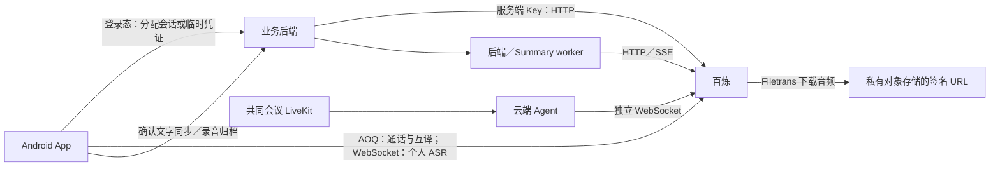

# 大模型接入方案

核对日期：2026-10-08。本文记录当前代码、已完成验收和接入边界；历史验证记录保留当时的模型名及配置。客户端默认接入方式以安装的 APK 版本为准，代码完成不代表所有已安装客户端已升级。

## 接入选择

个人实时语音优先客户端直连，业务服务器负责登录鉴权、会话分配和必要的文字保存。共同会议、文件转写、带权限检索的问答和摘要继续在云端执行。HTTP 调用复用连接和 SDK 实例；实时语音会话分别持有自己的连接。

AOQ、WebRTC、WebSocket 是传输方式，DashScope SDK、OpenAI SDK 是调用工具，两者不是互斥选项。例如，会议 Omni 的 DashScope SDK 底层仍使用 WebSocket。AOQ 使用阿里云 SDK 和服务端接口，本项目不将它作为跨供应商通用协议。

## 模型与实际调用路径

| 模型 | 用途 | 执行位置与接入方式 | 当前状态 |
| --- | --- | --- | --- |
| `qwen3.8-omni-flash-realtime` | Android AI 电话／视频通话 | 客户端 AOQ Client SDK；后端 HTTP 分配会话，媒体直达百炼 | 新版 Debug、Release 均默认 AOQ；设置中可手动选择 WebRTC |
| 同上 | 加入 LiveKit 会议的 AI 助手 | 云端 Agent 使用 DashScope `OmniRealtimeConversation`，底层 WebSocket | 保留云端桥接，不随个人通话切换 |
| 同上 | 双语互译语言识别及云端辅助处理 | Android AOQ 语言识别连接；云端路径使用 WebSocket 辅助适配器 | 属于互译链路的额外模型会话 |
| `qwen3.8-livetranslate-flash-realtime` | Android 独立双语互译 | 客户端 AOQ；云端备选路径为业务网关／Agent 的 WebSocket | 新版 Debug、Release 均默认 AOQ；内部验证 APK 提供固定方向单连接；可手动选择云端 |
| 同上 | 会议／录音翻译的云端适配器 | Agent 使用 Python `websockets`，连接百炼实时接口 | 新版 Android 接受 3.8 及历史 3.5 配置；保留既有云端生命周期 |
| `qwen-audio-3.1-asr-flash-streaming` | 保留音频的 Android 个人录音实时转写 | OkHttp WebSocket 直连百炼；后端签发专用临时凭证并保存确认文字 | 已转正，用户真机测试通过 |
| 同上 | 会议字幕、其他云端实时转写 | LiveKit／采集链路 → Agent → 百炼 WebSocket | 继续使用原生 WebSocket 适配器 |
| `qwen-audio-3.1-asr-flash-filetrans` | 上传文件、录后整段转写、旧 Summary 转写 | 后端／Agent／Summary 使用异步任务 HTTP API；分别复用 requests／aiohttp 连接 | 保留云端任务管理，已完成连接复用 |
| `qwen3.8-flash` | 会议纪要、概览、录音问答、全局 AI 搜索、会话摘要、上传原文翻译 | 后端和旧 Summary 使用 OpenAI 兼容 SDK，HTTP／SSE | 复用 SDK 实例和 HTTP 连接，不为池化更换 SDK |
| 同上（按任务配置） | Work 通信任务 | 后端 `WorkCommunicationExecutor` 使用 `LLMClient`／OpenAI SDK | 使用后端复用层；模型和地址取任务快照 |
| 同上（Pi 灰度配置） | Work 云端 Pi Agent | Agent runtime → Model Broker → 百炼兼容 HTTP／SSE | Broker 独立持有 httpx 池，已随云端适配器 0.3.6 发布并验证 |
| `text-embedding-v4` | 字幕及搜索向量，1024 维 | 后端调用兼容 HTTP `/embeddings`，实际传输经 requests 连接池 | 已生产发布：每请求最多 10 条，按索引恢复顺序并校验维度 |
| `qwen3-asr-flash-realtime` | Omni AOQ／WebRTC 会话中的输入文字 | 两条客户端路径均使用 `session.input_audio_transcription.model` 子配置 | 不是独立 ASR 3.1 转写任务，不应与其混为一谈 |

Work 的 DeepSeek 路径属于其他供应商，默认配置与 Pi 的 Qwen 灰度配置应分别理解。旧 `ARK_*`／`DOUBAO_*` 配置、历史 3.0／3.5 模型名和评估脚本不代表当前会议默认模型；当前会议 AI 目录拒绝旧 Doubao 配置。

## 数据路径

Omni 原来的 WebRTC 媒体已经是客户端直连，切换 AOQ 主要改变传输和建连过程。双语互译及个人 ASR 直连减少业务服务器参与实时音频转发的流量与处理；个人录音仍上传归档音频，因此不会消除全部上传流量。

## Android Omni 与双语互译

Android “AI 工具 → 打电话”的完整架构、业务控制流、实时事件流、直连媒体流及语音／视频切换见 [AI 音视频互动方案](ai-audio-video-interaction.md)。其中 AOQ 正式默认传输与摄像头语音控制的内部验收开关分别说明，不能将两者的发布状态混为一谈。

### 正式默认与升级迁移

2026-10-08 的客户端变更将两种功能的默认方式改为 AOQ，并移除双语互译执行路径及设置入口的 Debug 限制。首次读取旧偏好时，以 `aoq_default_v1` 标记完成一次迁移；保留音色、提示词、场景、语言和播报设置。迁移之后手动选择 WebRTC／云端的偏好会持续保留。

接入方式只能在会话开始前切换。连接失败不自动启动另一个模型会话；用户可停止后手动切换。新版 APK 安装后生效，无需为此次默认切换重新发布后端或 Agent。

### 分配接口与媒体连接

| 业务接口 | 请求用途 | 客户端收到的内容 |
| --- | --- | --- |
| `POST /api/v1.0/ai-call/session/` | Omni，`transport=aoq` 或 `webrtc` | AOQ 会话配置或 SDP answer，以及音色、提示词 |
| `POST /api/v1.0/assistant-translation/session/` | `purpose=translation` 或 `language_detection` | 对应模型名和 AOQ 会话配置 |
| `POST /api/v1.0/assistant-translation/ticket/` | 手动选择云端互译 | 业务网关 URL 和短期 ticket |

AOQ 分配由后端请求 `https://{workspace}.{region}.maas.aliyuncs.com/api/v1/webrtc/realtime?model={model}`，设置 `x-dashscope-rtc-transport: moq`。客户端只接收 `sid`、连接 Token、Relay、证书指纹和工作空间哈希，不接收永久 API Key。协议依据见[百炼 Token 鉴权](https://help.aliyun.com/zh/model-studio/realtime-token-authentication)。

两个 AOQ 分配接口已在生产接入后端 `provider_http.request`，与其他 provider HTTP 请求复用线程内 Session；保留固定模型、响应大小限制、禁止重定向和不自动重试会话创建的行为。它们属于短期控制请求，不承载持续音频；本轮真实验证见[生产发布记录](../reviews/llm-integration-production-2026-10-08.md)。目前请求体未提供选填的 `clientIp`；若后续优化 Relay 分配，应先正确解析可信代理传递的客户端公网地址。

双语互译的 `AoqBilingualWire` 默认自动双向模式建立正向、反向翻译及 Omni 语言识别三条连接，使用本机采集及方向路由。新版 Android 在设置中提供两个固定方向，固定方向仅分配并连接一个翻译模型，跳过 Omni 语言判断和另一条翻译连接；结束仍等待译音尾部、最后文本及 `session.finished`，支持译音回放。方向只能在会话开始前修改，切换语言对时恢复自动模式；云端备选仍使用自动双向模式。

自动模式通常缓冲 25,600 字节的 16 kHz PCM（800 ms）后启动语言判断，新版代码记录判断输入时长、耗时及连接数，不记录原始讲话。固定方向减少模型连接与判断步骤，实际译文延迟、Token 费用和弱网表现仍需分别测量；连接数从三变一不等于费用降为三分之一。

SDK 当前固定为 AOQ Client SDK 1.3.0，来源及校验记录在 Android `feature-assistant/libs/aoq-sdk.properties`。`app` 打包 AAR，`feature-assistant` 使用编译期依赖；AOQ／Opus 原生库沿用 ARM 版本，纯 x86 进程需手动选择备选路径。后台会话由前台服务持有；断网、取消及关闭沿用原生命周期。

AOQ 默认使用媒体音量，WebRTC 使用通话音量，这是 Android 播放路径的选择，两种系统音量分别保存。此前用户观察到 AOQ 建连约为 WebRTC 的 2/3，是单机体感结果；尚无统一真实网络压测支持将该比例作为性能承诺。

Android AI 电话新增摄像头 Function Calling 内部验收版本：Omni 理解自然语言，客户端核实权限及首帧、执行开关并回传实际状态，Omni 使用当前音色续答。AOQ 数据消息和 WebRTC DataChannel 共用协调器，不新增 ASR 连接、不改变会话分配 API，媒体和业务租约沿用当前连接。工具注册显式关闭联网搜索；不执行用户转写中的关键词，以避免重复操作。摄像头控制 Debug 默认开启，Release 在两条传输及真机验收完成前保持关闭；AOQ 传输方式本身的 Release 默认设置不受影响。协议、权限、失败清理、测试入口和回退说明见 [Android 摄像头语音控制](https://github.com/John-Shao/we-meet-android/blob/main/docs/ai-call-camera-voice-control.md)。

“结束对话／停止对话”新增本地 `end_call` 工具：Omni 理解明确的结束请求，App 复用挂断按钮的清理流程关闭当前语音／视频通话、媒体资源、前台服务和业务租约；不等待告别语或请求续答，不增加 ASR、后端接口或新会话。`OmniCallTools` 对参数、重复事件、取消与当前实例归属统一检查。语音挂断独立受 `AI_CALL_VOICE_HANGUP` 控制，Debug／Release 默认开启，可用 `-PAI_CALL_VOICE_HANGUP=false` 构建回退；生产摄像头语音工具仍默认关闭。否定、用法问句、引用、假设与画面内容不应触发挂断，模型漏调用也不能算已结束。整体架构、生命周期与验收限制见 [AI 音视频互动方案](ai-audio-video-interaction.md)。

该功能尚不具备生产默认开启条件：真实语音基本和连续开关探针仍观察到模型漏发工具调用、续答超时；不能用摄像头媒体开关或查询工具测试通过替代完整语音验收。发布门槛与实际证据见 [内部验收记录](https://github.com/John-Shao/we-meet-android/blob/main/docs/ai-call-camera-voice-verification.md)。

## Android 个人录音 ASR

适用范围是保留音频的个人录音。用户点击“开始转写”后，客户端从已登录的 `POST /api/v1.0/assistant-transcription/session/` 获取 60 秒临时凭证，再连接工作空间 `wss://{workspace}.{region}.maas.aliyuncs.com/api-ws/v1/inference`。输入为 16 kHz、单声道、16 位 PCM，使用 `run-task`／`finish-task`，等待 `task-started` 后才发送音频，结束时等待最终句及 `task-finished`。

后端只使用 `DASHSCOPE_ASR_CLIENT_API_KEY`，未配置时返回 503，不回退到全权限 Key。源 Key 必须在百炼限制为允许调用的 ASR 模型，临时 Key 会继承源 Key 权限；签发接口每用户每分钟限制 10 次，并禁止响应缓存。60 秒是建连凭证有效期，不是录音时长限制。[临时 API Key 权限说明](https://help.aliyun.com/zh/model-studio/application-obtain-temporary-authentication-token)、[建连阶段鉴权说明](https://help.aliyun.com/zh/model-studio/realtime-token-authentication)。

前台采集服务持有识别连接，离开页面或进入后台不会结束转写。暂停时结束当前模型任务，续录时建立新任务；不会回放开启前或暂停期间的音频。实时转写与翻译共用一个 PCM 订阅槽，不同时运行两种实时音频工具。

确认文字写入按账号隔离的本机加密待发送记录，通过设备／租约绑定接口同步：

- `POST /api/v1.0/capture-sessions/{capture}/transcription/direct/` 创建正式任务。
- `.../transcription/direct/{job}/` 同步固定句子 ID 和递增序号。
- 停止保存时原子发布到实录，标记来源 `client_direct_asr`、覆盖范围 `partial`；不伪造供应商用量。
- 保存失败可重试文字同步；不会自动重放音频、重启模型或追加云端收费转写。

保留音频的个人录音页面不再并列展示云端实时转写。共同会议字幕、仅保留文字的录音及已有云端任务仍使用原流程。录音结束后，如需完整覆盖，用户可在实录中明确发起整段 Filetrans。录音页“停止”按钮只重命名，仍执行原停止与保存功能。

2026-10-06 在当时区域及工作空间实测，ASR 3.1 的 AOQ inference 分配返回 `400 InvalidParameter (url error)`，同条件 3.0 成功；因此保留 3.1 并使用 WebSocket。该记录不代表供应商永久不支持 3.1 AOQ；再次评估时需重新验证具体模型、区域和 SDK，不能仅替换协议名称。

## 云端 HTTP、SDK 和实时连接

Filetrans 保留“提交异步任务 → 查询原 task → 下载结果 → 发布原文”的云端管理。模型通过签名 URL 下载对象存储中的音频；提交／查询接口不持续转发实时 PCM。这样可以保留文件权限、任务账本、恢复和发布行为。结果存储下载不附带模型 Authorization，临时对象按生命周期清理。详见[录音文件转写](file-transcription.md)。

文本模型继续使用 OpenAI 兼容 SDK，流式返回采用 HTTP SSE。问答、搜索和摘要需要服务端权限检索、提示词组装、用量及结果管理，不直接下放这些完整职责和永久 Key 到客户端。Embedding 使用兼容 HTTP，虽然构造 urllib Request，实际 `urlopen` 包装经 requests 共享连接；生产 `batch_embed` 每请求最多 10 条，按响应 `index` 恢复原顺序，拒绝重复／缺失／越界索引、非有限数值及非 1024 维向量。每批请求前检查来源快照，发布时再次验证，来源变化不继续提交下一批或发布部分结果。[官方批大小与维度](https://help.aliyun.com/zh/model-studio/text-embedding-synchronous-api)。向量及查询缓存按模型隔离，历史向量重建仍是显式付费操作。

### 本轮选型评估

当前个人实时音频直连、共同会议云端桥接、文件任务及权限检索云端管理的分工继续保留。Python SDK 的连接复用可通过自定义 Session 实现，现有 HTTP 层已经提供需要的复用；SDK 迁移以新增功能或降低维护成本为依据，不以 SDK 名称作为高并发能力判断。

个人录音翻译仍通过业务网关转发，具备进一步直连的优化空间；本轮先修复 3.8 响应兼容。该路径还承担租约／代次校验、译文归档、播放时间及用户停止后的原子发布，不能直接复用独立双语互译的页面内回调替换。后续直连迁移应像正式 ASR 一样提供独立的文字同步与恢复契约，覆盖账号切换、部分结果、保存失败和最终句验收后再替换。

### 直连分配记录与可配置准入

生产后端已新增 `DirectAIAllocation`（迁移 `0197`），记录账号、模型、传输方式、申请状态和时间；不保存永久 Key、会话 Token、音频或对话。Omni AOQ／WebRTC、互译 AOQ 和个人 ASR 临时凭证接口先预占申请记录，再在数据库事务外请求供应商；验证成功返回可选 `session_lease`，失败保留记录并释放活动申请槽，不自动重试收费创建。

新版客户端向 `POST /api/v1.0/direct-ai/sessions/{id}/` 每 30 秒发送一次 `heartbeat`，停止、暂停 ASR 或关闭连接时发送 `close`。服务端按账号校验、逐账号数据库锁串行化准入，租约保留 120 秒；失联租约可在下次申请或执行 `python manage.py expire_direct_ai_allocations` 时回收。生产宿主机已启用每分钟执行该命令的 `meet-direct-ai-expiry.timer`，包含调度间隔的实际回收时间可能超过 120 秒。关闭／过期租约不能通过迟到心跳复活。单条声明最长 12 小时。

`DIRECT_AI_MAX_ACTIVE_ALLOCATIONS`、`DIRECT_AI_MAX_DAILY_ALLOCATIONS` 默认均为 `0`，只观测，不改变当前可用范围；正数分别限制活动申请租约及 UTC 当日申请次数。自动双向互译占三个申请，固定方向和单个 ASR 任务占一个；日限额包含失败、关闭及已过期的申请，不能解释为成功模型调用次数或金额。活动限额开启时返回 `enforce=true`，客户端在租约被拒绝或连续三次心跳失败后结束连接；纯观测模式停止观测并等待租约过期，正常直连音频仍可继续。

这些是应用侧准入和声明，不是供应商权威并发或账单：旧客户端不报告心跳，临时 API Key 也不是一次性、单任务凭证，租约过期不会由服务端强制断开上游。活动限额应在目标客户端升级后配置；强制消费限制仍需结合供应商权限／限流／额度及账单核对。当前直连 ASR 仍明确记录 `billing_observed=false`，不将客户端声明伪造成实际费用。

本轮后端已于 2026-10-08 生产发布并应用迁移 `0197`，两个限额保持为 0；真实 AOQ、正式直连 ASR、Embedding 和失联回收验证通过。新版 Android 内部验证 APK 已归档，安装后启用新增客户端行为，未代表所有存量客户端已升级；新 APK 也兼容不含 `session_lease` 的旧后端。供应商 Key 仍使用原有专用权限设置，生产共享 Secret 改由外部管理，避免 Helm hook 遗漏专用 ASR 字段。版本、发布配置 profile、APK 与回退说明见[生产发布记录](../reviews/llm-integration-production-2026-10-08.md)。

### 已完成的复用层

| 调用层 | 复用范围 | 当前限制与释放方式 |
| --- | --- | --- |
| 后端／旧 Summary requests | 每进程、每线程独立 Session | 每 Session 缓存 8 个主机池，每主机 8 条连接，池满等待；请求前清理 Cookie，鉴权逐请求设置 |
| Work/Pi Broker HTTP／SSE | 每个 Broker 独立持有、进程内线程共享 httpx Client | 总连接 16，空闲 8，保留 60 秒；池等待最多 2 秒且不超过本次请求超时；禁重试及重定向 |
| 后端／旧 Summary SDK HTTP | 每进程共享 httpx transport | 总连接 64，空闲 32，保留 60 秒；禁用 transport 自动重试 |
| OpenAI SDK 实例 | 按凭证、地址、超时及重试配置隔离的进程缓存 | 最多 16 个实例；借用计数保证关闭／淘汰不打断其他任务；fork 后重建 |
| 开启 Langfuse 追踪的 Summary | 每任务 SDK wrapper、追踪对象及脱敏闭包 | 仅共享 HTTP transport；任务结束关闭 wrapper 并刷新追踪 |
| 封存 Filetrans Agent | 一个 worker 事件循环内跨任务 aiohttp Session | 总连接 32，每主机 16，空闲 60 秒，请求总超时 45 秒；worker 退出关闭；独立调用自行管理 Session |

共享资源不保存用户消息、会话状态或用量回调。SDK／aiohttp 会话拒绝 Cookie；requests 在每次请求前清空已有 Cookie。进程、线程及事件循环边界按各复用层分别处理。池大小是每个所有者的限制，多进程部署时须计算总连接数，并结合排队、超时和供应商限额调整。

Filetrans 的收费提交不自动重复；提交结果不明时不能把 HTTP 重试当作幂等恢复。SDK 复用保留调用点原有重试策略，显式 `max_retries=0` 的业务仍为 0；不能将底层 transport 禁重试理解为所有 SDK 调用都禁重试。

官方 DashScope 的 Java SDK 内置池和 Python 自定义 Session 机制不同。当前 Python requests／aiohttp／OpenAI SDK 已实现需要的复用，没有仅为池化迁移 SDK。[DashScope 连接复用配置](https://help.aliyun.com/zh/model-studio/connection-multiplexing-configuration)。

云端 ASR／翻译继续保留原生 WebSocket；会议 Omni 已使用 DashScope SDK。只有在 SDK 能减少维护成本，且通过握手、顺序、取消、超时、断网、最后一句、账号退出及关闭清理等生命周期测试后，才迁移对应适配器。HTTP 连接池不会把多个独立语音会话合并为一条 WebSocket，也不会自动降低模型推理成本。

## 配置与发布

| 配置 | 作用 |
| --- | --- |
| `DASHSCOPE_API_KEY` | 云端百炼调用及 Omni／互译 AOQ 分配，永久 Key 留在服务器 |
| `DASHSCOPE_WORKSPACE_ID`、`DASHSCOPE_REGION` | 实时模型工作空间及接入区域，需与 Key 匹配 |
| `DASHSCOPE_ASR_CLIENT_API_KEY` | 个人 ASR 临时凭证的专用源 Key，单独配置于 `meet-ai-credentials` |
| `DIRECT_AI_MAX_ACTIVE_ALLOCATIONS`、`DIRECT_AI_MAX_DAILY_ALLOCATIONS` | 候选后端的应用侧申请限制；默认 0 只观测；按模型申请数计算，不是供应商硬并发或金额额度 |
| `MEETING_CAPTURE_DIRECT_ASR_ENABLED` | 个人录音正式直连开关，代码默认关闭，既有生产部署已启用 |
| `QWEN_ASR_MODEL`、`QWEN_ASR_REGION` | 云端实时 ASR，默认 3.1 streaming／北京；客户端签发接口固定 3.1 |
| `QWEN_FILE_ASR_MODEL`、`QWEN_FILE_ASR_REGION`、`QWEN_FILE_ASR_BASE_URL` | 文件模型默认 3.1 filetrans，可显式指定区域／工作空间 HTTP 地址 |
| `MEETING_SUMMARY_MODEL`、`MEETING_OVERVIEW_MODEL`、`MEETING_SUMMARY_BASE_URL` | 默认 `qwen3.8-flash`，北京 OpenAI 兼容地址 |
| `QWEN_EMBEDDING_MODEL` | 默认 `text-embedding-v4`；更换模型需同时考虑索引和缓存 |
| 旧 Summary 的 `LLM_MODEL`、`LLM_BASE_URL`、`DASHSCOPE_API_KEY` | 独立服务配置；Qwen 路径不使用遗留 `LLM_API_KEY` |
| `WORK_MODEL_API_KEY`、任务的 model／base_url | 后端 Work 通信任务，与 Work Agent Broker 的 provider 配置分开管理 |

实时 WebSocket 使用工作空间域名的 `/api-ws/v1/inference`（ASR）或 `/api-ws/v1/realtime`（Omni／翻译）。文件任务使用区域 `/api/v1/services/audio/asr/transcription`、`/api/v1/tasks/{task}`；文本和向量使用 `/compatible-mode/v1`。各区域配置及凭证不能混用。

变更模型时同步检查后端、Agent、旧 Summary、客户端校验、数据库模型目录、Helm 环境变量和 Secret 引用。客户端直连仍需要正常登录、服务器签发接口及供应商可达性；关闭服务器新任务开关不应删除已保存原文。文档和验收只记录配置名、版本及脱敏指标，不记录永久 Key、会话 Token 或原始对话。

## 验收与兼容边界

原建议的四项状态：个人录音 ASR 直连已转正并通过用户测试；Filetrans／Embedding 连接复用已完成；后端及旧 Summary 的 OpenAI SDK 复用已完成；云端实时 WebSocket SDK 迁移按条件暂不实施。测试、模拟负载、10 个 deployment 的历史发布核对及回滚依据见[2026-10-07 连接复用验收](../reviews/provider-reuse-2026-10-07.md)。其中 512 任务／32 并发的结果来自隔离容器中的假服务，不代表真实模型吞吐、WAN 延迟或容量保证。

2026-10-08 AOQ 默认切换通过 Debug／Release 构建、Release 发布检查、600 项单元测试及非 Debug APK 的 14 项设备回归；真实 AOQ 互译探针验证了译文、译音、回放及结束。可安装验证 APK 使用测试签名，正式分发仍需项目发布签名；此次不需要发布后端。此前真机通话、翻译及 ASR 的用户验收不替代后续长会话、蓝牙、持续弱网和更多机型测试。

当前还需区分以下边界：

- 新版 Android `MeetingTranslationRepository`、`CaptureTranslationRepository` 接受服务端 3.8 和历史 3.5 配置，拒绝未知模型；已安装旧 APK 的 3.5 校验须通过升级修复。独立双语 AOQ 的验收仍不能证明会议／录音翻译链路全部兼容。
- Work/Pi Model Broker 已实现独立 httpx 连接池，保留逐任务鉴权、预算预占及用量账本；JSON／SSE 有界读取，异常／提前关闭释放连接，人工审批前释放上游响应，关闭时拒绝新借用并等待既有响应释放。凭证逐请求注入、拒绝 Cookie，不跨 Broker 或进程共享；fork 后需重新创建 Broker。云端适配器 0.3.6 已生产发布，两次真实 Qwen 复核通过且复用同一 HTTPS socket；仍保持单演示账号灰度，桌面内置 0.3.2 运行环境独立固定。发布及回滚依据见[Broker 连接池发布记录](../reviews/work-broker-pool-production-2026-10-08.md)，既有跨端证据见[Work 双 Agent 发布记录](../reviews/work-dual-agent-production-release-2026-10-08.md)。
- AOQ 分配池化、Embedding 批请求和申请租约已在生产验证，固定方向已用新版内部 APK 对接生产验证；实际模型并发限额、服务器容量及真实网络对比需另行测量。

本轮候选改进通过后端 117 项、Android 两模块 591 项单元测试、48 项独立设备回归，以及一次真实固定方向单连接 AOQ 探针。Debug／Release 构建通过；新增迁移、默认只观测的限额、旧客户端兼容及发布顺序见[接入改进验收](../reviews/llm-integration-improvements-2026-10-08.md)。

本轮生产发布和后续真实请求结果见[2026-10-08 生产发布记录](../reviews/llm-integration-production-2026-10-08.md)，与上述发布前测试分别记录。

## 实现位置

| 责任 | 代码 |
| --- | --- |
| Omni 会话分配 | [ai_call.py](../../src/backend/core/api/ai_call.py) |
| 互译会话／ticket | [assistant_translation.py](../../src/backend/core/api/assistant_translation.py) |
| ASR 临时凭证 | [assistant_transcription.py](../../src/backend/core/api/assistant_transcription.py) |
| 直连申请准入与回收 | [direct_ai_allocations.py](../../src/backend/core/services/direct_ai_allocations.py)、[租约接口](../../src/backend/core/api/direct_ai_allocations.py) |
| 正式直连文字保存 | [capture_direct_asr.py](../../src/backend/core/services/capture_direct_asr.py) |
| 后端 HTTP／SDK 复用 | [provider_http.py](../../src/backend/core/services/provider_http.py)、[provider_llm.py](../../src/backend/core/services/provider_llm.py) |
| Agent 文件转写及连接池 | [filetrans.py](../../src/agents/src/plugins/qwen/filetrans.py)、[http_pool.py](../../src/agents/src/plugins/qwen/http_pool.py) |
| 云端 ASR／翻译 | [asr.py](../../src/agents/src/plugins/qwen/asr.py)、[live_translate.py](../../src/agents/src/plugins/qwen/live_translate.py) |
| 会议 Omni SDK | [omni_client.py](../../src/agents/src/plugins/qwen/omni/omni_client.py) |
| Work Broker | [model_broker.py](../../src/work-agent/work_agent/model_broker.py)、[provider_http.py](../../src/work-agent/work_agent/provider_http.py) |
| Android 默认方式、迁移及验证说明 | [AI 电话](../../../we-meet-android/feature-assistant/README.md) |

业务功能另见[会议 AI 与 Qwen](meeting_ai_qwen.md)。早期 [AI 助手设计](ai_assistant.md) 包含历史规划，当前模型及接入状态以本文和代码为准。
