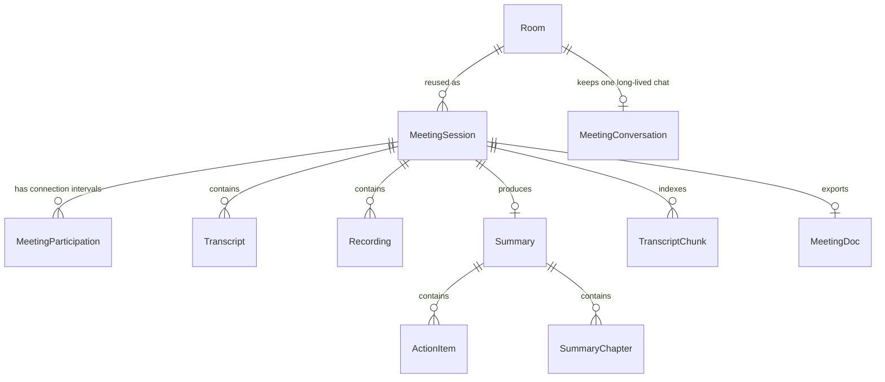
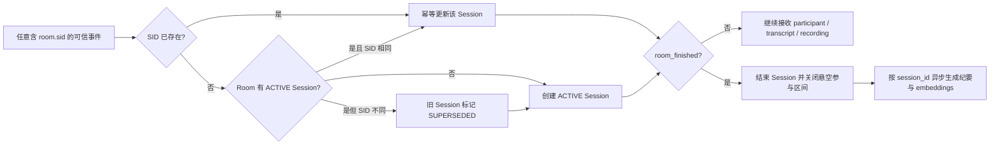

# MeetingSession 场次地基设计

状态：M1 场次投影、M2 产物双写已实施，M3-M5 待实施

日期：2026-08-17

## 1. 结论

新增 `MeetingSession`，将当前 `Room` 拆成两个稳定概念：

- `Room`：长期存在的会议入口，继续承载会议号、名称、ACL、组织、PIN 和房间配置。
- `MeetingSession`：一次真实开会过程，严格对应一个 LiveKit `Room.sid` 生命周期。

一个 Room 可以先后产生多个 MeetingSession。转写、录制、纪要、章节、行动项、RAG
切片和妙记文档都必须归属到具体场次；长期会议群聊仍归属 Room，同一个群内可以连续收到多场
会议的纪要。



## 2. 为什么现在必须拆

当前实现将“长期会议房间”和“一次开会”都压在 `Room` 上：

| 现状 | 直接后果 |
|---|---|
| LiveKit room name 使用 `Room.id`，同一链接可反复进入 | 多次实际会议仍指向同一个 Room |
| `room_finished` 只拿 Room 触发 `generate_meeting_summary(room_id)` | 每次结束都会读取该 Room 的全部历史转写 |
| `Summary.room` 是 OneToOne | 后一场纪要覆盖前一场 |
| `TranscriptChunk` 按 Room 全删重建 | 多场检索语料混在一起，引用无法定位场次 |
| `MeetingDoc.room` 是 OneToOne | 一个长期会议链接只能产出一份妙记文档 |
| `MeetingConversation.summary_pushed_at` 在 Room 级 | 第一场推送后，后续场次无法再推送纪要 |
| participant webhook 枚举存在但没有入库处理 | 无可靠的入退会区间和出席数据 |
| 转写 agent 只上传 `room_id` | 后端无法判断话语属于该 Room 的哪一次会议 |

`Room.ended_at` 也不能充当场次结束时间：它表示房主主动结束长期房间，而 LiveKit
`room_finished` 会在最后一人离开并经过 empty timeout 后发生；二者生命周期不同。

## 3. 目标与非目标

### 3.1 本期目标

1. 同一 Room 的不同实际会议拥有独立、不可串场的业务主键。
2. webhook 重试、缺失和非理想顺序下，场次投影仍然幂等且可修复。
3. 记录参与者每次连接的进入、离开和断开原因，支持重连及访客/SIP/Agent。
4. 让转写、录制、纪要、搜索语料和外部文档逐步切到场次归属。
5. 兼容当前 Room API 和滚动发布，不要求前后端、agent 同时上线。
6. 历史数据诚实回填：无法可靠拆分的旧数据只形成一个“历史合并场次”。

### 3.2 本期非目标

- 不改变 Room 的 URL、会议号、ACL 或组织归属。
- 不把 jusi-light-im 群聊改成一次性会话。
- 不在本期交付完整出席报表 UI、连接质量时序、举手/投票等会议能力。
- 不尝试根据旧转写的时间间隔猜测并拆分多个历史场次。
- 不保存完整 webhook 原始载荷，避免无必要的 PII 副本和存储成本。

## 4. 核心定义与不变量

### 4.1 场次边界

**一个 LiveKit `Room.sid` = 一个 MeetingSession。**

LiveKit room name 仍是 `Room.id`，用于找到长期房间；LiveKit `Room.sid` 是服务端分配的
具体房间实例标识，用于区分同一 name 的多次生命周期。短暂断网重连或同一 SID 内的参与者
全部暂离，不会人为拆成新场次；只有 LiveKit 创建了新 SID 才产生新 MeetingSession。

### 4.2 数据不变量

1. 非历史场次必须有 `livekit_room_sid`，且全库唯一。
2. 同一 Room 最多只有一个 `ACTIVE` 场次。
3. `ACTIVE` 必须没有 `ended_at`；`ENDED` 必须有 `ended_at`。
4. `ended_at >= started_at`。
5. 一个 participant SID 在一个场次内只对应一个连接区间。
6. 子产物的 `session.room_id` 必须等于其兼容字段 `room_id`。
7. ACL 始终继承 Room，不在 MeetingSession 复制一套权限。
8. 所有写路径先确定场次，再写业务产物；无法确定时允许暂存 `session=NULL`，但必须告警并进入修复队列，不能猜一个历史场次。

## 5. 数据模型

以下为目标语义，具体 migration 名称在实施时按主干最新序号生成。

### 5.1 MeetingSession

```python
class MeetingSession(BaseModel):
    class Status(models.TextChoices):
        ACTIVE = "active", "Active"
        ENDED = "ended", "Ended"

    class StartSource(models.TextChoices):
        LIVEKIT_ROOM = "livekit_room", "LiveKit room creation time"
        WEBHOOK = "webhook", "Webhook receive/event time fallback"
        TRANSCRIPT = "transcript", "Transcript fallback"
        LEGACY = "legacy", "Legacy backfill"

    class EndReason(models.TextChoices):
        ROOM_FINISHED = "room_finished", "LiveKit room finished"
        OWNER_ENDED = "owner_ended", "Owner ended room"
        SUPERSEDED = "superseded", "Superseded by a new SID"
        RECONCILED = "reconciled", "Closed by reconciliation"
        LEGACY = "legacy", "Legacy backfill"

    room = models.ForeignKey(
        Room, on_delete=models.CASCADE, related_name="meeting_sessions"
    )
    livekit_room_sid = models.CharField(
        max_length=64, null=True, blank=True, unique=True
    )
    status = models.CharField(max_length=16, choices=Status.choices)
    started_at = models.DateTimeField(db_index=True)
    ended_at = models.DateTimeField(null=True, blank=True, db_index=True)
    start_source = models.CharField(max_length=24, choices=StartSource.choices)
    end_reason = models.CharField(
        max_length=24, choices=EndReason.choices, blank=True, default=""
    )
    last_event_at = models.DateTimeField(null=True, blank=True)
```

约束与索引：

- `UniqueConstraint(room, condition=status="active")`：每个 Room 最多一个活动场次。
- CheckConstraint：状态与 `ended_at` 成对一致。
- CheckConstraint：结束时间不早于开始时间。
- 索引 `(room, -started_at)`、`(status, updated_at)`。

不在表中复制 `organization`、会议名称或 ACL。查询时经 `session.room` 获取，避免两份组织和
权限状态漂移。参与人数首期也不做持久化计数，先从 Participation 聚合；出现历史列表性能瓶颈后
再增加可重算的 rollup 字段。

### 5.2 MeetingParticipation

一行代表一次 LiveKit 连接，而不是“一名用户”。同一个人掉线重进后 participant SID 改变，
因此会得到第二行，出席时长可将其多个区间合并。

```python
class MeetingParticipation(BaseModel):
    session = models.ForeignKey(
        MeetingSession, on_delete=models.CASCADE, related_name="participations"
    )
    livekit_participant_sid = models.CharField(max_length=64)
    user = models.ForeignKey(
        User, null=True, blank=True, on_delete=models.SET_NULL,
        related_name="meeting_participations"
    )
    identity = models.CharField(max_length=255, db_index=True)
    display_name = models.CharField(max_length=128, blank=True, default="")
    kind = models.CharField(max_length=32, default="unknown")
    joined_at = models.DateTimeField(db_index=True)
    left_at = models.DateTimeField(null=True, blank=True, db_index=True)
    disconnect_reason = models.CharField(max_length=48, blank=True, default="")
```

规则：

- 唯一约束 `(session, livekit_participant_sid)`。
- CheckConstraint：`left_at IS NULL OR left_at >= joined_at`。
- `user` 只在 `participant.identity == User.sub` 时解析；访客、SIP 用户允许为空。
- `identity`、`display_name`、`kind` 是会议发生时的快照，不随用户档案改名而变化。
- `STANDARD` 和 `SIP` 默认视为人类参与者；`AGENT`、`EGRESS`、`INGRESS` 保留记录但从
  出席人数和默认历史列表中过滤。
- `kind` 和 `disconnect_reason` 的转换必须对 LiveKit 新枚举值宽容，未知值映射为
  `unknown:<number>`，不能因 SDK 升级后新增枚举而拒绝 webhook。

### 5.3 产物关系调整

迁移期保留既有 `room` 字段，新增 nullable `session` 并双写，降低一次性改动风险：

| 模型 | 目标关系 | 说明 |
|---|---|---|
| `Transcript` | FK MeetingSession | 新增 nullable `ingest_id` 唯一键，支持 agent 重试幂等 |
| `Recording` | FK MeetingSession | 创建时取活动场次；egress 的 `room_id`（LiveKit SID）可二次校正 |
| `Summary` | OneToOne MeetingSession | `room` 从 OneToOne 改 FK，一个 Room 可有多份场次纪要 |
| `ActionItem` | 经 Summary 归属场次 | 迁移期保留 room；校验 source transcript 与 summary 同场次 |
| `SummaryChapter` | 经 Summary 归属场次 | 迁移期保留 room，生成/重跑只删除本场次数据 |
| `TranscriptChunk` | FK MeetingSession | embedding 只删重建本场次切片 |
| `MeetingDoc` | OneToOne MeetingSession | room 从 OneToOne 改 FK；文档仍可在 Room/Session 删除后留存 |
| `MeetingConversation` | 仍 OneToOne Room | 不随场次复制；幂等位移到 `Summary.im_pushed_at` |

最终完成所有读路径切换并稳定一个版本后，才能考虑删除子产物上冗余的 `room` 字段。第一阶段
不删，且统一通过领域服务写入，校验 `artifact.room_id == artifact.session.room_id`。

## 6. 事件投影与状态机

新增 `core/services/meeting_sessions.py` 作为唯一领域入口，webhook、agent、录制 API 和修复任务
都不得各自拼查询规则。建议公开以下方法：

```text
start_or_reconcile(room, livekit_room_sid, started_at, event_at)
record_participant_join(session, participant, event_at)
record_participant_left(session, participant, event_at)
finish(session, ended_at, reason)
resolve_for_artifact(room, livekit_room_sid, artifact_at)
```

所有方法使用 `transaction.atomic()`；涉及同一 Room 的建场/关场时先
`Room.objects.select_for_update()`，由数据库约束兜底并发竞争。



### 6.1 事件处理表

| 输入 | 行为 |
|---|---|
| `room_started` | 按 room name 找 Room，以 `room.sid` 幂等创建/校正场次 |
| `participant_joined` | 即使 `room_started` 丢失，也先用事件内 Room 创建场次，再 upsert participation |
| `participant_left` | 按 participant SID 关闭区间；若 join 丢失则补建推断区间并记录指标 |
| 转写写入 | 新 agent 携带 room SID；若 webhook 尚未到达，以 SID 建立 provisional ACTIVE 场次 |
| 录制创建/egress | 创建时绑定当前 ACTIVE；egress 回调用 `EgressInfo.room_id` 校正到 LiveKit SID |
| `room_finished` | 幂等结束场次、关闭悬空 participation，并调度 `generate_meeting_summary(session_id)` |
| owner end | 保持现有踢人/结束 Room 语义；同时请求关闭 ACTIVE 场次，最终由 webhook 或修复任务收敛 |

### 6.2 时间来源优先级

开始时间按以下优先级取值，并允许后到的高可信数据修正低可信数据：

1. `room.creation_time_ms`
2. `room.creation_time`
3. webhook `created_at`
4. 第一条转写的 `started_at`
5. 后端接收时间

结束时间优先用 `room_finished.created_at`。如果 webhook 永久缺失，由 owner end、SID supersede
或定时修复器关闭，并通过 `end_reason` 明确这不是 LiveKit 的原始结束事件。

### 6.3 幂等和丢事件策略

LiveKit webhook 会重试，但官方明确不保证最终投递；事件 envelope 自带 `id` 和 `created_at`。
M1 不引入完整事件仓库，使用业务自然键幂等：

- Session：唯一 `livekit_room_sid`。
- Participation：唯一 `(session, livekit_participant_sid)`。
- Transcript：新 agent 生成并重试复用唯一 `ingest_id`。
- Summary：OneToOne Session；自动任务对 Session 加行锁，成功后重复任务直接返回。
- MeetingDoc：OneToOne Session。
- IM 推送：`Summary.im_pushed_at`。

webhook `event.id` 进入结构化日志，便于排查重复和缺失。只有未来确实需要重放原始事件或新增
不可幂等外部副作用时，再引入 inbox/outbox；当前不为可能性预建一套事件总线。

### 6.4 定时修复

增加周期性 `reconcile_active_meeting_sessions`：

1. 找出超过阈值仍为 ACTIVE 的场次。
2. 通过 LiveKit ListRooms 核对 SID，而不是只按 room name 判断。
3. SID 已不存在则以 `RECONCILED` 结束，关闭悬空 participation。
4. 对 `session IS NULL` 的近期产物，只有当时间窗内恰好匹配一个真实场次时才回挂；否则保留
   null、报警并交人工/后续任务处理。

阈值由配置控制，首期建议 24 小时；修复动作必须可重复执行。

## 7. 转写写入契约

后端先兼容新增字段，再发布 agent。新请求示例：

```json
{
  "room_id": "长期 Room UUID",
  "livekit_room_sid": "RM_xxx",
  "ingest_id": "agent 生成的 UUID",
  "speaker_identity": "user-sub-or-guest-id",
  "speaker_name": "张三",
  "text": "……",
  "language": "zh-cn",
  "started_at": "2026-08-17T09:00:00Z",
  "ended_at": "2026-08-17T09:00:04Z"
}
```

校验顺序：

1. `room_id` 必须存在。
2. `livekit_room_sid` 存在时，解析或创建的 Session 必须属于该 Room，否则返回 409 并报警。
3. 同一个 `ingest_id` 重复写入返回原 Transcript，不再创建第二行。
4. 滚动期旧 agent 没有 SID 时：优先唯一 ACTIVE Session；其次匹配刚结束且时间覆盖该话语的
   唯一 Session；仍无法判断则 room-only 落库并进入修复队列。
5. agent 全量升级并稳定后，将 SID 与 ingest_id 提升为必填。

agent 通过 `await ctx.connect()` 后的 `ctx.room.sid` 获取 SID；不能把 Room UUID、room name 或
本地时间拼成场次键。

## 8. 读 API 与权限

新增 canonical API：

```text
GET  /api/v1.0/rooms/{room_id}/sessions/
GET  /api/v1.0/meeting-sessions/{session_id}/
GET  /api/v1.0/meeting-sessions/{session_id}/participants/
GET  /api/v1.0/meeting-sessions/{session_id}/transcripts/
GET  /api/v1.0/meeting-sessions/{session_id}/recordings/
GET  /api/v1.0/meeting-sessions/{session_id}/summary/
PATCH /api/v1.0/meeting-sessions/{session_id}/summary/
POST /api/v1.0/meeting-sessions/{session_id}/summary/regenerate/
GET  /api/v1.0/meeting-sessions/{session_id}/action-items/
```

权限统一复用 Session 所属 Room 的现有角色判断。列表默认不展示“只有 Agent、没有人类参与者、
也无业务产物”的空场次，但管理员诊断接口可以查看。

兼容策略分两步：

1. 第一阶段保留现有 `rooms/{id}/summary|transcripts|action-items` 语义和响应结构，新前端只使用
   session API，避免旧客户端在发布中途突然改变含义。
2. Web/Android 切换完成后，旧接口改为返回“最近一个有业务产物的场次”，附 deprecation
   header；绝不再聚合一个 Room 的所有场次转写。至少保留一个发布周期后再删除。

`recent-meetings` 最终改为按 MeetingSession 返回：每个元素同时包含 `session_id`、`room_id`、
Room 名称、开始/结束时间、参与人数和纪要状态。同一长期 Room 在历史中可以出现多次。

## 9. 纪要、搜索、IM 与 Docs

### 9.1 纪要任务

`generate_meeting_summary` 参数从 `room_id` 改为 `session_id`，且只读取
`Transcript.objects.filter(session=session)`。行动项和章节只删除/重建该 Summary 的子项。

自动生成条件：场次结束，且至少存在一条人类参与者的最终转写。没有转写时不创建空纪要，
只记录 outcome；手动重跑仍可返回明确的“无可用转写”。

### 9.2 RAG 与引用

embedding 只删除并重建目标 Session 的 TranscriptChunk。个人/全局 AI 检索结果在兼容
`room_id` 的同时新增 `session_id`，引用链接跳具体场次，避免同名长期会议无法定位。

### 9.3 IM

MeetingConversation 保持 Room 级，一条长期会议链接仍对应一个讨论群。幂等位从
`MeetingConversation.summary_pushed_at` 移至 `Summary.im_pushed_at`，这样每个场次最多推送一次，
而同一群可以依次收到多场纪要。旧字段只用于历史兼容，完成迁移后废弃。

### 9.4 La Suite Docs

MeetingDoc 改为每 Session 最多一份。文档标题包含 Room 名称和场次开始时间；链接指向具体
session 详情。Room 或 Session 删除时继续采用 `SET_NULL`，不删除已经创建的外部文档。

## 10. 历史迁移

旧数据没有 Room SID 和完整参与者边界，不能可靠判断一个 Room 过去开过几场。采用明确的
“历史合并场次”规则：

1. 只为至少拥有 Transcript、Recording、Summary、Chunk 或 MeetingDoc 的 Room 回填场次；
   从未真正产生业务数据的 Room 不造空历史。
2. 若产物已能匹配上线后采集的真实 SID 场次，优先挂到真实场次。
3. 剩余旧产物按 Room 合并成一个 `start_source=legacy`、`end_reason=legacy`、SID=NULL 的
   ENDED Session。
4. `started_at` 取现有转写/录制/纪要/Room 时间的最早可信值；`ended_at` 取 Room.ended_at 或
   产物最晚时间，确保不早于 started_at。
5. 一个 Room 即使旧数据跨多天，也不根据静默间隔猜拆多场；前端标记“历史合并数据”。
6. 回填命令可重复执行，按 Room 加锁并使用确定性查询，不重复造 Session。

迁移顺序：

1. **Additive schema**：新增 Session/Participation 与所有 nullable session 字段、索引。
2. **Dual write**：webhook/agent/录制开始写真实 SID 场次，旧读路径不变。
3. **Backfill**：先回挂可匹配真实场次的产物，再创建历史合并场次。
4. **Constraint switch**：Summary/MeetingDoc 的 Room OneToOne 改 FK，启用 Session OneToOne；
   录制活动唯一约束从 Room 迁到 Session。
5. **Read cutover**：任务、API、Web、Android、RAG 全部按 session 读取。
6. **Cleanup**：稳定一个发布周期后移除旧幂等位和 Room 聚合查询；冗余 room FK 是否删除另审。

数据量较大时，backfill 使用批处理 management command，而不是在 migration 事务中一次性扫描
全表；migration 只负责 schema 和必要约束。

## 11. 发布与回滚

发布顺序固定为：

1. 数据库 additive migration。
2. 新后端：接受可选 SID/ingest_id、双写 Session，旧 API 仍可用。
3. 开启 webhook 的 participant handlers。
4. 新 agent：通过开关发送 SID/ingest_id。
5. 观察无 orphan/mismatch 后执行 backfill。
6. 切换 summary、embedding、IM、Docs 和客户端读路径。
7. 最后收紧非空约束与停用旧接口。

agent 新字段必须受发布开关保护，因为回滚到完全不识别新字段的旧后端可能返回 400。数据库
回滚只关闭 Session 双写和新读路径，不删除已写入的 Session 数据；涉及 OneToOne→FK 的约束
切换不做自动逆向数据回滚。

## 12. 可观测性

结构化日志统一带 `room_id`、`session_id`、`livekit_room_sid`、`webhook_event_id`：

- `meeting_session.created`
- `meeting_session.finished`
- `meeting_session.superseded`
- `meeting_session.reconciled`
- `meeting_session.room_sid_mismatch`
- `meeting_participation.join_recovered`
- `transcript.session_fallback`
- `transcript.session_unresolved`

核心指标：

- ACTIVE 场次数及超过 24 小时数量。
- room_started 到 Session 创建延迟。
- room_finished 到 Session 结束、纪要成功的延迟。
- SID mismatch、join recovered、session-null transcript 数量。
- 每场 transcript/recording/summary/chunk 数量及无人工参与者场次数。

告警至少覆盖：同 Room 活动场次唯一约束冲突、SID/Room 不匹配、场次结束后持续收到大量转写、
session-null 产物持续增长。

## 13. 测试与验收

### 13.1 必测场景

- 同一 Room 先后出现两个不同 SID，产生两个独立 Session。
- 重复投递 room_started/room_finished/participant 事件，结果不重复。
- participant_joined 先于或缺少 room_started，仍能恢复场次。
- participant_left 缺少 join，补建区间且不报 500。
- 同一 identity 重连产生两个 participation，出席聚合正确。
- 新 SID 到达时旧 ACTIVE 场次被 `SUPERSEDED`，唯一约束始终成立。
- webhook 未到但新 agent 先写转写，后到 room_started 能校正时间且不新建第二场。
- 同一个 ingest_id 重试只生成一条 Transcript。
- 同一 Room 两场会议的纪要、章节、行动项、chunks、Docs 完全隔离。
- 同一 Room 的两场纪要都能各推一次到同一个 IM 群。
- late transcript 只能进入时间/SID 匹配的场次，不污染下一场。
- STANDARD/SIP 计入人类出席；AGENT/EGRESS/INGRESS 默认不计。
- 历史 backfill 重跑无重复，且不把旧数据猜拆成多场。
- Session API 权限完全继承 Room；无权限用户不能通过 UUID 越权读取。
- 发布矩阵：旧 agent+新后端、新 agent+新后端、开关关闭后的回滚路径。

### 13.2 端到端验收

用同一个长期会议链接完成两次会议：

1. 第一次两人参会、讲话、录制并结束。
2. 第二次隔日再次从同一链接进入，一人通过 SIP 加入，讲话并结束。
3. 历史列表出现两条记录，开始时间和参与者各自正确。
4. 两场详情的转写、录制、纪要、章节、行动项和 AI 引用互不串场。
5. 同一个 IM 群收到两条不同场次的纪要；两场各有一份妙记文档。
6. Room 的会议号、链接、成员权限和配置均未改变。

## 14. 实施切片

| 阶段 | 范围 | 完成标志 |
|---|---|---|
| M1 场次投影 ✅ | MeetingSession、Participation、webhook 状态机、修复任务 | 2026-08-17 已实施，实时场次和出席连接可落库 |
| M2 产物双写 ✅ | agent SID/ingest_id、Transcript/Recording session 归属 | 2026-08-17 已实施；新 agent 字幕按 SID 归场且重试不重复，录制由活动场次及 egress SID 双重校正 |
| M3 纪要闭环切换 | Summary/ActionItem/Chapter/Chunk/IM/Docs 按 session | 同 Room 多场产物完全隔离 |
| M4 历史与客户端 | backfill、Session API、历史详情 Web/Android | 用户可按场次浏览和引用 |
| M5 收口 | 收紧约束、废弃旧 API/字段、运维手册 | Room 聚合读路径退出主流程 |

M1 是地基本体，应单独提交和评审；M2 以后均依赖 M1，不在同一个大提交中一次性改完。

## 15. 已拍板的设计选择

1. 场次键使用 LiveKit `Room.sid`，不用 Room UUID、会议开始时间或首位参与者时间拼接。
2. 场次状态只保留 ACTIVE/ENDED；“待生成纪要”等属于产物状态，不污染会议生命周期。
3. 重连按多个连接区间记录，用户级出席在查询层聚合。
4. IM 群按 Room 长期复用；纪要推送幂等和 Docs 归属改为按 Session。
5. 历史数据宁可标记合并，也不做不可验证的自动猜拆。
6. 首期依靠自然业务键和幂等任务，不保存完整 webhook event store。

## 16. 参考

- [LiveKit Webhooks & events](https://docs.livekit.io/intro/basics/rooms-participants-tracks/webhooks-events/)
- [LiveKit protocol models](https://github.com/livekit/protocol/blob/main/protobufs/livekit_models.proto)
