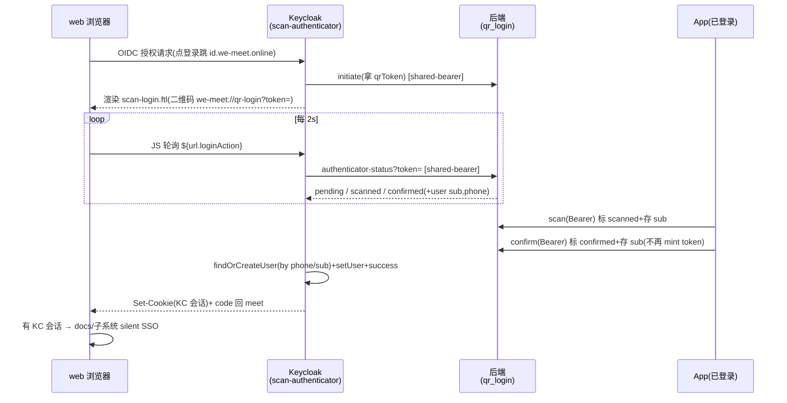

# 扫码登录 SSO — 设计文档

状态:阶段一 + 阶段二代码均已实现、待部署验证(2026-07-15)
背景:统一 SSO 已打通(web 走 Keycloak OIDC);扫码登录前后端代码仍在但被旁路,且现有实现给不了 SSO。
调研依据:`core/api/qr_login.py`、`core/api/mobile_auth.py`、`core/api/keycloak_sms.py`、`keycloak-phone-auth/PhoneAuthenticator.java`、`deploy/aliyun/keycloak/bootstrap-phone-auth.sh`、`docs/installation/sso-integration-plan.md` §6。
原则:① 最大复用现有资产 ② 只扩展不改 upstream ③ 分阶段落地(先跑通再做双栏)。

> 关联:统一 SSO 实施记录见 [sso-integration-plan.md](../installation/sso-integration-plan.md)(§6 记录了本方案的阻塞点结论)。

## 1. 现状与阻塞点

扫码登录三方:**web = 出示二维码方**、**App = 已登录扫码授权方**、**后端 = 态机 + 发码**。现有链路(全部已实现):

| 步骤 | 端点 / 位置 | 现状 |
|---|---|---|
| web 生成二维码 | `POST /api/qr-login/initiate/` → `QrInitiateView` | Redis 存 `{status:pending}`,TTL 300s |
| web 渲染 QR | 前端 `QrLoginPanel.tsx` + `qrLogin.ts` | 二维码 = `we-meet://qr-login?token=<token>` |
| App 扫码 | `POST /api/qr-login/scan/`(Bearer) → `QrScanView` | 标 `scanned` + 存 `scanned_user_id`(App 用户 sub) |
| web 轮询 | `GET /api/qr-login/poll/` → `QrPollView` | 每 2s 拉状态 |
| **App 确认** | `POST /api/qr-login/confirm/`(Bearer) → `QrConfirmView` | **`_token_exchange` mint token 塞进 Redis**(L304–318) |
| web 拿 token | poll 返回 `confirmed` + `access_token` | 存 localStorage,`/users/me/` 刷新 |

**阻塞点**:confirm 走 Token Exchange 把 token 直接交给 web 前端,**全程不在 Keycloak 域给 web 浏览器种会话 cookie**。结果扫码只登进 meet 单点 —— 打开 `docs.we-meet.online` 时 KC 那边查无此浏览器会话 → 仍要重登。**凡「异设备确认 + token 回传」模式(Token Exchange / Device Flow / CIBA)皆给不了 web 的 SSO cookie;App 改走 KC OIDC 也不解此阻塞**(那只换 App 自己的凭证)。

## 2. 核心设计决策

1. **态机留在后端**(唯一合理):App 打后端、KC 也能访问,只有后端是二者共享点 → 复用现有 `qr_login.py` Redis 态机,改动最小。
2. **落点改造**:confirm 不再 mint token,改为**标 `confirmed` + 记下用户身份(sub/phone)**;token 交换整条从扫码路径移除。
3. **扫码做成 KC authenticator**:web 走 OIDC 进 KC 页(**这一跳就是种 cookie 的前提**)→ KC 页出示二维码 → App 确认作为「完成本次 KC 认证」信号 → KC `setUser + success` **自己建会话** → 发 code 回 meet → SSO 成立。
4. **分阶段**:阶段一扫码独立页 MVP;阶段二抖音式双栏合一。

## 3. 目标架构(时序)

## 4. 组件设计

### 4.1 Keycloak 插件(keycloak-phone-auth)

- **`ScanAuthenticator.java`**(照 `PhoneAuthenticator` 骨架):
  - `requiresUser()=false`、无状态 SINGLETON、态存 authNotes(`qrToken`)。
  - `authenticate(ctx)`:调后端 `initiate` 拿 qrToken → `ctx.challenge(ctx.form().setAttribute("qrToken",…).setAttribute("deeplink",…).createForm("scan-login.ftl"))`。
  - `action(ctx)`:每次轮询查后端 status —— `pending/scanned` → 再 `challenge`(或返回轻量 pending 供 JS);`confirmed` → `findOrCreateUser(phone)` + `ctx.setUser(user)` + `ctx.success()`;`expired/cancelled` → 错误页 + 重新生成。
  - 复用 `fillProfile` 模式(手机用户合成 email,免 VERIFY_PROFILE 卡住)。
- **`ScanAuthenticatorFactory.java`**:`PROVIDER_ID="scan-authenticator"`,config properties = `backend_base_url` / `gateway_token`。
- **`ScanGatewayClient.java`**:照 `SmsGatewayClient`(`HttpURLConnection` + `Authorization: Bearer`),`initiate` / `authenticator-status` 两个调用。
- **注册**:`META-INF/services/org.keycloak.authentication.AuthenticatorFactory` 追加 `we.meet.keycloak.ScanAuthenticatorFactory`。
- **theme**:`scan-login.ftl` + `resources/js/scan-poll.js`(照 `otp-countdown.js` 改成轮询器);沿用 `phone` theme 品牌样式。

### 4.2 后端(we-meet)

- **`QrConfirmView` 落点改造**(`qr_login.py` L304–318):删 `_get_service_account_token`+`_token_exchange`,改为 `entry.update({"status":"confirmed"})`(`scanned_user_id`/`user` 已在 scan 时写入);**tokens 不再进 cache**。防重放校验 `scanned_user_id==user_sub`(L295–302)保留。
- **新增 KC 专用状态端点** `GET /api/qr-login/authenticator-status/?token=`:
  - 鉴权照 `keycloak_sms.py`:`authentication_classes=[]`、`permission_classes=[AllowAny]`,从 `Authorization` 头取 token 与 `settings.QR_AUTHENTICATOR_GATEWAY_TOKEN` 常量比较。
  - **收紧**:token 未配则 **fail-closed 拒绝**(不照抄 `keycloak_sms` 的「未配即放行」)。
  - 返回 `{status, user:{sub,phone,name}}`;**只返回身份、绝不返回 token**。
- **`initiate`**:KC 认证器复用现有 `POST /api/qr-login/initiate/` 拿 token(保持单一态机源);该端点可加 shared-bearer 变体或复用 AllowAny(评估后定)。
- **settings**:新增 `QR_AUTHENTICATOR_GATEWAY_TOKEN`(env 同名);token 三处同值(后端 settings ↔ KC 认证器 config ↔ bootstrap)。

### 4.3 前端(we-meet)

- web 扫码入口彻底走 KC(二维码由 `scan-login.ftl` 渲染,不再由 meet 前端出示)。
- 保留的 `QrLoginPanel.tsx`/`qrLogin.ts` 作为**搬迁参考源**(轮询/态机逻辑移植到 KC theme 的 `scan-poll.js`),移植完成后可再评估删除。
- `LoginButton` 已走 `authUrl()`,无需改。

### 4.4 App(we-meet-android)

- **scan/confirm 流程不变**:仍用现有 Bearer(mobile OTP token)调 `/api/qr-login/scan,confirm`。
- 唯一语义变化:confirm 后端不再返回 web token(App 本就不消费)。
- **不依赖 App 迁 KC**(见 §7)。

## 5. 接口约定

- 复用:`POST /api/qr-login/{initiate,scan,confirm,cancel}/`、`GET /poll/`(阶段一 web 已不用 poll,保留兼容)。
- 新增:`GET /api/qr-login/authenticator-status/`(KC 专用,shared-bearer,返回身份不返回 token)。
- 二维码 deeplink:`we-meet://qr-login?token=<token>`(不变,App 已认此 scheme)。
- KC flow:`scan-browser`(或在 `phone-browser` 里加 alternative);`bootstrap-scan-auth.sh` clone 自 `bootstrap-phone-auth.sh`(建 flow → 加 Cookie(ALTERNATIVE) + scan-forms 子流(ALTERNATIVE) → scan-authenticator(REQUIRED) → 写 config → 绑 realm/client)。

## 6. 分阶段里程碑

**阶段一(MVP · 扫码独立页,跑通 SSO)—— ✅ 代码已实现,待部署验证**
- KC:`ScanAuthenticator` + factory + `scan-login.ftl` + `scan-poll.js` + `ScanGatewayClient` + 注册(插件 commit `6564bc8`;Dockerfile builder 阶段已编译验证)。二维码服务端 zxing 生成;轮询走**纯 GET reload**(规避 session_code 轮转/CORS/竞态)。
- 后端:confirm 落点改造(不 mint token)+ `authenticator-status` 端点(shared-bearer fail-closed)+ `settings` + url(commit `b0a52c8e`)。
- flow:`bootstrap-scan-auth.sh`(commit `79fe1887`,默认 binding=none);扫码页 ↔ 手机号页整合(scan-forms 并入 phone-browser 作 try-another-way)是阶段一终态、单独做。
- 部署:backend/keycloak 三处配 `QR_AUTHENTICATOR_GATEWAY_TOKEN` 同值 → `build-and-push.sh keycloak` + compose up → `bootstrap-scan-auth.sh`。
- 验收:无痕 web(测试 client 绑 scan-browser)→ KC 扫码页 → App 扫码确认 → web 建 KC 会话 → 打开 docs 免登。

**阶段二(抖音式双栏合一)—— ✅ 代码已实现,待部署验证**
- 目标:左扫码 + 右手机号 OTP 单页。
- 实现:**`UnifiedLoginAuthenticator`**(合并 scan+phone,单 execution 渲染双栏,`action()` 按字段分派:`qrConfirm`→扫码建会话 / `phone`→发码 / `otp`→验证;手机 OTP 逻辑平移自 `PhoneAuthenticator`,HTTP 客户端复用 `ScanGatewayClient`/`SmsGatewayClient`)+ `unified-login.ftl` 双栏页 + `bootstrap-unified-auth.sh`(插件 commit `7f0113b`、后端/flow `3ac07990`)。
- **关键改动:扫码列轮询从阶段一的整页 GET reload 改为 AJAX**(`unified-poll.js` fetch 后端 **新增的 `GET /api/qr-login/ready/`**,只读 `{status}`、`ACAO:*`、非删除)—— 因为整页 reload 会冲掉右列正在输入的手机号/验证码;confirmed 才提交一次 `qrConfirm`,服务端仍查**受保护的 authenticator-status** 建会话(身份不经浏览器)。
- 阶段一独立 `phone-browser`/`scan-browser` 保留不动;unified 验证上线后再退役旧两个。
- config 合并两侧全部键;`bootstrap-unified-auth.sh` 默认 binding=none。

## 7. 并行可选项:App 迁 Keycloak OIDC

- **定位**:与扫码**正交、非前置**(扫码只需 App 能 scan/confirm,用现有 mobile token 即可)。
- **现状**:App 走 mobile OTP → Token Exchange(自绘原生登录,`/api/mobile/auth/*`)。
- **迁移**:App 改用 AppAuth(OIDC native + PKCE),登录页 = KC 手机号页(Custom Tab / WebView);token 存储/刷新走标准 OIDC。
- **收益**:认证体系收敛、砍掉 `mobile_auth` token-exchange 旁路、App 内嵌打开 docs 等也享 KC 会话。
- **成本**:App 端登录重写、原生 UX → KC 页、需处理 OIDC token 生命周期。
- **建议**:扫码上线后**独立评估**;若做,`phone` theme 已品牌化,App webview 可直接复用。

## 8. 风险与注意

- shared-bearer 网关 **fail-closed**(token 未配即拒,别照抄 keycloak_sms 的「未配即放行」)。
- 防重放:`scanned_user_id==confirm caller`(已有);`authenticator-status` 只回身份、不回 token。
- KC 轮询频率与 `QrPollThrottle`(120/min)对齐;qrToken TTL 300s。
- **只扩展不改 upstream**:新 authenticator / 端点 / flow / theme 页,均不动上游代码。
- KC theme 静态资源按版本号缓存,改 `scan-poll.js` 后须无痕 / `Ctrl+F5` 验证(见 `reference-keycloak-theme-i18n-cache`)。
- 改插件逻辑要两步:`build-and-push.sh keycloak` rebuild 镜像 + 重跑 `bootstrap-scan-auth.sh`(与 phone 认证器同坑)。

## 9. 复用资产映射

| 现有资产 | 阶段一去向 |
|---|---|
| `qr_login.py` initiate/scan/cancel + Redis 态机 | 直接复用 |
| `qr_login.py` `QrConfirmView` token-exchange 落点 | 改造(标 confirmed 不 mint token) |
| `qr_login.py` `QrPollView` | 保留兼容(web 不再用) |
| `mobile_auth.py` `_admin_realm_url`/`_get_service_account_token`/`_find_or_create_keycloak_user` | 复用 |
| `keycloak_sms.py` shared-bearer 鉴权 | 照抄(fail-closed 收紧) |
| `PhoneAuthenticator.java` + `SmsGatewayClient.java` | 骨架模板 |
| `bootstrap-phone-auth.sh` | clone 成 scan 版 |
| `theme/phone/login/*` + `otp-countdown.js` | 品牌样式复用 + JS 改轮询器 |
| 前端 `QrLoginPanel.tsx`/`qrLogin.ts` | 轮询/态机移植参考源 |

## 验证(实施阶段)

- **阶段一 E2E**:无痕 web 点登录 → 跳 KC 扫码页 → 已登录 App 扫码 + 确认 → web 拿到 KC 会话 cookie → 直接打开 `docs.we-meet.online` 免登(silent SSO)。
- **契约测试**:`authenticator-status` 无 / 错 token 返回 401;confirm 后 Redis 条目不含任何 token 字段。
- **回归**:App mobile OTP 登录、web 手机号 OTP 登录不受影响。
