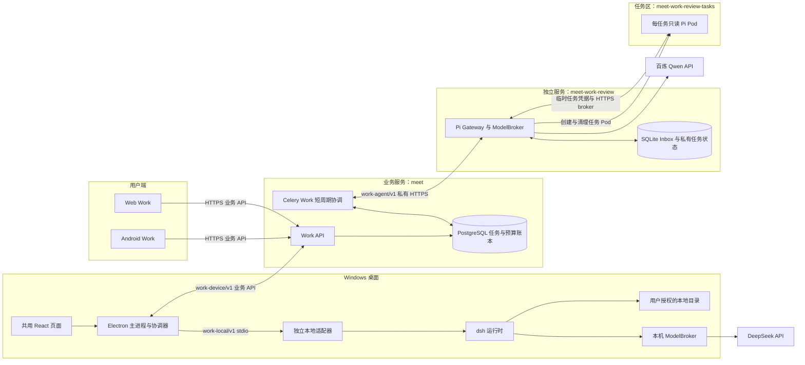
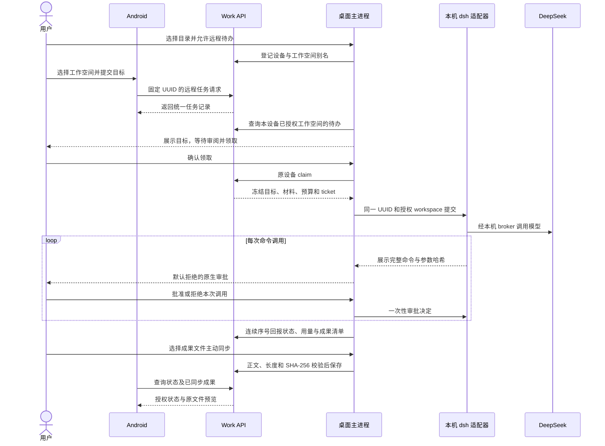
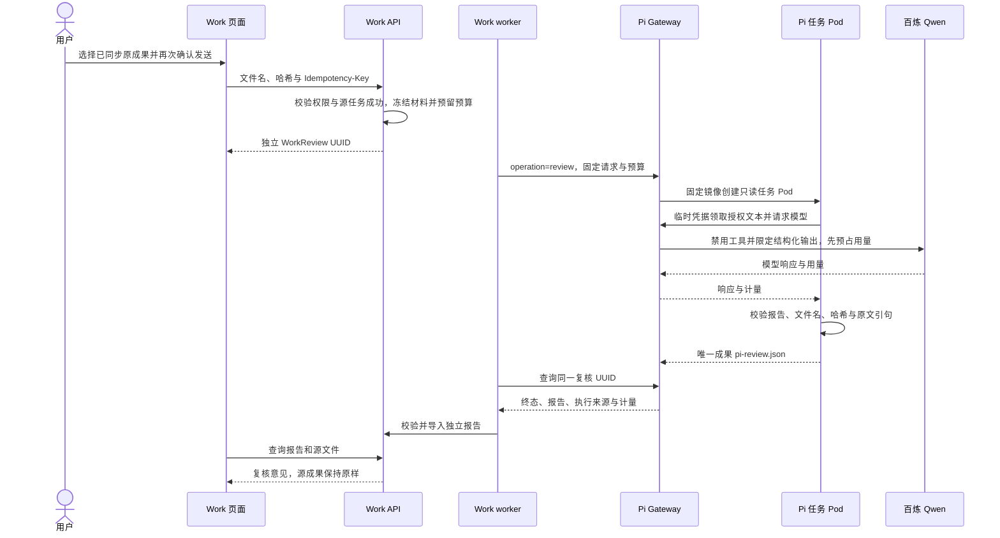

# Work Agent 架构

更新日期：2026-10-08。本文说明当前实现、部署边界和独立升级规则，是 Work Agent 的架构入口；历史规划、PoC 和逐批验收记录保留各自日期与范围。

当前采用 **桌面 dsh 执行 + 服务端 Pi 只读复核**。业务系统管理身份、任务、授权、预算和成果，通过自有版本化协议连接执行器。Android 可以派发桌面任务、查看状态和已同步成果，无需在手机运行 dsh。通用云端执行路径已经实现，当前生产开关关闭。

Work 原有材料处理和 `communication` 固定流程继续使用既有执行器；新增 Agent 路径使用 `office_agent` 及执行位置字段。普通材料与沟通准备不经过新 Agent 账号准入，双 Agent 的部署不会把所有 Work 流程替换成自主执行。

## 1. 当前基线与范围

| 单元 | 当前基线 | 交付与部署状态 |
| --- | --- | --- |
| 业务 API / Work worker | 构建提交 `e92f9eec4`，Work 迁移至 `0007` | 生产五个 Deployment、两个 CronJob；截至仓库 `8a448a798`，相关后端运行源码无变化 |
| Web | 构建提交 `1a316cdac` | 生产前端已包含材料不足提示 |
| Pi Gateway / worker | 适配器 `0.3.5`、Pi `1.0.4`、`qwen3.8-flash` | 生产私有 HTTPS Gateway 与 K3s 任务 Pod，源 `1a316cdac` |
| Windows 桌面 | `0.4.0-delivery.4`，源 `99b64cd5b` | 自包含内部安装包已构建和解包审计；安装该包才更新用户设备 |
| 桌面独立 Agent | 适配器 `0.3.2`、dsh SDK/runtime `0.1.5rc1`、`deepseek-flash` | 固定在桌面运行环境清单中，独立于服务端适配器版本 |
| Android | 源 `dd19008b` | 派发、状态、报告及原文件预览已验证；独立仓库交付 |

生产保持单演示账号灰度：`WORK_LOCAL_AGENT_ENABLED`、`WORK_REMOTE_AGENT_ENABLED`、`WORK_REVIEW_ENABLED` 开启，`WORK_AGENT_ENABLED` 关闭。账号准入模式为 `allowlist`，其他账号不获新 Agent 能力。工程默认值和示例配置仍为关闭，部署状态以现场配置为准。

精确镜像 digest、构建来源、安装包哈希、失败尝试和验证限制见 [生产记录](../reviews/work-dual-agent-production-release-2026-10-08.md) 与 [机器回执](../reviews/work-dual-agent-production-release-2026-10-08.json)。合成样本证明功能链路和来源校验，不构成真实业务材料的模型质量评估；当前不包含 iOS、全用户放量或通用云端 dsh 的生产启用。

## 2. 总体架构与职责



| 单元 | 负责 | 边界 |
| --- | --- | --- |
| Android / Web | 创建请求、查询状态、查看授权成果和复核意见 | 手机不持有桌面模型密钥、任务 ticket 或本地绝对路径；Web 可读已同步成果 |
| Electron 主进程 | 原生登录、凭据保护、目录授权、待办领取、命令审批、状态回报、文件同步、运行环境切换 | renderer 经受限 preload/IPC 调用；不导入 dsh SDK；远程待办逐项领取 |
| 本地适配器 / dsh | 在授权目录执行目标、管理本机任务和模型预算、产生成果 | 运行在用户设备；本机文件访问与命令执行经审批；不接管服务端任务 |
| Django Work | 身份与组织范围、材料版本、任务和复核账本、预算预留、成果授权、账号准入 | 不导入 dsh/Pi SDK，不读取上游会话库，不直接操作桌面文件系统 |
| Celery Work / Beat | 从持久记录领取短周期协调工作，查询 Gateway、导入结果、取消和对账、标记设备断线 | 模型和工具循环在独立执行器运行；本地任务不由云端 worker 执行 |
| Pi Gateway | 独立持久 Inbox、执行配置快照、任务凭据、供应商调用与计量、Pod 生命周期 | 不连接业务 PostgreSQL；供应商 key 留在 Gateway；单状态目录只运行一个 Gateway |
| Pi 任务 Pod | 对冻结的授权文本给出结构化复核意见 | 无文件读写、Shell、MCP 或技能工具；不自动修复、改写源任务或触发发布 |

这里的“双 Agent”是两个明确角色。dsh 负责执行，Pi 在用户再次授权后负责复核；两者没有自主互相派单、共享上游会话或无限循环的机制。

原生 dsh 支持本机工作空间。本产品通过固定官方 SDK/runtime 和 `cwd` 启动它，使用自己的 React 页面、审批与任务账本；dsh 原生 Web UI 和既有会话没有接入本产品。SDK 发布 pin、上游仓库源码提交及自有适配器版本分别记录。

## 3. 松耦合协议与版本

| 契约 | 两端与传输 | 主要内容 |
| --- | --- | --- |
| `work-device/v1` | 桌面主进程 / Android 与业务 API；HTTPS、当前账号认证 | 设备和工作空间别名、请求、领取、连续序号回报、显式成果同步 |
| `work-local/v1` | Electron 主进程与独立本地适配器；stdio JSON | `capabilities`、`grant`、`submit`、`get`、`list`、`cancel`、`artifact-path`、`review-approval` |
| `work-agent/v1` | Work worker 与独立 Gateway；私有 HTTPS、Gateway token | 能力、任务提交、增量查询、取消、执行快照、成果与用量；复核使用 `operation=review` |
| `work-runtime/v1` | 桌面运行环境发布包与主进程 | 完整文件清单、长度与 SHA-256、运行环境 descriptor，以及外部更新包的签名信任 |

任务受理前验证契约、引擎、模型、运行版本和预算能力。本地协调要求 `cloud_context`、`run_limits`、`command_approval`；不满足时提示升级。桌面内置适配器可以保持 `0.3.2`，服务端独立升级至 `0.3.5`，通过各自契约保证兼容。

同一 UUID 和相同冻结请求返回已有记录；同 UUID 改变请求内容返回冲突。桌面还在发出新执行请求前核对持久化的 workspace ID，防止响应丢失后把原任务移到另一目录。响应不确定时查询原记录，不自动创建新 UUID、切换执行器或重放模型调用。

v1 可增加兼容字段并保持已有语义；破坏性变更应发布 v2，并在业务迁移期间保留 v1。上游 SDK、插件、数据库和会话格式不作为业务契约。接入上游的实现集中在适配器驱动中，业务、客户端和执行器按各自发布单元更新。

业务端点前缀为 `/api/v1.0/work/`，使用现有账号认证，完整路由见 [urls.py](../../src/backend/work/urls.py)：

| 方法与相对路径 | 用途 |
| --- | --- |
| `GET capabilities/` | 当前账号可用能力及预算配置 |
| `POST local/devices/` | 登记当前账号的桌面设备 |
| `GET / POST local/workspaces/` | 查询别名 / 登记或更新工作空间远程准入 |
| `POST local/remote-tasks/` | Android 或其他业务客户端派发固定工作空间的任务 |
| `POST local/inbox/` | 桌面查询本设备当前授权工作空间的待办 |
| `POST local/tasks/` | 桌面主动创建需要统一登记的本机任务 |
| `POST local/runs/<run_id>/claim/`、`report/`、`sync/` | 原设备领取、状态回报、显式文件同步 |
| `GET runs/<run_id>/events/`、`files/`、`file-download/` | 查询状态事件、已同步文件和授权下载 |
| `POST runs/<run_id>/cancel/` | 请求取消源执行 |
| `GET / POST runs/<run_id>/reviews/` | 查询 / 创建独立复核，创建使用 UUID `Idempotency-Key` |
| `POST runs/<run_id>/reviews/<review_id>/cancel/` | 仅取消该复核 |

Gateway 独立提供 `GET /v1/capabilities`、`POST /v1/jobs`、`GET /v1/jobs/<id>?after=<seq>` 和 `POST /v1/jobs/<id>/cancel`。它使用独立 Gateway 凭据，只允许业务协调器访问，不直接向移动端开放。

## 4. 数据归属与一致性

| 数据 | 存放与用途 |
| --- | --- |
| `WorkTask` | PostgreSQL；目标、背景、账号/组织和材料引用，独立于人工待办 `core.Task` |
| `WorkRun` | PostgreSQL；一次执行、位置、设备/工作空间绑定、版本、预算、租约、用量来源和成果清单 |
| `WorkDevice` / `WorkWorkspace` | PostgreSQL；当前账号的设备 UUID、目录别名、模型、远程准入和最近在线时间；无本地绝对路径 |
| `WorkRunEvent` | PostgreSQL；有序状态事件，用于查询和恢复展示 |
| `WorkMaterial` | 私有材料对象和解析记录；版本、校验和、解析代次及访问授权 |
| `WorkArtifactFile` / `WorkArtifactVersion` | PostgreSQL；不可变原始文本文件及用户编辑/采纳的版本，编辑草稿不覆盖原始文件 |
| `WorkReview` | PostgreSQL；独立 UUID、幂等键、源 run、选中文件、冻结请求、模型用量与报告；取消复核不取消源任务 |
| 本机任务 / 协调记录 | 本机私有状态和账号隔离的加密协调记录；保存请求意图、原 UUID、回报序号与待确认内容 |
| Gateway Inbox | 独立 PVC 上的 SQLite 与私有任务目录；保存接收请求、执行配置、事件、取消墓碑、调用预占和终态 |

业务锁、唯一约束、租约及执行代次约束迟到响应和重复导入。持久记录承担 Outbox 的作用，Celery 消息用于推动协调，消息丢失后由后续扫描恢复。Gateway 的 Inbox 按 UUID 和请求哈希去重；两套数据库各自拥有自己的状态，通过协议对账，不共享数据库事务。

一条执行只有一个位置。桌面任务固定原设备；工作空间重试固定原绑定。设备断线不能转成云端任务或被另一台设备自动接管。复核建立新的 `WorkReview`，其结果不改变源 `WorkRun` 的成功状态。

## 5. Android 派发到桌面的流程



工作空间注册和心跳只发送别名及元数据。只有用户允许远程待办的工作空间可接受请求；离线可以排队，但重新登录后需重新授权目录和远程待办。工作空间“在线”按最近 30 秒判断；已领取任务每 10 秒尝试回报，设备租约为 90 秒，两者含义不同。

状态回报包含清单而不含文件正文。显式同步验证已成功任务、原设备 ticket、已回报的文件名、长度和哈希，保存选中文本；本地输入、未选择成果和整个目录不会因此上传业务服务。dsh 模型请求仍会把任务所需上下文发送到 DeepSeek。

桌面也支持未登记云端的本机任务；这种任务没有手机可查询的统一账本。已发出云端登记意图的同 UUID 在不确定时不能绕过协调改为本机独立执行。

## 6. Pi 复核流程与结论边界



业务从任务已经授权的材料、此次选中的原始成果、目标和背景构造快照，使用文件别名及 `snapshot.json` 映射；不读取未同步的本机文件，也不以编辑后的 Markdown 草稿替代原文件。复核创建、执行、交付和查看都重新检查源材料权限。

当前复核由 Web/桌面页面主动创建或取消；Android 实现报告只读查询及源成果预览，尚无复核创建/取消入口。

Pi 使用 `--no-tools`，关闭扩展、技能、模板和上下文发现。Gateway broker 拒绝模型工具/函数调用；任务只有内联冻结文本。对于 Qwen 结构化输出，Gateway 从自己接收的快照生成文件名、哈希和有限原文片段约束，客户端不能覆盖它。权威校验仍要求每条非空引句属于被引用的同一文件。

| 结论 | 展示与约束 |
| --- | --- |
| `no_issues` | 仅指提供材料中未发现问题；不能有缺失信息或问题列表 |
| `needs_changes` | 必须有发现及原文证据，仍需人工判断意见是否正确 |
| `inconclusive` | 说明缺失信息，不能当作任务失败或验收通过 |

适配器 `0.3.5` 对包含有效 `missing_information` 的 `no_issues` 或 `needs_changes` 保守转为 `inconclusive`，保留发现，继续严格校验引用。Web/Android 对历史报告也优先展示材料不足提示，同时保留原始记录。合法引用证明来源匹配，不能证明模型推理正确；无效报告返回失败，不自动付费重试。

## 7. 故障、取消与计量

业务状态使用 `queued / running / succeeded / failed / canceled`；本地另有 `disconnected`。Gateway 和本地协议的取消终态拼写为 `cancelled`，业务边界负责映射。

| 情况 | 行为 |
| --- | --- |
| 提交或 claim 应答丢失 | 保留 UUID 和原请求，查询/确认同一记录；不另建执行 |
| 状态回报应答丢失 | 先持久化正文和连续序号，再重发相同正文；跳号、旧序号不同正文或确认用量回退被拒绝 |
| 本地租约过期 | 标为 `disconnected`，原设备可以核对并回报；状态不代表本机已经停止 |
| 桌面重启或退出账号 | 隔离账号凭据并停止适配器；恢复历史/回报，不重新执行未知任务；目录重新授权 |
| 云端取消本地任务 | 下次回报通知本机；断网时不能即时送达，取消无法撤回已写入磁盘的修改 |
| Gateway/节点重启或执行不确定 | 清理所属执行，保留 `execution_unknown` 等错误及调用预占；不重放付费任务 |
| 镜像或执行配置变化 | 排队旧配置任务以 `deployment_changed` 失败，已受理任务不静默换引擎或模型 |
| 迟到成功或取消先于提交 | 取消优先，Gateway 保存取消墓碑；已发生模型用量继续对账 |
| 账号准入/材料权限撤销 | 阻止新执行和交付，已有提交继续取消/对账；已发到设备或供应商的材料不能远程收回 |

业务预留全任务预算，ModelBroker 在供应商请求前再原子预占每次调用。未知调用保留预占，`complete=false` 不作零成本。输入、输出和缓存 token 分开记录，金额仍需供应商对账。

本地用量为 `usage_origin=device_reported`，用于任务观测，不写作供应商确认的 `AIUsageRecord`，也不依据较低的设备报告释放预算预留。服务端 Pi 的 broker 计量独立记录于复核及用量账本。

当前生产 dsh 单任务最多 5 次调用、20,000 tokens；Pi 单次复核最多 1 次调用、20,000 tokens。协议上限和工程默认值可以更高，实际执行以已冻结请求和能力校验为准；每条源任务最多保留 5 次复核，新的尝试仍需用户明确发起。

## 8. 信任、凭据与执行隔离

| 边界 | 实现 |
| --- | --- |
| 用户与业务 | 现有认证，任务所有者及当前组织校验；账号准入与功能开关同时生效；能力响应禁止缓存 |
| renderer 与主进程 | sandbox、context isolation、受限 preload；IPC 校验可信窗口/frame/origin；账号 bearer、claim ticket 和模型 key 不交给页面 |
| 桌面与本地运行时 | stdio、自有能力握手、目录授权、运行清单校验；密钥由主进程保护并仅供本机执行使用 |
| 业务与 Pi Gateway | 私有 HTTPS、独立客户端 token 与公共 CA；保留证书及主机名校验，远程明文 HTTP 和重定向被拒绝 |
| Gateway 与任务 Pod | 每任务随机凭据、HTTPS broker、撤销和 deadline；Pod 不接收真实供应商 key |
| 任务 Pod 与集群 | 非 root、只读根、禁提权、无宿主机/Docker socket 挂载、无 ServiceAccount token、CPU/内存/PID 限制 |

Gateway 的供应商凭据在独立 namespace Secret；当前 Qwen 使用现有百炼账号。业务接入 Pi 只增加客户端 token 和公共 CA 引用，不把整个业务 Secret 或 `values.secrets.yaml` 复制给 Agent release。旧业务 AI 的独立供应商配置与 Agent 接入分开管理。

任务 namespace 的 NetworkPolicy 只放行到 Gateway broker 和集群 DNS，默认拒绝入站。Gateway 可访问指定 API server、DNS 及出站 HTTPS；其 443 规则覆盖所有 IPv4，并非供应商域名白名单。网络效果依赖 CNI，应以实际阻断验收为准。业务与 Pi 共用现有 K3s 主机，namespace、资源限额和 PID 约束不提供独立主机级隔离。

当前 Gateway worker 串行执行，Inbox 最多接受 20 个活动任务；任务 namespace 配额为 2 个 Pod，预留清理/检查空间。它们分别是队列容量与容器容量，不表示支持 20 路并行。扩容需先设计持久状态和任务归属，不能直接增加多个 Gateway 副本共享同一状态目录。

本机审批绑定任务、工具参数和 SHA-256，一次批准只用于本次调用；默认拒绝，拒绝/超时/取消/重启使待批准调用失效。Shell 可以访问工作目录之外的位置：目录授权与审批不是 OS 沙箱，当前不提供逐文件 diff。模型凭据、签名私钥、会话、真实账号标识及原始模型输出不写公开日志或发布回执；诊断只公开受限错误码和计数。

## 9. 部署、升级与回退

| 发布单元 | 独立更新与回退规则 |
| --- | --- |
| 业务 / Web | 按实际源码变化构建镜像，分别固定来源和 digest；常规发布必须保持现场 Work 配置，不通过整体 Helm rollback 回退数据库 |
| Pi Gateway / worker | 先关闭业务入口、停止活动执行，备份 SQLite 和完整工作负载 spec，验证备份，再替换固定 Gateway/worker digest；保留 PVC、各版历史和回退候选 |
| 桌面本地 Agent | 验证 `work-runtime/v1` 清单及签名、唯一暂存目录探测、再次校验、原子发布版本并切换指针；失败清理本次暂存，合法同版本可重试；保留上一版本 |
| Electron App | NSIS 安装包手动升级/回退；内置 Python、Node、rg 和 dsh，最终用户无需安装开发工具；无后台自动更新 feed |
| Android | 独立 App 发布，沿用业务 API 和兼容能力检查；不随服务端 Pi 更新而更换手机执行内核 |

生产 Work 配置需在五个 Deployment 和两个 CronJob 间保持一致。完整 overlay 位于操作员 `~/.config/we-meet/values.work-cohort.yaml`，权限 0600，仅含 Work 设置和 Secret 引用；`WORK_COHORT_VALUES_FILE` 可显式指定。发布保护校验现场与渲染后的完整设置、消费者集合及 UID；缺失、部分、过期、漂移或内联 Agent token 均阻止发布。

修改灰度或 Pi 连接设置应走独立 cohort 操作：完整 spec、UID、resourceVersion 检查 → 顺序更新 → 就绪/健康/账号准入验证 → 导出现场一致的完整 overlay。回退 patch 同样先核对当前资源仍等于本次已应用对象；发生外部变化时停止，不能覆盖别人刚修改的配置。Gateway 备份及 spec 按适配器版本保留，回退前验证状态兼容，不盲目恢复旧 SQLite 或业务 schema。

运行环境切换有互斥保护，活跃任务拒绝升级/回退，切换后重新授权目录。正式发布需要 Windows Authenticode 证书和产品 Ed25519 信任公钥，私钥留在签名端。当前无正式证书或产品运行时公钥：delivery.4 为未签名内部包，外部签名更新入口关闭；隔离测试密钥验证不等同于产品信任配置。详细操作见 [产品交付](../../src/work-agent/DELIVERY.md)、[桌面 README](../../src/desktop/README.md)、[K3s 部署](../../src/work-agent/KUBERNETES.md) 和 [账号联调指南](../deployment/work-account-cohort-acceptance.md)。

### 9.1 客户端 dsh 升级

升级对象有两个版本：自有本地适配器/运行环境版本，以及上游 dsh SDK/runtime 版本。当前已交付的组合是适配器 `0.3.2` + dsh `0.1.5rc1`；仓库适配器源码现已推进至 `0.3.6`，源码版本不会自动替换已安装的运行环境。以下命令是发布操作示例，需先填写候选版本和签名路径。

**发布端准备：**

1. 从固定源码提交构建候选。仅更新适配器时可保持 dsh pin；升级上游 dsh 时，一起更新 [requirements-dsh.lock](../../src/work-agent/requirements-dsh.lock) 中的 SDK、runtime-bin 版本及 wheel 哈希，[pyproject.toml](../../src/work-agent/pyproject.toml) 的依赖 pin，以及 [__init__.py](../../src/work-agent/work_agent/__init__.py) 的 `DSH_VERSION`，验证启动 profile、审批和本地协议仍兼容。
2. 为本次运行环境分配未发布的新版本，核对适配器的 `ADAPTER_VERSION`、Python 包版本以及 [build-local-runtime.py](../../src/desktop/scripts/build-local-runtime.py) 中的运行环境版本和 `dsh_sdk_runtime` 清单字段。构建脚本目前在源码中指定版本，没有 `--version` 参数；不要沿用已有 `0.3.2` 目录或给新源码套用旧清单。
3. 在 Windows 构建机的 `src/desktop` 执行下列命令，生成 `.agent-runtime/<新版本>/manifest.json` 和 `dist/bundled-runtime.json`，检查实际包内依赖、能力握手、命令审批、失败不切换、篡改拒绝及回退。SDK 发生变化时另行验证真实本地 dsh；离线通过不算真实模型验收。

   ```powershell
   npm ci
   npm run build:runtime
   npm test
   node scripts/verify-runtime.mjs
   ```

4. 独立 ZIP 升级要求客户端已经内置对应产品公钥。首次建立信任或更换信任根时，用外部 `WEMEET_RUNTIME_TRUST_FILE` 提供公钥列表，在桌面 App 构建中固定它；该文件包含 `key_id` 和 PEM `public_key`，不含私钥。保持 `work-local/v1` 及要求的能力兼容时，后续运行环境包可独立发布，不必同时更新业务服务或 Android。
5. 在签名端对最终清单生成 Ed25519 签名和 ZIP。私钥必须在 payload 外；签名后不得修改清单或任一文件。先完成任何二进制签名或其他文件变更，再生成最终哈希清单和 descriptor；保存源码、清单哈希、ZIP 哈希、SDK pin 与上一包。

   ```powershell
   # 在 src/desktop；先将占位符替换为已验证发布值
   $runtimeVersion = '<新运行环境版本>'
   $env:WEMEET_RUNTIME_SIGNING_KEY_FILE = '<包外的 Ed25519 私钥文件>'
   $env:WEMEET_RUNTIME_SIGNING_KEY_ID = '<客户端已信任的 key_id>'
   python scripts/sign-runtime.py ".agent-runtime/$runtimeVersion" "release/work-runtime-$runtimeVersion.zip"
   ```

**用户安装与回退：**

1. 结束本机活跃任务并保留需要的成果。登录桌面，在 Work 本地工作空间点击“安装签名升级包”，选择发布 ZIP；主进程验签、校验全目录、暂存探测、再次校验后原子切换，不自动重新执行旧任务。
2. 在页面核对执行器版本，重新选择目录；需要手机派发时重新允许远程待办。确认新任务仍逐项审批、状态回报和选定成果同步正常。
3. 要回退时先结束活跃任务，点击“回退上一版本”并确认。上一版本重新校验和探测后切换，随后再次授权目录；没有上一版本时入口不可用。探测失败保持原激活版本，合法同版本可以重试导入。

**当前内部交付方法：**现有 delivery.4 未配置产品运行时信任公钥，“安装签名升级包”关闭。此时从新源码构建包含新运行环境的桌面安装包：完成上述构建与验证后运行 `npm run package`，核验 NSIS/ASAR/内置运行环境和交付 manifest；用户退出 App 后在相同安装范围、目录运行新的 `setup.exe`，登录并重新授权目录。保留旧安装包用于 App 回退。App 回退与独立运行环境回退是两个操作；已安装独立运行环境的设备应先确认所需的运行环境版本，再回退 App。正式分发使用已配置证书、公钥的 `npm run package:release`，缺少发布信任配置时不能用内部包代替正式签名包。

### 9.2 服务端 Pi 升级

升级对象同样分为自有 Gateway/worker 适配器与上游 Pi npm 包。当前生产基线是适配器 `0.3.5` + Pi `1.0.4`；仓库 `0.3.6` 是新的源码候选，需构建、验收、部署才成为生产版本。以下流程适用于已有单账号 cohort 和独立 Pi 服务，不执行首次创建或业务数据库迁移。

**构建与发布候选：**

1. 固定源码提交和新的适配器版本。只升级自有 broker/适配器时保持 Pi pin；升级 Pi 上游时更新 [package.json](../../src/work-agent/package.json)、npm lock 和 `PI_VERSION`，验证 RPC、settled 事件、只读参数、结构化报告及计量。当前 [update-work-gateway.py](../../deploy/aliyun/update-work-gateway.py) 固定校验 Pi `1.0.4` 和 `qwen3.8-flash`；更换上游版本或模型必须先修改并验证部署工具的候选校验，不能只更换镜像或跳过校验。
2. 从同一候选构建 `kubernetes-gateway` 和 `pi` 两个 Docker target，推送到集群可访问的 registry。构建目录不得包含 `.env`、私有回执或供应商 key。以下 Bash 示例在仓库根目录、Linux/WSL 构建环境执行；填写发布标签，记录两个镜像的实际 `linux/amd64` digest 和源码来源。

   ```bash
   AGENT_REGISTRY='jusi-cn-guangzhou.cr.volces.com/we-meet'
   AGENT_TAG='<候选源码提交或发布标签>'
   docker buildx build --platform linux/amd64 --provenance=false \
     --target kubernetes-gateway -t "$AGENT_REGISTRY/work-agent-gateway:$AGENT_TAG" \
     --push src/work-agent
   docker buildx build --platform linux/amd64 --provenance=false \
     --target pi -t "$AGENT_REGISTRY/work-agent-pi:$AGENT_TAG" \
     --push src/work-agent
   docker buildx imagetools inspect "$AGENT_REGISTRY/work-agent-gateway:$AGENT_TAG"
   docker buildx imagetools inspect "$AGENT_REGISTRY/work-agent-pi:$AGENT_TAG"
   ```

3. 通过候选 CI、适配器/部署围栏回归及实际 Pi RPC 的合成 SSE 验证，确认无工具执行、严格引用、预算/未知用量、TLS 和 Pod 清理行为。上游或容器安全设置变化时增加 WSL 隔离 K3s 验收；真实模型验收单独记录调用预算，不自动重试失败记录。

**生产切换：**

1. 在生产主机使用经审查、固定来源的维护工具及已有私有 cohort 状态；不要改写旧工具目录或删除历史标记。先 `disable` 关闭 local/remote/review 等新入口，等待/取消并核对活动执行已终止，保留每个未知调用的预占和失败记录。关闭开关不等于本机任务立即停止，也不能撤回供应商在途请求。
2. 填写完整 `repository@sha256` 和候选适配器版本，执行升级。下面是 CLI 形状，命令在生产主机仓库根目录执行；维护工具的相邻模块、私有状态和 snapshot 必须来自本次验证组合。

   ```bash
   COHORT_RELEASE_ID='cohort-e92f9eec4-retest-032'
   AGENT_GATEWAY_IMAGE='jusi-cn-guangzhou.cr.volces.com/we-meet/work-agent-gateway@sha256:<完整摘要>'
   AGENT_WORKER_IMAGE='jusi-cn-guangzhou.cr.volces.com/we-meet/work-agent-pi@sha256:<完整摘要>'
   AGENT_ADAPTER_VERSION='<候选适配器的 x.y.z>'
   sudo python3 deploy/aliyun/configure-work-cohort-review.py disable --release-id "$COHORT_RELEASE_ID"
   sudo python3 deploy/aliyun/update-work-gateway.py \
     --release-id "$COHORT_RELEASE_ID" \
     --gateway-image "$AGENT_GATEWAY_IMAGE" \
     --worker-image "$AGENT_WORKER_IMAGE" \
     --adapter-version "$AGENT_ADAPTER_VERSION"
   ```

3. 升级工具先检查 cohort 已关闭、完整 spec/UID 与基线一致及数据库静止状态，生成带版本名的 SQLite 备份并做 quick_check，再保存 before/target 快照；只替换 Gateway 容器镜像及其 `--image` 引用的 Pi worker。它等待 rollout，经过现有业务客户端验证私有 TLS、鉴权、契约、适配器版本、Pi/model/image 和 `readonly_review_v1`，通过后才更新维护状态中的 Gateway 基线和历史。保留原 PVC、CA/TLS、Secret、RBAC、NetworkPolicy、资源约束及业务 schema。
4. 关闭期间核对 Ready Pod 的实际 imageID、业务健康、任务清理、历史报告读取和各版备份。新能力或 rollout 检查失败时，工具尝试按已应用 spec/UID 围栏反向 patch 回原 Gateway/worker，业务入口保持关闭；其他检查失败需检查私有状态再恢复，不盲目重跑升级命令。
5. 验证通过后恢复原灰度并确认账号隔离；下面的 `enable` 恢复本地/远程/复核准入，通用云端 Agent 保持关闭，不能把它理解为全用户开放。

   ```bash
   sudo python3 deploy/aliyun/configure-work-cohort-review.py enable --release-id "$COHORT_RELEASE_ID"
   sudo python3 deploy/aliyun/configure-work-cohort-review.py verify --release-id "$COHORT_RELEASE_ID"
   ```

6. 将现场完整 Work 设置重新导出到操作员文件，保留上一 overlay 并核对权限/所有者。作为操作员可在私有临时文件中保存当前 `deployment,cronjob` 快照，使用 [check-work-cohort.py](../../deploy/aliyun/check-work-cohort.py) 的 `--snapshot <私有快照> --export ~/.config/we-meet/values.work-cohort.yaml` 原子写入 0600 文件，再以 `--values-file` 检查完整设置；快照与实际 UUID 不提交。维护 root 目录中的导出文件和操作员目录文件是不同位置，需确认后者也已同步。

**成功上线后的回退：**先关闭业务入口，停止活动执行，再使用本次保存的 `gateway-<版本>-runtime-before.json` 和历史 digest 生成专用回退 patch；核对当前 UID、resourceVersion、完整 spec 仍等于本次已应用对象，恢复原 Gateway 镜像及 Pi worker 引用。验证旧契约/能力、数据库兼容性和业务健康后，更新私有维护基线并重新导出配置，再恢复原灰度。当前工具没有独立 `--rollback` 参数；`work-account-cohort.py rollback` 是业务 cohort 回退，不能用来代替 Pi 回退。每个适配器版本的升级标记是单次记录，不能删除标记来重复使用旧版本命令，也不能直接 `kubectl rollout undo` 后留下失配的维护状态。通常保留当前兼容 Inbox；确需恢复 SQLite 时应停服务、备份当前状态并先核实旧库兼容性，不能覆盖新产生的用量和任务历史。

## 10. 代码入口与验证

| 范围 | 入口 |
| --- | --- |
| 业务模型 / 路由 / 准入 | [models.py](../../src/backend/work/models.py)、[urls.py](../../src/backend/work/urls.py)、[rollout.py](../../src/backend/work/rollout.py) |
| 本地协调 / 远程待办 | [local_runs.py](../../src/backend/work/local_runs.py)、[remote_api.py](../../src/backend/work/remote_api.py)、[work-coordinator.ts](../../src/desktop/src/work-coordinator.ts) |
| 云端短周期协调 / 复核 | [agent_runs.py](../../src/backend/work/agent_runs.py)、[review_runs.py](../../src/backend/work/review_runs.py)、[agent_client.py](../../src/backend/work/agent_client.py) |
| 独立适配器 | [local.py](../../src/work-agent/work_agent/local.py)、[server.py](../../src/work-agent/work_agent/server.py)、[drivers.py](../../src/work-agent/work_agent/drivers.py) |
| 模型计量 / 报告 / Pod | [model_broker.py](../../src/work-agent/work_agent/model_broker.py)、[review.py](../../src/work-agent/work_agent/review.py)、[pod_runner.py](../../src/work-agent/work_agent/pod_runner.py) |
| 运行环境切换 | [managed-runtime.ts](../../src/desktop/src/managed-runtime.ts) |
| Web 复核展示 | [PiReview.tsx](../../src/frontend/src/features/work/routes/PiReview.tsx) |
| Android | 独立仓库 `we-meet-android` 的 `WorkApi.kt`、`WorkRepository.kt`、`WorkViewModel.kt`、`WorkScreen.kt`、`WorkReviews.kt` |
| 集群与发布保护 | [work-agent-k8s chart](../../src/helm/work-agent-k8s/Chart.yaml)、[check-work-cohort.py](../../deploy/aliyun/check-work-cohort.py)、[update-work-gateway.py](../../deploy/aliyun/update-work-gateway.py) |

离线验证覆盖协议、幂等、权限撤销、状态/用量倒退、预算预占、严格引用、Pod 清理、运行环境签名/篡改/回退、工作空间重试和页面结论展示。WSL 隔离 K3s 可验证真实 HTTPS、RBAC 和 NetworkPolicy；实际 Pi RPC 可接合成 SSE 验证，无供应商调用。真实模型和生产验收必须区分样本、调用次数、用量、执行来源、失败记录以及 fixture 边界。

当前生产端到端证据包括一次成功 dsh 任务、显式同步、成功 Pi 报告以及桌面/Android 只读查看；保留前三次失败，未自动付费重试。原生 OAuth UX、干净 Windows VM、逐文件修改预览、企业设备证明与统一计费、真实业务材料的规模质量评估仍需各自验收。未来增加自主修复或云端接管时，必须定义新的授权、幂等和恢复规则，不能从现有只读复核或断线恢复推导这些能力已经实现。

相关记录：[架构整改](../reviews/work-agent-architecture-review-2026-10-08.md)、[代码走查](../reviews/work-agent-code-review-2026-10-08.md)、[产品主计划](../plan/work-module-product-architecture-agent-plan-2026-09-21.md)。
