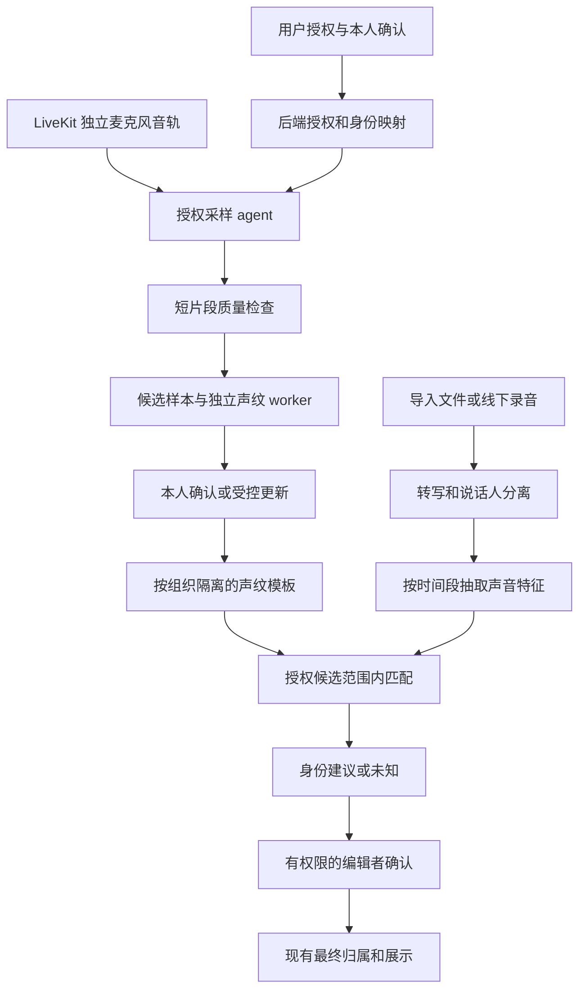

# 会议与通话声纹身份识别方案

通话管线已接通独立 sampler、派发、加密候选入库和单人质检，见[采样管线走查](../research/voiceprint-call-pipeline-review-2026-10-10.md)。进一步接通本人确认的首次通话基准、跨会话设备组补充、加密来源证明、失效门禁及幸存贡献重建，见[设备组模板走查](../research/voiceprint-device-templates-review-2026-10-10.md)。来源删除后的数据库物理清理、持久意图、周期恢复和独立重建已接通，见[来源删除走查](../research/voiceprint-source-removal-review-2026-10-10.md)。候选、试听音频、许可及无引用轨道的周期回收已接通，保留滚动／长会话配额和有效特征来源，见[周期维护走查](../research/voiceprint-maintenance-review-2026-10-10.md)。派发持久租约、周期恢复与实际采样上报已接通，见[派发与状态走查](../research/voiceprint-dispatch-status-review-2026-10-11.md)。目前默认关闭；实际 RTC 联调、部署及真人／生产验收继续推进，尚未完整交付。

通话后端的可信来源、短期许可、本人连接级控制及跨组织／设备配额已接通，基础阶段证据见[采样许可基础](../research/voiceprint-call-sampling-review-2026-10-10.md)。后续采样与模板进度以上段为准，完整范围不缩减。

后续 Web 语音／视频／会议共用的采样告知、设备／共享声明、明确允许、本次暂停、当前作用域积累关闭、私有运行状态和设置入口已接通，详见[Web 通话走查](../research/voiceprint-call-web-review-2026-10-11.md)。99 项后端、126 项前端与本地 Chromium 无媒体契约验证通过；Android 共用通话入口、原生设备元数据监听、后台／登录失效处理、当前组织设置和四组本地化标签已接通；89 项 JVM、28 项隔离 API 29 模拟器、APK 与五语言检查通过，详见[Android 通话走查](../research/voiceprint-call-android-review-2026-10-11.md)。实际 RTC／设备联调、部署及真人／生产验收仍待完成。两端入口更新取代此前待接入状态，功能继续默认关闭。

日期：2026-10-09（Asia/Shanghai）\
版本：v1.5，待评审；已确定先尝试 Qwen，未满足要求时再考虑私有化部署 CAM++\
范围：语音通话、视频通话、视频会议的授权声纹积累，以及 AI 录音／导入的说话人身份识别。\
状态：需求方案基线；用户后续已授权在 feature 分支开发，当前进度和验证见[实施记录](speaker-identity-implementation-2026-10-10.md)。尚未部署或采集真人声音；开发授权不代表已通过效果及生产发布验收。本方案中的数量、时限、性能和效果指标均为建议值，不代表已测得的能力。

最新进度：人工标记、本人授权／登记、模板、内部匹配／查询生产、身份队列、持久建议、记录级识别 API、建议确认／拒绝及多人版本协调已有阶段实现；Web／Android 导入后的候选选择、请求状态、试听和人工确认已接通，见[Web 识别走查](../research/voiceprint-web-identification-review-2026-10-10.md)及[Android 阶段记录](speaker-identity-implementation-2026-10-10.md#android-导入识别与跨端走查2026-10-10)。Android 本人设置、主动登记和样本审核已接通，见[设置与登记阶段记录](speaker-identity-implementation-2026-10-10.md#android-本人设置主动登记与走查2026-10-10)。本人设置八态、更新原因及有效登记组已完成两端投影，见[状态走查](../research/voiceprint-settings-status-review-2026-10-10.md)。收费 ASR 前导入预检、Web／Android 导入前选择与决定界面及转写后持久身份调度已接通；AI 录音分人、固定版本分页和身份试听已接通，详见下文；通话采样／实际设备分组、部署及真人／生产验收仍待完成。上传源须具备内容证明；直传／分片还须固定转写和查询共同使用的 VersionId。来源边界见[查询源代码走查](../research/voiceprint-source-query-review-2026-10-10.md)，任务／候选协调见[独立身份队列走查](../research/voiceprint-identity-jobs-review-2026-10-10.md)，API 和决定事务见[识别 API 走查](../research/voiceprint-identification-api-review-2026-10-10.md)。模型路线继续 Qwen 优先，完整验收范围不缩减。

后续本人设置走查已修复试听响应到期竞争、撤权后私有状态残留、Android 缓存期限同步及 Web 旧删除状态误展示，验证见[私有状态与试听期限走查](../research/voiceprint-private-state-review-2026-10-10.md)。

导入预检已补齐本地单声道准备及后端接入，包含实际两小时合成媒体边界、上传任务门禁、明确继续决定、转写／查询共同固定版本回执与持久清理；见[媒体准备记录](../research/voiceprint-import-media-preparation-2026-10-10.md)和[后端接入走查](../research/voiceprint-import-preflight-review-2026-10-10.md)。Web 与 Android 导入前显式选择、失败决定界面和转写后的持久身份请求调度已接通，见[Web 与调度走查](../research/voiceprint-import-web-dispatch-review-2026-10-10.md)及[Android 导入走查](../research/voiceprint-import-android-review-2026-10-10.md)；AI 录音分人的后续进度见下文；通话采样、部署及真人验收仍待完成，尚未完整交付或上线。

AI 录音后续阶段已接通独立派生版本、原文时间对齐、原子发布、人工修订继承、保留缺口的私有媒体准备和一次 Qwen 提交／持久轮询，见[派生版本与 worker 走查](../research/voiceprint-capture-diarization-review-2026-10-10.md)。分人操作 API、取消回执及固定版本录音身份查询的后端已接通，含派生 JSON 预算、内容 SHA-256 和独立存储校验，见[操作与查询走查](../research/voiceprint-capture-identity-api-review-2026-10-10.md)。Web／Android 分人入口、同请求恢复、固定派生版本分页、身份确认及录音区间试听已接通并走查，见[Web 走查](../research/voiceprint-capture-web-review-2026-10-10.md)和[Android 走查](../research/voiceprint-capture-android-review-2026-10-10.md)。Android 本轮 120 项 JVM、35 项隔离模拟器回归与构建通过；完整产品路由／真实设备、真人效果及生产验收仍待完成。

调研状态：[实施前代码与资料调研](../research/voiceprint-preimplementation-2026-10-09.md)已完成；用户确认暂无获授权真人样本，模型效果、实际音轨采样和生产容量仍待验证，P0 尚未整体通过。

代码走查补齐 `0207` 上下文迁移，修复人工标记与 worker 的锁顺序、停用账号复核、人工编辑后旧建议失效及任务预算；多建议稳定上下文只放行展示 revision 变化，其余来源／授权／目标状态保持绑定。具体问题与证据见[代码走查修复](../research/voiceprint-identity-review-fixes-2026-10-10.md)。确认／拒绝 API、Web 与 Android 导入识别客户端已在后续阶段接通，其他来源及生产验收继续开发。

后续走查已复现并修复人工标记的账号切换缺口：通讯录读取与全部身份决定校验预期账号，Web 固定登录会话、丢弃迟到结果并关闭旧面板、清理联系人缓存。验证见[账号会话走查](../research/voiceprint-account-session-review-2026-10-10.md)。

## 1. 建议与产品目标

采用“独立音轨采样 → 本人确认登记 → 多样本声纹库 → 分人后匹配 → 人工确认身份”的路线。保留现有千问转写，增加独立声纹 worker，不通过语言模型根据发言内容猜姓名。

优先利用系统已有的账号与独立音轨关系，降低用户重复录制成本；账号关系仅作为采样来源证据，不能直接成为声音身份真值。在线通话仍按连接账号显示姓名，声纹主要解决线下录音和导入文件缺少身份信息的问题。

首期提供身份建议，最终归属必须由有权限的人确认。高置信度自动归属、实时身份展示分别作为后续独立发布阶段，不随首期默认启用。

用户已明确要求：人工标记说话人身份必须同时支持“从通讯录选择”和“自定义标签”。这两种方式属于首期必需能力，可在没有声纹、自动识别失败或未开启识别时独立使用；该要求已确定，整体方案仍待评审。

成功体验：张三授权后完成一次本人声纹确认，系统可从后续个人设备通话补充候选样本；以后导入多人录音，转写仍显示“说话人 1、2”，编辑者可看到“疑似张三、李四”，试听并确认后，转写、导出和后续纪要使用一致的最终姓名。未登记人员继续显示未知身份。

不包括登录认证、门禁、支付验证、反欺诈、人脸识别、声音克隆，也不以声纹替代在线账号认证。

## 2. 当前仓库基础与缺口

以下结论来自 2026-10-09 本地代码阅读，不作为线上已部署证明。

| 已有能力 | 代码依据 | 对本方案的意义 |
|---|---|---|
| Web 一对一通话先创建 LiveKit 房间，再邀请进入 | `src/frontend/src/features/im/call/callController.ts` | 通话与会议可以复用媒体采样服务 |
| Android 通话同样进入 LiveKit 房间 | `../we-meet-android/feature-im/src/main/java/com/we/meet/feature/im/call/CallController.kt` | 可沿用账号、房间与音轨契约，不要求客户端上传远端声音 |
| 后端签发 LiveKit identity，匿名参与者有单独身份 | `src/backend/core/utils.py` | 从服务端可信映射解析 user_id，不能信任显示名称 |
| 在线会议转写读取 participant.identity 和姓名 | `src/agents/src/transcription/runtime.py` | 有按参与者处理的接入基础；尚无声纹采集实现 |
| 导入支持 diarization 开关并保存 provider speaker_id | `src/backend/core/services/qwen_filetrans.py`、`uploaded_recordings.py` | 可按已分人的时间段提取特征 |
| 独立 AI 录音当前统一生成未知说话人 | `src/backend/core/services/capture_transcription.py` | 需补录音结束后的分人，不能给整条未知轨道直接绑定一个人 |
| MeetingSpeaker 保存来源标签和人工 user 归属 | `src/backend/core/models.py`、`services/speaker_attribution.py` | 复用最终身份与显示名称，保留原始分人证据 |
| 通讯录包含组织成员和外部联系人 | `src/frontend/src/features/contacts/routes/ContactsRoute.tsx`、`src/backend/core/api/directory.py`、`models.ExternalContact` | 复用当前可见联系人检索；外部联系人不自动取得组织声纹权限 |
| 部分录音采用临时音频保留策略 | `src/backend/core/services/capture_retention.py` | 新任务必须遵守既有到期和清理门禁 |

缺口包括：声纹授权、本人登记、音轨采样、模型推理、身份匹配、建议状态、样本质量控制、声纹删除、评测数据和运行监控。现有转写 agent 不能被假定为在所有普通通话中启动；采样调度必须独立于转写开启状态。

## 3. 场景与身份可信度

| 场景 | 身份线索 | 入库策略 | 识别用途 |
|---|---|---|---|
| 登录用户用个人耳机／手机进行通话 | 服务端账号绑定的麦克风音轨 | 授权后采候选；首次本人确认，后续验证 | 为跨设备声纹积累提供样本 |
| 多人会议中个人设备音轨 | 同上，但可能串音、回声 | 同上，增加串音与多人检查 | 同上 |
| 共用会议室设备／借用账号设备 | 设备账号，不代表实际说话人 | 默认禁止自动积累 | 需要分人，再对实际声音识别 |
| 匿名／访客／机器人 | 无可信实名映射或非真人声音 | 首期禁止入库 | 保留来源标签或未知 |
| 导入混合音视频 | 上传者、文件名均不证明发言身份 | 默认只识别，不作为登记材料 | 分人后在选定候选集合中匹配 |
| 线下 AI 录音 | 录音者不等于所有说话人 | 默认只识别 | 结束后分人、匹配 |

显示名称、前端传入 user_id、文件标题、转写文字中的姓名、单次“正在发言”事件都不能作为自动登记依据。摄像头开关不改变音频采样规则；不采集视频画面。

## 4. 授权和组织边界

建议提供三个独立、默认关闭的用户授权：

1. **建立声纹**：本人主动登记，或确认来自本人通话的候选片段。
2. **通过通话完善声纹**：允许在满足条件的后续个人音轨中积累样本；关闭后主动登记仍有效。
3. **允许在指定组织中识别本人**：按组织选择授权范围；撤销某组织后不再在该组织进行匹配。

组织管理员可开放或关闭功能、设置配额、查看聚合运行状态，不能代替个人开启授权、下载特征向量或把他人的录音直接登记到某账号。

建议首期每个组织独立保存该用户授权的模板，禁止跨组织搜索、模板复制和全站人名检索。个人范围默认仅识别本人；个人导入若要识别同事，必须显式选择一个共同组织，并通过该组织的完整授权检查，不能利用现有手动归属接口较宽的个人记录规则绕过声纹权限。

匹配候选需同时满足：当前有效账号、有效组织成员、该组织的识别授权、有效声纹模板，以及记录的编辑／识别权限。在线会议优先限定真实参与者；导入文件由编辑者明确选择候选成员或候选组，首期最多 50 人，不静默扩大到整个组织。

声纹登记与会议录音授权分别处理：声纹授权不自动允许录整场会议，已有会议录音授权也不自动允许建立声纹。采样入口明确说明用途、采样量、保留期和删除方式。上线前由负责隐私与制度的人确认告知文本及组织政策；本方案不作法律合规结论。

## 5. 总体架构



模块分工：

- Django：授权、账号与音轨可信映射、模板元数据、候选过滤、任务编排、最终归属和审计。
- LiveKit 采样 agent：只订阅允许采样的麦克风音轨，完成语音检测、限量和片段封装。首期与 ASR agent 独立部署，后续可复用有界 PCM 分发，禁止重复启动导致双份采样。
- 声纹 worker：媒体解码、质量分析、特征提取和匹配；固定模型版本，以独立任务队列隔离资源。
- PostgreSQL／私有存储：元数据和加密特征、短期候选音频。初期直接比较小候选集合，不新增向量数据库。
- Web／Android：授权设置、本人试听确认、候选成员选择、识别建议确认／纠错和删除状态。

声纹失败不能导致原有通话、ASR、播放或人工归属失败。转写可先完成，身份匹配异步继续；禁止为等待声纹而延长原录音保留期。

## 6. 声纹模型与运行选择

### 6.1 Qwen 优先与模型边界

用户要求尽量采用 Qwen。转写和分人继续使用现有 Qwen 文件 ASR；声纹特征优先评估 `Qwen/Qwen3-TTS-12Hz-0.6B-Base` 的 speaker encoder。官方源码有 `extract_speaker_embedding`，该模型配置为 24 kHz 输入、1024 维特征；可作为登记和匹配的研究候选，但其产品定位是语音合成／克隆，不能视为已验证的多人实名识别模型。[官方模型配置](https://huggingface.co/Qwen/Qwen3-TTS-12Hz-0.6B-Base/blob/5d83992436eae1d760afd27aff78a71d676296fc/config.json)、[官方提取源码](https://github.com/QwenLM/Qwen3-TTS/blob/022e286b98fbec7e1e916cb940cdf532cd9f488e/qwen_tts/core/models/modeling_qwen3_tts.py)

Qwen 文件 ASR 的 speaker_id 是录音内分人标签；Qwen-Audio-Realtime 的参考声纹用于锁定目标说话人／排除其他声音。已查公开资料尚未确认可直接用于本方案的多人声纹库注册、检索、身份评分与未知拒绝 API；这不等于断言所有 Qwen 产品都没有声纹能力。[Realtime 说明](https://docs.qwencloud.com/developer-guides/speech/qwen-audio-realtime)

用户已确定顺序：**先尝试 Qwen；如果不满足要求，再考虑私有化部署 CAM++**。当前验证范围集中在 Qwen 的编码器加载、特征提取、登记与匹配可行性、资源开销及真人效果；不同时启动三个专用模型的部署评测。ERes2NetV2 和 SpeechBrain ECAPA-TDNN 保留为调研参考，不属于当前实施路线。

“不满足要求”需要形成可复核的验证结论：无法稳定提取／复现特征、无法满足第 15 节身份识别准入门槛，或资源／延迟超出评审确定的预算。先记录 Qwen 的问题、适用场景及优化结果，再提交 CAM++ 私有化验证方案。CAM++ 也需通过相同效果与容量门槛；未验证通过前继续提供转写与人工标记。暂无获授权真人样本时，准确率和未知拒绝保持待验证，不能将缺少样本直接判为 Qwen 不合格，也不能仅凭接口可运行认定其满足身份识别要求。

Qwen 声纹候选的当前技术路径是本地加载官方 speaker encoder；这与现有 Qwen 云端 ASR 的调用方式不同，不能假定已有通用声纹登记／实名检索 API。若后续核实存在满足需求的 Qwen API，再比较功能、数据范围及成本。CAM++ 仅在 Qwen 未满足要求后作为私有化备选。保留 provider 抽象；开源代码许可与具体权重使用条件分别核验，冻结权重哈希、依赖版本、特征维度及预处理参数，不能仅凭仓库代码许可证推断所有权重的使用条件。

特征方案：Qwen 候选采用 24 kHz 单声道，CAM++ 备选采用 16 kHz 单声道；各自冻结预处理、维度与门限。新声纹采样优先按 24 kHz 接收，与现有 16 kHz ASR 分流；评测尽量使用原始采样输入分别转换，不能认为将旧 16 kHz 上采样即可恢复原始高频信息。语音检测、按质量选段、L2 归一化、余弦比较和模板聚合均需在真人数据校准。每个用户模板数量设上限，避免仅取所有样本最高分而产生偏差。

Qwen 验证仅使用说话人编码器提取特征，不调用语音生成。需验证是否能单独加载并封装 encoder、权重与依赖规模；不能以 0.6B 完整 TTS 模型的大小估算 encoder 服务容量，也不能未经验证将 TTS 特征当作成熟声纹身份分数。模型族、模型 ID、revision 和预处理共同定义模板空间，1024 维与 192 维模板禁止混用。

不同模型版本的特征不能直接比较。升级时新旧模板与阈值隔离，先影子评测再切换；源音频已删除则要求重新登记，不能从旧向量转换并假定等效。

CPU 推理作为初期基准，是否需要 GPU 由实际并发与解码／推理耗时决定。部署资源和推理效率在 P0 实测后确定，不预先承诺单机容量。

### 6.2 CAM++ 备选与其他模型调研参考

以下三个模型均提供声纹特征提取或说话人验证能力。“登记声纹库＋多人实名匹配”由本项目在模型之外实现：登记特征并绑定已确认账户，在获授权候选集合内做 1:N 比较，校准未知拒绝门限，再展示人工确认建议。模型不会直接生成真实姓名；ECAPA 的预训练分类器类别也不能代替本项目通讯录成员。

| 模型与具体候选 | 输入／输出 | 选型定位 | 决策条件 |
|---|---|---|---|
| CAM++：`iic/speech_campplus_sv_zh-cn_16k-common`，revision `v1.0.0` | 16 kHz 单声道／192 维特征 | 中文场景、低成本 CPU 部署的优先专用备选 | 在达到第 15 节效果门槛后，优先比较 CPU 成本与延迟；不因更轻量而跳过真人评测 |
| ERes2NetV2：`iic/speech_eres2netv2_sv_zh-cn_16k-common`，revision `v1.0.1` | 16 kHz 单声道／192 维特征 | 仅保留调研参考，当前不安排部署评测 | 官方论文研究了短时语音验证；如后续扩展选型，再单独确定验证范围 |
| SpeechBrain ECAPA-TDNN：`speechbrain/spkrec-ecapa-voxceleb` | 16 kHz 单声道／192 维特征 | 仅保留调研参考，当前不安排部署评测 | 官方权重训练于 VoxCeleb 1＋2；如后续扩展选型，需验证中文等场景并冻结 revision 与权重哈希 |

CAM++／ERes2NetV2 的模型版本及预处理证据见[实施前调研](../research/voiceprint-preimplementation-2026-10-09.md)；ECAPA 输入规格和特征维度见[官方模型卡](https://huggingface.co/speechbrain/spkrec-ecapa-voxceleb)及[官方参数配置](https://huggingface.co/speechbrain/spkrec-ecapa-voxceleb/blob/main/hyperparams.yaml)，ERes2NetV2 的短时验证背景见[官方论文](https://arxiv.org/abs/2406.02167)。三个专用模型虽然均输出 192 维特征，仍属不同模板空间，不能跨模型比较或共用门限。

当前选型决策：先验证 Qwen，满足准入要求则采用 Qwen；只有形成 Qwen 未满足要求的证据后，才考虑 CAM++ 私有化部署并验证其效果与成本。ERes2NetV2／ECAPA 的资料不构成当前任务清单。首期生产只启用一个通过准入的模型。

### 6.3 分模型服务器配置建议

以下为**单独部署一个模型**的工程起步估算，适用于声纹登记及录音／导入完成后的低并发匹配：worker 按 3～10 秒有效语音片段推理，长录音先按分人时间段选取有限片段，通过队列限制并发。三个模型都可使用 CPU，GPU 用于提高并发或批处理吞吐。表中数值不是官方最低硬件要求，也不是已测得的生产容量。

| 模型 | 功能验证配置 | 小规模生产起步配置 | 较多并发／批处理的 GPU 起步配置 |
|---|---|---|---|
| CAM++ | 2 vCPU、4 GB 内存，无 GPU | 4 vCPU、8 GB 内存，无 GPU | 8 vCPU、16 GB 内存、1 张 NVIDIA GPU，显存 8 GB 起 |
| ERes2NetV2 | 4 vCPU、8 GB 内存，无 GPU | 8 vCPU、16 GB 内存，无 GPU | 8 vCPU、32 GB 内存、1 张 NVIDIA GPU，显存 8～16 GB |
| SpeechBrain ECAPA-TDNN | 4 vCPU、8 GB 内存，无 GPU | 8 vCPU、16 GB 内存，无 GPU | 8 vCPU、32 GB 内存、1 张 NVIDIA GPU，显存 8～16 GB |

统一建议使用 Linux x86_64、100～200 GB SSD，录音原文件放对象存储；磁盘预留用于依赖、模型缓存、日志和有界临时片段。GPU 显存建议为批处理及运行时预留空间，实际峰值取决于片段长度、batch size、精度和进程数，不按权重文件大小直接计算。小规模生产列仅为单实例资源建议，高可用副本与数据库／对象存储预算另算。

本表覆盖专用声纹特征提取服务及其预处理，不包含本地 ASR、完整说话人分离、Qwen TTS encoder 或大模型摘要服务。现有 Qwen 云端转写／分人继续沿用；若增加本地分人或与其他模型共享 GPU，必须单独测量资源竞争并调整预算。

当前先验证 Qwen encoder 的加载方式与资源需求，优先利用现有研究机器；此前本机检查发现的 RTX 4070 SUPER 12 GB 可作为 GPU 评测候选，目前尚未实际运行模型，是否满足 Qwen encoder 需要实测。上述专用模型配置保留作预算参考，不代表现在购买或部署。若进入 CAM++ 备选验证，可从 2 vCPU／4 GB 功能验证起步，效果达标后参考 4 vCPU／8 GB 的生产配置并压测；不预先采购三个模型的服务器。整体业务实施仍遵循方案评审后开始的安排。

### 6.4 配置依据与 P0 容量验证

[3D-Speaker 官方 ONNX CPU 测试](https://github.com/modelscope/3D-Speaker/blob/main/runtime/onnxruntime/README.md)在 Intel Xeon Platinum 8163 上处理 3 秒音频，包含 FBank 特征计算及声纹提取，给出以下实时率（RTF＝处理耗时／音频时长）：

| 模型 | 官方 RTF | 按 3 秒输入换算的处理耗时 |
|---|---|---|
| CAM++ | 0.049 | 约 147 毫秒 |
| ERes2NetV2 | 0.142 | 约 426 毫秒 |

这些数字支持优先评估 CAM++ 的 CPU 成本，但仅是上游特定环境的参考，不代表本项目实测；测试未给出完整服务并发容量，不能据此直接承诺支持多少场会议。SpeechBrain ECAPA 官方模型卡未提供相同条件的 CPU 性能结果，其表中服务器配置为待验证估算。[SpeechBrain 推理说明](https://huggingface.co/speechbrain/spkrec-ecapa-voxceleb)

P0 资源验证需冻结 CPU 型号／vCPU 配额、GPU 型号、依赖、模型 revision、预处理、精度和 batch size；覆盖 3／5／10 秒片段、冷启动／预热、CPU／GPU、单任务／并发任务和不同模板规模。报告解码与特征提取耗时、每秒处理片段数、P50／P95 延迟、内存／显存峰值、排队时间及 OOM／超时情况，并验证推理不会挤占现有转写服务。

容量按“同时提交的记录数 × 每条记录 speaker 数 × 每 speaker 选取片段数”及完成时限计算，结合实测吞吐和保留余量选择实例数。声纹库登记人数主要影响模板存储和检索量，不能单凭库人数确定 GPU 配置。达到效果与延迟门槛后，再确定 CPU 起步、增加 GPU 或扩容副本；不以本表替代生产压测。

## 7. 通话／会议采样协议

### 7.1 调度与可信身份

通话接通或会议用户加入后，由后端检查组织功能、本人授权、设备类型和采样配额，签发短期采样许可。许可绑定 user_id、organization_id、room/session、participant identity、track SID、采样上限、过期时间、consent_version 和撤销 generation。

采样 agent 从服务端签名的身份映射解析用户；当前登录 identity 来自 `User.sub`，不能直接当作数据库 user_id。许可需同时绑定当前 participant SID。重连、换设备、重新发布音轨都需要重新验证，不能将旧 track SID 许可移到新轨道。匿名、屏幕共享音频、系统播放、TTS、翻译音轨、机器人和共用设备不纳入。

必须关闭自动订阅全部音轨，只订阅已获许可的源；SDK 的媒体订阅基础见 [LiveKit 官方文档](https://docs.livekit.io/transport/media/subscribe/)。若现有 SDK／权限粒度无法满足这个边界，P0 阶段需确定本地本人麦克风采样或调整媒体权限的替代方案，不能先全量采集再丢弃未授权数据。

现有私人翻译有定轨订阅与 16 kHz PCM 接入可借鉴，但声纹使用独立授权。本机 SDK 探测发现 AudioStream 内部帧队列默认无界，新服务需显式限制 SDK 队列与处理队列；接口存在不代表实际采样已验收。

### 7.2 建议采样参数

| 项目 | 初始建议 | 说明 |
|---|---|---|
| 单个片段 | 3～10 秒有效语音 | 过短片段不作为独立模板；允许在稳定同一来源内合并 |
| 首次登记 | 30～60 秒有效语音，至少 3 个片段 | 本人主动朗读或确认授权采样，长度待校准 |
| 自动积累 | 每人每天最多 120 秒，每次会话最多 60 秒 | 达到有效模板数量后减少采样 |
| 模板上限 | 每人每组织每模型最多 5 组 | 覆盖手机、耳机、笔记本等条件；组内来源数也有上限 |
| 片段质量 | 排除明显削波、静音、重叠、回声和多人不一致 | 分数门限由真实样本确定 |
| 多会话要求 | 首次确认后，补充至少来自 2 次会话 | 避免同一段音频重复切片伪装成独立证据 |

这些是保守起点，不是硬编码最终阈值。共享设备标识应由用户可设置；检测到明显多种声音时，该音轨停止自动积累并显示原因，不能依靠单一设备标记排除所有污染。

### 7.3 首次登记与后续更新

首次候选无论与账号绑定得多紧，都不能直接成为 active 模板。本人进入设置试听候选片段，确认“这是我的声音”，服务端核验本人身份和许可后激活；可选择主动录制随机提示语完成登记。提示语用于减少误提交及简单录音重放，不能宣称已提供可靠活体检测。

后续自动更新需同时满足：有效授权、与已确认基准模板一致、单说话人质量检查通过、多片段一致且无冲突。新样本先进入隔离状态，不立即滚动修改基准；跨会话验证后再新增模板。保留稳定的本人确认基准，异常设备或声音变化要求本人重新确认。

首期设置开关，使补充样本全部经过本人确认；评测证明污染控制有效后，才启用受控自动更新。录音中的人工“张三”归属、系统自动识别结果，均不直接触发声纹登记，避免错误结果自我强化。

## 8. AI 导入与录音身份识别

### 8.1 导入文件

识别身份需要启用说话人区分。用户选择“识别身份”时同时明确开启分人，并选择组织、候选成员；关闭分人则不提交身份匹配，不能让整段多人录音共用一个身份。

现有 `qwen_filetrans` 继续提交任务和返回时间段、speaker_id。转写发布后，为每个 MeetingSpeaker 抽取多个干净片段；长录音按质量和时间分布选取，避免解码全部文件到内存。若音轨、时间戳或 speaker_id 不可用，返回可说明的不可识别状态，不能自动猜测。

官方约束已核验：文件分人仅支持单声道，建议不超过两小时。首期身份识别需预检媒体流／声道／时长，必要时使用短期单声道派生输入并保留准确原时间映射；超过两小时暂不提供身份识别。分块与跨块 speaker 关联另行验证，不影响普通转写与人工标记路径。[官方说明](https://help.aliyun.com/zh/model-studio/non-realtime-speech-recognition-user-guide)

### 8.2 独立 AI 录音

当前未知轨道不能整体命名。建议录音结束后对现有音频分人，再将分人区间与原转写时间段对齐；句子跨说话人边界时，仅在有可信词级时间戳的情况下拆分，否则保留歧义并让用户复核。

分人结果通过新 generation／派生来源发布，不就地改写旧来源标签和 immutable speaker 字段。人工修改、历史引用、播放位置和旧纪要的来源保持可追溯，重复处理不能混合不同 generation。

当前 generation 查询会保留所有无 transcription_job 的原文，不能简单插入无 job 的分人副本。建议以独立派生时间范围／说话人映射实现，实施前冻结与有效原文、人工修订和历史引用的投影协议；不能将分人处理伪装成 ASR 重试。

既有临时音频到期时任务终止或返回 unavailable。首期“仅保留文字”模式不从该音频建立持久声纹；允许在既有窗口内做身份识别，但不创建延长保留的副本。

### 8.3 在线已知身份

普通在线个人音轨依旧显示连接账号，不用声纹覆盖账号名。可后台检测与本人模板冲突以阻止样本入库，但不自动改名。共用会议室设备的实际多人识别属于后续专门场景，不作为首期个人音轨积累入口。

## 9. 匹配与未知拒绝

对每个查询说话人，从不同时间段选取多个片段，分别与授权候选模板匹配，综合得到每个用户的评分。推荐接受条件为：

`质量达标 AND 有效语音足够 AND 第一名分数 >= T_accept AND 第一/第二名差值 >= T_margin AND 多片段身份一致`。

只有一名候选时仍必须通过绝对门限，不因没有第二名而自动认定。多人标签可匹配到同一个账号，因为分人系统可能把同一人拆成多组；不能强制一对一映射。不同声音被合并到一个 speaker_id 时，应产生 mixed/conflict 并要求重新分人，不能按多数票把整组命名。

输出区分：suggested、unknown、ambiguous、insufficient_audio、mixed_speaker、unavailable。未知访客、未登记成员、声音太短、设备失配都有正常的拒绝路径。相似度不是概率，不向用户展示“98% 是张三”。

按模型、候选规模和设备条件在独立校准集上确定门限，并冻结 threshold_version。若候选集合或模板变化，重跑应生成新的建议版本；旧建议不得在条件已变化后确认。

## 10. 数据模型草案

以下是新增模型建议，具体字段命名在实施契约中冻结；本轮不创建迁移。

| 模型 | 主要字段与约束 |
|---|---|
| VoiceprintConsent | user、organization/scope、允许登记／积累／识别、version、generation、granted_at、revoked_at；每作用域一条当前授权 |
| VoiceprintProfile | user、organization/scope、状态、model_version、generation、confirmed_at、last_updated_at；同一用户/作用域/版本唯一当前 profile |
| VoiceprintSample | profile、source_type、session/track、start/end、许可版本、片段哈希、质量摘要、encrypted_embedding、短期 audio_ref、状态、expires_at；同许可与片段唯一 |
| VoiceprintTemplate | profile、model/preprocess version、dimension、device_group、encrypted_vector、generation、支持样本引用；模板数量有界 |
| SpeakerIdentityJob | record/source generation、请求者、候选快照哈希、模型与门限版本、租约、状态、重试次数、幂等键 |
| SpeakerIdentitySuggestion | speaker、job、候选用户、score/margin、质量与一致性摘要、状态、source revision、profile generation；每次识别只追加版本 |
| SpeakerIdentityDecision | speaker、可空建议版本、确认／拒绝／选择通讯录／自定义／清除、actor、时间、来源、前后成员／标签、revision；独立记录人工审计，支持没有自动建议的操作 |
| MeetingSpeaker 扩展 | manual_label、attribution_kind（none/member/contact/custom）、可空联系人来源引用；来源 label 和 identity_type 不变，成员绑定与人工标签互斥 |
| VoiceprintDeletionJob | user/scope、撤销 generation、任务状态、存储/缓存删除回执、错误类别与重试 |

首期 `MeetingSpeaker.user` 继续仅存人工确认后的成员身份；自定义标签或外部联系人姓名快照写入 `manual_label`，不创建虚拟用户。`attributed_by/attributed_at` 记录人工标记行为，清除时与现有语义一致。`identity_type` 仍代表原始分人来源，不能改为“声纹”以覆盖证据。自动建议存在独立表，不设置 attributed_by 为机器人或伪造人工操作。

`display_name` 统一按“人工标签 → 已绑定成员姓名 → 原始来源 label”解析；写入时保证人工标签与成员绑定互斥。旧数据中已有 user 的记录回填为 member，其余为 none，不把原始 label 当作自定义标签。多个说话人使用相同标签不意味着来源合并。

名称规则必须同时更新模型 Python 属性和 `attributed_name_subquery` 的 SQL 投影；仅改客户端或模型属性无法覆盖导出和纪要来源。标签输入最多 64 字符，存储字段预留 128 字符以容纳通讯录姓名快照。逐入口核验录音／导入检索，不能假定现有在线 TranscriptChunk 索引自动覆盖。

后续自动归属需增加明确的 attribution_method 和模型决策记录，并逐一改造最终名称解析、撤销和导出；该变化单独评审，不塞进首期迁移。

## 11. API 与异步状态契约

拟新增 API，路径是建议，不代表已存在：

| 接口 | 权限和行为 |
|---|---|
| `GET/PATCH /voiceprint/settings/` | 本人读写指定组织授权；验证有效成员，版本化写入，管理员不能代开 |
| `POST /voiceprint/enrollments/` | 本人开始主动登记；限额、短期上传凭据、幂等键 |
| `GET /voiceprint/samples/` | 本人读取待确认候选、临时试听地址；不返回向量和他人样本 |
| `POST /voiceprint/samples/{id}/confirm/` | 本人确认／拒绝，核验样本来源、授权版本和过期时间 |
| `DELETE /voiceprint/profiles/{id}/` | 本人删除；立即失效，再异步物理清理，返回清理 job |
| `POST /records/{id}/speaker-identification/` | 当前可编辑且可处理音频者发起；明确组织、候选、源版本和幂等键 |
| `GET /records/{id}/speaker-identification/` | 编辑者看建议与诊断；只读读者默认仅看已确认的最终姓名 |
| `GET /records/{id}/speaker-contacts/` | 编辑者按关键词、部门／联系人类型分页检索当前可见且可标记的通讯录项，返回最小选择信息，不能导出完整私人通讯录 |
| `POST /records/{id}/speakers/{id}/identity-decision/` | 编辑者确认／拒绝建议、选择通讯录、自定义或清除；提交操作类型与预期 revision，仅确认自动建议时要求建议版本 |

worker 内部接口使用服务凭据和有界任务许可，不接受未经核验的 arbitrary user_id、任意文件 URL 或扩大后的候选列表。

人工标记契约：`action=select_contact` 仅接受联系人引用，服务端重查可见性、有效关系和记录边界并决定成员绑定或姓名快照；`action=set_label` 接受纯文本标签并清除 user／联系人引用；`action=clear` 清除所有人工展示身份、恢复原始 label；`action=confirm_suggestion` 使用有效建议绑定成员并清除标签。客户端不能同时提交成员绑定与标签，也不能伪造联系人快照。既有人工归属接口需进入同一服务和 revision／审计规则，避免旧客户端留下冲突状态。

任务状态：queued → running → succeeded/failed/canceled/expired。worker 领取租约，失败有限重试（建议最多 3 次）；超时租约可重领，但结果提交需匹配当前 lease、源 generation 和授权版本。排队和结果提交都重查权限、成员状态、音频到期、用户撤销及模板 generation。

任务幂等键由调用方 request key 与 record/source generation、候选快照、model/threshold version 共同约束；同 key 的不同参数返回冲突。确认采用事务及预期版本检查，不能覆盖并发人工更正。声纹任务与 ASR 任务各自成败，不自动重跑计费 ASR。

最终归属更新后增加记录展示 revision，使转写、导出、搜索索引和缓存刷新。已生成纪要保留历史版本并标记“身份已更新，可重新生成”，不自动重写已分享的文档或任务负责人。身份建议不得被纪要当作确定姓名使用。

## 12. 用户界面

### 12.1 声纹设置

Web 与 Android 均提供：未开启、采样中、待本人确认、已建立、需要更新、已暂停、删除中、已删除。展示授权组织、最后确认时间和有效设备组，不显示内部向量或评分。

用户可以选择“主动录制”或“使用已授权通话的片段”；试听前说明片段可能录入其他人的声音，拒绝后删除候选。建立成功不自动打开后续积累；所有开关可独立关闭。

通话／会议中显示本人采样状态，允许本次暂停和全局关闭。共用设备提供“多人共用麦克风”开关，默认排除自动积累。采样 agent 的存在与用途应可见，不伪装成普通参会者。

### 12.2 录音／导入

增加“识别说话人身份”选项，说明需要区分说话人以及已登记成员。用户选择组织和候选，任务结束显示建议卡片，可试听对应来源片段，并提供“确认张三”“从通讯录选择”“自定义标签”“保持未知”。只读分享页不展示未确认候选人名。

没有匹配结果时展示具体可理解原因，例如“有效语音不足”“候选成员尚未建立声纹”“音频已到期”。关闭识别仍可正常转写和手动指定姓名。

### 12.3 人工标记：通讯录与自定义标签

点击说话人名称或其菜单中的“标记说话人”，打开统一面板：展示当前名称和可试听的来源片段，提供“通讯录”“自定义标签”两个入口，并允许清除已有标记。Web 与 Android 使用相同数据和状态规则。

**从通讯录选择**：复用成员／联系人选择能力，支持搜索姓名、按部门查找和外部联系人筛选；同名联系人展示必要的部门或组织辅助信息。选择有效的记录组织成员时绑定真实 user_id；个人记录按可见通讯录及既有归属规则绑定成员。选择记录边界外但当前可见的有效外部联系人时，首期只保存该联系人姓名的记录级快照，不将其绑定为本组织成员，不改变现有跨组织归属约束。

外部联系人姓名快照属于人工标记，不代表声纹核验；保存前明确该名称会随记录向读者展示。联系电话、邮箱、私人备注及私人联系人关系不随记录共享或导出，联系人来源引用不向普通读者返回。联系人关系撤销或联系人删除后不能再次选取；已保存姓名按记录编辑历史保留，删除来源引用并允许有权限的人改名。尚未保存的选择必须在服务端重新校验。

**自定义标签**：允许输入“客户王经理”“主持人”“访客 A”等文本，不要求注册账号。建议长度为去除首尾空白后 1～64 个字符，单行纯文本，前后端一致校验；空白不可保存，所有展示和导出按文本处理。标签只作用于当前记录的该说话人，不加入通讯录，不产生组织成员关系或声纹模板。

**应用范围与切换**：一次标记更新当前 speaker 对应的全部关联片段及后续展示；同一人的多个来源 speaker 首期逐个标记，不通过相同姓名自动合并。可从通讯录切换到标签、从标签切换到成员或清除，互斥字段在事务内一次更新。若分人混入多人，先修正分人，不能用标记操作把不同声音隐式归成一人。

**权限与优先级**：仅有现有转写编辑权限的人可以操作；读者可以看最终标签，不能改名。人工成员归属和人工标签都优先于自动建议，后台识别不能覆盖。记录中已保存的最终名称同步用于转写、播放关联文字、导出和搜索；后续生成纪要采用它，已有纪要依第 11 节保留版本并提示更新。

已核验当前编辑权限仅开放 AI 录音／导入（AUDIO／UPLOAD）且要求管理权限，因此首期人工标记沿用该范围；在线会议继续显示连接账号，不新增在线改名权限。

人工选择通讯录成员或自定义标签均不自动登记、更新或授权声纹。自定义标签没有可验证账号，首期不参与跨录音声纹身份匹配，也不用于自动设置任务负责人或执行需要账号身份的操作。

## 13. 数据生命周期与撤销

| 数据 | 初始建议保留策略 |
|---|---|
| 采样过程 PCM | 有界内存缓冲；无许可不处理，任务结束释放，不写日志 |
| 待确认通话／登记片段 | 最长 24 小时，超过即删除并要求重新采样 |
| 已确认样本的短期试听音频 | 确认并完成特征后尽快删除，最多再保留 24 小时 |
| 未确认或异常特征 | 与候选片段同时删除；不进入 active 模板 |
| 有效样本特征与模板 | 授权有效期间保留；建议 12 个月无更新暂停匹配，提醒重新确认 |
| 查询录音派生片段与向量 | 作业内存／临时目录使用，完成即删，硬上限 24 小时且不超过源音频期限 |
| 删除任务 | 撤销后立即不可匹配；在线存储／缓存建议 24 小时内完成清理 |
| 备份 | 运维文档声明 age 加密、对象保留 30 天，尚未核验生产实际策略；发布前明确物理到期上限，恢复时从当前可信来源重放删除墓碑再允许识别，不能仅使用旧备份里的墓碑 |

授权采样片段不得在确认前被长久保留。持久声纹特征也按敏感个人数据处理，不宣称“向量不可还原，所以无需保护”。加密传输、加密存储、最小服务访问、分组织缓存，日志与指标不记录原音频、向量、候选实名或签名 URL。

关闭“积累”仅停止新增样本；关闭“识别”立即停止该范围匹配；“删除声纹”关闭相关授权并删除样本、模板、缓存和未确认建议中的关联信息，重新使用需重新授权及登记。本人确认前的候选、本人撤销、账号停用、退出组织都要使在途结果失效。

采样默认不生成整场通话录音；每个样本保留来源引用。来源记录删除时，与该来源有关的未确认样本立即失效，已形成的模板需删除对应贡献并重建；若不足以保留有效模板则暂停。主动登记有独立来源与授权，不受不相关会议删除影响。

原会议的普通临时音频清理不等于撤销已单独授权的声纹，但不得把临时音频悄悄转为登记材料。首期排除“仅保留文字”记录的声纹入库，避免改变原有承诺。

已由人工确认的会议归属属于记录编辑历史，删除声纹不自动删除该姓名；产品文本明确这一点，用户如需修改历史归属仍走记录编辑权限。待确认建议删除后不能被旧客户端确认。

删除采用先撤销 generation、后物理清理；缓存携带 generation 且每次匹配校验，不能只依赖过期 TTL。worker 发布和清理发生竞争时，以撤销版本为准；墓碑持续阻止旧任务和备份恢复重新激活。

## 14. 错认、污染与故障处理

| 风险 | 处理 |
|---|---|
| 共用麦克风录到多人 | 排除共享设备，检查片段／聚类一致性，冲突转人工确认 |
| 远端回声把另一人录进本人的音轨 | 回声与跨轨相同片段检查；有疑问不入库 |
| 借用账号、克隆或重放声音 | 本人确认基准、随机提示、异常隔离；不用于强身份认证，不能保证识别所有伪造 |
| 自动更新造成声纹漂移 | 固定确认基准、隔离新样本、跨会话验证、可回退模板版本 |
| 分人合并或拆分错误 | mixed/conflict 拒绝；允许多标签同人，不强制一对一 |
| 生病、方言、设备和房间变化 | 多设备模板、低匹配保持未知、本人补充登记 |
| 跨组织数据泄露 | 先过滤授权候选再解密匹配；接口、缓存、任务、日志共同隔离 |
| 权限撤销／音频清理竞态 | 领取与提交双检、generation 门禁、租约、源删除取消任务 |
| 模型服务故障／队列拥堵 | 有限重试、限额、熔断；正常转写与人工归属继续 |
| 恶意上传或过大媒体 | 复用文件校验，隔离解码进程，CPU/内存/时长上限，禁止任意 URL 拉取 |

管理员只获得聚合告警；具体样本的本人试听与记录编辑试听分别依原有权限。模型建议被拒绝时记录错误类别，用于评测分析，但不自动把拒绝片段训练到另一个人的库。

## 15. 评测设计与首期准入

采用本人授权的真人样本，TTS 仅用于协议测试，不作为身份识别准确率依据。建议 P0 至少 30 名参与者、每人 3 次不同会话，覆盖耳机、手机、笔记本、会议室远场、噪声、普通话／方言、相近声音、短句、插话及未登记访客。

训练／登记、门限校准、最终测试按会话隔离，并对模型选择留独立测试集；同一音频切片不得跨集合。另留未参与校准的新人员组，防止只适应试点成员。评分在人工校对的真实分人时间段上进行，既测模型，也测整个“分人 → 匹配 → 展示”的链路。

| 指标 | 定义／用途 | 初始目标 |
|---|---|---|
| 人员建议精确率 | 被建议的 speaker 中，人名正确的比例 | ≥99%，同时报告样本量和区间 |
| 未知误接受率 | 未登记或候选集合外 speaker 被匹配到库内人的比例 | ≤1%，按 speaker 查询计算，不按所有向量对稀释 |
| 有效识别覆盖率 | 已登记且有足量合格语音的 speaker 中，得到正确建议的比例 | 近场 ≥80%；远场分开报告 |
| 样本污染率 | 被接受的登记／更新样本中，实际不属于该账号的比例 | 测试集零已知污染；列出样本量，不能宣称真实风险为零 |
| 分人效果 | 时间覆盖和人工检查；条件允许时计算 DER | 单独报告，不与人名准确率混淆 |
| 端到端延迟 | ASR 完成至建议可见，包含排队 | 初步目标 P95≤60 秒；边界为 1 小时以内录音、≤10 人、队列≤5，P0 校准 |
| 授权与删除 | 跨组织、撤销在途任务、恢复删除数据等场景 | 无越权结果和撤销后复活 |

针对未知拒绝，建议独立测试至少 300 个 speaker 查询，覆盖不同人、设备及会话，并报告按人／会话分组的不确定性。即使 300 次零错认，在独立假设下 95% 上界也仅约 1%；不能据此开放“0.1% 错认”的自动归属。自动归属阶段需要更大、足够独立且真实分布的验证集，以及单独评审的错误预算。

首期准入条件：真实评测报告完成，权限／撤销／污染／人工确认门禁通过，模型资源基准完成，Web／Android 交互走查通过。达不到效果门限时仅开放本人登记与人工归属，不发布身份建议。

## 16. 实施阶段与交付物

所有阶段在方案通过后才启动。时间为初步工作量估计，取决于设备访问、真人样本和现有媒体权限，不能视为交付承诺。

| 阶段 | 工作与交付 | 准入／退出条件 | 初步工作量 |
|---|---|---|---|
| P0 技术验证 | 核验各端音轨身份、选择性订阅、实际房间权限／E2EE 情况；Qwen encoder 权重许可、加载／特征与资源验证；真人授权样本、身份效果与门限校准；Qwen 未满足要求后再考虑 CAM++ 验证；冻结协议 | 无法取得授权独立 PCM 时先解决采样路径；输出 Qwen 验证结论、模型和门限建议，备选验证另估工作量 | 3～5 工作日 |
| P1 基础与导入 | 授权、主动登记、加密模板、删除链路、worker、导入分人匹配、通讯录选择／自定义标签和人工确认；Web／Android 功能开关 | 首期准入指标及跨端走查通过；默认关闭组织声纹功能，人工标记可独立使用 | 7～10 工作日，新增标记交互的工作量实施前复估 |
| P2 通话积累 | 服务端采样许可、独立 agent、Web／Android 告知与暂停、本人确认通话候选、配额与异常隔离 | 完成撤销／重连／换设备／共享麦克风验证；补充样本仍需本人确认 | 5～8 工作日 |
| P3 录音后识别 | AI 录音结束分人、generation 对齐、临时音频门禁和历史引用兼容 | 多人录音端到端评测，原转写及回放回归通过 | 5～8 工作日 |
| P4 受控自动更新／归属 | 分别评审并灰度，先影子模式；明确错误预算、method 字段、撤销和纠错 | 独立大样本评测及产品审批；两项各有开关 | 另行估算 |
| P5 实时身份 | 流式分人、多片段稳定、暂定身份与结束复核 | 已具备稳定后处理能力，延迟与误认预算通过 | 另行估算 |

P1～P3 的顺序可按资源调整，但 P0 必须先于生产采集，P1 的授权／删除能力必须先于 P2 通话积累。首先用少量自愿用户试点，再逐组织开放。普通通话采样不要求开启会议转写，不为声纹采样强制生成会议实录。

实施涉及仓库：`we-meet` 后端、agents、前端和 Helm；`we-meet-android` 设置、采样状态与识别交互。`jusi-light-im` 主要承载既有通话信令，优先不改信令协议；如 P0 发现房间上下文缺失，再单独定义有版本的附加字段。不能假定仅发布后端即可覆盖所有客户端。

## 17. 验证清单

实施时按真实风险验证，不为本次文档添加运行测试。

- 后端：授权矩阵、候选边界、离开组织、匿名排除、幂等冲突、租约重领、人工与自动并发、删除 generation、音频到期、来源清理、模型版本隔离。
- 媒体：只订阅许可音轨、mute/unmute、重连、track 变更、换设备、多端同账号、静音房间、共享设备、回声、翻译／系统音轨排除。
- worker：短音频、无音轨视频、损坏媒体、超长媒体、时间戳越界、重叠说话、分人混合、超时/OOM、目录清理、模型离线加载。
- 产品：本人确认与拒绝、授权部分撤销、试听到期、成员候选不足、未知状态、只读分享看不到建议、人工纠错跨端同步、历史纪要版本提示。
- 人工标记：通讯录成员搜索／分页／同名区分、外部联系人可见性及姓名快照、私人信息不随记录泄露、自定义标签长度／空白／文本安全、成员和标签互斥切换／清除、多个 speaker 同名不合并、并发改名冲突、旧客户端归属兼容、自动结果不覆盖人工、没有声纹时可独立使用。
- 数据：在线存储与缓存删除、备份恢复先执行墓碑、撤销后旧任务拒绝写入、源删除模板重建、日志不泄露声音／向量。
- 回归：语音／视频通话、视频会议、实时转写与翻译、导入上传、录音播放、人工归属、导出、搜索、权限和已有清理机制。

真实评测、功能回归、发布验收分别记录，模拟 provider 或 TTS 测试不能写成真实声纹准确率。

## 18. 运维、配额与回退

独立队列设置并发上限、任务超时、每组织和每用户采样预算；采样达到目标后停止，避免长期全量存档。监控有效音频量、拒绝原因、采样／识别排队、P95 时延、worker 内存、模板失效、人工拒绝率、清理积压，按组织输出聚合值。

容量以实测计算：Qwen 候选的 24 kHz、16 bit 单声道约 48 KB／秒；每人每天 120 秒约 5.76 MB，1,000 人全部用满时约 5.76 GB／日短期音频。16 kHz 对照约 32 KB／秒，对应 3.84 MB／人和 3.84 GB／日。不包含副本、备份和网络开销，也不代表持续订阅带宽；实际传输与解码资源按订阅时长计算，并通过启停订阅和有界缓冲控制。

匹配量约为“查询 speaker 数 × 每 speaker 片段数 × 候选人数 × 每人模板数”，初期候选有界，先做直接比较。模型下载在镜像构建／受控初始化完成，生产任务不能动态加载任意远程代码。

建议独立功能开关：总功能、组织授权、主动登记、通话采样、自动补充、导入识别、录音后识别、自动归属、实时识别。首发只有主动登记和人工确认的识别路径开放。

回退顺序：停新增采样／自动更新 → 停识别任务并取消排队 → 隐藏未确认建议 → 保留原有转写和人工归属。发现模板污染时冻结相关 profile、回退有效版本、删除污染贡献，并要求本人重新确认；已经人工确认的历史姓名不静默批量修改。

## 19. 评审决策表

以下是具体待评审项；推荐值已写明。评审通过前不实施，不以文档完成或沉默替代批准。

2026-10-09 代码与资料调研已形成报告，未完成真人／生产实测，不作为方案已通过或自动识别可发布的证明。人工标记可独立评审；模型／采样相关阶段继续以前置验证为条件。

已确定的用户要求：人工标记支持选择通讯录和自定义标签，并纳入首期；模型按“先尝试 Qwen，未满足要求时再考虑私有化部署 CAM++”推进。这些要求不重复征求是否需要；评审重点是具体设计、准入证据与实施预算。

| 编号 | 需决定的问题 | 推荐结论 |
|---|---|---|
| D1 | 首期是否自动写最终姓名 | 否；只提供建议并人工确认 |
| D2 | 库的范围与跨组织使用 | 组织隔离，个人范围仅本人，不跨组织复用 |
| D3 | 通话采样与首次登记 | 用户独立授权，首次必须本人确认，排除共享设备与匿名 |
| D4 | 后续样本是否立即自动更新 | 首期逐次本人确认；通过污染评测后单独开放受控更新 |
| D5 | 模型与资源路线 | 路线已由用户确定：先尝试 Qwen3-TTS Base speaker encoder；未满足第 6.1 节要求时再考虑 CAM++ 私有化部署。当前不安排 ERes2NetV2／ECAPA 部署评测；具体资源以 P0 实测决定，专用配置表仅作后备预算参考 |
| D6 | 音频与特征保留 | 候选 24 小时，确认后音频尽快删；模板可撤销，12 个月无更新暂停 |
| D7 | 仅文字模式与历史数据 | 不从仅文字模式入库；不默认回扫历史通话／录音 |
| D8 | 候选与权限 | 声纹候选会议参与者优先、导入显式选择、首期最多 50 人；人工通讯录选择另行分页，允许外部联系人姓名快照和自定义标签，均不扩大声纹权限；只读者不看建议 |
| D9 | 首期效果门限 | 采用第 15 节建议，P0 可提出有证据的修订；不得为赶发布静默降低 |
| D10 | 实施顺序与预算 | P0 → P1 → P2 → P3；自动归属与实时识别另行评审 |
| D11 | 删除与来源政策 | 立即撤销、在线清理 24 小时；源删除撤销贡献；现有文档备份保留 30 天需实地核验，并验证恢复时当前墓碑阻止复活 |
| D12 | 告知及试点参与者 | 明确声音处理用途，由负责人员确认政策；仅使用自愿授权真人样本 |

评审记录模板：

```text
结论：待评审 / 通过 / 修改后通过 / 不通过
评审日期与人员：
通过的版本：
D1～D12 的决定与修订：
P0 验证前置与预算：
允许启动的阶段：
验收负责人：
未决事项及处理期限：
```

即使方案通过，正式发布仍需该阶段的真实验证与发布验收；本方案通过不等于所有后续自动化阶段一并获准。

## 20. 实施前仍需核验的事实

1. 生产 LiveKit 与各端的版本、媒体解密条件、E2EE 是否启用，以及是否可在服务端取得授权音轨的 PCM。
2. 普通通话房间是否有独立的采样服务准入策略、组织上下文、共享设备与机器人标记；不能沿用显示名称替代账号映射。
3. 字词时间戳覆盖和 generation 发布接口是否足以支持录音后分人，历史引用／手工修订的实际迁移成本。
4. 可提供的 CPU/GPU、并发预算、存储加密与密钥管理方式、备份保留及删除传播能力。
5. 自愿参与的真实样本规模、设备条件、目标组织和最终效果门限；未取得样本前不能承诺上线准确率。

## 21. 参考与证据

- [2026-10-11 持续处理调度走查](../research/voiceprint-processing-scheduler-review-2026-10-11.md)：有界编码／质检／模板与身份周期任务、控制队列隔离和私有媒体路径接入已完成；69 项最终专项／注册／导入预检、292 项组合回归和单独三条实际 Qwen／FFmpeg 链路通过。注册／路由已验证，实际 Linux 消费者和部署验收仍继续完成。

- [2026-10-11 Linux 编码器镜像与部署走查](../research/voiceprint-linux-encoder-review-2026-10-11.md)：Qwen CPU 哈希锁镜像、私有 HTTPS、非 root／只读挂载、预算、默认关闭的 Helm 编码器资源、网络隔离及聚合指标已实现；84 项 Linux 与 36 项 Helm 验证通过。冷启动和内存仅为单次合成信号技术数据；持续业务调度、sampler／后端私有配置、生产部署与真人效果验收仍待完成。

- [3D-Speaker 官方项目](https://github.com/modelscope/3D-Speaker)：预训练声纹模型、特征提取和分人能力；本方案未复制其基准数字作为本项目验收结果。
- [3D-Speaker 官方 ONNX Runtime 测试](https://github.com/modelscope/3D-Speaker/blob/main/runtime/onnxruntime/README.md)：CAM++／ERes2NetV2 的 CPU 实时率参考；条件与限制见第 6.4 节。
- [SpeechBrain ECAPA-TDNN 官方模型卡](https://huggingface.co/speechbrain/spkrec-ecapa-voxceleb)及[参数配置](https://huggingface.co/speechbrain/spkrec-ecapa-voxceleb/blob/main/hyperparams.yaml)：特征提取、验证、CPU／GPU 使用方式、16 kHz 输入与 192 维输出。
- [ERes2NetV2 官方论文](https://arxiv.org/abs/2406.02167)：短时说话人验证研究背景；不作为本项目中文远场识别准确率证明。
- [LiveKit 订阅音轨官方文档](https://docs.livekit.io/transport/media/subscribe/)：媒体订阅机制；本项目部署权限仍需 P0 核验。
- [AI 录音导入现有方案](meeting-ai-media-import-2026-09-16.md)：上传与文件保留背景；模型版本以当前代码为准。
- [线上会议媒体时间轴方案](online-meeting-media-timeline-2026-09-19.md)：媒体和原文时间轴背景。
- 当前仓库实现依据见第 2 节；与历史文档冲突时按代码核查并在实施契约中冻结，不将历史“已验证”解释为声纹方案验证。
