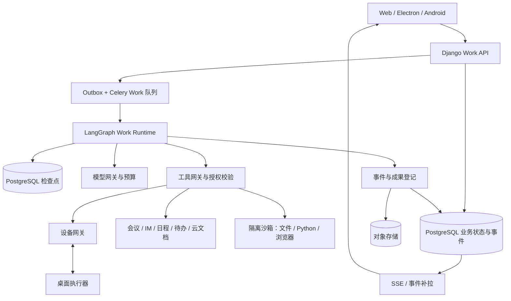

# 工作（Work）模块：产品、架构与 Agent 选型方案

日期：2026-09-21 · 更新：2026-09-22 · 修订：v1.8，记录桌面真实认证、业务与安装生命周期验收及暴露问题的修复 · 状态：D0 候选包 `0.2.0-d0.7`，设备、原生交互和干净系统门槛待通过；Work 尚未实施 · 原源码核查基线：we-meet `4c5ca713f`

## 1. 建议决策

将 Work 定位为聚视协作产品内的 **通用 AI 工作执行中心**：用户交代目标，系统使用获准的会议、消息、文档、日程、文件及代码工作空间，持续执行并交付可验收成果。完整产品覆盖“日常办公”“代码开发”“设计创意”三条场景线，共用任务、权限、执行、成果与用量底座；场景是任务发起和成果呈现方式，不是三套独立 Agent 系统。

先把现有 Electron 外壳建设为可安装、可登录、可访问既有业务的 Windows 客户端，再在其中交付“会议与协作闭环”，随后补上传文件、周报、沟通准备与表格分析。后续按“最小本地文件处理 → 项目与资料复用 → 定时任务 → 设备治理与助理续办 → 代码开发 → 设计创意 → 开放生态”推进。桌面基础、最小本地执行、代码开发及创意专项分别核算资源，不默认为原 Work 云端 P0 排期已包含。

落地技术边界：**现有 React / Django + PostgreSQL 业务账本 + 独立 Celery / Outbox + 工具权限网关 + ExecutorAdapter + 一个主执行内核 + 可替换的模型适配层**。首期使用单个主 Agent 配合受控工具；专业能力先实现为技能，不默认启动多个 Agent。文件计算需要时接受控云端沙箱，桌面执行器按后续阶段建设。

执行内核沿用 v1.3 建议：**优先验证 Pi，以 Goose 做有界对照；DeepSeek Harness（dsh）保留为候选，OpenHands SDK 留作代码开发专项执行器候选**。验证阶段只集成一个主内核，按第 14.4 节限时定案。Django 持有业务状态，执行运行时经 adapter 接入；LangGraph 按跨业务流程需要选择性保留，不叠加管理同一个工具循环。此为工程判断，尚无实测排名；候选比较依据见第 19 节，第 18 节保留 dsh 专项分析。

这是一项面向现有系统的产品与工程建议，不代表竞品内部架构，也不代表已验证的模型性能。默认假设：国内企业协作场景优先、复用现有组织与身份体系、先推出受控试点；可投入人力及具体模型账号尚未核实。Work 方案尚未调用付费模型或部署执行服务；D0 已修改桌面与必要的前端适配代码，并按用户确认的 `meet.we-meet.online` 环境新增独立桌面登录 client，实施范围与证据见第 14.0 节。

### 1.1 当前执行结论

**当前第一任务是 D0：安装 Windows 客户端 → 系统浏览器登录并回跳 → 使用既有消息 / 会议 / 文档入口 → 退出、重启及升级后仍可正常使用。** 原基线仅有外壳；当前已产出内部候选包并通过部分安装与集成检查，仍不能据此把完整客户端视为已经可用。D0 的逐项范围与验收见第 14.0 节。

D0 通过后，启动 W01–W05 的 Work 闭环：选会议 → 后台生成带来源报告 → 修订行动项 → 创建待办 / 云文档 → 回执，优先在桌面安装包内验证。后端契约和内核 PoC 可在不占用桌面关键人力时提前，但不据此跳过 D0。桌面持续复用 React UI 和 Django 业务服务。

本地文件的最小处理闭环提前到项目、定时任务之前；远程设备配对、手机指挥、完整助理及 GUI 仍分阶段建设。完整菜单、专家市场及多 Agent 不进入首轮。第 14 节是执行顺序的唯一依据：其他章节的完整能力按该顺序启用，不代表同时开工。

## 2. 参考产品：哪些事实可以借鉴

| 依据 | 已观察或公开披露的能力 | 对 Work 的启发 |
|---|---|---|
| 用户提供的豆包工作首页截图 | 全局一级入口；新工作任务、云盘、定时任务、插件·技能·伙伴；项目与历史；输入区选择电脑、项目、确认方式、知识、技能和模型 | 以任务为中心组织入口；把执行环境与资料范围放在提交前可见的位置 |
| 用户提供的手机控制电脑截图 | 同账号设备连接、继续电脑任务、进度提醒、电脑文件与工具、保持唤醒开关 | 手机做指令与验收入口，电脑负责需要本地资源的步骤 |
| 豆包官方公告 | 本地 / 云端运行、Windows 虚拟桌面、手机续办、侧边工作台、技能及连接器 | 云端执行、本地执行、跨端续办分别设计，成果与执行过程同屏。[官方公告](https://weibo.com/2/detail/5334423399565762) |
| WorkBuddy 官方产品资料 | 自然语言发起、多步骤规划执行、本地文件操作、文档表格等产物、MCP 与 Skills | 产品评价围绕工作是否完成和成果是否可用。[产品介绍](https://www.workbuddy.cn/docs/workbuddy/From-Beginner-to-Expert-Guide/Product-Guide) |
| WorkBuddy 官方入门资料 | 创建任务、任务管理、任务对话、独立结果区 | 采用任务列表、执行过程、成果预览的布局。[产品简介](https://www.workbuddy.cn/docs/workbuddy/Overview) |
| 用户补充的 WorkBuddy 5.5.2 两张截图 | 日常办公 / 代码开发切换；新建任务、助理、专家·技能·连接器、自动化；场景卡片、工作空间、默认权限、Auto 选项 | 区分场景、模式、工作空间、权限和模型策略；两类场景共用任务输入与历史 |
| 本次 WorkBuddy 5.5.6 中文版 8 张截图（S1–S8） | 三场景首页、本地助理、项目与模板、专家发现、定时任务管理、资料库；输入区显示“快速” | 以本次截图更新中文信息架构；“快速”仅能确认是可选控件，不据此认定模型、执行模式或速度承诺 |
| WorkBuddy 当前任务栏说明 | Ask、Plan、默认 Agent 三种工作模式 | 我们采用“问答 / 规划 / 执行”的稳定中文名称；用户资料中的 Craft 不作为当前官方统一命名。[官方说明](https://www.workbuddy.cn/docs/workbuddy/From-Beginner-to-Expert-Guide/Function-Description/Task-Bar) |
| WorkBuddy 开放平台 | Buddy 应用、专家、Skill、连接器、硬件五类开放能力 | 预留能力资产与场景包体系，按阶段开放。[开放平台](https://open.workbuddy.cn/) |

部分 WorkBuddy 页面通过搜索索引获取，直接抓取失败；任务栏说明已直接打开核对，界面依据用户提供截图，尚未登录产品做完整功能测试。截图中没有体现的执行机制、成功率和权限实现均不作竞品事实推断。开放平台五类能力可核实；“国内首个”、具体合作伙伴覆盖及所有能力上线时间，本方案不据此作技术决策。

补充商业与运行边界：官方当前定价页列出免费体验版每月 500 基础积分，但积分不是固定数量的 token，套餐也不作为本产品成本测算依据。[定价说明](https://www.workbuddy.cn/docs/workbuddy/Pricing) 官方远程助理支持微信、企业微信、QQ、钉钉、飞书等入口，并要求本地电脑保持开机且运行 WorkBuddy；不能把“定时任务”直接理解成电脑关机后也能运行。[远程助理](https://www.workbuddy.cn/docs/workbuddy/From-Beginner-to-Expert-Guide/Function-Description/Assistant)

聚视的差异化应当是：已有会议、消息、待办与文档之间的上下文连续性，以及成果交付后可继续协作。首先做好“开完会以后工作如何推进”，比同时建设所有办公场景更容易验证价值。

### 2.1 本次中文版截图的逐页依据

S1–S8 按本次消息中的图片顺序编号，界面左上角均显示版本 5.5.6。图片来自用户提供的会话附件，尚未作为仓库图片文件归档；编号用于需求追踪，不虚构本地图片链接。本次仅补充截图分析，前述外部资料及第 12、18、19 节选型依据沿用原修订的核查记录，不表示在 2026-09-22 重新验证。

| 编号 / 页面 | 截图直接可见 | 聚视采用的设计及证据边界 |
|---|---|---|
| S1 日常办公首页 | 标题“WorkBuddy，我帮你”；日常办公 / 代码开发 / 设计创意分段；大输入框；`@ 引用对话文件`、`/ 调用技能与指令`；附件、快速、麦克风、发送；下方工作空间、默认权限 | 采用场景切换 + 统一输入器 + 环境摘要；空输入时发送呈灰色。附件菜单、权限菜单及速度选项内容未展示 |
| S2 代码开发首页 | 选中“代码开发”；主体输入结构与 S1 相同 | 复用输入器，通过场景配置改变推荐与成果视图；该截图不能证明仓库、终端、diff 或运行预览已实现 |
| S3 设计创意首页 | 视觉海报、运营海报、PPT设计、生成图片、生成视频、品牌设计快捷项；输入工具栏新增“AI 生图”“设计风格”；快捷项末端有横向切换按钮 | 增加创意任务配置；截图只证明入口可见，不证明生成质量、视频链路或风格菜单的具体选项。S1/S2 未显示同类快捷项，不据此判断其他状态是否存在 |
| S4 助理 | “本地助理”；“已连接：微信小程序”及设置图标；底部输入器，含附件、默认权限、快速、发送；主要区域为空 | 采用长期助理入口和渠道 / 设备状态；连接状态不等于设备在线或任务正在运行，空白页也不能证明助理没有历史功能 |
| S5 项目 | 标题、协作说明、新建项目；我的项目、搜索、卡片菜单；从模板创建及五类模板 | 补齐项目列表、创建向导、模板版本与项目内任务组织；成员管理及模板创建结果是聚视拟议设计，截图未展示 |
| S6 专家·技能·连接器 | 顶部三页签；专家搜索、我的专家；精选场景横向卡片；专家 / 专家团；分类、综合 / 最热 / 最新排序；专家卡含头像、职称、作者、描述、标签 | 建设统一能力发现入口；本图仅展示专家页签，技能及连接器详情、安装流程和专家团执行机制均未知 |
| S7 定时任务 | 定时任务 / 运行记录页签；筛选、搜索、刷新、批量管理、添加定时任务；已暂停分组；条目显示名称、所属项目、每天 09:00、已暂停 | 区分规则与每次运行；补齐暂停 / 恢复与记录页。截图未打开运行记录或添加菜单，不推断补跑、时区及后台常驻机制 |
| S8 资料库 | 二级侧栏：搜索、最近、本地产物、我的资料、团队空间；最近访问 / 我分享的 / 与我共享；类型筛选；名称、所有者、位置、最近访问列；容量与升级入口、引导卡 | 采用输入资料与输出成果的统一查找视图，保留来源和权限；容量数值是该截图账号状态，不是聚视配额；不据引导文案推断协作编辑或发布机制 |

共同外壳可见“新建任务、助理、项目、专家·技能·连接器、定时任务、资料库、更多”，下方是“空间（1）”及项目下的历史任务，底部为账号与通知入口；“发现应用”、首页积分活动属于扩展和运营入口。聚视优先借鉴工作组织结构，品牌吉祥物、营销插画、积分活动、升级销售和桌面菜单栏不纳入功能对齐范围。“空间”与工作空间的底层关系无法从截图确定，聚视采用第 4 节的明确对象边界。

## 3. 现有代码基础与缺口

除桌面项外，以下沿用原代码基线的源码核查，未重新审计全部业务实现。2026-09-22 补读了桌面 main、preload、打包配置和 README，尚未运行安装包或验证登录；不把 README 的历史规划或默认配置等同于线上可用。

| 能力 | 当前证据 | Work 的复用方式与增量 |
|---|---|---|
| Web 工作台 | [routes.ts](../../src/frontend/src/routes.ts)，已有会议、IM、日程、审批、任务、文档路由 | 增加 `/work` 路由与 `features/work`，复用导航、用户选择器、来源卡片 |
| 桌面应用 | [main.ts](../../src/desktop/src/main.ts)、[preload.ts](../../src/desktop/src/preload.ts)、[桌面说明](../../src/desktop/README.md) | 原基线为外壳；D0 已补齐候选包、内置资源、原生登录与会话、媒体授权和窗口生命周期，部分集成检查通过；真实业务和升级仍待验收，本地执行和远程配对另行建设 |
| 会议 / 日程 / IM 检索问答 | [global_ask.py](../../src/backend/core/services/global_ask.py)、[meeting_search.py](../../src/backend/core/services/meeting_search.py) | 复用逐来源权限校验、引用和检索逻辑；新增可供 Agent 调用的工具契约。云文档全文检索需独立验证与接入 |
| Qwen 文本能力 | [llm_client.py](../../src/backend/core/services/llm_client.py) | 当前主要是 chat、JSON、stream 与 embedding 封装，`from_settings` 限定 Qwen；新增 tool-call 循环、能力注册、路由，保留会议原路径 |
| 模型目录与用量 | [models.py](../../src/backend/core/models.py) 中 `AIVendor / AIModel / AIUsageRecord` | 复用模型目录与调用计量；补充工具能力、部署区域、WorkRun 归因和预算预占 |
| 行动项转待办 | [meeting_summary_tasks.py](../../src/backend/core/services/meeting_summary_tasks.py) | 已要求当前人工修订、真实账号、组织校验、请求去重；Work 必须沿用这些业务约束 |
| 云文档交付 | [summary_export_delivery.py](../../src/backend/core/services/summary_export_delivery.py) | 复用冻结内容、租约、未知结果对账模式；通用 Work 成果需要新的适配器，不能直接套用会议专属导出模型 |
| IM 通知与机器人 | [im_bots.py](../../src/backend/core/services/im_bots.py)、`task_notifications.py` | 新增工作助手身份与通知模板；保留发送权限、卡片动作鉴权和交付去重 |
| 协作文档服务 | [we-meet-docs 架构](../../../we-meet-docs/documentation/architecture.md) | 对接文档 API 与现有身份映射，不直接写另一服务的数据库 |
| 会中 AI Agent | [ai_agent.py](../../src/backend/core/services/ai_agent.py) | 现有职责为 LiveKit 房间内调度；Work Runtime 单独建设，两者共享模型基础设施而非执行生命周期 |

特别注意：`jusi-light-im` 早期架构说明称单租户，不能由 Django 中存在 Organization 就推断整个 IM 链路已经支持租户隔离。多组织试点前，需要验证组织、群成员、搜索、机器人和对象存储的端到端隔离。

## 4. 产品对象与模块边界

| 名称 | 定义 | 例子 |
|---|---|---|
| 工作任务 WorkTask | 用户希望 AI 达成的目标，可持续补充要求 | 整理客户评审会并准备跟进材料 |
| 执行 WorkRun | 某次实际执行，记录模型、工具、检查点、预算与环境 | 首次运行；修改要求后产生下一次运行 |
| 待办 Task | 已有任务模块中交给人的事项 | 张三周五前确认接口方案 |
| 成果 Artifact | 可预览、编辑、下载或交付的版本化产物 | 跟进报告、行动项清单、XLSX |
| 项目 WorkProject | 多个工作任务共享的资料、规则、成员与成果空间 | A 客户交付项目 |
| 工作空间 WorkWorkspace | 文件、代码仓库和输出目录的逻辑边界；与具体环境的挂载关联 | 本地授权目录、云端沙箱目录、隔离 Git checkout |
| 技能 Skill | 可复用的方法、工具范围、输入输出和验收规范 | 周报生成、会议跟进、表格分析 |
| 连接器 Connector | 连接一个系统的工具及其授权 | 聚视会议、云文档、日历、外部 CRM |
| 伙伴 AgentProfile | 配置了角色、技能、模型策略和资料范围的助手 | 客户跟进伙伴；不等于另训一个模型 |
| 场景包 WorkApp | 包含首页模板、专家配置、技能及连接器依赖的版本化应用配置 | 客户跟进工作台、企业内部研发工作台 |
| 资料条目 WorkLibraryItem | 指向上传文件、云文档或成果版本的可管理引用，带位置、所有者和访问关系 | 项目背景材料、会议报告；不复制成另一套文档正文 |
| 项目模板 WorkProjectTemplateVersion | 版本化的项目说明、资料目录建议、规则和起始任务配置 | 产品需求全流程、团队知识库；不同于单次任务提示模板或 WorkApp |
| 定时规则 WorkSchedule | 在指定时区和授权范围内触发工作的持久配置 | 每周五生成周报；规则状态与某一次运行状态独立 |

关系：WorkTask 可产生多个 WorkRun、多个 Artifact，也可关联或创建现有 Task；WorkRun 内部的执行步骤不直接映射成人的待办。

Project 管团队与资料，Workspace 管文件边界，Environment 管在哪里执行；三个对象不能互相代替。界面把 AgentProfile 统一称为“专家”，保留“伙伴”为可选品牌表达。“助理”是持续对话和任务路由入口，可经本地界面或远程渠道访问，不另建一套 Agent 身份；助理会话按用户、组织及显式项目范围隔离。“专家团”是后期专家组合配置，不因界面出现多人头像就启用多 Agent 并发。

P0 继续使用 **成果** 入口；P1 当上传资料、项目引用、共享视图可用后升级为 **资料库**，默认保留“成果”筛选及原入口重定向。资料库承载可复用输入和输出，任务详情中的“成果栏”继续承载本次交付，两者访问同一成果对象。云文档正文与协作能力仍由现有文档服务管理，不建设平行云盘。项目在 P1 正式开放；P0 只保留扩展字段，不做空入口。

## 5. 首期场景与完成标准

| 优先级 | 用户表达 | 必须交付 | 验收重点 |
|---|---|---|---|
| P0 | 整理这次会议，列出结论和下一步 | 带时间戳来源的跟进报告、待确认行动项、文档草稿 | 不编造负责人；人工修订确认后才创建待办；重复提交不重复创建 |
| P0 | 汇总本周与项目有关的会议、消息和进展 | 周报草稿、引用、缺失或冲突信息清单 | 只读本人可见资料；无资料时明确缺口；分享前展示对象和内容 |
| P0 | 根据这些材料，准备明天的客户沟通 | 准备清单、问题清单、资料摘要 | 支持选定会议、上传文件和指定消息；不默认读取整个组织 |
| P0 | 分析这张销售表并做出总结 | 可核算的统计结果、图表、XLSX 或 CSV 和解释 | 计算由程序执行；数字与源数据一致；声明数据范围和单位 |
| P0-L | 整理我电脑上的这些文件 | 文件清单、变更预览、处理后的副本 | 限定目录；冲突可处理；首版生成副本，不覆盖源文件 |
| P1 | 每周五生成周报，完成后提醒我 | 定时草稿和私人通知 | 时区明确；单次触发去重；失去权限立即停止 |
| P1 | 我离开电脑了，继续刚才的工作 | 同一个工作任务的进度、确认与成果 | 手机操作有序；电脑离线显示等待设备，不显示仍在执行 |
| P1-D | 根据这份活动资料，做一张符合品牌风格的中文海报 | 指定尺寸的海报、预览、素材来源和可继续修改的版本记录 | 活动日期与文案准确；布局可读；修改后保留旧版；不默认发布到外部渠道 |
| P2 | 在业务网站中完成一组操作 | 操作回执、截图或系统记录 | 接口优先；GUI 仅在获准环境中执行；结果不确定时对账 |

P0 的表格分析支持限定格式、数据量和图表类型；PPT 和高保真复杂排版安排到 P1。语音输入可复用已有语音能力，但不作为 P0 上线前置。

## 6. 信息架构与交互

全局导航新增“工作”，建议放在“消息”之后。保留已有“任务”入口承载人员协作待办。

```text
工作
  新建任务             P0 日常办公；P1-C 代码开发；P1-D 设计创意
  我的工作             P0 进行中 / 待我处理 / 已完成 / 失败
  助理                 P1 本地界面、聚视 IM / 手机；P2 外部渠道
  项目                 P1 我的项目 / 从模板创建
  专家·技能·连接器     P0 仅开放内置技能页签；P1 预设专家与自有连接授权
  定时任务             P1 规则 / 运行记录；P2 扩展事件自动化
  成果 → 资料库        P0 成果；P1 最近 / 本地产物 / 我的资料 / 团队空间
  更多                 按已上线能力提供帮助、场景包发现等
  项目与最近任务树     P1；P0 显示个人最近任务
  账号与设置           执行设备 / 渠道连接 / 授权 / 用量 / 通知
```

Web / 桌面采用三级空间：全局导航、Work 子导航、工作内容；任务详情里的内容区分为“过程”和“成果”两栏。Work 子导航分为主功能、项目 / 最近任务树、底部账号工具三个区域，历史区独立滚动；“我的工作”保留聚视所需的运行状态入口。截图侧栏约占整窗宽度的 18%，仅作为层次参考，不照搬到已有全局导航内。

建议桌面 Work 子导航宽度 240–280 CSS px，主内容留白 24–32 px；新任务输入器最大宽度约 960 px、随容器收缩。这些是聚视设计初值，不是截图像素测量结论。资料库采用可折叠的局部目录；空间不足时将全局导航压缩为图标栏、局部目录改抽屉，避免四条固定侧栏同时占宽。以 1440 / 1024 / 390 px 视口校验，手机将“过程 / 成果”切换为页签。

| 页面 | 主要内容 | 关键动作 |
|---|---|---|
| 新建任务 | 日常办公 / 代码开发 / 设计创意场景切换、一句话输入、场景快捷项、最近任务 | `@` 选择资料、`/` 选择技能与指令、上传文件；只显示当前已开放场景 |
| 输入工具栏 | 附件、场景专属参数、策略选择、发送；底部显示工作空间 / 执行位置、权限摘要；模式可见且可切换 | 场景、问答 / 规划 / 执行、响应策略、权限分别配置；高级设置展示实际模型与预算 |
| 工作详情 | 当前目标、步骤状态、简短操作说明、等待原因、成果 | 补充要求、暂停、继续、取消、重试失败步骤 |
| 成果栏 | 预览、来源、版本、修改摘要、交付回执 | 编辑、下载、保存云文档、创建待办、分享 |
| 待我处理 | 缺少材料、权限、操作确认、设备离线 | 集中处理阻塞事项，点击回到具体步骤 |
| 设备管理 | 在线 / 离线、最后心跳、能力、授权目录、所属账号 | 配对、撤销、暂停本地执行、选择保持唤醒 |

执行过程展示“已读取哪些资料、完成哪些步骤、产生什么结果”，不展示模型内部推理。进度用阶段与已完成步骤表达，无法可靠估算时不用虚假的百分比。

工作模式、交付要求与权限分别配置：“只生成草稿”属于交付要求；“按需确认 / 按已授权规则执行”属于权限策略；“问答 / 规划 / 执行”属于工作模式，详见第 16 节。系统记录用户已明确允许的动作，不因换端或重试重复询问。新的收件人、扩大共享范围、覆盖或删除文件、安装软件等超出既有授权范围的动作需要具体预览；策略由服务端执行。

P0 示例流程：会议详情点击“交给工作” → 预填目标与记录引用 → 自动读取并整理 → 成果栏显示草稿 → 用户修订行动项及负责人 → 系统创建待办 / 文档 → 返回回执。若用户只要求生成报告，到草稿交付即可完成，不强制要求发送。

### 6.1 新建任务与统一输入器（S1–S3）

首页结构为“产品标题 → 场景分段 → 可选快捷项 → 输入器 → 环境与权限摘要”，避免把首页做成密集能力仪表盘。办公、开发共用输入骨架；创意场景按已具备能力增加“生成方式”“设计风格”等结构化参数。快捷项只预填目标 / 参数或打开简短表单，不直接发起运行。

| 控件 / 状态 | 聚视交互契约 |
|---|---|
| 三场景切换 | 保留文本、附件与通用引用；场景专属配置分开保存，不兼容的参数显式标记并在提交前处理；不创建任务、不提高权限 |
| `@` 引用 | 按类型选择会议、消息、云文档、已上传文件、历史工作或成果版本；展示引用标签和来源，可移除；服务端逐项校验访问权，不把整个历史会话自动作为上下文 |
| `/` 技能与指令 | 可搜索当前用户可用的技能及命令；选择后展示用途、必填输入和所需工具；未授权依赖给出配置入口，不在输入时自动安装 |
| 附件与发送 | 支持上传状态、失败重试、移除；空目标或附件未就绪时禁用发送并说明原因；提交失败保留草稿，重复点击复用同一幂等键 |
| 工作空间与执行位置 | 提交前可见“云端临时空间”或已授权设备 / 目录摘要；纯云端任务无需强制选择本地目录；项目选择与目录选择分别呈现 |
| 权限 | “默认权限”必须可展开查看具体范围、写入确认规则和授权有效期；不能只有含糊标签；沿用既有授权的动作不反复询问 |
| 响应策略 | 聚视拟设“自动 / 快速 / 深入”，映射模型网关策略及预算；截图中的“快速”不作为该映射的事实依据。它不改变问答 / 规划 / 执行模式或操作权限 |
| 麦克风 | 具备能力后显示录音、转写、失败状态；转写进入可编辑草稿，由用户发送；P0 可隐藏，不阻塞文字提交 |
| 提交成功 | 进入唯一 WorkTask 详情并显示已受理；首页草稿清理与返回行为明确；仅切换标签、挑选专家或浏览模板不创建空任务 |

首页、任务续聊、助理对话共用输入器组件，按上下文控制工具栏；助理输入器固定在内容区底部，首页输入器位于主体中部。键盘可操作场景、引用候选和发送，图标按钮提供可读名称；移动端工具栏可换行，不挤压输入区域。

### 6.2 助理：持续对话与任务入口（S4）

顶部展示当前助理、会话范围、设备状态、渠道连接及设置；分别显示“微信等渠道已连接”和“电脑在线 / 离线”，不能合并为一个成功状态。聚视首期使用自有 IM / 手机，不因截图展示微信小程序就把外部渠道纳入 P1。

首次进入显示能力说明、连接设备 / 渠道引导和可用示例；日常问答保留在会话中，需要持续执行时创建或关联 WorkTask，并用任务卡呈现目标、状态、待确认事项和成果。用户说“继续刚才的工作”时按明确关联路由，多个候选则让用户选择；不能默认共享所有项目的资料。具体身份、去重和多端契约见第 17.1 节。

### 6.3 项目与模板（S5）

项目页由标题 / 协作说明 / 新建项目、我的项目与搜索、从模板创建三部分组成。项目卡显示名称、更新时间及操作菜单；详情使用“工作任务 / 资料 / 成果 / 成员与规则”组织内容，并与侧栏项目树保持一致。菜单中重命名、归档、退出或删除按角色开放；删除与来源文档的关系需明确，不能级联删除用户原始资料。

截图模板可转换为聚视首批候选，以下预置内容为聚视建议：

| 模板名称 | 建议初始化内容 |
|---|---|
| 产品需求全流程 | 背景与目标、需求资料、PRD 起始任务、评审和验收清单 |
| 市场调研与竞品分析 | 研究问题、来源记录、对比维度、报告评审任务 |
| 团队知识库 | SOP / FAQ 分类、资料维护规则和整理任务 |
| 项目交付 | 客户目标、计划、风险、会议跟进与周报模板 |
| Bug 跟踪/测试验收 | 缺陷资料、复现模板、测试用例与验收总结；需执行代码的任务由 P1-C 能力开关控制 |

创建流程为“空白 / 选模板 → 名称与说明 → 成员及资料范围 → 预览将创建的内容 → 创建”。实例锁定模板版本；预置任务保持草稿，模板内的周期建议默认停用，不在创建项目时自动运行、邀请外部联系人或开通连接器。创建使用幂等键，失败可重试而不重复生成项目。

### 6.4 专家·技能·连接器：能力发现与管理（S6）

保持统一入口和三个独立页签，避免把角色、执行方法和外部系统授权混为一类。专家页包含精选场景、专家 / 专家团切换、分类与排序、搜索、我的专家；技能页和连接器页的下列设计是聚视方案，并非截图已验证功能。

| 类型 | 列表 / 详情字段 | 主操作与状态 |
|---|---|---|
| 专家 | 名称、头像、发布者、角色说明、标签、适用场景、依赖技能 / 资料范围 | 选择用于任务、收藏 / 我的专家；使用前展示将附加的配置，不立即执行 |
| 技能 | 名称、输入输出、版本、示例、工具依赖、支持环境 | 查看内置技能；P1 导入受控版本、启用 / 停用；区分可用、依赖缺失、已停用 |
| 连接器 | 系统名称、可提供的读写动作、适用账号 / 组织、授权范围 | 连接、重连、撤销；区分未连接、已连接、授权过期、受组织限制；凭证不出现在卡片正文 |

精选场景、分类与排序由配置驱动，内容少时优先搜索和分类，避免为了复刻“最热”制造虚假使用数据。P0 仅交付内置技能清单，可将菜单暂简写为“技能”；P1 增加预设专家和自有连接状态，P2 再开放团队发布、专家团及外部市场。发现、选用、安装授权、实际执行是不同动作，分别留痕。

### 6.5 定时任务与运行记录（S7）

P1 菜单采用“定时任务”，页面内设“定时任务 / 运行记录”页签；P2 增加事件规则后再演进为“自动化”。规则列表支持状态筛选、名称 / 项目搜索、刷新、分页及批量暂停 / 恢复，显示名称、所属项目、周期与时区、下次触发、规则状态。添加菜单至少提供空白规则和从已有工作创建，不假定截图下拉菜单中的实际选项。

编辑表单包含目标、来源引用、可选项目、固定技能版本、执行环境、时区与周期、接收者、预算、失败与补跑策略；保存前预览未来三次触发时间。运行记录展示触发时间、开始 / 结束、耗时、运行状态、失败 / 等待原因、成果与用量，并跳转 WorkTask / WorkRun；规则“已暂停”不代表此前运行已暂停。

暂停只停止未来触发，取消活动运行是独立动作；恢复必须重验授权和环境。批量操作逐条返回结果，不把部分失败显示成全部成功；重试生成有关联的新运行，已成功的外发步骤遵循操作账本去重。完整调度约束见第 17.2 节。

### 6.6 资料库：从本次成果到后续工作的输入（S8）

局部导航采用“搜索、最近、本地产物、我的资料、团队空间”；最近页提供“最近访问 / 我分享的 / 与我共享”及类型筛选。列表至少包含名称 / 类型、所有者、位置、最近访问，详情提供预览、版本、来源任务、引用到新任务、下载及有权限的共享操作。引导卡可关闭并记住状态，容量区按真实配额显示；无商业化能力时不显示升级入口。

“本地产物”按设备区分，记录位置和最后同步时间；设备离线时显示不可读取原因，只有显式上传的副本才能云端预览。用户选择本地文件不意味着自动同步整个目录。个人资料加入项目或团队空间需确认共享范围，默认共享资料条目不自动公开完整任务对话和全部来源。

“引用到任务”解析到明确来源及版本，由服务端在执行时重验权限；源文档更新后可选择使用新版本，不能悄悄替换已经批准的输入。删除资料库引用与删除源文件分别处理；容量按存储计量规则统计，引用同一对象不会产生重复实体文件。复用机制与数据契约见第 9、10 节。

### 6.7 页面状态与导航连续性

各列表统一覆盖加载、首次空白、筛选无结果、网络失败、无权限和部分数据不可用，分别提供清除筛选、重试或申请访问等适用动作。项目和资料库搜索必须在授权集合内执行，错误提示不能泄露其他组织的条目名称。刷新、前进 / 后退保留页签和筛选条件；从项目 / 专家 / 资料进入新任务时带可见预填标签，从运行记录进入详情后可返回原筛选位置。

## 7. 系统架构

本节图示保留最初 LangGraph 方案，用于说明业务控制、工具和执行环境的边界；执行内核的当前候选顺序以第 19 节为准。采用 Pi / Goose 等内核时，通过 ExecutorAdapter 替换图中的 Work Runtime 及其检查点实现，不影响三场景和管理页共用的 Work API、权限、事件与成果契约。



此图是拟议架构。MVP 在现有 Django 项目中增加独立 `work` app，API 与 worker 共享服务代码，先不拆出新的业务微服务；Work worker、沙箱和会议音视频 worker 分进程、分队列、分配额。沙箱不得获得数据库账号或服务管理员凭证。

| 层 | 负责什么 | 不承担什么 |
|---|---|---|
| Work API | 身份、任务与权限、用户指令、确认、事件读取、成果访问 | 不在 HTTP 请求中执行分钟级任务 |
| LangGraph | 一个 WorkRun 的规划、工具循环、检查点、等待和恢复 | 不替代组织权限、租约、外部写入幂等和业务审计 |
| Celery + Outbox | 可靠投递、执行唤醒、定时调度、退避重试 | Redis 消息不是任务状态唯一来源；审批等待不占 worker |
| 工具网关 | Schema 校验、主体与资源权限、确认策略、预算与操作回执 | 不因模型说“已授权”就放行 |
| 执行器 | 运行受控代码、文件转换、浏览器或设备动作 | 不决定租户权限，不持有可任意扩大权限的长期令牌 |
| PostgreSQL | Work 业务状态、事件、操作账本与持久检查点 | 大文件存储放到对象存储 |

P0 不额外引入 Temporal、Kafka、独立向量数据库。若出现跨天跨服务事务、大规模定时任务或 Celery 自建调度恢复成本持续上升，再评估持久工作流引擎。已有检索先包装复用；索引规模与延迟确有瓶颈时再评估 pgvector。

SSE 需要核实当前 Django 部署的长连接并发能力、反向代理缓冲与超时；P0 可用有界长轮询 / 增量补拉兜底，避免一个 SSE 占满一个同步 worker。

## 8. 执行与恢复：必须从第一版做对

建议外部运行状态：`queued → running → awaiting_input / awaiting_approval / waiting_device / paused → running → succeeded / failed / canceled`。预算耗尽以 `paused + budget_exceeded` 表达；内部工具操作另外使用 `uncertain` 标记结果未知。

1. WorkTask 提交在同一事务中写入 WorkRun 与 Outbox；异步派发失败可重新投递。
2. Worker 通过租约和递增 generation 领取 Run，同一 Run 只允许一个有效写者；过期 worker 的结果不能覆盖新状态。
3. 每次工具调用先持久化 ToolOperation。写操作使用稳定的幂等键、输入摘要和目标资源版本；重试沿用同一操作键。
4. 工具成功与图检查点之间存在崩溃窗口。恢复时先查操作账本；外部写入超时进入 `uncertain`，按原键查询结果，不能盲目重新发送。
5. 如果外部系统没有幂等与对账能力，未知结果交给用户核对或人工处理；不声称具备“恰好一次”执行保证。
6. 等待输入或确认时落盘并释放 worker。恢复事件带 Run 版本与批准内容摘要，旧确认、跨账号确认和重复消费被拒绝或返回原回执。
7. 用户在运行中补充要求形成持久 command；在安全步骤边界应用，必要时新建 Run。变更目标后重新验证待执行写操作，不能把旧批准用在新内容上。
8. 暂停停止调度下一步；取消发出 cancel 信号并回收进程。已成功发送的消息不会因取消自动撤回；结果页列明已发生的动作。
9. SSE 断线使用 `Last-Event-ID` 或 `after_seq` 补拉，客户端按事件序号去重；关掉界面不会取消云端运行。

LangGraph 官方文档提供持久化检查点和 interrupt/resume 能力，同时说明恢复时会重跑中断节点前的代码；因此业务副作用必须独立登记，不能把图恢复当成防重复保障。[持久化](https://docs.langchain.com/oss/python/langgraph/persistence) · [中断与恢复](https://docs.langchain.com/oss/python/langgraph/interrupts)

## 9. 数据模型与 API 草案

下表均为新增设计，名称可在实现评审中调整。

| 实体 | 核心字段 / 约束 |
|---|---|
| WorkTask | organization、owner、title、goal、可选 project、visibility、version；创建时默认私人 |
| WorkMessage | task、author、角色、结构化内容、client_message_id；服务端保存历史，不信任前端拼接历史 |
| WorkRun | task、attempt、status、runtime_version、model_policy、budget、checkpoint_ref、lease、generation |
| WorkEvent | run、seq、type、payload、created_at；`(run, seq)` 唯一；鉴权后才能订阅 |
| ToolOperation | run、tool_version、args_hash、operation_key、resource_version、status、receipt、executor |
| WorkApproval | operation、approver、payload_hash、scope、expires_at、decision；一次性消费 |
| WorkArtifact / Version | task、immutable object key / doc_id、checksum、mime、size、版本、来源、状态、owner |
| WorkContextRef | source_type、source_id、source_version、授权范围、引用位置；避免无边界复制资料 |
| WorkTaskLink | WorkTask 与已有 Task / MeetingRecord / 文档的关联；不替代各对象访问控制 |
| WorkProject | P1：名称、说明、owner、成员角色、资料引用、输出规则、template_version、archived_at；成员加入不自动获得所有来源权限 |
| WorkProjectTemplateVersion | P1：模板键、版本、说明、初始目录 / 任务配置、能力依赖；实例化不自动执行任务或启用定时规则 |
| WorkLibraryItem / LibraryAccess | P1：organization、owner、location、source_type/id/version、可选 project/device、访问 / 分享关系、last_accessed_at；源资源权限仍需独立校验 |
| WorkAssistantSession | P1：owner、organization、可选 project、channel_binding、关联 task；会话隔离及任务路由，不建立新的执行循环 |
| WorkWorkspace / WorkspaceMount | P0-L：文件根引用、当前桌面用户授权和读写 grant；P1 扩展仓库、基线版本、环境挂载；切换设备不自动继承挂载授权 |
| WorkSchedule / ScheduleOccurrence | P1：规则版本、状态、目标及上下文、项目、环境、IANA 时区、next_run、并发 / 补跑策略、授权主体、预算；Occurrence 保存触发槽、触发原因、关联 task/run、跳过原因，`(schedule_id, scheduled_at_utc)` 唯一 |
| WorkDevice / DeviceGrant | P1：设备身份、public key、capabilities、心跳、目录授权、revoked_at |
| SkillVersion / ConnectorGrant | P0 可从版本化内置清单开始；P1 数据库化、安装授权与版本锁定 |
| AgentProfileVersion / UserExpertSelection | P1：角色配置版本、发布者、标签、依赖技能、知识引用、模型策略、用户收藏 / 选用；P2 扩展团队发布与组合配置 |

三场景增量：WorkTask 增加 `domain=office|coding|creative`、`workspace_id`、可选 `app_version_id`；WorkRun 固定 `mode=ask|plan|execute`、`plan_version_id`、`permission_policy_id`、`executor_profile_version`、`expert_profile_version_id`、`response_policy=auto|fast|deep` 及经 Schema 校验的 `scene_options`（如创意输出类型、尺寸、风格引用）。模式变化保留历史并创建后续运行，禁止仅在前端换标签就扩大工具权限。模型策略、技能版本、引用版本与场景参数在每次运行中冻结；截图上的“快速”不直接作为运行模式枚举。

WorkLibraryItem 是索引引用，WorkArtifact / Version 才是产物版本记录；WorkSchedule 是规则，ScheduleOccurrence 是一次计划触发，WorkRun 是真实执行。手动运行单独保存 request_id，规则编辑不改写既有触发槽与历史运行。截图“空间（1）”不对应新增同名租户实体，沿用组织 / 个人范围和 WorkProject 组织任务。

所有引用和操作必须与服务端解析出的组织、账号绑定；个人空间的组织可为空，但唯一约束和查询不能把空组织当成公共空间。

```text
POST /api/v1.0/work/tasks/                  创建目标，支持 Idempotency-Key
GET  /api/v1.0/work/tasks/                  状态 / 项目 / 关键词筛选
GET  /api/v1.0/work/tasks/{id}/             目标、运行、上下文与成果
POST /api/v1.0/work/tasks/{id}/messages/    补充要求，返回 command_id
POST /api/v1.0/work/tasks/{id}/runs/        创建一次新执行
GET  /api/v1.0/work/runs/{id}/events/       SSE 或 after_seq 增量 JSON
POST /api/v1.0/work/runs/{id}/commands/     pause / resume / cancel / retry
POST /api/v1.0/work/approvals/{id}/decision/ 确认具体内容与版本
GET  /api/v1.0/work/artifacts/{id}/         鉴权预览 / 下载 / 来源
POST /api/v1.0/work/artifacts/{id}/deliver/ 生成或提交交付预览
POST /api/v1.0/work/devices/pairings/       P1 一次性配对
POST /api/v1.0/work/devices/{id}/revoke/    P1 撤销设备授权
```

页面配套 API 草案（均为待实现，P1-C / P1-D 能力继续按独立开关放行）：

| API | 用途与约束 |
|---|---|
| `GET /api/v1.0/work/capabilities/` | 返回当前用户可用场景、模式、响应策略、技能及环境；前端隐藏不可用入口，服务端提交时再次校验 |
| `GET/POST /api/v1.0/work/projects/`、`GET /api/v1.0/work/project-templates/` | 搜索 / 创建项目、读取模板；创建支持版本锁定和幂等键 |
| `GET /api/v1.0/work/catalog/{experts,skills,connectors}/` | 分类、搜索、分页和我的能力；此处花括号表示三类独立资源路径，响应不包含凭证 |
| `POST /api/v1.0/work/assistant/sessions/`、`POST /api/v1.0/work/assistant/sessions/{id}/messages/` | 创建持续会话及提交消息，返回关联任务；按 client_message_id 去重 |
| `GET/POST /api/v1.0/work/schedules/`、`PATCH /api/v1.0/work/schedules/{id}/` | 规则列表、创建、版本校验编辑；创建 / 编辑均返回触发预览 |
| `POST /api/v1.0/work/schedules/batch-actions/`、`GET /api/v1.0/work/schedule-occurrences/` | 批量暂停 / 恢复逐项鉴权，返回逐项结果；记录接口按规则 / 时间 / 状态过滤 |
| `GET/POST /api/v1.0/work/library/items/`、`GET /api/v1.0/work/library/items/{id}/` | 登记来源引用、最近 / 分享视图、类型筛选与详情；实际下载复用成果或文档鉴权接口 |

共享、连接授权与撤销分别调用各资源的受控服务，不通过通用列表 API 绕过权限。所有列表定义稳定排序与游标分页；过滤后的数量也只统计可见资源。前端路由建议 `/work/new`、`/work/tasks/:id`、`/work/assistant`、`/work/projects`、`/work/capabilities`、`/work/schedules`、`/work/library`；页签与筛选放在查询参数中，`/work/artifacts` 在资料库上线后兼容跳转到成果筛选。

事件契约建议包含 `schema_version / task_id / run_id / seq / type / created_at / payload`；事件类型至少覆盖消息、步骤、工具开始与结束、成果、确认、等待设备、预算和终态。工具事件不回传密钥、原始凭证或无权限的文件内容。

## 10. 工具、知识与成果

首期工具限制为少量明确职责：会议检索与读取、指定消息读取、日程读取、待办读取、行动项转换、文档草稿交付、上传文件读取、受控表格计算、成果保存。发消息、创建日程等写工具在契约与预览机制完成后开放。

调用路径优先级：**业务 API → 已批准的连接器 / MCP → 受控文件与代码工具 → 浏览器 DOM → GUI**。MCP 是接入协议，不能替代鉴权或沙箱；已有内部服务无需为使用 Agent 而全部先改写为 MCP。

每个工具声明：参数 Schema、所需权限、读写属性、是否外发、执行环境、超时、最大结果大小、幂等语义、可否重试与验收条件。动态工具发现也必须先按用户授权筛选可见工具。

知识分四层：运行中的工作记忆、任务来源引用、项目资料、用户主动保存的偏好。企业全文检索必须先按源权限过滤、再召回，并在使用和交付前重新检查；向量相似度不能决定访问权限。共享成果应检查接收者对源资料的可见性，不满足时显式走发布授权或生成脱敏版本。

来源撤权后停止读取，并限制对关联检查点、引用和成果的继续访问；已经合法发布到外部的副本无法自动收回，需要展示交付记录。资料正文、网页和 Skill 中的文字都不能自行扩大授权。

成果流水线：结构化数据 → 模板 / 程序生成 → 自动检查 → 预览 → 用户采纳或修订 → 交付。P0 以 Markdown、云文档、CSV/XLSX 为主，PDF/DOCX 可按模板支持；P1 扩展 PPTX。表格需验证公式、单位和汇总；文档需验证引用、打开能力和渲染；不能以“文件存在”作为生成成功。

编辑云文档时记录版本，用户与 Agent 并发修改产生冲突应合并或请用户选择，不覆盖人工编辑。二进制文件生成新版本；“继续修改”保留旧成果。

资料库复用闭环：本次 Artifact → 用户保存或按已授权项目规则登记 LibraryItem → 后续任务通过 `@` 引用 → 固定来源版本并重新鉴权 → 生成新 Artifact。资料库默认不把所有历史成果自动放入团队空间；共享结果、共享来源和共享任务对话分别控制。本地产物登记设备与路径引用，复制到云端属于独立上传动作；检索索引、缩略图和预览缓存同样遵循撤权与留存规则。

## 11. 手机续办与本地执行

本节为完整目标架构。P0-L 先在当前已登录桌面内实现受限文件工具、授权目录和本地操作回执；P1-3 再增加设备网关、远程配对及多端命令路由。D0 仅交付可用客户端，不包含本节的执行能力。

产品文案用“连接我的电脑”“继续工作”，首期实现任务级指挥、进度和成果；交互式远程桌面单独放到 P2，不把它作为跨端续办的前置。

建议实现：Electron 管理 UI、登录与授权；独立桌面 sidecar 执行受控动作，通过窄 IPC 接口通信。操作系统钥匙串保存设备私钥，renderer 不获得任意 shell、文件系统或原始 IPC 权限。

配对链路：桌面登录 → 生成短时一次性配对挑战 → 已认证手机确认设备信息 → 服务端绑定账号与设备公钥 → 用户在桌面选择目录 / 能力 → 设备主动建立出站 WSS。只有同账号仍不足以获得整台电脑权限。设备撤销同步吊销令牌、停发命令并请求终止活动执行。

命令包含 `command_id / operation_key / run_id / generation / grant_id / payload_hash / expires_at`；设备校验身份、有效期、授权范围和本地去重账本。网关保存离线指令但过期不执行；设备重连先同步撤销与执行回执，再领取新命令。

文件授权按用户选定目录发放 capability，检查规范化路径、符号链接 / junction、越界与文件变化。只开放格式化工具时不暴露任意 shell；若需要执行生成代码，应放入可验证的 OS 级隔离环境，无法隔离时转云端沙箱或关闭该能力。普通子进程不是安全沙箱。

| 情况 | 期望行为 |
|---|---|
| 云端任务，电脑关机 | 云端继续；手机可看进度与成果 |
| 本地步骤，电脑离线 / 休眠 | 进入 waiting_device，提示等待 / 换设备 / 取消 |
| 从本地切云端 | 先确认材料迁移和目标环境能力，在步骤边界重新规划；不承诺迁移任意运行进程 |
| 手机修改目标 | 与桌面共享 command 版本，防止两个终端覆盖同一指令 |
| 用户要求保持唤醒 | 显式启用、仅在任务需要时生效、执行结束释放；不承诺远程唤醒关机设备 |
| 本地文件被人工修改 | checksum / 版本冲突，生成副本或重新预览后执行 |

Windows 虚拟桌面功能本身不是安全隔离。P2 的 GUI 自动化优先独立 VM / 云桌面或受控独立会话；DOM 自动化与可访问性接口是否可用逐应用验证。模型能理解截图，不等于具备可靠跨应用操作能力。

## 12. Agent 选型结论

### 12.1 分层选型

以下表格保留初版选型基线；v1.3 起执行内核验证优先级已由第 19 节更新，LangGraph 为按需采用的业务编排候选。本次 v1.4 增加产品页面与创意能力契约，不重新给框架排名。

| 层 | 推荐 | 理由 |
|---|---|---|
| 产品与业务状态 | 自建 Work 域，复用 Django 权限与业务服务 | 任务、成员、成果和账本属于产品长期资产 |
| 编排运行时 | LangGraph Python | 与 Python 后端匹配，可持久化、暂停恢复；流程与工具边界可显式控制 |
| 通用办公执行框架 | P0 不强依赖；P1 对 Deep Agents 做隔离 PoC | 已含文件、上下文、技能和子任务等通用机制，但要映射现有权限与事件体系 |
| 专业角色 | 会议整理、资料研究、文档生成、表格分析四组技能 | 先共用主 Agent，只有独立上下文和可并行交付确有收益时再拆子 Agent |
| 模型 | Qwen 基线 + Doubao 备选；其他供应商按部署与授权配置 | 当前项目已有 Qwen 文本链路和厂商目录，降低首期接入成本 |
| 执行环境 | 云端隔离沙箱；P0-L 最小桌面受控执行器；P1-3 远程设备治理 | 数据、代码与业务服务分离，统一任务模型 |

LangGraph 的推荐基于项目适配与可控性，不是已完成性能跑分。[LangGraph 持久化](https://docs.langchain.com/oss/python/langgraph/persistence)

### 12.2 候选比较

| 候选 | 官方能力依据 | 对本项目的建议 |
|---|---|---|
| LangGraph | 图状态、检查点、interrupt/resume | 主编排；需要自行实现业务权限、操作账本和调度 |
| DeepSeek Harness（dsh） | 插件化 Agent 执行、文件 / Shell、Skills、MCP、会话等能力，提供 Python subprocess SDK | 通用办公 / 开发核心执行候选；开发者预览阶段，版本与隔离要求见第 18 节。[官方项目](https://github.com/deepseek-ai/deepseek-harness/blob/master/README.md) |
| Deep Agents | 文件与执行环境、上下文管理、技能、子 Agent、人工干预；基于 LangGraph | P1 文件办公 harness 候选；锁定版本，显式配置规划能力，避免与主图双重管理状态。[官方文档](https://docs.langchain.com/oss/python/deepagents/overview) |
| OpenAI Agents SDK | Python / TypeScript agent loop、工具、编排、状态与人工审核等开发接口 | 可作为替代运行时验证；自有数据权限与部署仍需实现，不因选择 SDK 就获得完整 Work 产品。[官方文档](https://developers.openai.com/api/docs/guides/agents/sdk) |
| Claude Agent SDK | 文件 / 命令工具、会话、MCP、权限与技能机制 | 文件与代码任务的专项候选；接入前验证目标环境与服务可用性；不作为国内部署默认前提。[官方文档](https://code.claude.com/docs/en/agent-sdk/overview) |
| Qwen-Agent | Qwen 工具调用、Agent 与工具组件 | Qwen 专项 PoC 候选；只有确有适配收益才引入，避免和 LangGraph 重复拥有循环与状态。[官方仓库](https://github.com/QwenLM/Qwen-Agent/blob/main/README.md) |
| OpenClaw | Gateway 统一连接 operator、node、session 和 approvals | 借鉴设备与控制平面协议；整套引入需评估身份、会话、工具授权对现有系统的重构成本。[官方协议](https://github.com/openclaw/openclaw/blob/main/docs/gateway/protocol.md) |
| Dify | Agent、工作流、知识与 API 集成平台 | 适合作为后期业务人员流程构建入口；不作为 Work 任务、设备和成员权限的唯一数据库。[官方文档](https://docs.dify.ai/en/home) |

WorkBuddy 与豆包工作在本方案中是产品参照；不假定其桌面客户端可以作为可嵌入、可再分发的底层 SDK。采购托管企业 Agent 与自建 Work 是两条可比较的路线，不能仅因名称含 Agent 就当成同一类框架。

### 12.3 模型配置建议

| 模型角色 | 初始候选 | 使用规则 |
|---|---|---|
| 常规执行 / 中文生成 | 现有 `qwen3.8-flash` 作为评测基线 | 此 ID 取自本项目配置，尚未验证目标账号授权与 Agent 表现；工具调用必须单独过测 |
| 复杂规划 / 多文档综合 | `qwen3.8-max` 候选 | 官方当前接入示例列出该模型；是否升档取决于成功率与成本，不按名称判定。[百炼接入说明](https://help.aliyun.com/zh/model-studio/first-api-call-to-qwen) |
| 第二供应商 | 支持工具调用的 Doubao / Seed 部署 | 由方舟控制台选定实际可用版本并固定；先验证字段和流式行为。[方舟工具调用](https://www.volcengine.com/docs/82379/1958524?lang=zh) |
| 图表 / 计算 | 确定性 Python / SQL 工具 + 文本模型解释 | 模型负责选择方法与解释，不直接充当计算引擎 |
| 图像 / GUI 理解 | 具备视觉能力的候选模型，P2 单列评测 | 与截图定位、动作工具和目标应用环境联合验收 |
| 创意图像生成 / 编辑 | P1-D 独立验证的图像服务或设计工具 | 与图像理解模型分开注册能力，记录输入参考、生成参数、输出版本和成本；视频服务留待 P2 验证 |
| 私有部署 | 可部署的 Qwen 模型 + 推理服务 | 单独评估 GPU、吞吐、许可证、量化损失与运维成本；不等同于云 API 效果 |

模型网关用 `fast / standard / deep / vision` 等策略角色，保存实际 provider、model ID、版本和请求参数。模型切换只发生在兼容的安全步骤边界；外部动作成功但回执丢失时，先对账而非换模型重跑。

“OpenAI-compatible”仅代表部分传输格式兼容，不保证工具调用、并行工具、JSON Schema、流式参数和思考开关行为相同。百炼文档也列出了 `tool_choice` 等具体差异，适配器应建立能力矩阵。[百炼 Chat Completions 参数](https://help.aliyun.com/zh/model-studio/qwen-api-via-openai-chat-completions)

### 12.4 单 Agent 到多 Agent 的升级条件

P0：一个 Work Coordinator，最多 15 个模型回合、30 次工具调用、20 分钟活动执行作为初始保护阈值；等待用户不占活动时长。可按任务模板配置，超限暂停并说明已交付部分。这些是试点初值，不是性能结论。

P1：对独立资料研究或多文件批处理验证最多 2–3 个并行子任务、深度 1。子 Agent 只能读取获配上下文，不能自行新增对外写权限；成果交回主 Agent 做合并和一致性检查。并行共享父任务总预算，各自有独立输出目录，防止同文件覆盖。

没有可分离交付物、共享写目标冲突明显、或并行后成本提升大于收益的任务，继续单 Agent。

## 13. 质量、成本与发布门槛

### 13.1 评测方法

先建立 100 条固定任务，建议组成：会议与消息 30、资料写作 20、表格分析 20、文件处理 10、权限 / 注入 / 故障恢复 20。P0-3 文件处理使用上传文件或沙箱；P0-L 追加本地目录授权、越界、文件变化、撤权和取消样本，全部通过后开放本地工具；P1-3 再追加远程配对、离线和跨端冲突样本。

用相同工具、数据、权限、提示模板和预算比较 Qwen 基线、增强候选、Doubao 候选。保留调参集与冻结验收集；随机性较高的任务重复至少三次，人工盲评成果并结合程序检查。不得只用另一个模型评分来认定事实正确。

建议评分权重：真实完成率 35%、事实与计算正确性 20%、工具与恢复可靠性 20%、时延 10%、单位成功任务成本 10%、部署运维适配 5%。越权访问或未经授权外发属于否决项，不参与均分抵消。

| 维度 | 试点目标，待基线校准 |
|---|---|
| 明确范围内任务的可验收完成率 | ≥85%；说明样本数和置信区间，不推广成所有任务表现 |
| 程序化校验的表格结果 | 核心汇总结果 100% 与确定性基准一致 |
| 受测权限与外发边界 | 越权读取、越权执行均为 0；表示通过测试集，不代表绝对安全保证 |
| 崩溃 / 重试 / 重复点击 | 注入故障后无重复业务写入；未知结果进入可对账状态 |
| 用户可见响应 | 受理回执 P95 <2 秒；首个有意义步骤 P95 <10 秒，注明负载与模型条件 |
| 跨端事件恢复 | 断线补拉后状态一致，重放不重复执行 |
| 成果可用性 | 交付文件可打开，引用可定位，版本与修改摘要可追踪 |

### 13.2 成本与可观测性

每次执行成本 = 模型输入 / 输出与缓存费用 + 检索及工具费用 + 沙箱 CPU/内存/时长 + 存储 / 出网 + 重试开销。**单位成功任务成本 = 总执行成本 ÷ 被采纳的成功任务数**，不能只展示一次请求的 token 价格。

复用 AIUsageRecord 并以 `ref_type=work_run` 归因；另记沙箱与工具账单，价格版本在调用时冻结。预算在子任务和工具调度前预占，完结后结算释放；组织月预算、用户并发和单任务上限共同约束，不能等账单事后统计才限额。

灰度期间采集：run/step/tool 时延、模型版本、token、失败类别、重试与对账次数、用户修订率、采纳率、等待确认次数、设备离线率。Trace 默认不保存完整敏感正文，按租户策略脱敏并设置留存期限。

北极星指标建议“每周被用户采纳的有效工作成果数”；同时观察端到端耗时、任务复用率和单位成功任务成本。聊天条数与调用量只作为诊断数据。

### 13.3 中文版页面与交互验收清单

以下是待实施后的验收要求，本次文档修订不代表已通过产品测试。视觉验收以聚视组件规范和第 6 节布局为准，截图用于检查信息层次与关键入口，不要求复刻品牌素材。

| 编号 / 依据 | 可复现检查与通过条件 | 放行阶段 |
|---|---|---|
| UI-01 / S1–S3 | 切换已开放场景，文本和附件保留；场景参数正确切换；网络层未新增任务，权限未变化 | P0 骨架；P1-C / P1-D 各自上线时复验 |
| UI-02 / S1–S3 | 用 `@` 选来源、`/` 选技能、上传附件后提交；失败保留草稿，连续点击仅创建一个任务；无法访问的引用不可提交执行 | P0 |
| UI-03 / S1–S3 | 分别修改工作模式、响应策略和权限；Ask / Plan 不写业务资源，“快速”不扩大权限；执行详情能追踪实际配置 | P0 |
| UI-04 / S3 | 快捷项预填而不执行；输出风格 / 尺寸等参数进入运行快照；产物可预览下载，修改后保留旧版本；未接入视频时不显示可执行入口 | P1-D |
| UI-05 / S4 | 助理渠道已连接但电脑离线时分别显示两种状态；关联任务续办复用 task_id；多任务指代不清时不会误执行 | P1 |
| UI-06 / S5 | 空白 / 模板创建均可用；重复提交不重复创建；模板任务不自动运行；项目成员无法读取未授权来源 | P1 |
| UI-07 / S6 | 专家、技能、连接器可分别搜索和查看状态；选用专家仅预填；失效连接提示重连；无公开市场时不出现假安装按钮或虚假热度 | P0 技能；P1 配置；P2 市场 |
| UI-08 / S7 | 时区预览正确；暂停规则后无新触发，原运行状态保持独立；重复触发槽仅执行一次；批量操作准确报告部分失败 | P1 |
| UI-09 / S7 | 从记录进入对应 Run / 成果，返回保留筛选；失败、等待设备、跳过均有原因，不合并显示为“成功” | P1 |
| UI-10 / S8 | 最近、我分享的、与我共享视图与授权一致；来源撤权后搜索 / 预览不可继续读取；本地设备离线不提供虚假下载 | P1 |
| UI-11 / S8 | 成果加入资料库后可作为下一任务的版本化输入；删除引用不删除源文件；容量不重复计算同一实体对象 | P1 |
| UI-12 / 全部 | 1440 / 1024 / 390 px 无关键操作溢出；侧栏可折叠，键盘可操作；空态、加载、失败和无权限有明确区分 | 各阶段页面上线前 |

## 14. 实施路线与人力

本节将原 P0 / P1 范围拆成顺序明确的交付批次，替代 v1.4 中把全部 P1 能力放入一个阶段的排期。当前所有批次均为待实施，不以本文完成、截图齐全或 PoC 演示作为功能完成依据。

估算基于：1 位产品 / 设计、2 位后端 / Agent 工程师、1 位 Web / Electron 工程师、1 位测试，Android 与基础设施有人配合。先执行 D0；T1 改为 D0 放行后 Work 主线开工的第一个工作日。原 6–8 周只用于 Work 云端 P0-0 至 P0-3，D0 与新增 P0-L 需完成技术摸底后单独估算，不能直接承诺合计周期。人力不足时保留顺序并重估时间。

### 14.0 第一里程碑 D0：桌面端从外壳到可用客户端

D0 主责为 Web / Electron 工程师，后端负责身份与 API 配合，测试负责安装环境和业务冒烟。**第一步先构建并安装真实 Windows 包，复现启动、资源和登录问题，再逐项补齐；开发服务器能打开窗口不算 D0 通过。**

| 步骤 | 建设范围 | 验收条件 |
|---|---|---|
| D0-1 启动与资源 | 安装 / 卸载、打包资源加载、前端路由、环境地址、单实例与错误提示；解决现有 `file://` 与资源 / 登录跳转兼容问题 | 在无开发服务器、无 Node 开发环境的 Windows 测试机安装启动；导航和刷新正常，离线有可理解提示 |
| D0-2 登录与会话 | 系统浏览器登录、PKCE 与回跳校验、重复回调、登录态恢复、退出和切换账号 | 关闭 / 重启后按会话有效性恢复；登录失败可重试；退出后旧账号页面、缓存和通知不再可见 |
| D0-3 既有业务可用 | 复用消息、会议、录音及文档页面，验证 API 访问、上传下载、链接打开和麦克风 / 摄像头 / 屏幕共享入口 | 桌面中能完成登录 → 一次消息操作 → 加入 / 离开会议 → 打开文档；权限允许 / 拒绝、媒体设备和外链均可正确处理。桌面特有阻塞必须修复 |
| D0-4 窗口与运行状态 | 最小化、关闭、退出、重启、断网恢复；明确会议 / 录音进行中关闭窗口的提示与行为 | 不能关闭窗口后界面显示仍在采集、实际进程已退出；云端任务与客户端生命周期分开。首版可显式退出并提示，不强制托盘常驻 |
| D0-5 分发与升级 | 固定版本构建、安装包标识、目标 Electron 版本及依赖核查、签名 / 分发方案、升级与回退说明 | 内部试用至少验证手动安装新版及回退、配置和会话处理；对外分发前完成签名与安装验证。全自动更新可在后续补齐，但不能没有可执行的更新路径 |

D0 验收只核实桌面承载已有业务的能力，不把所有消息 / 会议功能重写一遍。桌面权限桥接必须保持最小范围，补齐来源 / 参数校验与外链协议限制。D0 不开放任意 Shell、本地 Agent 执行或手机遥控；这些能力需要独立执行与授权契约。

验收记录至少保存安装包版本 / 校验和、Windows 环境、启动与登录证据、业务冒烟结果、退出 / 断网 / 升级结果及已知限制。**D0 未通过，桌面端仍按“外壳阶段”标记，不能排成只剩 UI 润色。**

#### 14.0.1 本轮实施与证据（2026-09-22）

验收环境由用户确认使用现有 `meet.we-meet.online`。Windows 候选包与操作说明统一维护在 [桌面 README](../../src/desktop/README.md)，避免新增零散计划文件；测试输出保留于 `src/desktop/test-results/`，安装包保留于 `src/desktop/release/`，不将二进制或账号数据提交到文档目录。

| 项目 | 已有证据 | 剩余门槛 |
|---|---|---|
| D0-1 | `d0.7` 安装 / 卸载 / 重装成功；从已安装 `app.asar` 加载；生产 config、路由刷新、单实例及卸载保留应用数据通过 | 无开发工具的干净 Windows 环境、异常安装验证 |
| D0-2 | 真实 `desktop` PKCE、Windows 注册协议回跳、原生 bearer 访问；重启同账号、退出后 API 401 / Docs Cookie 清理及两个 demo 账号切换通过；失效会话另有模拟回归 | 系统默认浏览器的完整“打开应用”提示交互。专用 Chrome 与测试运行器分派回调的证据需保留此边界 |
| D0-3 | 10 项真实服务预检；桌面消息列表 / 检索、关闭音视频的独立会议进入及结束；Docs 创建 / 编辑 / 刷新、附件上传 201 且持久化、PDF 下载完成；未向他人发送消息 | 真实设备允许 / 拒绝、屏幕共享、录音及系统文件选择器；测试运行器选择文件 / 保存位置不等于原生选择器验收 |
| D0-4 | 最小化 / 恢复、取消退出、断网提示 / 重连和退出清理存储的集成检查通过 | 真实会议 / 录音进行中的退出与重启结果 |
| D0-5 | 锁定 Electron 44.4.3、builder 26.15.3；跨版本升级保留真实会话；退出后 `d0.7 → d0.6` 回退及重新安装 `d0.7`，配置和未登录状态检查通过；各包独立 SHA-256 | 当前包来自包含并行改动的工作区，需明确源码基线后复现；对外分发前完成签名与干净环境验证 |

真实验收推动修复了四类阻塞：缺少 IM 构建地址导致登录后白屏；Docs 请求来源丢失导致 CSRF 403；外部重定向隐藏最终地址导致文档深链接刷新错误；请求超时覆盖整个响应体影响长流。当前已通过 11 组单元回归、真实 Electron 外部转发测试、安装包冒烟和桌面集成回归，版本与证据对应关系见桌面 README。**D0 当前未放行，优先补完设备、原生交互及干净系统验收，再切到 Work 主线。**

用户已提供并授权 demo 账号及 Playwright 专用测试窗口；账号资料不写入计划或测试结果。mobile OTP 的服务预检与后续真实 desktop PKCE 分开记录，未把 mobile token 注入桌面。业务证据见 `live-business-d0.4.json`、`live-desktop-d0.6.json`、`live-desktop-d0.7.json`；安装生命周期见 `installed-rollback-d0.6.json`、`installed-uninstall.json` 及最新 `installed-smoke.json`。当前客户端已退出验收账号并重装 `d0.7`；下一步依次完成“真实媒体 / 录音授权与验收 → 默认浏览器 / 文件选择器交互 → 干净 Windows → 固定源码基线交付”。设备授权问题仍待用户选择，不能以假设备测试代替。

### 14.1 落地优先级与顺序

| 顺序 / 批次 | 交付目标与范围 | 开始依赖 | 完成门槛 / 后续动作 |
|---|---|---|---|
| 0：D0 桌面基础 | 按第 14.0 节完成安装、登录、既有业务访问、窗口生命周期和升级路径 | 现有 Electron 脚手架；真实 Windows 测试环境 | 五项验收记录完整，安装包实际可用；通过后安排 Work 桌面闭环 |
| 1：P0-0 契约与选型，T1–T5 | 冻结首条会议闭环、任务 / 事件 / 工具契约；验证一个执行内核和一个模型配置；建立首批验收样本 | 核查当前代码、可用开发环境和测试账号 | 一页范围说明、接口 Schema、工具权限表、内核 PoC 证据；未通过时记录阻塞，不扩展更多内核 |
| 2：P0-1 只读报告闭环，T6–T10 | 新建 / 列表 / 详情 / 成果；会议来源引用；后台读取会议并生成报告；状态持久化、取消、预算与重连 | P0-0 契约可用，W02 业务账本及 W03 基础执行通过验证 | 实际模型产生可追溯报告；跨账号拒读；刷新不丢任务；重复提交不重复运行；失败原因可见。此时仅作内部验证 |
| 3：P0-2 交付闭环，T11–T20 | 人工修订行动项、真实负责人映射、待办创建、云文档保存、交付回执、恢复与去重 | P0-1；通用文档写入和既有待办约束已验证 | 报告 → 确认 → 待办 / 文档 → 回执可完成；超时、重启和重复确认不重复写入；通过后开放单组织小范围试用 |
| 4：P0-3 办公 MVP，T21–T40 | 按“上传材料与沟通准备 → 周报 → CSV/XLSX 分析”补齐其余场景；内置技能选择、受控计算、成本与通知 | P0-2；沙箱与上传文件权限通过验证 | 第 13 节适用的 100 条冻结样本全部执行，整体完成率目标 ≥85%，受测越权及重复外发为 0；完成反馈与回退演练后扩大灰度 |
| 5：P0-L 最小本地文件闭环 | 用户选择输入文件 / 授权目录 → 有范围的读取与处理 → 新文件保存到指定位置 → 打开成果；范围仅限当前桌面用户 | D0 与 P0-3 的权限、成果和受控处理能力 | 授权目录不可越界；不覆盖源文件；取消、文件变更冲突与撤权可处理。若调用云模型，明确材料上传范围；不以云端生成后下载冒充本地执行 |
| 6：P1-1 项目与资料复用 | 空白项目 → 一个“项目交付”模板 → 个人资料 / 项目资料 → 成果再次引用；其余模板按需要补齐 | P0-L；来源及成果版本可追踪 | 项目成员和资料源权限分别校验；一次成果可作为下一任务输入；UI-06、UI-10–11 的云端范围通过 |
| 7：P1-2 定时工作 | 云端周报规则、时区预览、暂停 / 恢复、运行记录、失败提醒与预算；先个人草稿和私人通知 | P1-1；稳定的执行恢复、资料范围、授权和预算 | 触发槽去重、暂停生效、失败可追踪、撤权停止；UI-08–09 通过；不依赖本地设备常驻 |
| 8：P1-3 设备治理与助理续办 | 在 P0-L 上增加远程配对、多端设备状态、本地产物索引、聚视 IM / 手机确认与续办，再接助理会话 | P1-2；桌面分发更新机制及设备授权验证 | 离线、撤销、目录越界、取消和跨端冲突通过；UI-05 及 UI-10 本地范围通过；聚视自有渠道先行 |
| 9：P1-C 代码开发 | 一个隔离仓库中的缺陷修复、受控测试、diff / patch 与结果说明 | P0-3 的沙箱与成果能力；默认排在 P1-3 后获得主线资源 | 第 16 节开发专项 ≥30 条评测、仓库保护和恢复通过；再开放代码开发入口。原 2–4 周仅作专人专项估算 |
| 10：P1-D 设计创意 | 先中文海报 / 图片生成编辑，再复用 PPT 模板；风格、尺寸、素材引用和版本 | P0-3 成果服务与图像工具 PoC；默认排在 P1-C 后 | 创意专项 ≥20 条评测、UI-04、产物可用性及费用核对通过；再开放设计创意入口 |
| 11：P2 团队与生态 | 按已验证需求逐项立项：专家发布 / 专家团、外部连接器、GUI / 云桌面、视频、更多操作系统 | 对应基础能力稳定，且试点有明确使用需求和独立预算 | 每次只扩展一个可验收能力；业务权限、成本、撤销及执行边界均通过后上线 |

**默认调度规则：按 0 → 11 分配主线资源，桌面工程师先保障 D0。** D0 期间后端可提前核查业务接口和做内核 PoC，但不挤占桌面登录、环境及测试支持。后续同一组工程人员同时只推进一个待验收批次。P1-C / P1-D 仅在已有额外专人且不抽走主线人力时提前专项 PoC；不改变放行门槛。各批按真实容量估算，不沿用原“全部 P1 共 4–6 周”的口径。

PPT 的可用模板可以先作为办公技能交付，再复用于创意入口。P0 手机端先验证响应式页面的进度 / 成果查看；原生推送、IM 指挥、本地任务续办和完整助理会话属于 P1-3。行业 WorkApp 与硬件伙伴在 P2 后独立立项。

### 14.2 D0 后 Work 首轮 10 个工作日执行清单

只为会议报告闭环做必要界面和契约；三场景及全部管理页保留在本方案中，首轮不制作全套高保真原型。所有步骤完成后将验证证据追加在本节，避免再拆出逐日小文件。

| 步骤 / 目标时间 | 主责与工作包 | 具体动作 | 当步交付 / 检查 |
|---|---|---|---|
| 1，T1 | 产品 + 后端 A；W01、W04 | 复核当前分支的会议读取、来源权限、待办创建、文档服务；选定一场可授权测试会议和演示目标 | 记录实际代码基线、复用接口、缺口、允许的资料范围；首轮场景及输入 / 输出冻结 |
| 2，T1–T2 | 后端 A + 前端；W01、W02、W05 | 定义 task/run/event/context/artifact 及提交幂等、事件序号、错误码；画新建、执行、成果、错误四态 | 前后端认可同一 Schema；前端以契约样例搭骨架，明确标记演示数据 |
| 3，T2–T5 | 后端 B + 测试；W03、W07 | 用既有模型配置验证 Pi，并做有界 Goose 对照；接一个会议只读工具和一个成果登记工具；注入中断、超时、取消 | 冻结内核 / 模型配置与版本、实际支持的恢复语义、接入结果及成本；按第 14.4 节定案 |
| 4，T3–T5 | 后端 A；W02 | 建独立 work app 和迁移；实现 WorkTask / WorkRun / WorkEvent / WorkContextRef / Artifact、Outbox、租约和授权校验；预留操作账本 | 同事务提交，按真实账号读取；重复受理和重复队列投递均不新增执行；不向内核暴露管理员凭据 |
| 5，T6–T7 | 后端 B；W03、W04、W06 最小子集 | 实现会议读取 → 单 Agent 生成带来源报告 → 成果登记；接模型用量与超限、失败、取消 | 真实输出及来源可查看；失败明确记录；报告只读链路不依赖任意 Shell 或本地执行器 |
| 6，T6–T8 | 前端；W05、W08 最小子集 | 将共用 React 工作台接入真实 API，优先在桌面安装包验证会议“交给工作”、过程 / 成果及事件补拉 | 桌面重启恢复同一 task/run，Web 刷新行为一致；草稿、错误和等待可区分；不显示未实现菜单 |
| 7，T8–T9 | 后端 A/B + 测试；W02、W03、W07 | 在工具边界完成暂停 / 恢复与取消；验证预算耗尽、worker 重启、重复请求、撤权和断线补拉 | 每项有输入、期望与实际回执；不把会话恢复等同于副作用可重试；待写操作的恢复要求转入 P0-2 |
| 8，T10 | 产品 + 测试 + 全体；W07 | 以固定首批样本验收真实闭环，演示成功及失败路径；汇总问题和后续接口缺口 | P0-1 验收记录、阻塞清单与 P0-2 待办；通过才能进入交付功能，不以占位结果冒充完成 |

步骤 3 与 4 可按已冻结契约同时进行，步骤 5 必须等两者满足接入条件；步骤 6 可先开发状态界面，最终验收必须接真实服务。首批样本建议 20 条：会议报告 8、无资料 / 引用边界 4、跨账号 / 撤权 4、重复 / 中断 / 预算 4；成功样本逐项满足定义，故障样本进入预期状态，不能仅靠总分放行。P0-3 再执行第 13 节完整 100 条样本。

### 14.3 工作包与批次归属

W01–W07 按上表逐步交付，不要求首轮一次完成每个工作包的全部范围；W06 首轮仅负责报告成果保存，任意文件计算与通用沙箱到 P0-3 才进入必需范围。

| 工作包 | 建议责任 | 验收交付 |
|---|---|---|
| W00 桌面基础 D0 | Web / Electron + 后端身份配合 + 测试 | 第 14.0 节五项真实安装包验收；先于 Work 桌面主线 |
| W01 Work 交互与契约 | 产品 + 前端 + 后端 | 页面状态、对象边界、API / 事件 schema |
| W02 业务模型与权限 | 后端 A | task/run/event/operation/approval/artifact，组织隔离与幂等 |
| W03 模型与执行 PoC | Agent / 后端 B | 适配器能力矩阵、持久检查点、预算与取消 |
| W04 会议与待办工具 | 后端 A | 现有权限封装、人工修订确认、回执与去重 |
| W05 工作台页面 | 前端 | 输入、过程、待确认、成果预览、重连恢复 |
| W06 沙箱与成果模板 | 后端 B + 基础设施 | 受限文件 / 表格工具、成果校验、对象存储 |
| W07 故障与效果验收 | 测试 + 产品 | 冻结测试集、跨组织 / 重放 / 断线 / 注入测试报告 |

本次截图新增的后续工作包（沿用 W01–W07，不代表另有并行人力）：

| 工作包 | 阶段 / 依赖 | 可评审交付 |
|---|---|---|
| W08 三场景输入器 | P0 公共骨架；P1-C / P1-D 场景能力；依赖 W01、W05 | 能力开关、草稿保留、参数 Schema、引用 / 技能选择、响应策略与权限分离 |
| W09 项目及模板 | P1-1；依赖 W02、W05 | 列表 / 搜索、成员与规则、版本化模板创建、项目任务树 |
| W10 助理及渠道状态 | P1-3；依赖 W02、设备与第 17.1 节渠道契约 | 会话与任务关联、设备 / 渠道分开显示、续办和指代澄清 |
| W11 能力中心 | P0-3 内置技能；P1-1 自有连接状态；P1-3 预设专家配置；P2 发布 | 先交付任务中选用技能及已有授权状态；再扩展完整页签、专家选用和授权管理 |
| W12 定时管理 | P1-2；依赖执行恢复、授权和通知链路 | 规则编辑 / 批量操作、触发槽去重、运行记录与详情跳转 |
| W13 资料库 | P1-1 云端；P1-3 本地产物；依赖 W06、文档 API 与 W09 项目权限 | 来源引用索引、个人 / 团队与分享视图、本地产物、成果再引用 |
| W14 创意成果 | P1-D；依赖 W06、W08 和图像服务验证 | 海报 / 图片 / PPT 子场景、结构化风格参数、预览与版本、质量评测 |
| W15 最小本地文件 | P0-L；依赖 D0、W02、W03、W06 | 当前桌面用户的目录授权、受限文件工具、操作回执、新文件输出和取消；远程配对继续归 P1-3 |

W08 首轮只做办公输入器的通用配置，W11 首轮使用内置工具清单即可。W09–W14 按第 14.1 节分批建设，不能只把导航做出来就视为功能交付。五类项目模板、专家发现运营页、所有文件格式和全部桌面系统均不作为首个相关批次的完成条件。

建议目录增量：`src/backend/work/{models,api,services,runtime,tools,tests}`；`src/frontend/src/features/work/{routes,components,api}`；D0 完善现有 `src/desktop`，P0-L 增加 `src/desktop/src/work` 与受控执行模块，独立 runner 按隔离需要建设。新增 app 需注册与迁移，不继续把所有 Work 模型堆进已有大型 `core/models.py`。

### 14.4 决策时限、阻塞与降级

| 决策点 | 本轮默认选择与时限 | 未满足条件时的处理 |
|---|---|---|
| 内核 | T5 前按同一最小契约完成 Pi 主验证与 Goose 对照，冻结一个主内核；第 19 节提供比较依据 | 优先候选未过恢复 / 权限边界则评估另一个候选；均失败时停在 P0-0，明确缺口后做一次有范围的替代验证；不同时接入全部框架 |
| 模型 | 首轮以项目已有 Qwen 配置为基线，T2 前检查目标账号授权，T5 前完成工具调用验证；其他供应商放在 P0-3 效果 / 成本对照 | 无真实可用模型时可继续契约和模拟界面开发，不能宣布 P0-1 通过；不自行替换未核实端点或把 mock 当成真实结果 |
| 来源资料 | 首轮仅使用已处理完成且当前用户可读取的会议记录 | ASR 或音视频处理不可用时换合法的固定测试会议，不在本项目重建采集 / 转写链路；无可用授权来源则列为阻塞 |
| 云文档 | T1 识别通用创建 / 更新 / 权限映射缺口，P0-2 验证 | 可以先交付可下载报告供内部验证，但 P0-2 的“保存文档”门槛仍未完成，不偷偷缩减验收范围 |
| 实时进度 | P0-1 先确保事件序号与增量补拉可用；长连接按部署验证结果接入 | SSE 受部署限制时用有界轮询兜底，真实运行仍由后端持久状态驱动 |
| 桌面 / 沙箱 / 本地 / 图像 | D0 先验收客户端；受控计算到 P0-3，本地文件工具到 P0-L，远程配对到 P1-3，图像服务到 P1-D | 对应能力未过验证则隐藏入口；桌面交付以 D0 通过为前提，后续专项失败不伪装为已有能力 |

第 18、19 节中的本地目录和代码 PoC 用例在 Work 首轮用于发现明显接入风险，其完整能力验收分别放入 P0-L 和 P1-C；不要求 T5 建成桌面执行器、代码工作台或所有候选的生产适配器。任何替代验证都要写明问题、预计投入和完成条件，不能无限延长框架选型。

### 14.5 每批完成标准与首批状态

每批交付必须同时包含可用路径、适用测试证据、可追踪的操作与成本、开关及回退说明。后端测试由后端负责人交付，产品路径与验收结果由产品 / 测试共同确认；依赖不满足或存在越权、重复外发、无法取消等阻塞项时留在本批，不能用下一批功能抵消。

完成记录统一写“代码版本 / 环境 / 已完成范围 / 验证样本与结果 / 未完成项 / 下一步”，追加到本文对应批次；当前未执行的项目保持以下状态：

- [ ] D0：Windows 真实安装包的启动、登录、既有业务、窗口生命周期和升级路径通过。
- [ ] P0-0：核对实际代码基线、冻结首条闭环与接口契约、验证内核 / 模型。
- [ ] P0-1：真实会议报告闭环、事件恢复和故障样本通过。
- [ ] P0-2：待办 / 文档交付、幂等与未知结果对账通过。
- [ ] P0-3：四类办公场景、完整冻结评测和单组织反馈通过。
- [ ] P0-L：选定本地材料 → 受限处理 → 生成新文件 → 打开成果，目录权限与取消验收通过。
- [ ] 后续 P1 / P2：按第 14.1 节前序门槛和人员容量逐批启动。

上线按 `work_enabled / work_write_tools_enabled / work_sandbox_enabled / work_local_runner_enabled` 等独立开关灰度；补充 `work_coding_enabled / work_creative_enabled / work_projects_enabled / work_library_enabled / work_schedules_enabled`，由服务端能力接口统一返回。关闭入口不抹除已有成果和运行记录；关闭写工具停止新的写入但仍允许回执对账；全局停止与设备撤销分别实现。先在单组织受控用户试点，确认跨组织边界后再扩大。

## 15. 执行前提与待核实项

产品顺序已按第 14 节确定，以下是执行时必须核实的条件，不再把功能先后全部留到立项讨论：

| 项目 | 默认执行口径 | 核实节点与责任 |
|---|---|---|
| 场景与入口 | 先完成 D0 客户端，再以桌面为 Work 首验入口；共用 Web 页面，P0 提供响应式查看；单组织受控试用 | D0 核实桌面基础，T1 冻结会议闭环及测试资料，不先扩展所有场景 |
| 部署与资料边界 | 复用现有身份 / 组织，明确模型、检索及文件处理可用的数据范围；单组织试点也保留组织隔离设计 | P0-0，后端与基础设施核实目标环境；扩大组织范围前追加端到端隔离验收 |
| 模型与预算 | 已有 Qwen 配置先验证，实际模型 ID、账号权限、并发及单任务预算留证 | T2–T5，后端 B；无账号验证不通过 P0-1，本文不构成付费调用或报价记录 |
| 云文档 API | 复用文档服务；通用读取 / 创建 / 更新及来源权限按真实接口验证 | T1 识别缺口，P0-2 放行前后端 A 完成契约和恢复验收 |
| 人力与后续范围 | 第 14 节顺序固定；新增管理页和专项按真实人员容量逐批估算 | 每批开工前产品与工程确认责任人、依赖及目标窗口，不把未分配资源视为并行产能 |
| 桌面与原生客户端 | Windows 先从外壳补齐 D0；macOS 和外部 IM 后置；Android 原生续办单列任务 | D0 核实安装、登录和分发；P0-L 验证本地文件；P1-3 再核实远程设备及渠道条件 |
| 创意能力 | 图片 / 中文海报优先；视频和完整品牌包后置 | P1-D 前核实工具授权、素材范围、文字质量、成本及专项周期 |

演示逐步升级：D0 展示“安装 → 登录 → 使用既有业务 → 重启 / 升级”；P0-1 在桌面展示“一场会议 → 带引用的报告”；P0-2 增加“用户修订 → 待办 / 云文档 → 回执”；P0-3 加入表格分析与手机查看；P0-L 展示本地文件处理；P1-3 再展示 IM / 手机续办。每次只承诺该批已通过的能力。

## 16. 三场景、工作模式与执行器设计

### 16.1 场景与模式正交

“日常办公 / 代码开发 / 设计创意”决定推荐内容、工具与成果界面；“问答 / 规划 / 执行”决定本轮行为；“自动 / 快速 / 深入”表达聚视拟议响应策略并参与模型路由；权限策略单独控制操作边界。四者独立，切换场景不会自动授予执行权限，也不会触发运行。本次 S1–S3 没有展示 Ask / Plan 选项；这套工作模式沿用原方案设计，不能写成截图直接观察结果。

| 模式 | 允许行为 | 成果与下一步 |
|---|---|---|
| 问答 Ask | 解释、分析已提供内容、调用获准的只读检索；不运行任意命令、不修改业务资源 | 回答与来源；用户明确要求后可转规划或执行 |
| 规划 Plan | 只读调查、澄清、列出材料、动作、工具、成本范围和验收条件 | 版本化计划；用户确认后新建 execute Run；拒绝或修改不启动计划内动作 |
| 执行 Execute | 在当前授权、模式与预算内生成成果、运行工具和完成业务动作 | 文件、报告、代码变更和回执；超出授权范围的步骤暂停等待具体确认 |

系统保存问答记录和 Plan Artifact 属于平台元数据操作，不等于允许 Agent 写用户文件。只读工具若隐藏业务副作用不能进入 Ask / Plan 工具列表。MVP 用确定性工具 allowlist 限制模式，不能只在提示词中说“不要写文件”。

计划记录 `goal_hash / context_versions / workspace_revision / planned_actions / estimated_budget / acceptance_criteria`。批准计划表示允许进入执行阶段，不自动授予计划未列出的收件人、文件范围或生产发布权限。目标、材料或目标资源发生实质变化时，重新计算需确认的差异；用户已授权且未变化的部分沿用。

从 Execute 切回 Ask / Plan 时，先请求在安全边界暂停并等待回执，列明已发生动作，再开启新模式；不能仅更新标签而让旧执行器继续写入。P0 新任务默认 Execute，需求含糊或成本较高时建议 Plan，由用户选择，不无条件增加一道计划确认。

### 16.2 办公、开发与创意的工具和验收

| 维度 | 日常办公 | 代码开发 |
|---|---|---|
| 首页场景 | 文档处理、数据分析、演示文稿、调研、文件整理、会议跟进 | 日常开发、网站、Agent 应用、Skill、CI/CD、技术文档 |
| 工作空间 | 上传文件、授权目录、项目资料 | 仓库与分支、基线 commit、隔离 checkout / worktree |
| 核心工具 | 检索、文件解析、表格计算、办公模板、业务 API | 文件与代码检索、补丁、受控终端、测试、构建、隔离预览 |
| 成果界面 | 文档 / 表格 / 幻灯片预览、来源、版本 | 文件 diff、变更说明、测试结果、预览链接、patch 或 PR 草稿 |
| 验收标准 | 内容与引用正确，数字可核算，文件可打开 | 需求满足、相关测试通过、修改范围可解释、构建或预览可复现 |
| 外部写入 | 发消息、创建待办、发布文档等按授权执行 | push、创建 PR、合并、部署分别登记权限与回执 |

设计创意使用相同控制层，新增配置如下：

| 维度 | 设计创意 |
|---|---|
| 首页场景 | 视觉海报、运营海报、PPT 设计、生成图片；生成视频、完整品牌设计待专项能力达标 |
| 输入与工作空间 | 目标受众、用途、文案、尺寸、风格、品牌参考素材和授权输出目录；不强制选择代码仓库 |
| 核心工具 | 已批准图像生成 / 编辑服务、排版与导出、PPT 模板；素材检索按来源授权执行 |
| 成果界面 | 图片 / 幻灯片预览、尺寸与格式、版本对比、参考素材及可编辑源文件（工具支持时提供） |
| 验收标准 | 目标内容完整、中文文字准确、布局可读、尺寸格式合规、文件可打开；不能把渲染图说成可编辑设计源文件 |
| 外部写入 | 保存为成果默认可执行；覆盖品牌源文件、发布到外部渠道、扩大共享范围分别按授权及具体预览执行 |

完整形态保留三入口，首期首页只显示已可用的场景。同一 PPT 技能可从办公或创意入口调用，domain 表达任务意图而非隔离成重复服务。截图中的投资分析、法律咨询等精选场景仅作为能力发现结构参考，不因竞品展示就复制为首期业务承诺。

### 16.3 共用控制层，按任务选择执行器

在第 7 节架构中增加 `ExecutorAdapter` 抽象。Work 控制服务持有业务阶段、等待与结果汇总；确需图编排时由 LangGraph 管外层阶段，具体边界以第 19.3 节为准。基础办公可直接走主 Agent 的工具循环，复杂文件、开发或创意任务按能力委托专项执行器 / 工具，不叠加管理同一工具循环。

接口建议：`start(step_spec)`、`stream(after_seq)`、`request_pause()`、`resume(checkpoint_ref)`、`cancel()`、`collect_artifacts()`。执行器报告 `supports_resume / supports_pause / supported_tools / environment_requirements`；不支持暂停的工具在步骤结束后暂停，不能伪造恢复能力。

`step_spec` 包含授权引用、工作空间、目标、预算、工具 allowlist、输入版本和验收条件。专项 SDK 可管理步骤内部会话，外部 WorkRun 仍以业务账本为权威；用 `runtime_session_ref` 关联，避免两套状态各自覆盖对方。

开发执行器选型沿用第 12 节候选：先比较现有模型加受控代码工具与成熟 Agent SDK 的效果，再决定是否引入专项 SDK。LangGraph 本身不是完整编程 Agent；框架的文件和命令工具也不自动解决沙箱、凭证、PR 和部署权限。第三方执行器如无法接入统一工具策略、事件、预算或取消接口，不进入多用户环境。

开发试点最少验证：保护用户未提交修改、固定基线版本、隔离依赖安装、限制网络与凭证、记录变更和测试结果。失败或取消保留可查看 patch，不自动删除用户工作；已有分支更新时先检查冲突，不静默覆盖。开发生成的 Skill 先作为未发布草稿进入沙箱评测，通过后用户才可安装或共享，不能自行获得永久权限。

P1-C 在原 100 条评测外新增至少 30 条开发任务，覆盖缺陷修复、小功能、页面生成、Skill 生成、仓库状态冲突、超时 / 取消与权限边界。办公得分与开发得分分别报告，不用文档生成的通过率替代编程能力评测。

P1-D 单列创意评测集，建议至少 20 条覆盖中文海报、参考图编辑、指定尺寸、风格一致性、PPT 复用、素材缺失、服务超时和版本回退。程序检查文件格式 / 尺寸，人工检查文字与版式；分别报告图片与 PPT 通过率。视频接入后另建评测，不用图片通过率替代视频能力结论。图像理解、图像生成、GUI 操作是三种独立能力，分别注册和验收。

## 17. 远程助理、自动化与开放生态

### 17.1 多入口共用工作任务

拟议接入路径：`聚视 IM / 手机 / 外部 IM → ChannelAdapter → 身份绑定与消息去重 → Work API → 同一 WorkTask / WorkRun → 结果与确认卡片`。

先用聚视自有 IM 与 Android，P2 按客户实际使用接入企业微信、飞书、钉钉、QQ 或可用的微信官方通道。每个渠道分别验证账号类型、API 能力和授权范围，不假定个人聊天、客服、群机器人具备相同接口。

新增 `WorkChannelBinding` 保存外部身份与聚视账号 / 组织绑定、允许的会话、可调用能力与默认环境；`ChannelDelivery` 以平台 event_id 去重并记录回执。外部消息正文不得自行指定 actor 或扩大权限。群成员发来的指令按实际发起人鉴权；未绑定用户不借用机器人管理员身份执行。

多任务路由使用明确 task_id、回复关系或确认卡片，指向不明时让用户选择；不可把所有群消息拼入一个持有多人资料的长期会话。群内只返回群可见内容，私人资料的结果通过私人入口交付。确认动作绑定执行内容摘要、有效期和实际批准者，转发卡片不能转移批准权。

### 17.2 自动化必须有可用执行环境

| 类型 | 触发与执行 | 初始范围 |
|---|---|---|
| 定时 | 指定时间、周期、IANA 时区；绑定服务身份或用户委托 | P1 生成私人草稿与完成提醒 |
| 事件 | 会议处理完成、文件上传、业务记录变化；验证事件来源与订阅权限 | P2，接入确定存在的事件发布点 |
| 条件监控 | 定期查询授权数据并判断阈值 | P2，明确轮询频率、成本与去重窗口 |

调度服务可以持续在线，但本地步骤仍依赖电脑与执行代理。云端可无人值守运行获准的步骤；需要人工确认时等待，不能以“7×24”承诺跳过确认。自动化绑定固定技能 / 场景包版本与授权，升级不静默扩大工具范围。

每个规则定义：重叠执行策略（默认跳过或合并）、超时、失败退避、失败上限、错过时刻的补跑策略、结果接收者和预算。创建预览显示未来三次触发时间；停用后停止新任务并由用户决定是否取消已运行任务。高频触发先聚合再生成，避免一条业务变更触发一次昂贵运行。

P1 收敛为单规则不重叠、重叠时跳过并写记录，合并触发作为后续选项；错过时刻默认不追溯补跑，可显式启用有时间窗及次数上限的补跑。规则状态使用 `active / paused / disabled`，与 WorkRun 的 `running / waiting_device / failed` 等状态分别展示。触发槽以 UTC 唯一键记录、展示使用规则 IANA 时区；夏令时不存在或重复的本地时刻采用明确策略并在预览中说明。

调度领取规则时在事务中校验规则版本及状态，创建唯一 ScheduleOccurrence 和 Outbox；暂停 / 编辑与领取共享并发控制。暂停成功之前已持久化的触发视为既有运行，界面明确列出并提供取消，暂停之后不生成新触发。重试关联原触发与前次运行，外部动作沿用可对账的操作身份，避免恢复或重复调度造成重复外发。

### 17.3 开放能力的最小抽象

WorkBuddy 的 Buddy 应用可以定制首页及专家、技能、连接器，说明行业场景可以封装成可分发资产；聚视可借鉴这种包装方式，底层继续共用 Work 服务。[Buddy 应用说明](https://www.workbuddy.cn/docs/workbuddy/From-Beginner-to-Expert-Guide/Function-Description/Buddy-App)

| 开放资产 | 聚视拟议契约 | 推进时机 |
|---|---|---|
| Skill | 输入 / 输出 Schema、操作说明、工具权限、依赖、测试样例、版本与校验和 | P0 内置清单；P1 企业内导入 |
| Expert | 指令、技能版本、知识引用、模型策略、执行环境要求 | P1 预设配置；P2 团队发布 |
| Connector | 工具定义、OAuth / 服务凭证引用、组织授权、错误与幂等契约 | P0 自有业务工具；P2 外部生态 |
| WorkApp | 品牌与首页、场景模板、专家及技能依赖锁、可用连接器、权限说明 | P2 后按垂直场景立项 |
| HardwareSource | 设备身份、采集能力、内容格式、上传会话、来源信息与用户授权 | P2 后按硬件合作项目立项 |

WorkApp 是对同一运行时的配置与能力组合，不是每个行业重新部署一套默认全权 Agent。引入第三方插件时检查发布者、版本、依赖和请求权限，支持组织内试用、版本回退、停用与紧急撤销；资产市场不等于可以自动安装并运行任意脚本。

硬件采集与电脑执行分开授予能力。录音卡、眼镜、麦克风的音视频优先接已有上传、会议记录和 ASR 流程，再经获准事件触发 Work；采集设备不会因此获得桌面命令执行权。具体厂商、协议和本地 / 云端处理方式待接口验证，首期不新增一条平行会议 AI 管线。

### 17.4 商业化安排

试点先记录实际成本和成果采纳，不直接复制竞品积分档位。可验证“基础功能 + 月度用量额度 + 按需增购”，企业增加组织预算、共享技能和专用执行环境；本地运行仍可能产生云模型费用，云端运行另有沙箱和存储成本。

若使用积分，需公开计量项、价格版本、预算预占、实际扣减与失败处理规则。任意模型的一 token 不对应固定积分，失败的真实供应商成本与面向用户的减免策略分别记账。收费上线前单独完成账单对账与展示验收，暂不承诺免费额度和付费价格。

## 18. DeepSeek Harness 选型补充

### 18.1 结论与已核实能力

**可以选择，建议进入核心执行运行时 PoC。** 对本项目“办公 + 开发 + 本地文件 + 可扩展技能”的目标，它值得与前述方案同等评估。以下适配判断是工程建议，未安装或运行 dsh，尚无本项目效果与性能实测。

官方 `deepseek-ai/deepseek-harness` 将 dsh 定义为基于 Cordis 的插件化 Agent Harness，采用 MIT 许可证，同时明确处于开发者预览阶段、可能出现破坏兼容的变更。[项目说明](https://github.com/deepseek-ai/deepseek-harness/blob/master/README.md)

| 核查项 | 官方资料与对 Work 的意义 |
|---|---|
| 执行能力 | 包目录包括 Agent loop、文件、Shell、上下文压缩、Skills、MCP、子 Agent、计划、成果与会话持久化，可减少重复开发通用执行机制。[能力目录](https://github.com/deepseek-ai/deepseek-harness/blob/master/packages/README.md) |
| Python 接入 | SDK 通过 stdio JSON-RPC 驱动打包的 dsh 子进程，要求显式 Harness home；适合从 Django worker 接入，仍需管理独立 runtime 生命周期。[SDK](https://github.com/deepseek-ai/deepseek-harness/blob/master/python/sdk/README.md) |
| 模型替换 | 存在 provider-neutral 接口、DeepSeek 与 pi-ai 适配器；选 dsh 不等于必须只用 DeepSeek，具体 Qwen / Doubao 端点仍要验证。[模型适配](https://github.com/deepseek-ai/deepseek-harness/blob/master/packages/llm/README.md) |
| 隔离机制 | 官方列出 Linux、macOS、Windows 的进程限制实现；属于共享宿主内核与文件系统的约束，不能直接当成完整多租户沙箱。[Sandbox](https://github.com/deepseek-ai/deepseek-harness/blob/master/packages/sandbox/README.md) |

存在 computer-use 或 browser-use 的能力接口不等于具备所有目标应用的完整操作实现；GUI provider、办公产物模板与质量、设备配对和远程助理仍逐项验收。官方安全说明指出该项目尚未经过安全审计、不可视为已可安全生产使用，不能作为不可信任务的唯一隔离措施。[安全状态](https://github.com/deepseek-ai/deepseek-harness/blob/master/SAFETY.md)

### 18.2 建议分工与 LangGraph 的位置

拟议方案 B：`聚视 UI → Django Work API / 业务账本 → Celery 调度 → DshExecutorAdapter → 隔离 dsh Runtime → 获准模型、工具与工作空间`。

| 责任 | 由谁持有 |
|---|---|
| 租户、账号、WorkTask / WorkRun、外部批准、交付幂等、预算 | 聚视 Work 服务 |
| 会话内 Agent 循环、工具交互、上下文整理与插件组合 | dsh，固定 profile 和版本 |
| 文件 / 代码执行与资源限制 | 隔离运行环境，加上 dsh 配置的工具边界 |
| 设备绑定、手机和 IM 路由、定时触发、企业权限 | 聚视控制服务与设备 / 渠道适配器 |
| 多阶段确定性业务流程 | 简单流程由已有服务状态机处理；确需显式图编排时再使用 LangGraph |

若主要任务是“交代目标 → Agent 使用工具 → 交付成果”，PoC 可以先不引入 LangGraph。若还需要“跨系统审批 → 并行工作 → 人工验收 → 持久定时跟进”，可让 LangGraph 管外层业务阶段，把 dsh 看成一个有界执行步骤。两者只在清晰边界对接，不同步维护两份完整对话历史或两套工具重试循环。

采用方案 B 时，第 7–9 节中的业务账本、Outbox、租约、未知写入对账、事件与权限设计继续适用；原 LangGraph 检查点改为 dsh session / runtime 持久资源引用。恢复能力的等价性必须通过故障测试，不能由“有会话持久化”直接推断。

### 18.3 接入要求

1. 使用独立 worker / 容器运行 dsh；每个隔离单元显式指定 `dsh_home`、工作空间与 session，不能让不同用户共享默认凭证和持久目录。持久卷只能挂载本任务可访问的资源。
2. 增加 `DshExecutorAdapter`，把 dsh 的会话标识、事件、成果和终态映射到 WorkRun。具体暂停、取消、批准与进程崩溃恢复接口在目标版本验证后再承诺。
3. 固定 runtime、Python SDK、插件版本及 profile 校验和。生产配置关闭未审核插件安装、运行时自修改与任意权限扩展路径；升级先通过回归集，再迁移会话格式。
4. 模型凭证按 allowlist 注入子进程，不继承 Django 的数据库、对象存储管理员等完整环境变量。工具通过聚视服务校验实际发起人与资源授权，外发动作仍走 WorkApproval / ToolOperation。
5. 设置请求超时、活动时长、子进程树终止、总预算和并发上限；SDK 的单请求输出 token 上限不能代替整个 WorkRun 的累计预算。模型调用与 sandbox 用量都要计入同一账本。
6. Windows 先用测试目录验证权限、文件占用、中文路径、长路径、子进程退出和升级安装；云端先用隔离 Linux 环境验证。设备代理与 GUI 能力不能因云端 PoC 通过而直接视为通过。

### 18.4 定版验证与选择规则

建议追加 5–10 个工作日的技术验证估算，前提是 1 位熟悉 Python / TypeScript 的工程师及测试配合，可纳入原验证阶段但需要重新核算容量。验证任务包括：会议资料生成报告、CSV / XLSX 清洗、测试目录批量整理、一个代码修复任务；分别保留产物和业务回执作为成功依据。

另外故障注入：模型超时、worker 被终止、确认后重启、工具成功但回执丢失、重复指令、预算耗尽、取消后子进程残留、跨用户目录与凭证访问。Ask / Plan 的禁写策略必须覆盖所有暴露工具和插件入口。

评测分开进行：同一模型对比 dsh 与原执行方案以观察框架差异；同一 dsh 配置对比 DeepSeek、Qwen 与 Doubao 的可用适配，以观察模型差异。允许各框架做合理配置，但记录差异，避免把模型升级或更大预算的收益算成框架收益。

通过标准：满足第 13 节适用指标、可接入统一审批与预算、无受测越权和重复副作用、能导出成果与审计事件、固定版本可部署并回退。dsh 通过后具备进入主执行引擎决策的资格，仍需与第 19 节候选比较接入成本和任务表现；未通过则保留可替换 adapter，并逐项记录阻塞原因。当前未完成框架替换。

## 19. 开源执行内核比较与最新选型建议

### 19.1 决策口径

“更好”按产品路线判断，不按 GitHub 热度或框架自报跑分排序。聚视已有 React / Django / Electron 产品，重点是可嵌入、可控制、可交付；若目标改为快速推出独立桌面助手，选择会不同。以下为 2026-09-21 官方资料核查与工程推断，未实际安装、运行或测量候选。

| 候选 | 核实的能力与接入方式 | 本项目推荐位置 | 主要增量工作 |
|---|---|---|---|
| Pi | TypeScript 执行内核，SDK 嵌入与进程 RPC；Skills、扩展、会话管理、多模型；MIT | 自有 Work 产品的主内核首选验证对象 | MCP 通过扩展或自有工具桥接；审批、权限、隔离、业务任务恢复由产品补齐 |
| Goose（用户写作 Goosse） | 通用助手，桌面 / CLI，MCP 扩展、多模型、Recipes、自定义发行版；Apache-2.0 | 追求接近 WorkBuddy 的桌面能力时优先；与 Pi 对照验证 | Rust 执行核心与现有产品接入；固定版本验证无界面运行、审批事件与协议；保留自有 UI |
| OpenHands Software Agent SDK | Python / REST，可自定义工具、使用 MCP，Agent Server 支持 Docker / Kubernetes；MIT | 代码开发专项：仓库修复、运行测试、生成补丁 | 建设仓库与沙箱生命周期；办公模板、本地设备和企业协作仍需另做 |
| OpenCode | 无界面 HTTP server、OpenAPI、事件流与 JS/TS SDK | 代码场景的另一候选，适合偏好 HTTP 服务接入的团队 | HTTP 鉴权不能代替组织权限；需隔离工作空间并适配业务状态 |
| DeepSeek Harness | 插件化执行与 Python 子进程 SDK，MIT，官方标为开发者预览 | 保留挑战者，按第 18 节验证 | 版本兼容、恢复、审批与隔离需要专项验证 |

事实来源：[Pi 仓库](https://github.com/earendil-works/pi)、[Pi coding-agent](https://github.com/earendil-works/pi/blob/main/packages/coding-agent/README.md)、[Pi SDK](https://github.com/earendil-works/pi/blob/main/packages/coding-agent/docs/sdk.md)、[Goose 仓库](https://github.com/aaif-goose/goose)、[Goose 自定义发行版](https://github.com/aaif-goose/goose/blob/main/CUSTOM_DISTROS.md)、[OpenHands SDK](https://docs.openhands.dev/sdk)、[OpenCode Server](https://opencode.ai/docs/server/)、[OpenCode SDK](https://opencode.ai/docs/sdk/)。Pi 与 Goose 的旧仓库链接当前分别重定向到上述地址；接入时应固定具体版本与依赖包名。

### 19.2 Pi 与 Goose 的实际取舍

Pi 的优势是内核小、可替换工具和资源加载逻辑，较适合隐藏在现有 Work 界面之后。建议从 coding-agent SDK 起步，复用会话与压缩能力；只有明确需要完全自定义对话生命周期时，才下沉到 agent-core。Django 通过 RPC 或受控 Node worker 调用，不把 SDK 放进浏览器 renderer。官方默认工具偏代码和文件操作，办公能力应增加结构化业务工具与文档技能。

Pi 明确不内置 MCP、审批弹窗、计划模式与子 Agent 编排，这些可通过扩展实现。扩展能执行代码，应用应使用受控 ResourceLoader / 配置，仅加载固定版本白名单，不从任意工作目录自动发现并运行插件。工具 hook 与提示词均不构成操作系统隔离；官方也明确没有内置文件、进程、网络和凭证的完整权限限制。[Pi 功能边界](https://github.com/earendil-works/pi/blob/main/packages/coding-agent/README.md)、[安全边界](https://github.com/earendil-works/pi)

Goose 提供更多现成的通用助手组成部分，适合优先验证办公自动化与 MCP 生态。它提供工具审批模式与权限配置，但默认用户进程权限仍需外部约束，不能把审批等同于沙箱。官方自定义发行版指导建议优先通过 Recipes / 扩展定制，减少长期 fork 核心的维护成本。[工具权限](https://goose-docs.ai/docs/guides/managing-tools/goose-permissions/)、[Developer 扩展](https://goose-docs.ai/docs/mcp/developer-mcp/)、[发行版指导](https://github.com/aaif-goose/goose/blob/main/CUSTOM_DISTROS.md)

Goose 已公开 ACP 与客户端架构迁移方案，文章中的迁移计划不等于所有版本已完成。接入前固定 release，确认该版本实际提供的协议、流事件、暂停和批准能力；不把历史 goosed REST 接口当作永久契约，也不直接依赖桌面 UI 内部接口。无人值守 CLI 与可跨端等待批准的运行时不是同一个接入要求。[架构迁移说明](https://goose-docs.ai/blog/2026/04/08/goose-acp-and-new-tui/)、[Headless 运行说明](https://goose-docs.ai/docs/tutorials/headless-goose/)

OpenHands 的推荐对象是 Software Agent SDK / Agent Server，其官方定位明确偏软件工程。先作为独立代码执行服务验证，不因其能执行 Python 或 Shell 就认定办公产物与桌面应用操作均已覆盖。[SDK 定位与组件](https://docs.openhands.dev/sdk)

### 19.3 与 Work 的职责边界

建议路径：`React / Electron / 手机 → Django Work 控制服务 → ExecutorAdapter → Pi 或 Goose 执行进程 → 受控业务工具与隔离工作空间`。代码场景有确切收益时，再增加 OpenHands adapter；首期只落地一个主内核。

统一 adapter 的目标能力包括：启动、事件订阅、补充输入、取消、等待与提交批准、恢复会话、成果导出和用量归因。各实现声明实际支持能力，不承诺所有框架天然支持同样的暂停 / 恢复语义。断线重连只恢复事件订阅；进程恢复需检查工具回执，写入结果未知时先对账再决定是否重试。

身份、组织权限、WorkTask / WorkRun、WorkApproval、业务写入幂等、预算、设备在线状态和渠道接入继续由聚视持有。任一内核都不直接获得数据库管理员凭证或自动扩大用户授权。模型供应商与内核独立选型：继续以项目可用的 DeepSeek / Qwen / Doubao 接口做兼容与效果验证，支持某类兼容 API 不等于每个模型的工具调用都已验证。

文档 / 表格 / PPT 应作为有输入、生成过程与验收规则的技能：数据用程序核算，输出验证可打开、公式与来源正确、版式可用。GUI 操作属于独立工具适配和运行环境能力，不能由“Agent 有 Shell / MCP”推定支持任意桌面软件。

### 19.4 收敛验证而非同时引入全部框架

1. 第一轮仅 Pi 与 Goose 对比；dsh 保留同一测试契约，待资源允许或首轮不满足要求时加入。OpenHands 在 P1-C 的开发专项验证中评估。
2. 使用相同模型版本、输入、允许工具、验收产物和总预算；允许候选按官方最佳方式配置，完整记录差异。报告框架集成工作量与运行效果两类结论，不以模型差异冒充框架收益。
3. 最小任务集覆盖会议资料到跟进报告、CSV / XLSX 清洗、中文路径文件整理、一处代码修复与测试；故障集复用第 18.4 节，增加审批跨端返回、模型流中断、目录链接逃逸、扩展加载和事件重连。
4. 记录产物通过率、人工纠正次数、总耗时、实际模型与执行成本、接入工时；业务越权、重复外发、不可停止的进程属于阻断项。小样本仅用于淘汰明显不适配方案，定版仍须第 13 节完整验收。
5. Pi 达到要求且接入增量可控，优先采用 Pi；Goose 在任务覆盖与交付速度上显著降低工程量，且固定版本接口满足要求，则选 Goose。无法满足关键边界时继续评估 dsh 或原 LangGraph 方案，不为维持早期建议强行定版。

当前建议是：聚视这类已有产品优先 Pi；新做独立桌面助手优先 Goose；云端开发代理优先验证 OpenHands SDK。此处优先级是工程适配判断，不是已证明的任务性能排名。
