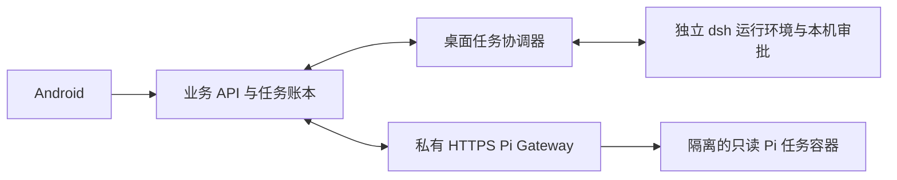

# Work Agent 架构整改（2026-10-08）

完整架构、跨端时序、数据归属和运维边界统一维护在 [Work Agent 架构](../features/work-agent-architecture.md)，本篇保留此次发现的问题、修复与验证记录。

业务层负责身份、任务、设备/工作空间别名、材料授权、成果和独立复核记录。桌面协调器通过版本契约交接任务，dsh 独立运行并接受本机命令审批；服务端 Pi 在专用 K3s 任务容器中只读复核冻结材料。Android 使用同一业务 API 派发桌面任务和查看结果。业务进程不导入上游 SDK，供应商密钥不进入移动端或业务 Helm 历史。

| 发现的问题 | 改动 | 验证 |
| --- | --- | --- |
| 常规 Helm 业务发布可能覆盖现场的 Pi URL、Secret 引用或灰度准入；旧 cohort 文件只保存部分开关 | 导出完整 canonical overlay；默认可读取操作员配置目录；发布前与渲染后检查全部现存消费者的 Work 设置、UID 和现场变化，缺失/过期/部分配置阻止发布 | 7 项发布保护测试、真实 Helm 渲染、7 项账号围栏、26 项现有发布回归；WSL 16 项真实 Helm/发布测试 |
| 模型引文合法不等于判断可靠；缺少原输入时仍给出确定的错误结论 | 新报告只要含缺失信息就保守标记 inconclusive；Web/Android 对旧报告也优先展示不确定性，不改写原模型记录、不影响已成功任务 | 严格证据测试保留；Web 页面回归；Android WorkReviewTest |
| 快速升级期间适配器、容器和桌面内置运行环境版本容易混淆 | 独立固定镜像 digest、适配器/上游版本及契约；每次 Gateway 升级独立保存数据库和 spec 历史；桌面从已固定 descriptor 动态选择打包资源 | 0.3.4、0.3.5 真实生产独立升级；delivery.4 实际 NSIS 文件清单、renderer 和本地适配器探测 |

发布保护只允许常规业务发布保持现有 Agent 设置。需要调整 Agent 设置时，先使用有完整 spec/UID/resourceVersion 围栏的 cohort 操作，再导出与现场一致的完整配置。若操作员配置过期，发布会停止并给出固定错误码，不能跳过校验来“修复”差异。

操作员的完整配置位于 `~/.config/we-meet/values.work-cohort.yaml`，权限 0600；也可显式设置 `WORK_COHORT_VALUES_FILE`。从私有集群快照使用 `deploy/aliyun/check-work-cohort.py --snapshot <私有快照> --export <完整配置路径>` 导出，仅包含 Work 设置及 Secret 引用，禁止内联 Agent token；快照、实际准入 UUID、配置和模型内容均不提交仓库。`values.work-dual.yaml` 是相同内容的历史兼容别名。

取消、未知执行和未知用量仍以失败/待确认处理，不重放任务、不把未知成本记为零。Pi 没有文件修改或命令执行工具；有问题的报告只提供人工核实意见。命令审批允许在明确工作空间中执行已展示的命令，但不代表操作系统沙箱；不将审批能力描述成文件系统隔离。

生产应用及最终镜像、客户端交付和检查回执见 [生产记录](work-dual-agent-production-release-2026-10-08.md)，桌面重试与运行环境升级的补充修复见 [代码走查](work-agent-code-review-2026-10-08.md)。新适配器使用合成 SSE 在实际固定 Pi 镜像中验证保守结论，供应商调用为 0；旧生产报告通过桌面和 Android 只读复验，不创建新的付费复核。
