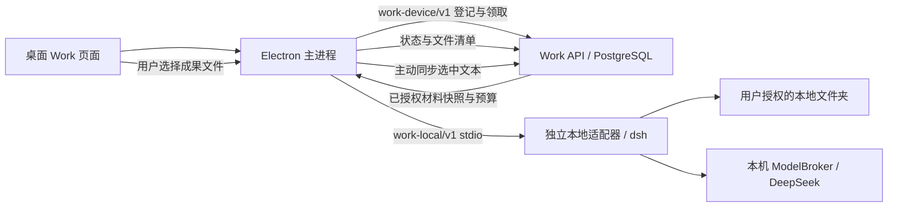

# 客户端执行与服务端任务协调

2026-10-08 当前客户端交付为桌面 `0.4.0-delivery.4` / 独立 Agent `0.3.2`，要求 `command_approval` 能力并支持 Android 远程待办；旧适配器须升级后执行。生产已迁移至 `work.0007`，仅对演示账号开启本地/远程协调及 Pi 复核。分工、恢复语义和发布边界见 [架构文档](../../docs/features/work-agent-architecture.md)，安装步骤见 [产品交付](DELIVERY.md)；下文有日期的旧候选记录保留历史语义。

2026-10-07：桌面候选版 `0.3.0-local-work.2` 与独立适配器 `0.2.0` 增加统一任务记录、设备领取、状态回报和主动成果同步。服务端开关默认关闭；当前未部署线上，也未安装替换已有客户端。

服务端拥有业务任务、用户与组织权限、材料版本、预算预留和任务状态。本机拥有目录授权、实际文件读写、运行时生命周期和模型凭据。一条任务只有一个执行位置；云端 worker 不领取本地任务。业务后端与 Electron 均不依赖上游 dsh SDK，SDK 更新集中在独立适配器中。

## 启用和使用

1. 确认 Work 数据库迁移和 worker 可用；当前生产基线为 `work.0007`。
2. 本地协调要求 `WORK_ENABLED=true`、`WORK_LOCAL_AGENT_ENABLED=true`、`WORK_AGENT_MODEL=deepseek-flash` 及账号准入；远程待办另需 `WORK_REMOTE_AGENT_ENABLED=true`。选择云端材料还需 `WORK_MATERIALS_ENABLED=true`。本地协调不要求打开 `WORK_AGENT_ENABLED`，也不要求服务端执行 Gateway 或 Docker；现有 Work 定时 worker 可处理过期设备，任务读取也会检查过期状态。生产设置须通过 cohort 流程保持所有消费者一致并导出完整 overlay。
3. 安装桌面候选版，使用其内置独立适配器 `0.3.2`；模型密钥仍由本机导入，后端和页面均不接收该密钥。旧手动安装记录见 [本地集成说明](LOCAL.md)。
4. 在桌面本地工作空间中选定目录。服务端能力可用时，“登记到云端任务列表”默认勾选，可选择最多 10 份当前账号可访问的云端材料。目标、目录名称、任务状态及设备回报用量会登记；本地原始文件不因此上传到业务服务。
5. 完成后查看本机成果，勾选希望同步的文件，点击同步按钮。服务端只接收本次选中的正文，并按任务所有者和当前组织权限提供已有 Work 成果下载。当前没有自动共享给组织其他成员的权限入口。

关闭登记可使用原有本机独立任务。服务端不可用时页面明确显示本地模式。已经发出登记的同一 UUID 不允许绕过协调改为本地独立提交，避免不确定应答导致重复执行。

## 版本化协议

`work-device/v1` 使用现有账号认证，端点均位于 `/api/v1.0/work/`，响应禁止缓存：

| POST 端点 | 输入与结果 |
| --- | --- |
| `local/devices/` | 设备 UUID、名称；绑定当前账号及组织 |
| `local/tasks/` | 固定 run UUID、设备 UUID、目标、模型、目录名称和材料版本引用；创建统一 WorkTask / WorkRun |
| `local/runs/<uuid>/claim/` | 原设备领取；返回目标、冻结材料文本、执行预算及私有 ticket |
| `local/runs/<uuid>/report/` | ticket、连续序号、状态、运行版本、设备用量和文件名/字节数/SHA256；不接受成果正文 |
| `local/runs/<uuid>/sync/` | 用户选中的成果文本；验证已回报清单、字节数及 SHA256，并保存不可变文件 |

取消复用 `runs/<uuid>/cancel/`。Web 原有任务接口可读取同一任务、执行位置、目录名称和已同步文件。任务 run UUID 与本机执行 UUID 一致，领取绑定原设备 UUID；同 run UUID 的目标、模型、材料引用和目录名称不可变。重试登记或回报不会创建第二条执行。

`work-local/v1` 保持原有 stdio 方法；`submit` 增加可选 `files` 和 `limits`。协调执行要求适配器通过能力声明提供 `cloud_context`、`run_limits`、`command_approval`；旧适配器不进入当前受审批的执行入口。云端快照校验 SHA256，作为数据传入本机任务；预算只能低于适配器固定上限：6 次模型调用、80,000 tokens、每次输出 4,096 tokens、180 秒。生产任务进一步限制为最多 5 次调用、20,000 tokens；传输和成果大小沿用受限 UTF-8 契约。

## 断线、重启和取消

Electron 主进程按账号加密保存 `coordination.enc`，先写入登记意图，再发送请求；页面拿不到业务 bearer 或任务 ticket。登记应答丢失后仍保留原 UUID，重启显示“待确认”，用户重新授权原目录并主动继续；不会自动补发执行。状态回报先持久化序号和完整请求，丢失应答后重发同一正文和序号。旧序号不同正文、跳号、版本变化和已确认用量回退均拒绝。

活跃任务每 10 秒尝试回报，设备租约 90 秒。过期任务标为 `disconnected`，含义是执行状态待核对；不会迁移至服务端或自动重跑。原设备重新回报可恢复状态。重启只恢复历史和回报，不重新执行未知任务；已失败或取消任务应由用户创建新任务。

云端取消通过后续回报通知本机；断网时无法立即送达。桌面本机取消先停止运行，再尝试回报。退出账号会立即隔离凭据并关闭本机适配器；最终云端回报可能需要下次同账号登录，期间服务端按租约显示断线。取消优先于迟到成果，但已发起模型调用的用量仍可记录。取消不能撤回已写入本机磁盘的变化。

## 数据与计量边界

自动回报包含目标、目录名称、设备身份、执行版本、状态、用量以及成果文件清单。完整路径、本地原始文件和成果正文不随状态回报上传。用户选择的本地内容仍可能经模型请求发往 DeepSeek；目录授权是执行约定，**不是操作系统沙箱**。

用量标记 `usage_origin=device_reported`，保存在 WorkRun，供任务观测。客户端回报不能作为供应商确认的计费凭证，因此不写入 `AIUsageRecord`，也不按较低的设备回报释放每日预算预留。当前采用每任务完整预算预留；供应商对账、组织统一计费和企业设备治理仍需后续建设。

云端材料在登记和领取时校验访问权限、校验和及解析代次，执行期间回报继续检查权限；撤销后停止交付和主动同步。已发送到执行设备的快照无法远程收回。上传成果保持原有任务所有者/当前组织访问范围，当前不支持跨设备接管本机执行或自动组织共享。

## 升级和验证

当前桌面包内置独立运行环境，升级/回退规则见 [产品交付](DELIVERY.md)。早期手动安装 wheel `.work-acceptance/work-coordination-20261007/artifacts/we_meet_work_agent-0.2.0-py3-none-any.whl` 保留为历史候选；当前上游 SDK/runtime 继续固定 `0.1.5rc1`。业务、桌面和适配器分别发布，以三个自有协议的兼容性为边界。升级前结束活跃任务，不自动重放未知模型调用。

离线检查：后端 `python -m pytest work/tests --reuse-db`，适配器 `python -m unittest discover -s tests -v`，桌面 `npm test`，前端 Work 路由 Vitest 与 TypeScript。

真实联合验收入口为后端 `work/tests/test_local_coordination_live.py`，需要显式设置 `WORK_COORDINATION_LIVE_KEY_FILE` 和 `WE_MEET_LOCAL_ADAPTER`。测试启动仅监听 loopback 的真实 Django API 桥，使用 PostgreSQL、实际 Node 协调器、非 editable 安装的适配器、dsh 和 DeepSeek；业务身份为隔离的合成账号。测试验证本地原文件与授权云端材料同时进入任务、统一 UUID、设备计量、上传前无成果正文、主动同步后可读。证据见 [本轮评审](../../docs/reviews/work-device-coordination-2026-10-07.md)。
