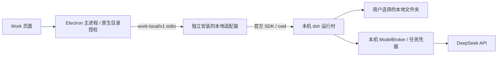

# 客户端本地工作空间

当前交付已更新为桌面 `0.4.0-delivery.1` / 独立 Agent `0.3.1`，通过安装包内置自包含运行环境，日常用户无需运行下文的开发安装脚本。命令审批、签名升级/回退及 Android 远程待办见 [产品交付](DELIVERY.md)。下文 `0.2.0` wheel 与桌面 `0.3.0` 的说明保留为历史独立安装记录，旧适配器不能进入当前受审批的执行入口。

2026-10-07：最新 Windows 桌面候选版 `0.3.0-local-work.2` 与适配器 `0.2.0` 支持本机 dsh 执行及可选云端任务登记。桌面“新工作 / 周报 / 表格分析”优先进入本地工作空间；浏览器继续使用服务端 Agent。桌面可切换原有云端执行路径。本机与服务端的分工、断线恢复及主动同步见 [协调说明](COORDINATION.md)。

集成结构：



Electron 不导入 dsh SDK，业务服务不参与本机文件执行。适配器独立安装并通过版本化协议握手；当前官方 SDK / runtime 固定为 `0.1.5rc1`，使用支持的 `sdk-minimal` 启动 profile 和 `cwd`。不修改 `D:\workspace\dsh\deepseek-harness`，也不连接其原生 UI 的既有会话。

## 安装和使用

安装桌面候选包 `src/desktop/release/We-Meet-0.3.0-local-work.2-setup.exe`。本地适配器独立安装，当前验证环境为 Windows x64、Python 3.13；不需要 Docker 或系统 Node。

从仓库根目录执行：

```powershell
& .\src\work-agent\install-local.ps1
```

脚本创建专用虚拟环境、校验锁文件中的依赖哈希，并安装非 editable 的适配器。默认安装位置为 `%LOCALAPPDATA%\WeMeet\LocalAgent\0.2.0`。也可指定候选 wheel 和独立目标目录：

```powershell
& .\src\work-agent\install-local.ps1 `
  -TargetDirectory "$env:LOCALAPPDATA\WeMeet\LocalAgent\candidate-2" `
  -WheelPath '.\.work-acceptance\work-coordination-20261007\artifacts\we_meet_work_agent-0.2.0-py3-none-any.whl'
```

登录桌面后打开“工作 → 新工作”：

1. 点击“配置本机 dsh”，选择安装目录下的 `Scripts\work-agent-local.exe`。
2. 选择包含一行 `DEEPSEEK_API_KEY=sk-…` 的本地 `.env` 文件；模型名默认 `deepseek-flash`。密钥文件不进入 Git，模型凭据经 Windows DPAPI 加密保存，不返回页面。
3. 点击“选择本地文件夹”，通过原生目录选择器和授权提示确认工作空间。
4. 填写目标并提交。dsh 直接读取所选目录；成果保存在 `所选目录\WeMeet成果\<run UUID>\output\`。页面可查看文本成果，并通过系统应用打开原文件。

成果目前限定平铺的 UTF-8 Markdown / TXT / CSV / JSON，合计最大 400 KB；原生 PowerShell 生成的 UTF-8 BOM 会保留。任务可读取其他原生格式文件，但没有保证每种格式都能成功解析。默认提示要求保留原始材料；用户明确要求修改时，原生 dsh 可以修改文件。

## 权限、生命周期和记录

工作空间是实际工作目录，**不是操作系统沙箱**。原生 dsh 可以执行本机命令，并拥有当前 Windows 用户的文件访问能力。目录授权提示明确说明这一点；提供给模型的内容仍通过 API 发往 DeepSeek。当前不提供系统级目录访问隔离。

IPC 仅接受主窗口、主 frame 和受信 origin，页面提交仅包含任务 UUID、授权工作空间 ID 和目标，不接受原始路径或任意运行参数。配置、历史和授权按 OIDC issuer / subject 隔离；退出账号或正常退出客户端会取消本机任务。客户端或适配器重启后需重新选择并授权目录，未知执行不自动重放。取消不能撤回已经写入本地磁盘的修改，也不保证已经发起的模型请求不计费。

本机任务历史、成果快照和模型用量在对应账号的 `userData/local-work-v1/<account hash>/local.sqlite3` 保存。启用并勾选云端登记时，任务和设备回报用量同时进入 Django WorkTask / WorkRun，成果正文只在用户选中后同步；未登记的任务保持本机独立模式。设备回报不作为供应商确认的计费数据，目前没有跨设备接管本机执行。退出账号保留本机历史，但其他账号不能通过客户端访问。

适配器持有真实模型 key；SDK 子进程只接收每任务随机凭据，通过监听 `127.0.0.1` 的 ModelBroker 访问模型。默认每任务最多 6 次模型调用、80,000 tokens、单次输出 4,096 tokens、180 秒。未知用量保持未知，不记为零。主进程和运行时只继承必要系统环境变量，不继承业务 bearer、数据库或云端 Agent token。

## 独立升级和回退

更新 dsh 时只更新适配器依赖锁及其驱动，SDK 与 runtime 必须同步升级；先跑契约、取消和真实本机文件测试。`work-local/v1` 不变时无需重新发布业务后端或桌面页面。协议破坏性修改需另起版本；握手不匹配会拒绝连接。

推荐把新适配器安装到新目录，待当前任务结束后在桌面“更新本机配置”中选择新 `work-agent-local.exe`。旧适配器保留，可同样选择旧路径回退；业务端与适配器都可以独立发布。更新本机配置会取消该适配器上的活动任务并撤销目录授权。

## 验证入口

离线：在 `src/work-agent` 执行 `.venv/Scripts/python.exe -m unittest discover -s tests -v`；在 `src/desktop` 执行 `npm test`；在 `src/frontend` 执行 `npx vitest run src/features/work/routes`。

真实模型测试显式启用，密钥始终通过本地文件读入：

```powershell
cd src/desktop
$env:WE_MEET_LOCAL_ADAPTER = 'C:\path\Scripts\work-agent-local.exe'
$env:WE_MEET_LOCAL_KEY_FILE = 'C:\private\deepseek.env'
$env:WORK_LOCAL_ALLOW_PAID = '1'
node scripts/local-work-smoke.cjs
```

测试使用独立 profile 和本地合成业务身份，实际 Electron 页面、官方 dsh 和 DeepSeek。原生对话框由测试指定选择结果，未把它算作人工选择器验收。验证记录见 [客户端集成评审](../../docs/reviews/work-local-agent-2026-10-07.md)。候选安装包构建与实际安装验收分开记录。
