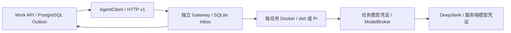

# Work Agent 集成

已增加按成果手动开启的 [Pi 只读复核 PoC](REVIEW.md)：冻结授权快照，禁用全部工具，单独记录证据、预算和复核状态；生产默认关闭。

当前阶段增加自包含 Windows 本地运行环境、逐次命令审批、签名运行环境升级与回退、Android → 桌面待办派发。当前 Agent `0.3.1`，dsh 固定 `0.1.5rc1`，与 Django / Electron 保持独立协议；不改动上游仓库。使用和交付边界见 [产品交付](DELIVERY.md)。只开发 Android，iOS 暂不开发。

Pi 只读复核支持 DeepSeek 与百炼 Qwen，通过独立网关配置供应商；默认执行仍为 dsh + DeepSeek。本轮 Qwen 使用现有 `qwen3.8-flash` 和百炼 API Key，无需另建 key。配置、预算和同样本对照见 [复核说明](REVIEW.md)。

服务端独立 Helm release、生产密钥分配、私有 CA 和专用 Docker 节点准备见 [生产部署](DEPLOYMENT.md)。生产配置默认关闭；本地 PoC key 不复制到生产，桌面密钥继续保存在本机。

2026-10-07 下一阶段已增加本地与服务端协调：统一 WorkTask / WorkRun、设备领取、持久化状态回报及用户主动成果同步，使用独立 `work-device/v1` 契约。详见 [客户端与服务端协调](COORDINATION.md)；服务端开关默认关闭，本次未部署线上。

2026-10-07 已补齐 **Windows 客户端本地工作空间**：桌面通过 `work-local/v1` stdio 连接独立安装的适配器，原生 dsh 直接使用用户选择的本地目录。安装、授权、独立升级和本机记录边界见 [客户端本地集成](LOCAL.md)；下面的 HTTP Gateway 是云端执行路径。

选用 dsh 作为当前试点执行器，Pi 保留为可替换对照。两者均通过 DeepSeek 合成周报和 CSV
样例；Work API → dsh → 模型 → Work 授权下载/用量账本的真实端到端验证也已通过。
评审和回执见 [验证记录](../../docs/reviews/work-agent-poc-2026-10-07.md)。本次代码未发布线上。

业务与 Agent 使用自有 **`work-agent/v1` HTTP Job API**。Django 不安装 dsh/Pi SDK，
不解释上游会话、插件或数据库。业务控制用户/组织权限、材料版本、任务、预算、成果编辑和采纳；
独立 Gateway 控制自己的 Inbox、模型调用、运行镜像和终态。唯一上游 SDK 适配点为 `drivers.py`。



K3s 单节点部署新增独立 [任务 Pod 执行器](KUBERNETES.md)，不要求挂载 Docker socket 或专用 Docker runner，仍使用同一业务契约。生产开关默认关闭，必须完成该执行器的独立验收。

## 启动与接入

需要 Python 3.13、Docker Linux engine。从本目录执行：

```powershell
python -m venv .venv
.venv/Scripts/python.exe -m pip install -e .
docker build --target dsh -t we-meet-work-agent:dsh-poc .
docker build --target pi -t we-meet-work-agent:pi-poc .
```

Git 忽略的 `.env` 只配置 `DEEPSEEK_API_KEY` 和独立随机 `WORK_AGENT_TOKEN`（至少 24 字符）。
模型 key 只留在 Gateway，运行容器只收到每任务随机 token；业务端只持有 Gateway token。
Docker context 排除 `.env`、虚拟环境和本地回执。

```powershell
.venv/Scripts/python.exe -m work_agent.server --engine dsh --env-file .env --state-dir ../../.work-acceptance/dsh-service --port 8881
```

业务服务先应用 `work.0003` 数据库迁移，保留独立 Celery `work` 队列和 Beat。
配置 `WORK_ENABLED=true`、`WORK_MATERIALS_ENABLED=true`、`WORK_AGENT_ENABLED=true`、
`WORK_AGENT_URL=http://127.0.0.1:8881`、`WORK_AGENT_TOKEN`（与 Gateway 相同）及
`WORK_AGENT_MODEL=deepseek-flash`。两者在不同主机时使用内部 HTTPS 端点；客户端禁止远程明文 HTTP
和重定向。默认关闭 Agent 开关，已有沟通准备使用原执行器。

`WORK_AGENT_TIMEOUT=180`、`WORK_AGENT_MAX_CALLS=6`、`WORK_AGENT_TOKEN_BUDGET=80000`，
每次响应上限来自 `WORK_MAX_OUTPUT_TOKENS`（最高 4096）。每日配额仍为 `WORK_DAILY_TOKEN_BUDGET`。
业务先预留全任务预算，完整用量确认后改为实际 token；未知用量继续占用预算。缓存 token 独立保存，
账本输入包含缓存读取；现有价格目录不能精确反映缓存折扣，金额需供应商对账。

Web `/work/new`、周报和表格分析复用同一 Agent 路径。上传支持 CSV/文本/文本型 PDF/受限 DOCX，
执行器只接收选定材料的 UTF-8 解析快照。成果目前为 Markdown/CSV/JSON/TXT，用户可编辑、采纳
草稿并下载不可变的原始文件。任务、产物和下载均限制当前用户及组织；材料删除或权限撤销禁止交付。

## 独立升级

| 部署单元 | 固定依赖 | 兼容边界 |
| --- | --- | --- |
| Django Work | 标准库 HTTP 客户端、自有 Outbox | 无上游 SDK；只依赖 v1 契约 |
| Gateway | 标准库、自有 SQLite Inbox | 独立安装/启动，不连接业务数据库 |
| dsh 镜像 | SDK/runtime `0.1.5rc1`、wheel 哈希锁 | `sdk-minimal`、关闭重试、受控 patch |
| Pi 镜像 | `@earendil-works/pi-coding-agent` `1.0.4`、npm lock | RPC、关闭重试、等待 `agent_settled` |

Gateway 启动时将 tag 固定为不可变 image ID。每个任务保存镜像、模型、policy 哈希、适配器/runtime
版本；已受理的任务不会随升级静默切换配置。升级前排空执行中的任务，保留 Inbox 卷，再替换镜像和
Gateway。未执行的旧配置任务失败为 `deployment_changed`；重启中的运行任务为 `execution_unknown`，
不自动重放付费调用。回滚同样保留 Inbox，切回已验证镜像即可；不承诺跨版本恢复上游会话。

v1 可新增可选字段，保持已有语义；破坏性变更发布 v2，同时保留 v1 服务直到业务迁移。
升级 dsh 或切换 Pi 只修改 Agent 部署，不改业务对象或 UI。每个状态目录只允许一个 Gateway，
当前为串行 worker，最多 20 个活动任务；不支持多个 Gateway 共享状态目录。

本地 upstream 参考 `D:/workspace/dsh/deepseek-harness`，提交
`5badb15009ae1756c3afe0ae0cef1faafc290ccc`；该仓库未修改，部署不依赖此路径。
Python 发布 pin 与仓库源码提交分别记录，不能视为验证了 master 全部能力。

## HTTP 契约与故障恢复

所有接口要求 `Authorization: Bearer <gateway-token>`。

| 路径 | 行为 |
| --- | --- |
| `GET /v1/capabilities` | 契约、版本、镜像、模型、能力及预算上限 |
| `POST /v1/jobs` | 新任务 202；同 UUID/相同请求返回已有任务；变更内容 409 |
| `GET /v1/jobs/{id}?after=0` | 状态、增量事件、执行快照、成果和模型用量 |
| `POST /v1/jobs/{id}/cancel` | 幂等取消；先于提交时保存墓碑，后到提交不执行 |

请求包含 `contract`、UUID `run_id`、`goal`、`files`、`timeout_seconds`（1—300），可选 `limits`。
文件为 `{name,text,sha256}`，最多 20 份、400 KB 总量，只允许平面 `.txt/.md/.csv/.json` 名称。
`limits` 包含 `max_model_calls`（最高 6）、`max_total_tokens`（最高 80000）、
`max_output_tokens`（最高 4096）。ModelBroker 在每次供应商调用前原子预占，用 UTF-8 请求字节数
加 1024 和输出上限作保守 token 上界，未知调用保留预占；超过总预算/次数拒绝新调用。

状态为 `queued → running → succeeded/failed/cancelled`，事件只返回序号、类型和时间。
成功结果含 `summary/artifacts/usage/elapsed_ms/execution`；文件内容带 SHA-256。
`metering` 聚合代理观察到的所有模型调用；`complete=false` 表示仍有未知用量，不能当零成本。
取消后已发起调用的用量仍可到达。Work 使用短 HTTP tick 查询，不在 Celery 内等待完整 Agent 循环。
响应丢失时查询/重试同 UUID 和冻结请求，不新增付费任务；重复导入和过期 worker 响应由数据库防护。

容器仅挂载当前任务目录，不接收业务源码、S3/DB 凭证；只读根目录、无 capabilities、禁止提权，
限制 CPU/内存/PID。取消和 deadline 删除整个容器；网关重启先清理所属遗留容器，容器还有独立 watchdog。

## 验证与当前范围

```powershell
$env:WORK_AGENT_DOCKER_TEST_IMAGE='we-meet-work-agent:dsh-poc'
.venv/Scripts/python.exe -m unittest discover -s tests -v
../backend/.venv/Scripts/ruff.exe check work_agent tests ../backend/work/agent_client.py
.venv/Scripts/python.exe -m work_agent.compare --env-file .env --output-dir ../../.work-acceptance/comparison --allow-paid
```

最后一条会调用真实模型，可加 `--engine dsh/pi` 和 `--case csv-analysis/weekly-report`。
业务层 `work/tests/test_agent_runs.py` 包含真实 HTTP/fixture 端到端测试；付费 dsh 验证仅在明确设置
`WORK_AGENT_LIVE_ENV` 时执行，`WORK_AGENT_LIVE_RECEIPT` 指定 Git 忽略的回执路径。

当前完成合成材料的选型与集成验证，默认开关关闭。容器仍有网络访问，未配置出站白名单，因此本轮
仅验证合成材料；生产敏感材料放行需另行落实网络策略与业务验收。Skills/MCP、业务外部写入、
GUI、二进制成果、会话恢复和多副本调度不在本次实现范围。
